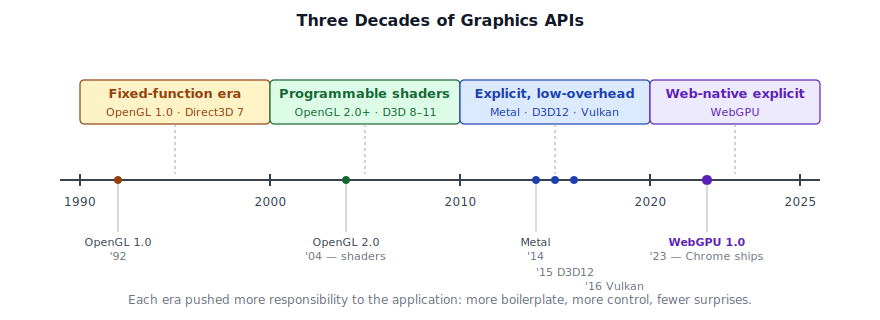
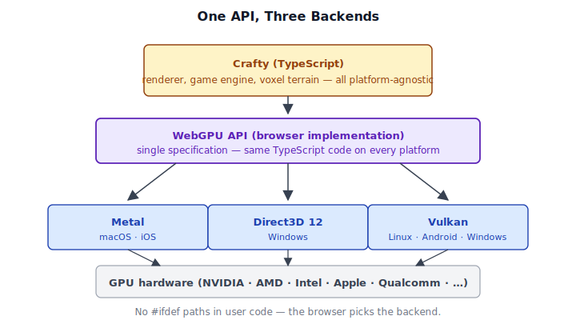
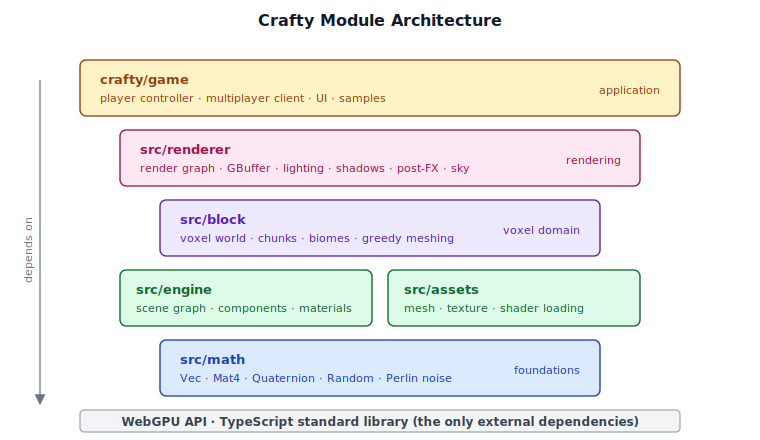
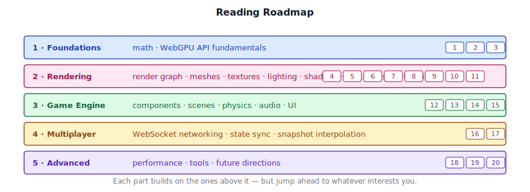

# Chapter 1: Introduction

[Contents](../crafty.md) | [02-Mathematics](02-mathematics.md)

## 1.1 What is Crafty?

Crafty is a voxel game engine and rendering framework built entirely from scratch on top of WebGPU. It is written in TypeScript and runs in any browser that supports the WebGPU API.

The engine demonstrates a complete, production-quality rendering pipeline:

- **Multi-pass deferred rendering** with a GBuffer, HDR lighting, and forward rendering for transparency
- **Cascaded shadow maps** for a directional sun light
- **Variance shadow maps** for point and spot lights
- **Full post-processing suite**: temporal anti-aliasing (TAA), bloom, screen-space ambient occlusion (SSAO), screen-space global illumination (SSGI), depth of field (DOF), god rays, auto-exposure, and HDR tonemapping
- **Procedural voxel terrain** with chunk management, greedy meshing, and LOD
- **GPU compute particles**, water rendering, volumetric clouds, and atmospheric sky
- **A component/entity game engine** with scene graph, player controller, physics, and multiplayer networking

But Crafty is more than a demo — it is a *teaching vehicle*. Every system is built by hand. We import only the WebGPU API and the TypeScript standard library. There are no middleware rendering libraries, no physics engines, no black boxes. If you want to understand how a modern real-time renderer works from the GPU queue up, you can read every line of code here.

## 1.2 A Brief History of Graphics APIs

To understand why WebGPU exists, it helps to see where it came from.

**The fixed-function era (1990s).** OpenGL 1.0 and Direct3D 7 gave you a fixed pipeline: set a light, set a material, draw a triangle. You could configure parameters, but you could not reprogram how the GPU worked. This was simple but limiting — every effect that deviated from the standard model required expensive CPU-driven workarounds.

**The shader revolution (2000s).** OpenGL 2.0 / Direct3D 8 introduced programmable vertex and fragment shaders. Suddenly developers could write small programs that ran directly on the GPU. The fixed-function pipeline was still there as a fallback, but the industry rapidly moved toward fully programmable pipelines. OpenGL 3.2 (2009) made the core profile mandatory and deprecated the fixed-function path.

**The explicit API shift (2010s).** OpenGL and Direct3D 11 were *driver-managed* — the driver handled memory allocation, synchronization, and state validation. This made them easy to use but unpredictable. Games that pushed hardware limits needed lower overhead. Apple developed Metal (2014), Microsoft released Direct3D 12 (2015), and the Khronos group standardized Vulkan (2016). These explicit APIs gave applications direct control over GPU resources and command submission, at the cost of significantly more boilerplate.

**WebGPU — the web-native explicit API.** The web needed a modern graphics API that could run on all three native backends (Metal, D3D12, Vulkan) without the legacy baggage of WebGL (which was based on OpenGL ES 2.0/3.0). WebGPU, designed by the W3M GPU for the Web Community Group, is the result. It provides an explicit, low-overhead API with a clean, ergonomic design that feels like Metal with Vulkan's validation philosophy baked in.



## 1.3 Why WebGPU?

We chose WebGPU for Crafty for several reasons:

**Zero installation.** The user opens a URL and the engine runs. No downloads, no SDKs, no platform-specific builds. This dramatically lowers the barrier to entry for readers who want to experiment.

**First-class TypeScript.** The entire engine is written in TypeScript, which means we get static typing, modern async/await, and a rich ecosystem of developer tooling — all without a compilation step to native code. Debugging is done in the browser's DevTools, which every web developer already knows.

**Clean API design.** Compared to Vulkan, WebGPU eliminates enormous amounts of boilerplate. There are no instance/device/queue hierarchy splits, no explicit memory allocation, and no manual synchronization (the driver still handles resource tracking under the hood, just with more predictability than OpenGL). Yet WebGPU retains the explicit pipeline state objects, descriptor-based resource binding, and command buffer recording that make modern APIs efficient.

**Cross-platform.** Write once, run on Windows (D3D12), macOS/iOS (Metal), Linux/Android (Vulkan), and — eventually — all major browsers. No `#ifdef` platform paths.



**It is the future of graphics on the web.** WebGL 2.0 is in maintenance mode. All major browser vendors have committed to WebGPU as the successor. Learning WebGPU today means your skills are relevant for the next decade.

## 1.4 Literate Programming with This Book

This book follows the tradition of Donald Knuth's *Literate Programming* and, more directly, *Physically Based Rendering: From Theory to Implementation* by Pharr, Jakob, and Humphreys. The core idea is simple:

> The code *is* the explanation. We present source files alongside the reasoning that produced them.

Each chapter focuses on a subsystem of Crafty. We walk through the key source files, showing annotated excerpts that illustrate the central logic. When a full file is needed, we show it in its entirety. You are encouraged to open the actual source tree alongside this book — every code block references its file path.

The convention for annotated excerpts is:

```typescript
// ── from src/renderer/gbuffer.ts ──

// ... boilerplate context elided ...

// The three G-buffer textures share the canvas dimensions
this._width = ctx.width;
this._height = ctx.height;
// ── end of excerpt ──
```

Code blocks that are **complete file listings** are marked by listing the full path at the top and containing the entire file's content.

## 1.5 Setting Up the Development Environment

To follow along with this book, you need:

- **A browser that supports WebGPU.** Open `webgpureport.org` to check if your browser supports WebGPU. This will include a report about all of the features available to WebGPU.
- **Node.js 20+** (for development tooling).
- **A code editor** — VS Code is recommended for its TypeScript integration.

Clone the repository and install dependencies:

```bash
git clone https://github.com/brendan-duncan/crafty
cd crafty
npm install
```

Start the development server:

```bash
npm run dev
```

This launches Vite on `http://localhost:5173`. Open it in your browser and you should see a screen letting you open Crafty or one of the Samples.

Crafty can be opened at `http://localhost:5173/crafty/`.

The project uses the following toolchain:

| Tool | Purpose |
|------|---------|
| **TypeScript** (https://www.typescriptlang.org) | All source code, strict mode enabled |
| **Vite** (https://vite.dev) | Development server and production bundler |
| **Vitest** (https://vitest.dev/) | Unit testing framework |
| **@webgpu/types** (https://github.com/gpuweb/types) | TypeScript type definitions for the WebGPU API |

You can run the test suite to verify your environment:

```bash
npm run test:run
```

The full `package.json` at `package.json` defines all available scripts:

| Command | What it does |
|---------|-------------|
| `npm run dev` | Start Vite dev server |
| `npm run build` | Type-check then production build |
| `npm test` | Run tests in watch mode |
| `npm run test:run` | Run tests once |
| `npm run test:coverage` | Run tests with coverage |
| `npm run server` | Start the multiplayer server |

There are also self-contained sample pages in `samples/`. Each sample pairs an HTML file with a TypeScript entry point. To view a sample, navigate to its HTML path, e.g. `http://localhost:5173/samples/forward_test.html`.

## 1.6 The Crafty Codebase at a Glance

The project root is organized as follows:

```
crafty/
├── docs/                   # This book
├── src/                    # Core engine library
│   ├── math/               # Vec3, Mat4, Quaternion, noise, random
│   ├── engine/             # Scene graph, components, materials
│   ├── assets/             # Mesh, texture, shader loading
│   ├── block/              # Voxel world, chunks, biomes
│   └── renderer/           # WebGPU render graph and passes
├── crafty/                 # Game application
│   ├── config/             # Classes for storing various engine configurations.
│   ├── game/               # Crafty game engine code
│   └── ui/                 # HUD, hotbar, start screen
├── server/                 # WebSocket multiplayer server (Node.js)
├── samples/                # Samples to test engine and rendering features
├── tests/                  # Unit tests (Vitest)
├── scripts/                # Build tools (texture atlas, etc.)
├── dist/                   # The production build of Crafty
├── package.json
├── tsconfig.json
└── vite.config.ts
```

The library code in `src/` is self-contained and could be used independently from the game application in `crafty/`. The game application is the primary consumer of the library and demonstrates all its features.

These directories form a layered architecture — each layer depends only on the ones below it, with WebGPU and the TypeScript standard library at the very bottom:



**Where we go from here.** This book proceeds in five parts:

1. **Foundations** (Chapters 1–3): Mathematics, WebGPU API fundamentals.
2. **Rendering** (Chapters 4–11): The render graph, meshes, textures, lighting, shadows, post-processing, sky, terrain.
3. **Game Engine** (Chapters 12–15): Components, scenes, physics, audio, UI.
4. **Multiplayer** (Chapters 16–17): WebSocket networking, state sync, snapshot interpolation.
5. **Advanced Topics** (Chapters 18–20): Performance, tools, and future directions.



By the end, you will understand how every pixel on the screen got there — from the WGSL shader that computed it to the WebGPU pipeline that rasterized it to the game engine that placed the object in the world.

----
[Contents](../crafty.md) | [02-Mathematics](02-mathematics.md)
