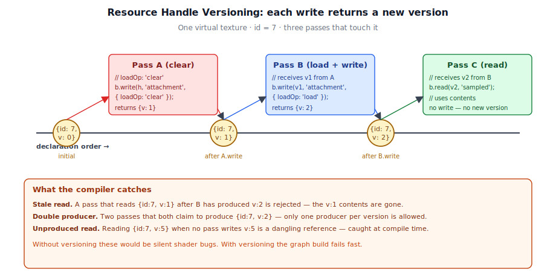
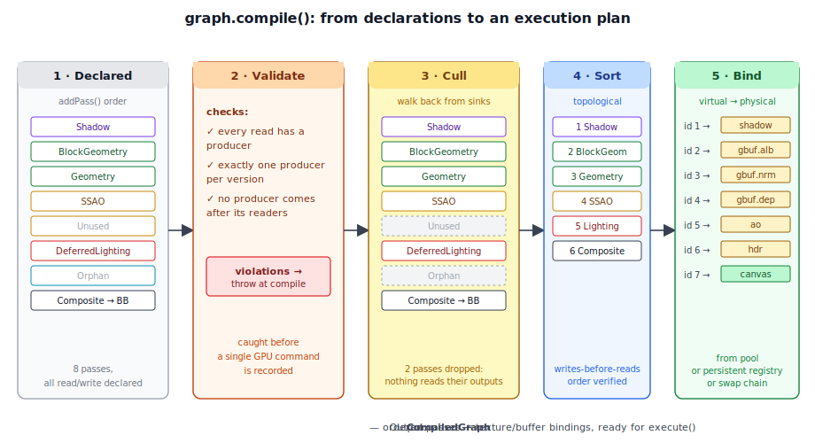
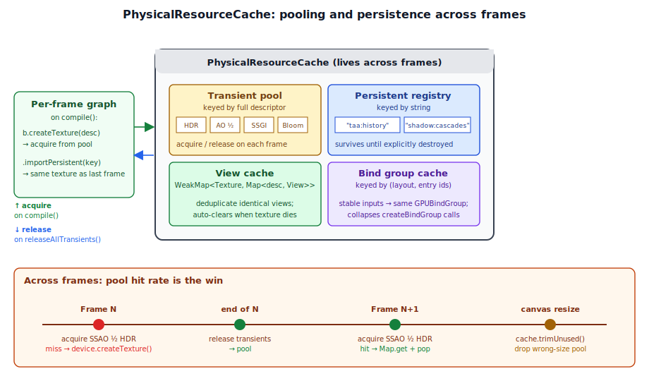

# Chapter 3: Rendering Architecture

[Contents](../crafty.md) | [02-WebGPU Fundamentals](02-webgpu-fundamentals.md) | [04-Meshes](04-meshes.md)

This chapter presents the architectural backbone of Crafty's renderer — the **render graph**, its **passes**, and how they compose to produce every frame.

## 3.1 The Render Graph


The render graph ([src/renderer/render_graph/](../../src/renderer/render_graph/)) is a **dependency graph** of passes that the renderer rebuilds, compiles, and executes once per frame. Each pass declares which virtual resources it reads and writes, and the graph compiler turns those declarations into an ordered command stream, allocating physical GPU objects from a pool as it goes.

There are three classes at the heart of the system:

| Class | Role |
| --- | --- |
| [`RenderGraph`](../../src/renderer/render_graph/render_graph.ts) | Per-frame builder, compiler, and executor. Constructed each frame; thrown away after `execute()` returns. |
| [`Pass`](../../src/renderer/render_graph/pass.ts) | Long-lived owner of pipelines, bind group layouts, and persistent uniform buffers. Inserts itself into the graph each frame. |
| [`PhysicalResourceCache`](../../src/renderer/render_graph/physical_resource_cache.ts) | Cross-frame pool of `GPUTexture` / `GPUBuffer` / `GPUBindGroup` / `GPUTextureView` objects. Survives graph rebuilds. |

### Why a Dependency Graph?

Crafty's frame is a moving target. Bloom, depth-of-field, godrays, cloud shadows, cloud overlay, weather particles, and SSGI all come and go based on user settings. The G-buffer depth alone feeds eight different consumers (SSAO, SSGI, deferred lighting, godrays, water refraction, particle soft-edges, the block highlight outline, the composite pass). Every sample under [samples/](../../samples/) wires its own subset of the pipeline. A render graph turns this kind of dynamic, branching workload into something the compiler can check, optimize, and rearrange on its own.

Four concrete capabilities fall out of organizing the frame as a dependency graph:

1. **Type-checked wiring.** Each pass declares its dependencies and outputs in TypeScript interfaces. Connecting two passes is `b.write(a.output)` — if the producer's output doesn't match the consumer's expected input, the compiler rejects it.
2. **Automatic culling.** Passes that don't reach the backbuffer (or a persistent / external resource) are dropped before execution. Disabling a downstream pass automatically prunes any upstream-only-fed passes — there's no manual bookkeeping to keep optional features in sync.
3. **Automatic resource lifetime.** Transient textures and buffers are described, not allocated. The cache pools physical objects across frames keyed by descriptor, so a "new" half-res `rgba16float` texture is almost always a cheap pool hit. Lifetime correctness comes from the read/write declarations, not from manually tracking which texture is live at which point in the frame.
4. **Validation.** Every read declares the version of the handle it observed. Writing a handle bumps the version. Reading a stale version is caught at graph-build time, not as a silent shader bug.

Together, these capabilities collapse "what order should the passes run in?", "which textures do they share?", and "what usage flags does each resource need?" from three separate problems that the caller has to solve into a single set of declarations the graph compiles automatically.

### Lifecycle (Per Frame)

The graph is **per-frame, not per-application**. Persistent state lives on the pass instances and on the cache; the `RenderGraph` object itself is built fresh, compiled, executed, and discarded each frame.

```typescript
// ── from crafty/renderer_setup.ts ──
async render(ctx: RenderContext, frame: FrameDeps): Promise<void> {
  const graph = new RenderGraph(ctx, cache);
  const backbuffer = graph.setBackbuffer('canvas');

  // Each pass.addToGraph(graph, deps) returns its outputs as handles.
  const shadow = shadowPass.addToGraph(graph, { cascades, drawItems });
  const gbuffer = blockGeometryPass.addToGraph(graph, { loadOp: 'clear' });
  const ssao = ssaoPass.addToGraph(graph, { normal: gbuffer.normal, depth: gbuffer.depth });
  // ... more passes wired together by handle ...
  compositePass.addToGraph(graph, { input: ..., backbuffer });

  const compiled = graph.compile();   // validate → cull → topo-sort → bind
  await graph.execute(compiled);      // one command encoder, one submit
}
```

Five steps run every frame:

1. **Build.** Construct a new `RenderGraph(ctx, cache)`. The cache is owned by the renderer setup and lives across frames.
2. **Declare.** Each pass's `addToGraph()` calls `graph.addPass(name, type, b => { ... })` exactly once. The setup callback uses the `PassBuilder` to record reads, writes, and the execute callback.
3. **Set the sink.** `graph.setBackbuffer('canvas')` (and optionally `setBackbufferDepth`) tells the compiler which resource(s) the graph is producing. Everything not reachable from the sink will be culled.
4. **Compile.** `graph.compile()` validates the declarations, culls dead passes, topologically sorts the survivors, and resolves every virtual resource to a physical `GPUTexture` or `GPUBuffer` from the cache.
5. **Execute.** `graph.execute(compiled)` records every pass into a single `GPUCommandEncoder`, opens render or compute passes as declared, submits one command buffer, and returns transient resources to the pool.

Per-frame rebuilds sound expensive, but the cost is dominated by `compile()` (a couple of `Map` lookups and a depth-first walk over a few dozen passes) and pooled `getOrCreate*` calls on the cache. Pipelines, shader modules, persistent uniform buffers, BGLs — the genuinely expensive things — live on the pass instances and are never re-created.

### Virtual Resources and Handles

Resources inside the graph are **virtual** until `compile()` runs. A pass receives a `ResourceHandle` from another pass, declares how it uses the resource, and gets back a new handle representing the post-write state:

```typescript
// ── from src/renderer/render_graph/types.ts ──
export interface ResourceHandle {
  readonly id: number;
  readonly version: number;
}
```

The `id` identifies the underlying virtual resource; the `version` is bumped every time the resource is written. Pass A writes id 7 and gets back `{id: 7, v: 1}`. It hands that handle to pass B, which loads and writes it, receiving `{id: 7, v: 2}`. Pass C reads `{id: 7, v: 2}`. The handle versions form a single-producer chain per resource that the compiler can validate, sort, and cull against.



This versioning is the central trick that lets the graph reason about lifetimes without parsing shader code. Whoever called `write()` last "owns" the contents; whoever reads the returned handle observes those contents. Three mistakes the compiler catches as a consequence:

- **Stale reads.** A read of `{id: 7, v: 1}` is invalid if a later pass already produced `{id: 7, v: 2}` — the new version overwrites the old, so the old contents are gone.
- **Double producers.** If two passes both claim to produce `{id: 7, v: 2}`, the compiler rejects the graph. There is exactly one producer per version.
- **Unproduced reads.** If a pass reads `{id: 7, v: 5}` and no pass writes that version, the read references something that does not exist.

### Resource Usage Classification

Every read and write declares a `ResourceUsage` from a fixed vocabulary. This single declaration drives both the GPU usage flags applied to the physical resource and which encoder type the graph opens for the pass:

| `ResourceUsage` | Meaning | Usage flag(s) added |
| --- | --- | --- |
| `'attachment'` | Color attachment, write-only | `RENDER_ATTACHMENT` |
| `'depth-attachment'` | Depth-stencil attachment | `RENDER_ATTACHMENT` |
| `'depth-read'` | Read-only depth (bound to render pass with `depthReadOnly: true`) | `RENDER_ATTACHMENT \| TEXTURE_BINDING` |
| `'sampled'` | Bound to bind group as sampled texture | `TEXTURE_BINDING` |
| `'storage-read' \| 'storage-write' \| 'storage-read-write'` | Bound as storage texture / buffer | `STORAGE_BINDING` (tex) or `STORAGE` (buf) |
| `'uniform' \| 'vertex' \| 'index' \| 'indirect'` | Buffer bound to the corresponding pipeline slot | `UNIFORM` / `VERTEX` / `INDEX` / `INDIRECT` |
| `'copy-src' \| 'copy-dst'` | Source / destination of a `copyBufferToBuffer` / `copyTextureToTexture` | `COPY_SRC` / `COPY_DST` |

The graph aggregates every usage of a virtual resource across all passes that touch it and creates the physical object with the union of those flags. A G-buffer texture used by the geometry pass as `'attachment'` and then by the lighting pass as `'sampled'` gets `RENDER_ATTACHMENT | TEXTURE_BINDING` automatically — no manual usage bookkeeping.

Three usage classifications carry extra weight:

- **`'attachment'` and `'depth-attachment'` writes** also carry an `AttachmentOptions` struct (`loadOp`, `storeOp`, `clearValue`, optional MSAA `resolveTarget`, optional view descriptor). The graph reads these to build the `GPURenderPassDescriptor`; the pass execute callback never touches `beginRenderPass()` directly.
- **`'depth-read'` reads** bind the depth texture as a read-only depth attachment instead of as a sampled texture. This lets the pass run with depth-test enabled without re-uploading a depth buffer.
- **`'copy-src'` / `'copy-dst'`** are how copy commands participate in the dependency graph. A pass that does `encoder.copyTextureToTexture(history, current, ...)` declares the history texture as `'copy-src'` and the new texture as `'copy-dst'`; downstream passes that read the new texture see the dependency.

### Pass Types

Every pass is one of three types:

```typescript
// ── from src/renderer/render_graph/types.ts ──
export type PassType = 'render' | 'compute' | 'transfer';
```

- **`'render'`** — the graph builds a `GPURenderPassDescriptor` from declared attachments, calls `beginRenderPass()`, and hands the execute callback both the command encoder and the render pass encoder. Used by every G-buffer pass, lighting pass, post-processing pass, and fullscreen pass.
- **`'compute'`** — the graph calls `beginComputePass()` and hands the execute callback both encoders. Used by SSGI temporal accumulation, particle simulation, and auto-exposure histogram passes.
- **`'transfer'`** — no sub-pass is opened. The execute callback receives only the raw `GPUCommandEncoder`. Used for copy commands (`copyBufferToBuffer`, `copyTextureToTexture`), buffer clears, and the shadow pass family that opens many sub-passes of its own (one per cascade).

### Worked Example: Wiring Three Passes

The clearest way to see the API in motion is to look at how the deferred renderer connects the G-buffer fill, SSAO, and deferred lighting:

```typescript
// ── from crafty/renderer_setup.ts (excerpt) ──
const gbuf = blockGeometryPass.addToGraph(graph, { loadOp: 'clear' });
const ssao = ssaoPass.addToGraph(graph, {
  normal: gbuf.normal,
  depth: gbuf.depth,
});
const lit = lightingPass.addToGraph(graph, {
  gbuffer: gbuf,
  shadowMap,
  ao: ssao.ao,
  hdr: skyHdr,
});
```

The handles returned from `blockGeometryPass.addToGraph()` are typed (`{ albedo, normal, depth }`), and TypeScript checks that `ssaoPass.addToGraph()` is given handles for `normal` and `depth`. Inside `BlockGeometryPass.addToGraph()`, the work looks like this:

```typescript
// ── from src/renderer/render_graph/passes/block_geometry_pass.ts ──
graph.addPass(this.name, 'render', (b: PassBuilder) => {
  // Create transient attachments if no incoming GBuffer was supplied.
  const albedo = b.createTexture({ label: 'gbuffer.albedo', ...screenDesc('rgba8unorm') });
  const normal = b.createTexture({ label: 'gbuffer.normal', ...screenDesc('rgba16float') });
  const depth  = b.createTexture({ label: 'gbuffer.depth',  ...screenDesc('depth32float') });

  outAlbedo = b.write(albedo, 'attachment',       { loadOp: 'clear', storeOp: 'store', clearValue: [0, 0, 0, 1] });
  outNormal = b.write(normal, 'attachment',       { loadOp: 'clear', storeOp: 'store', clearValue: [0.5, 0.5, 1, 1] });
  outDepth  = b.write(depth,  'depth-attachment', { depthLoadOp: 'clear', depthStoreOp: 'store', depthClearValue: 1.0 });

  b.setExecute((pctx) => {
    const enc = pctx.renderPassEncoder!;
    // ... bind pipelines, iterate visible chunks, issue draws ...
  });
});

return { albedo: outAlbedo, normal: outNormal, depth: outDepth };
```

Three things to notice:

- **The pass never builds its own `GPURenderPassDescriptor`.** It declares the attachments via `b.write(..., 'attachment', { loadOp, ... })` and the graph builds the descriptor at execute time.
- **The pass returns the *post-write* handles**, not the originals. Downstream passes reading these handles observe the cleared-then-drawn versions, not the initial empty texture.
- **The setup callback is synchronous and runs at graph-build time**. The execute callback runs later, during `graph.execute()`, with the resolved physical resources available via `ResolvedResources`.

### Persistent and External Resources

Some resources need to survive between frames: shadow maps that the next frame's lighting pass will sample, TAA history that the next frame's resolve will blend with, the auto-exposure scalar that drives composite. The graph supports two non-transient resource categories:

- **Persistent.** `graph.importPersistentTexture(key, desc)` returns a handle backed by a `GPUTexture` keyed by `key` in the `PhysicalResourceCache`. The same `key` across frames returns the same physical texture. The graph never destroys persistent resources; the owning pass calls `cache.destroyPersistentTexture(key)` in its own `destroy()`.
- **External.** `graph.importExternalTexture(tex, desc)` wraps a caller-owned `GPUTexture` as a graph handle. Used for assets like the block atlas or the cloud noise volume whose lifetime is managed by the loader.

Persistent resources participate in culling specially: any pass that *writes* a persistent resource is treated as a sink (the same way the backbuffer is), because the write is visible to the next frame's graph even if no pass in the current graph reads the new version. Without this, a pass that updates TAA history but doesn't directly feed the backbuffer would be culled.

### Culling and Topological Sort



`compile()` walks the declared passes through five stages — validate, cull, sort, bind, plus the final packaging into a `CompiledGraph`:

1. **Validate.** Every read at version > 0 must have a producer. Every version must have exactly one producer. Stale reads (caught at builder time) and dangling references (caught here) are both compile errors.
2. **Cull.** Starting from the backbuffer (and from every pass that writes a persistent / external resource), walk the dependency graph backwards. Passes that aren't reached are dropped. A pass that writes version *v* of a resource is also kept if some live pass writes *v + 1* — the new version's `'load'` op needs the previous contents.
3. **Sort.** Passes are inserted in declaration order, and the API contract (write returns a fresh handle that downstream callers must use) already guarantees that order respects data flow. The compiler verifies this and rejects graphs that try to read a handle whose producer comes later.
4. **Bind.** Each surviving virtual resource id is mapped to a physical `GPUTexture` or `GPUBuffer`. Transients come from the pool, persistent resources from the cache's named registry, the backbuffer from the swap chain at execute time.

The reason culling matters in practice: many optional passes feed into the lighting pass via `'load'` writes (atmosphere clears the HDR target, cloud shadow writes a transmittance texture). When SSGI is disabled, the SSGI pass is never added to the graph at all — but even if it were added with an output nothing reads, culling would drop it before execute.

### Single Command Encoder, Single Submit

```typescript
// ── from src/renderer/render_graph/render_graph.ts (excerpt) ──
const encoder = this.ctx.device.createCommandEncoder({ label: 'RenderGraph' });
for (const cp of compiled.passes) {
  const node = cp.node;
  if (node.type === 'render') {
    const renderPass = encoder.beginRenderPass({ label: node.name, ...descriptor });
    node.execute({ commandEncoder: encoder, renderPassEncoder: renderPass }, resolved);
    renderPass.end();
  } else if (node.type === 'compute') {
    const computePass = encoder.beginComputePass({ label: node.name });
    node.execute({ commandEncoder: encoder, computePassEncoder: computePass }, resolved);
    computePass.end();
  } else {
    node.execute({ commandEncoder: encoder }, resolved);
  }
}
this.ctx.queue.submit([encoder.finish()]);
this.cache.releaseAllTransients();
```

Every pass appends to the same `GPUCommandEncoder`, and the entire frame is submitted as a single command buffer. WebGPU's automatic synchronization model means resource hazards between passes are handled by the API — the graph's only responsibility is correct *ordering*, which the topological sort provides.

## 3.2 Passes


A pass is a `Pass<TDeps, TOutputs>` subclass that owns long-lived GPU state and, on each frame, inserts itself into a render graph:

```typescript
// ── from src/renderer/render_graph/pass.ts ──
export abstract class Pass<TDeps = undefined, TOutputs = void> {
  abstract readonly name: string;
  abstract addToGraph(graph: RenderGraph, deps: TDeps): TOutputs;
  destroy(): void {}
}
```

The split between long-lived state and per-frame declaration is intentional. Pipelines, BGLs, samplers, and persistent uniform buffers are expensive to create — the pass instance is built once and reused for every frame. The dependency wiring (which textures this pass reads, which it writes, what's in the execute callback) is cheap to declare and is rebuilt fresh each frame so it can respond to changes in the scene without rebuilding pipelines.

### Authoring Convention

Every Crafty pass follows the same three-method pattern:

```typescript
// ── conventional pass skeleton ──
export class MyPass extends Pass<MyDeps, MyOutputs> {
  readonly name = 'MyPass';

  // 1. Long-lived state.
  private readonly _pipeline: GPURenderPipeline;
  private readonly _bgl: GPUBindGroupLayout;
  private readonly _uniformBuffer: GPUBuffer;

  private constructor(/* ... */) { super(); /* ... */ }

  // 2. Static factory: compile pipelines, create persistent resources, etc.
  static create(ctx: RenderContext): MyPass {
    // ... build pipelines/BGLs/persistent buffers ...
    return new MyPass(/* ... */);
  }

  // 3. Per-frame uniform setters (optional).
  updateCamera(ctx: RenderContext, viewProj: Mat4): void {
    ctx.queue.writeBuffer(this._uniformBuffer, 0, viewProj.data);
  }

  // 4. Per-frame graph insertion: declare reads/writes, register execute.
  addToGraph(graph: RenderGraph, deps: MyDeps): MyOutputs {
    let out!: ResourceHandle;
    graph.addPass(this.name, 'render', (b) => {
      const result = b.createTexture({ /* ... */ });
      out = b.write(result, 'attachment', { loadOp: 'clear', ... });
      b.read(deps.input, 'sampled');

      b.setExecute((pctx, resources) => {
        const view = resources.getTextureView(deps.input);
        const bg = resources.getOrCreateBindGroup({ layout: this._bgl, entries: [/* ... */] });
        pctx.renderPassEncoder!.setPipeline(this._pipeline);
        pctx.renderPassEncoder!.setBindGroup(0, bg);
        pctx.renderPassEncoder!.draw(3);
      });
    });
    return { output: out };
  }

  destroy(): void {
    this._uniformBuffer.destroy();
    // pipelines/BGLs are GC'd with the device
  }
}
```

This split lets the renderer setup file ([crafty/renderer_setup.ts](../../crafty/renderer_setup.ts)) read top-to-bottom as a description of the frame:

```typescript
// ── from crafty/renderer_setup.ts ──
const shadow   = shadowPass.addToGraph(graph, { cascades, drawItems });
const gbufBlk  = blockGeometryPass.addToGraph(graph, { loadOp: 'clear' });
const gbuf     = geometryPass.addToGraph(graph, { gbuffer: gbufBlk });
const ssao     = ssaoPass.addToGraph(graph, { normal: gbuf.normal, depth: gbuf.depth });
const skyHdr   = atmospherePass.addToGraph(graph).hdr;
const lit      = lightingPass.addToGraph(graph, { gbuffer: gbuf, shadowMap, ao: ssao.ao, hdr: skyHdr });
```

### The PassBuilder

The setup callback inside `graph.addPass(name, type, b => { ... })` receives a `PassBuilder`. It exposes four operations:

```typescript
// ── from src/renderer/render_graph/pass_builder.ts ──
export interface PassBuilder {
  createTexture(desc: TextureDesc): ResourceHandle;
  createBuffer(desc: BufferDesc): ResourceHandle;
  read(handle: ResourceHandle, usage: ResourceUsage): ResourceHandle;
  write(handle: ResourceHandle, usage: ResourceUsage, attachment?: AttachmentOptions): ResourceHandle;
  setExecute(fn: ExecuteFn): void;
}
```

- **`createTexture` / `createBuffer`** allocate a new transient virtual resource for this pass. The descriptor is recorded; the physical object is acquired from the pool at compile time.
- **`read`** declares a read of an existing handle at its current version. Returns the same handle (for chaining).
- **`write`** declares a write to an existing handle. Bumps the version and returns a new handle. Downstream consumers of the written value must use the returned handle, not the original. Same-pass read-then-write of the same id is rejected — split the work into two passes.
- **`setExecute`** registers the callback that runs at execute time. Must be called exactly once.

`AttachmentOptions` is passed to writes whose usage is `'attachment'` or `'depth-attachment'`, and supplies `loadOp` / `storeOp` / `clearValue`, optional MSAA `resolveTarget`, and an optional `view` descriptor for slicing into a specific mip level, array layer, or cube face.

### Execute Callbacks

When `graph.execute()` runs a pass, the execute callback receives:

```typescript
// ── from src/renderer/render_graph/pass_builder.ts ──
export interface PassContext {
  commandEncoder: GPUCommandEncoder;
  renderPassEncoder?: GPURenderPassEncoder;   // set when type === 'render'
  computePassEncoder?: GPUComputePassEncoder; // set when type === 'compute'
}

export interface ResolvedResources {
  getTexture(handle: ResourceHandle): GPUTexture;
  getTextureView(handle: ResourceHandle, viewDesc?: GPUTextureViewDescriptor): GPUTextureView;
  getBuffer(handle: ResourceHandle): GPUBuffer;
  getOrCreateBindGroup(descriptor: GPUBindGroupDescriptor): GPUBindGroup;
}
```

The callback resolves handles to physical resources via `ResolvedResources`. Bind groups assembled inside the callback are cached on the `PhysicalResourceCache` keyed by their entries, so a stable set of inputs returns the same `GPUBindGroup` on every frame.

### Optional Passes

A pass that's disabled this frame is simply not added to the graph. The renderer setup makes this explicit:

```typescript
// ── from crafty/renderer_setup.ts (excerpt) ──
if (godrayPass) {
  hdr = godrayPass.addToGraph(graph, { hdr, depth: gbuf.depth, shadowMap, cameraBuffer, lightBuffer }).hdr;
}
```

When `godrayPass` is null, the godray pass never enters the graph, and the `hdr` handle continues to point at the previous pass's output. Downstream passes see the right thing without any conditional plumbing.

## 3.3 The Physical Resource Cache



The [`PhysicalResourceCache`](../../src/renderer/render_graph/physical_resource_cache.ts) is the cross-frame state behind the graph. It owns:

- **Transient pools** keyed by full descriptor (format, size, mip count, usage flags). When a pass calls `b.createTexture(desc)`, the compiler acquires from the pool if a matching texture is available, or creates one if not. At the end of `execute()`, every transient is returned to the pool.
- **Persistent registry** of resources keyed by string (`"taa:history"`, `"lighting:exposure"`, `"shadow:cascades"`, ...). These never enter the transient pool; they're owned by the cache until their key is explicitly destroyed.
- **View cache** keyed by `(GPUTexture, view descriptor)`. Avoids re-creating identical views every frame. The cache is a `WeakMap` on the texture so views are reclaimed when the texture is destroyed.
- **Bind group cache** keyed by `(layout, entries)`. Bind groups assembled inside execute callbacks deduplicate to a stable `GPUBindGroup` per unique entry set.

### Why Pool Across Frames?

Creating a `GPUTexture` involves a driver allocation and a roundtrip to the GPU memory manager. For a frame that allocates a half-res HDR scratch texture for SSAO, another for SSGI, another for bloom, another for DOF — re-allocating those every frame would add measurable per-frame overhead. The pool is a free list per descriptor; the cost of a "new" transient is a `Map.get` and a `pop`.

The trade-off is memory: pooled textures sit allocated even when no pass needs them this frame. The cache offers `trimUnused()` to drop the entire pool, which the renderer calls after a canvas resize — every pool entry is sized to the old canvas and is now wrong.

### Why Pool Bind Groups?

`createBindGroup()` is moderately expensive and the typical pass builds many of them per frame (one per chunk, one per draw item). When the entries are stable across frames (which they usually are — same uniform buffer, same sampler, same view of a pooled texture that ends up at the same address), caching collapses thousands of calls per second into a `Map.get`.

The cache key is built from a stable id assigned to each `GPUBuffer` / `GPUTextureView` / `GPUSampler` plus the binding number, joined with `|`. The id assignment uses a `WeakMap`, so dead GPU objects don't leak entries.

## 3.4 Multi-Pass Deferred Rendering


Crafty uses a **deferred shading** pipeline for its main geometry. Surface properties (albedo, normal, depth) are rendered into a G-buffer in a first set of passes; lighting runs in a separate fullscreen pass that reads the G-buffer.

### Why Deferred?

- **Decoupled geometry from lighting.** Shading cost depends on screen resolution, not on the number of lights or on geometric complexity.
- **Supports many lights.** The deferred lighting pass evaluates the directional light once per pixel; the point/spot pass additively blends each tile of lights with no vertex shader cost.
- **Enables screen-space effects.** SSAO, SSGI, TAA, and DOF all consume the G-buffer (`normal`, `depth`) as graph inputs and produce textures the lighting pass reads back.

### The Deferred Pipeline

The graph that [crafty/renderer_setup.ts](../../crafty/renderer_setup.ts) builds each frame is:

```
ShadowPass          (depth array, one layer per cascade)
BlockShadowPass     (loads + writes the same shadow map — voxel chunks)
CloudShadowPass?    (top-down cloud transmittance)
PointSpotShadowPass (VSM atlas for point + spot lights)
BlockGeometryPass   (clears + writes G-buffer)
GeometryPass        (loads G-buffer + draws mesh objects)
SSAOPass            (samples normal + depth → AO)
SSGIPass?           (samples normal + depth + prev TAA history → indirect)
AtmospherePass      (clears HDR target with sky + sun + moon)
DeferredLightingPass    (loads HDR + samples gbuffer/shadow/AO/SSGI/IBL)
PointSpotLightPass?     (additively blends point + spot lights)
WaterPass               (forward, alpha-blended)
GodrayPass?             (additive volumetric shafts)
ParticlePass × N        (forward weather + break + explosion particles)
CloudPass? (overlay)    (premultiplied-alpha cloud composite)
AutoExposurePass        (compute: HDR histogram → exposure buffer)
TAAPass                 (temporal resolve + writes history)
DofPass?                (circle-of-confusion blur)
BloomPass?              (prefilter + downsample + upsample)
BlockHighlightPass      (selected block outline)
CompositePass           (tonemap + fog + exposure → backbuffer)
```

Optional passes (marked `?`) come and go based on user settings. Each is added to the graph only when present; the connections re-route automatically because the downstream pass takes the previous `hdr` handle as input regardless of which producer wrote it.

### Forward Rendering

Two categories of work bypass deferred shading because the G-buffer can only hold a single surface per pixel:

- **Water.** [`WaterPass`](../../src/renderer/render_graph/passes/water_pass.ts) renders refractive surfaces with forward lighting, reading the HDR target as the refraction source.
- **Particles.** [`ParticlePass`](../../src/renderer/render_graph/passes/particle_pass.ts) renders alpha-blended billboards via a forward pipeline.

Both run after deferred lighting, in the order they're added to the graph. Each takes the current `hdr` handle as input and returns the post-write handle.

## 3.5 HDR Rendering Pipeline


Crafty renders in **HDR** (high dynamic range) throughout the lighting and post-processing stages, then tone-maps to SDR (or passes through to an HDR swap chain) at the very end.

### The HDR Handle

The atmosphere pass creates the initial HDR texture:

```typescript
// ── from src/renderer/render_graph/passes/deferred_lighting_pass.ts ──
export const HDR_FORMAT: GPUTextureFormat = 'rgba16float';
```

From the lighting pass onward, the HDR target is just a `ResourceHandle` that gets passed from pass to pass. Each pass loads the current version, composites on top, and returns the new version. The pool keeps the physical texture alive across passes within a frame (because the descriptor is identical), and `'load'` writes pick up where the previous pass left off:

```typescript
// ── from crafty/renderer_setup.ts (excerpt) ──
let hdr: ResourceHandle = lit.hdr;
if (pointSpotShadows) { hdr = pointSpotLightPass.addToGraph(graph, { ..., hdr }).hdr; }
hdr = waterPass.addToGraph(graph, { hdr, depth: gbuf.depth }).hdr;
if (godrayPass) { hdr = godrayPass.addToGraph(graph, { hdr, ... }).hdr; }
hdr = blockBreakPass.addToGraph(graph, { gbuffer: { depth: gbuf.depth }, hdr }).hdr;
if (cloudPass) { hdr = cloudPass.addToGraph(graph, { hdr, depth: gbuf.depth, overlay: true }).hdr; }
```

Because each step reassigns the local `hdr` variable, the chain naturally re-routes when a pass is missing. The compiler sees a clean linear dependency.

### Tone Mapping

The final [`CompositePass`](../../src/renderer/render_graph/passes/composite_pass.ts) converts HDR to SDR using ACES filmic approximation (or passes through if the swap chain is HDR). It also applies depth fog, samples the auto-exposure buffer, and presents to the backbuffer.

```wgsl
// ── from src/shaders/tonemap.wgsl ──
fn tonemap(color: vec3f) -> vec3f {
  let a = 2.51;
  let b = 0.03;
  let c = 2.43;
  let d = 0.59;
  let e = 0.14;
  return clamp((color * (a * color + b)) / (color * (c * color + d) + e), 0.0, 1.0);
}
```

## 3.6 The GBuffer

The G-buffer is three handles produced by the geometry passes:

| Output | Format | Channels | Producer |
| --- | --- | --- | --- |
| `albedo`  | `rgba8unorm`    | RGB = albedo, A = roughness | `BlockGeometryPass`, then `GeometryPass`, `SkinnedGeometryPass` |
| `normal`  | `rgba16float`   | RGB = world-space normal, A = metallic | (same chain) |
| `depth`   | `depth32float`  | depth | (same chain) |

### GBuffer Fill Strategy


The first geometry pass clears the attachments by passing `loadOp: 'clear'`; subsequent passes consume the previous pass's outputs and re-emit them after their own writes:

```typescript
// ── from crafty/renderer_setup.ts ──
const gbufBlock = blockGeometryPass.addToGraph(graph, { loadOp: 'clear' });
const gbuf      = geometryPass.addToGraph(graph, { gbuffer: gbufBlock });
```

`geometryPass.addToGraph()` declares the same three handles as both reads and writes (with `loadOp: 'load'` under the hood), so the version chain reads:

```
v0 → BlockGeometryPass(clear) → v1 → GeometryPass(load) → v2
```

Downstream consumers (SSAO, SSGI, lighting, composite, godrays, water, particles) take `v2` and just read it. The compiler folds all of those uses into the union usage flags (`RENDER_ATTACHMENT | TEXTURE_BINDING`) when it allocates the underlying physical texture.

## 3.7 The Backbuffer and Presentation

`graph.setBackbuffer('canvas')` returns a `ResourceHandle` whose physical binding is deferred until `execute()` time, because the swap chain texture changes every frame. At execute time the graph asks the `RenderContext` for the current texture and binds it just before recording.

```typescript
// ── from src/renderer/render_graph/render_graph.ts ──
context.configure({
  device,
  format: 'rgba16float',
  alphaMode: 'opaque',
  colorSpace: 'display-p3',
  toneMapping: { mode: 'extended' },
});
```

The final pass — typically [`CompositePass`](../../src/renderer/render_graph/passes/composite_pass.ts) — declares the backbuffer handle as its color attachment write. WebGPU automatically presents the swap chain texture once the command buffer finishes; no explicit `present()` call is needed.

### Canvas Resize

On resize, the renderer updates the canvas pixel dimensions and calls `cache.trimUnused()` to drop every pooled texture (they're sized to the previous canvas):

```typescript
// ── from crafty/renderer_setup.ts ──
onResize(): void {
  cache.trimUnused();
}
```

Persistent resources keyed by string survive the trim. The next frame's `compile()` re-acquires transients at the new size. Pass instances themselves are not destroyed — pipelines, BGLs, and persistent uniform buffers don't care about canvas dimensions.

## 3.8 Factories

A factory is a small class that owns one persistent instance of every pass in a sub-pipeline and offers a single `build()` method to wire them into a graph. The repo ships [`DeferredGraphFactory`](../../src/renderer/render_graph/factories/deferred_graph_factory.ts) as a turnkey deferred pipeline for samples and small applications:

```typescript
// ── conceptual usage ──
const factory = DeferredGraphFactory.create(ctx, { blockTexture });
// each frame:
const graph = new RenderGraph(ctx, cache);
factory.build(graph, { cascades, camPos, shadowMeshes, iblTextures });
const compiled = graph.compile();
await graph.execute(compiled);
```

The Crafty game has its own bespoke wiring in [crafty/renderer_setup.ts](../../crafty/renderer_setup.ts) — it needs every optional pass and toggleable feature — but the factory pattern is how samples avoid duplicating connection rules.

## 3.9 Render Graph Visualization

[`RenderGraphViz`](../../src/renderer/render_graph/ui/render_graph_viz.ts) renders an interactive DAG view of the compiled graph. After `compile()` returns, the caller can hand the graph + compiled result to the viz, which dumps every pass node and resource edge into an overlay. Useful when adding new passes ("which producer wrote v3 of this handle?") and when debugging unexpected culls.

## 3.10 Summary

Crafty's render graph is a dependency-graph builder: each pass declares its reads, writes, and produced resources via a typed `PassBuilder`, and the graph compiles those declarations into an ordered execution plan that culls unused passes and pulls physical resources from a cross-frame cache.

- **Frame structure**: graph rebuilt every frame from persistent pass instances; one command encoder per frame, one submit.
- **Resource flow**: virtual handles with versioning. Writes return new handles; downstream passes consume those handles. Compile time catches stale reads and double producers.
- **Resource lifetime**: transients pooled per descriptor across frames; persistent resources keyed by string; external resources wrapped from caller-owned objects.
- **Optional passes**: passes that aren't added to the graph are simply absent. Culling drops any upstream-only passes that depended on them.
- **Pass authoring**: `Pass` subclasses own pipelines and uniforms; `addToGraph()` is the per-frame wiring step; `destroy()` releases the long-lived resources.

The compiled graph still resolves to a single `GPUCommandEncoder` and one `queue.submit()` per frame — the graph's job is to derive a correct, minimal execution plan from explicit, validated dependencies, then hand the result off to WebGPU as a single command buffer.

**Further reading:**
- [src/renderer/render_graph/render_graph.ts](../../src/renderer/render_graph/render_graph.ts) — Graph builder, compiler, executor
- [src/renderer/render_graph/pass.ts](../../src/renderer/render_graph/pass.ts) — Abstract `Pass` base class
- [src/renderer/render_graph/pass_builder.ts](../../src/renderer/render_graph/pass_builder.ts) — `PassBuilder` interface and implementation
- [src/renderer/render_graph/physical_resource_cache.ts](../../src/renderer/render_graph/physical_resource_cache.ts) — Transient pool, persistent registry, view + bind group caches
- [src/renderer/render_graph/types.ts](../../src/renderer/render_graph/types.ts) — Resource handles, descriptors, usage flags
- [src/renderer/render_graph/passes/](../../src/renderer/render_graph/passes/) — Every concrete pass
- [src/renderer/render_graph/factories/deferred_graph_factory.ts](../../src/renderer/render_graph/factories/deferred_graph_factory.ts) — Turnkey deferred pipeline factory
- [crafty/renderer_setup.ts](../../crafty/renderer_setup.ts) — How the game wires the full pipeline

----
[Contents](../crafty.md) | [02-WebGPU Fundamentals](02-webgpu-fundamentals.md) | [04-Meshes](04-meshes.md)
