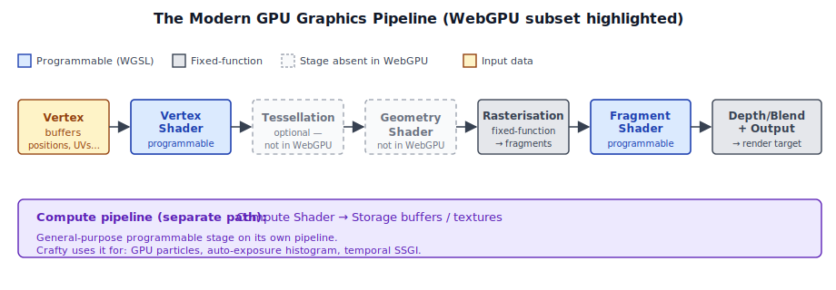
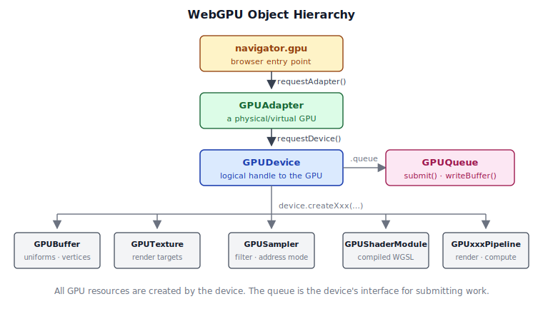
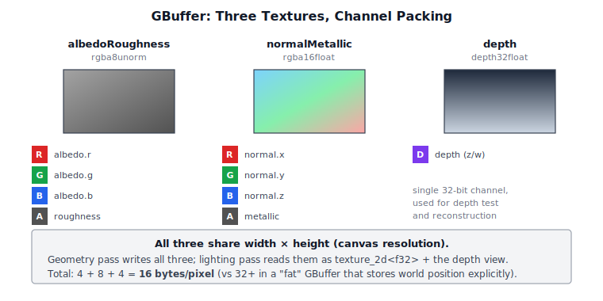
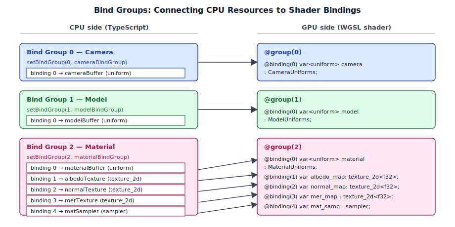
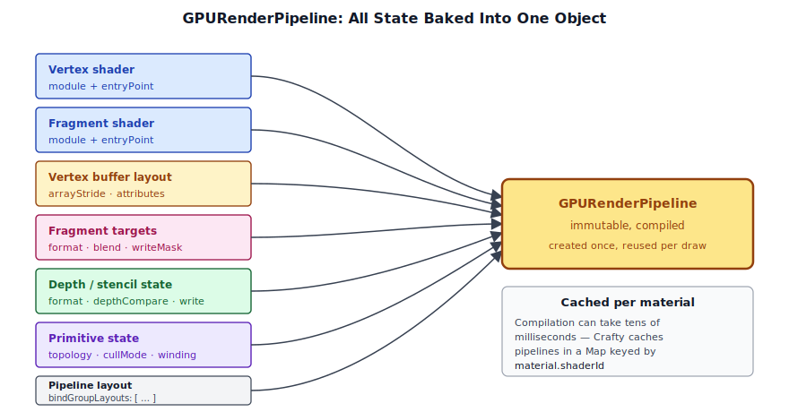
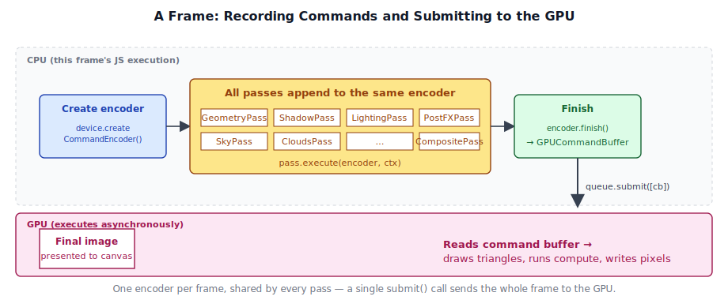

# Chapter 3: WebGPU Fundamentals

[Contents](../crafty.md) | [02-Mathematics](02-mathematics.md) | [04-Rendering Architecture](04-rendering-architecture.md)

This chapter introduces the WebGPU API from the ground up. We cover every resource type and pipeline stage that Crafty uses, building toward the `RenderContext` abstraction that the rest of the engine is built on.

## 3.1 The Graphics Pipeline

Before diving into the API, it is worth reviewing the modern GPU pipeline. Every frame, the GPU executes a sequence of stages:



WebGPU exposes a subset of this pipeline with a clean, explicit API. The key programmable stages are:

- **Vertex shader** — transforms vertices from model space to clip space, passes interpolated data to the fragment shader.
- **Fragment shader** — computes the color of each rasterised pixel, performing lighting, texturing, and shading.
- **Compute shader** — a general-purpose shader that operates on arbitrary workgroups (used by Crafty for particle systems and auto-exposure).

Pipeline state is fully explicit. Every combination of shaders, vertex layout, blend mode, depth test, and primitive topology is compiled into an immutable `GPURenderPipeline` object. There is no global state — you bind a pipeline, bind resources, and draw.

## 3.2 GPUDevice and GPUAdapter

The entry point to WebGPU is `navigator.gpu`. The first step is to request an **adapter** (a physical or virtual GPU), then create a **device** (the logical handle to that GPU). The device, in turn, owns every resource you create — buffers, textures, shaders, pipelines — and exposes a single queue for submitting work:




```typescript
// ── from src/renderer/render_context.ts ──

static async create(canvas: HTMLCanvasElement, options: RenderContextOptions = {}): Promise<RenderContext> {
  if (!navigator.gpu) {
    throw new Error('WebGPU not supported');
  }

  const adapter = await navigator.gpu.requestAdapter({
    powerPreference: 'high-performance',
  });
  if (!adapter) {
    throw new Error('No WebGPU adapter found');
  }

  const device = await adapter.requestDevice({
    requiredFeatures: [],
  });
  // ...
}
```

**Adapter selection.** We request `powerPreference: 'high-performance'` to prefer the discrete GPU when one is available. The alternative `'low-power'` prefers integrated GPUs to save battery. If the returned adapter is `null`, WebGPU is not available on this system.

**Device creation.** `adapter.requestDevice()` creates a logical device that owns all GPU resources. The `requiredFeatures` array requests optional WebGPU features; Crafty currently uses none, keeping compatibility as broad as possible.

**Error handling.** When `enableErrorHandling` is true, the context registers an `uncapturederror` event listener on the device that logs validation, out-of-memory, and internal errors:

```typescript
device.addEventListener('uncapturederror', (event) => {
  const err = event.error;
  if (err instanceof GPUValidationError) {
    console.error('[WebGPU Validation Error]', err.message);
  } else if (err instanceof GPUOutOfMemoryError) {
    console.error('[WebGPU Out of Memory]');
  }
});
```

Validation errors are the most common — they occur when you misuse the API (e.g., binding a buffer with the wrong usage flags). WebGPU's validation is strict and comprehensive, which means most bugs are caught at creation time rather than appearing as graphical corruption.

### Canvas Configuration

Once we have a device, we configure the canvas to create a swap chain:

```typescript
const context = canvas.getContext('webgpu') as GPUCanvasContext;

// Attempt HDR canvas: rgba16float + display-p3 + extended tonemapping.
let format: GPUTextureFormat;
let hdr = false;
try {
  context.configure({
    device,
    format: 'rgba16float',
    alphaMode: 'opaque',
    colorSpace: 'display-p3',
    toneMapping: { mode: 'extended' },
  });
  const config = context.getConfiguration();
  // Verify that we actually got an HDR display.
  if (config.toneMapping.mode === "extended") {
    format = 'rgba16float';
    hdr = true;
  } else {
    // The display doesn't support HDR, get the format used by the canvas.
    format = navigator.gpu.getPreferredCanvasFormat();
  }
} catch {
  // Fallback to preferred SDR format
  format = navigator.gpu.getPreferredCanvasFormat();
  context.configure({ device, format, alphaMode: 'opaque' });
}
```

Crafty attempts an HDR swap chain (`rgba16float` with `display-p3` color space and extended tone mapping). If the platform does not support it (the `configure()` call throws), we fall back to the platform's preferred SDR format — typically `bgra8unorm` on Windows and `rgba8unorm` on macOS.

## 3.3 GPUBuffer

A `GPUBuffer` is a block of GPU-accessible memory. Buffers are the primary mechanism for moving data between CPU and GPU.

### Buffer Creation

Crafty provides a convenience wrapper `createBuffer` on `RenderContext`:

```typescript
// from src/renderer/render_context.ts
createBuffer(size: number, usage: GPUBufferUsageFlags, label?: string): GPUBuffer {
  return this.device.createBuffer({ size, usage, label });
}
```

The `usage` parameter specifies how the buffer can be used:

| Flag | Used for |
|------|----------|
| `UNIFORM` | Small, frequently updated per-frame data (matrices, lights) |
| `STORAGE` | Large, randomly accessed data (skinning joints, particles) |
| `VERTEX` | Vertex positions, normals, UVs |
| `INDEX` | Triangle index lists |
| `COPY_DST` | Receiving data from `queue.writeBuffer()` |
| `COPY_SRC` | Source for `commandEncoder.copyBufferToTexture()` |
| `INDIRECT` | Indirect draw/dispatch parameters |

Example from the `GeometryPass` camera uniform buffer:

```typescript
const cameraBuffer = device.createBuffer({
  label: 'GeomCameraBuffer',
  size: CAMERA_UNIFORM_SIZE,   // 4 mat4 + vec3 + near/far = 288 bytes
  usage: GPUBufferUsage.UNIFORM | GPUBufferUsage.COPY_DST,
});
```

The `COPY_DST` flag is essential here — it allows us to upload data via `queue.writeBuffer()`.

### Uploading Data

The fastest way to upload data is `GPUQueue.writeBuffer()`, which copies CPU memory directly into the GPU buffer without an explicit staging buffer:

```typescript
// ── from RenderContext.writeBuffer ──
writeBuffer(buffer: GPUBuffer, data: ArrayBuffer | ArrayBufferView, offset = 0): void {
  if (data instanceof ArrayBuffer) {
    this.queue.writeBuffer(buffer, offset, data);
  } else {
    this.queue.writeBuffer(buffer, offset,
      data.buffer as ArrayBuffer, data.byteOffset, data.byteLength);
  }
}
```

Crafty uses `writeBuffer` extensively for per-frame uniform updates. For example, the geometry pass uploads camera matrices each frame:

```typescript
// ── from GeometryPass.updateCamera ──
updateCamera(ctx: RenderContext, view: Mat4, proj: Mat4, viewProj: Mat4,
             invViewProj: Mat4, camPos: Vec3, near: number, far: number): void {
  const data = this._cameraScratch;  // pre-allocated Float32Array
  data.set(view.data,         0);
  data.set(proj.data,        16);
  data.set(viewProj.data,    32);
  data.set(invViewProj.data, 48);
  data[64] = camPos.x; data[65] = camPos.y; data[66] = camPos.z;
  data[67] = near;
  data[68] = far;
  ctx.queue.writeBuffer(this._cameraBuffer, 0, data.buffer as ArrayBuffer);
}
```

The `_cameraScratch` `Float32Array` is pre-allocated once in the constructor and reused every frame. This avoids garbage-collector pressure from per-frame allocations.

### Buffer Alignment

WebGPU imposes alignment requirements on buffer bindings:

- **Uniform buffers**: `minUniformBufferOffsetAlignment`, typically 256 bytes.
- **Storage buffers**: `minStorageBufferOffsetAlignment`, typically 16 bytes.

Crafty uses dynamic offset uniform buffers in `BlockGeometryPass` to fit per-chunk data into a single large buffer, where each chunk gets a 256-byte aligned slot.

## 3.4 GPUTexture

A `GPUTexture` is a GPU image — a 2D, 3D, or cube-map array of texels used as render targets, depth buffers, or shader-readable inputs.

### Texture Creation

The `GBuffer` class allocates three textures for deferred rendering. Each one packs different per-pixel data into its four channels — albedo + roughness, world-space normal + metallic, and depth:




```typescript
// ── from src/renderer/gbuffer.ts ──
static create(ctx: RenderContext): GBuffer {
  const { device, width, height } = ctx;

  const albedoRoughness = device.createTexture({
    label: 'GBuffer AlbedoRoughness',
    size: { width, height },
    format: 'rgba8unorm',
    usage: GPUTextureUsage.RENDER_ATTACHMENT | GPUTextureUsage.TEXTURE_BINDING,
  });

  const normalMetallic = device.createTexture({
    label: 'GBuffer NormalMetallic',
    size: { width, height },
    format: 'rgba16float',
    usage: GPUTextureUsage.RENDER_ATTACHMENT | GPUTextureUsage.TEXTURE_BINDING,
  });

  const depth = device.createTexture({
    label: 'GBuffer Depth',
    size: { width, height },
    format: 'depth32float',
    usage: GPUTextureUsage.RENDER_ATTACHMENT | GPUTextureUsage.TEXTURE_BINDING,
  });

  return new GBuffer(albedoRoughness, normalMetallic, depth, width, height);
}
```

Key texture parameters:

| Parameter | Description |
|-----------|-------------|
| `size` | `{ width, height, depthOrArrayLayers }` — 1 for a standard 2D texture |
| `format` | Texel format — `rgba8unorm`, `rgba16float`, `depth32float`, etc. |
| `usage` | Bitfield specifying how the texture is used (`RENDER_ATTACHMENT`, `TEXTURE_BINDING`, `COPY_DST`, etc.) |
| `mipLevelCount` | Number of mip levels (default 1) |
| `sampleCount` | MSAA sample count (default 1, no multisampling) |

### Texture Views

A `GPUTextureView` is a window into a texture — a specific subresource (mip level, array layer, aspect) that can be bound as a render target or shader input. Most of the time you just want the default view:

```typescript
this.albedoRoughnessView = albedoRoughness.createView();
```

But some passes need specialized views — for example, reading only the depth aspect of a depth-stencil texture, or binding a single array layer of a cube map.

### HDR Render Target

The lighting pass writes into an HDR color attachment with format `rgba16float`:

```typescript
export const HDR_FORMAT: GPUTextureFormat = 'rgba16float';
```

This is a 16-bit-per-channel floating-point format, giving a wider dynamic range and color precision than the 8-bit sRGB swap chain. The HDR texture persists through post-processing (bloom, TAA, DOF) before being tone-mapped to SDR for display.

## 3.5 GPUSampler

A `GPUSampler` controls how textures are sampled in shaders — filtering mode, addressing mode (wrap/clamp/mirror), and level-of-detail behavior. Samplers are created once and reused across passes.

Typical creation pattern from Crafty's passes:

```typescript
const sampler = device.createSampler({
  addressModeU: 'repeat',
  addressModeV: 'repeat',
  magFilter: 'linear',
  minFilter: 'nearest',
  mipmapFilter: 'linear',
});
```

Samplers are lightweight objects that are bound to shaders through bind groups.

## 3.6 GPUBindGroup and GPUBindGroupLayout

Resources are made available to shaders through **bind groups**. A `GPUBindGroupLayout` describes the types and visibility of resources a shader expects. A `GPUBindGroup` binds actual resources (buffers, textures, samplers) to that layout.

The bind group index from `setBindGroup(N, …)` on the CPU lines up with the `@group(N)` annotation in the shader, and the per-entry `binding` numbers line up with `@binding(M)`. This is how Crafty's geometry pass connects camera, model, and material data to its WGSL:




### Bind Group Layout

Layouts are immutable descriptions of resource bindings. Here is the geometry pass creating layouts for its camera and model uniforms:

```typescript
// from src/renderer/passes/geometry_pass.ts
const cameraBGL = device.createBindGroupLayout({
  label: 'GeomCameraBGL',
  entries: [
    {
      binding: 0,
      visibility: GPUShaderStage.VERTEX | GPUShaderStage.FRAGMENT,
      buffer: { type: 'uniform' },
    },
  ],
});

const modelBGL = device.createBindGroupLayout({
  label: 'GeomModelBGL',
  entries: [
    {
      binding: 0,
      visibility: GPUShaderStage.VERTEX,
      buffer: { type: 'uniform' },
    },
  ],
});
```

The `visibility` field controls which shader stages can access the resource. The `type` field specifies the resource type (`uniform`, `storage`, `read-only-storage`, `texture`, `sampler`, etc.).

Why does WebGPU use a BindGroupLayout, when a BindGroup should be enough? The answer is about validation. The BindGroupLayouts that will be used with a shader are included when creating a Pipeline object. This validates that the shader will be compatible with the resources you intend to use with the shader. The BindGroupLayout is also used to create a BindGroup, validating the BindGroup will be compatible with the Pipeline. Since everything has now been validated at object creation time, WebGPU doesn't need to do that validation at runtime.

### Bind Group

Bind groups are the actual resource handles bound to a layout:

```typescript
const cameraBindGroup = device.createBindGroup({
  label: 'GeomCameraBindGroup',
  layout: cameraBGL,
  entries: [
    { binding: 0, resource: { buffer: cameraBuffer } },
  ],
});
```

During draw, the pipeline sets bind groups at indices matching the WGSL `@group(N)` attribute:

```typescript
pass.setBindGroup(0, this._cameraBindGroup);   // @group(0) in shader
pass.setBindGroup(1, this._modelBindGroups[i]); // @group(1)
pass.setBindGroup(2, item.material.getBindGroup(device)); // @group(2)
```

In the WGSL shader, these correspond to:

```wgsl
// from src/shaders/geometry.wgsl
@group(0) @binding(0) var<uniform> camera  : CameraUniforms;
@group(1) @binding(0) var<uniform> model   : ModelUniforms;
@group(2) @binding(0) var<uniform> material: MaterialUniforms;
@group(2) @binding(1) var albedo_map: texture_2d<f32>;
@group(2) @binding(2) var normal_map: texture_2d<f32>;
@group(2) @binding(3) var mer_map   : texture_2d<f32>;
@group(2) @binding(4) var mat_samp  : sampler;
```

Bind groups are lightweight to create and can be updated each frame when the underlying resource changes (e.g., a new shadow map texture).

## 3.7 GPUShaderModule and WGSL

WebGPU shaders are written in **WGSL** (WebGPU Shading Language), a concise, SPIR-V-derived language designed for the web.

### Shader Structure

A WGSL shader module contains a sequence of declarations — structs, bindings, functions, and entry points. Here is the geometry pass vertex shader:

```wgsl
// ── from src/shaders/geometry.wgsl ──

struct CameraUniforms {
  view       : mat4x4<f32>,
  proj       : mat4x4<f32>,
  viewProj   : mat4x4<f32>,
  invViewProj: mat4x4<f32>,
  position   : vec3<f32>,
  near       : f32,
  far        : f32,
}

struct ModelUniforms {
  model       : mat4x4<f32>,
  normalMatrix: mat4x4<f32>,
}

struct VertexInput {
  @location(0) position: vec3<f32>,
  @location(1) normal  : vec3<f32>,
  @location(2) uv      : vec2<f32>,
  @location(3) tangent : vec4<f32>,
}

struct VertexOutput {
  @builtin(position) clip_pos  : vec4<f32>,
  @location(0)       world_pos : vec3<f32>,
  @location(1)       world_norm: vec3<f32>,
  @location(2)       uv        : vec2<f32>,
  @location(3)       world_tan : vec4<f32>,
}

@group(0) @binding(0) var<uniform> camera : CameraUniforms;
@group(1) @binding(0) var<uniform> model  : ModelUniforms;

@vertex
fn vs_main(input: VertexInput) -> VertexOutput {
  let world_pos = model.model * vec4f(input.position, 1.0);
  var output: VertexOutput;
  output.clip_pos = camera.viewProj * world_pos;
  output.world_pos = world_pos.xyz;
  output.world_norm = (model.normalMatrix * vec4f(input.normal, 0.0)).xyz;
  output.uv = input.uv;
  output.world_tan = model.normalMatrix * input.tangent;
  return output;
}
```

Key WGSL features visible here:

- **Struct types** define shader interfaces.
- `@group(N) @binding(M)` attributes link bindings to the bind groups set from the CPU.
- `@location(N)` specifies vertex attribute locations and inter-stage varying slots.
- `@builtin(position)` marks the clip-space position output.
- `var<uniform>` declares a uniform buffer; `var texture_2d<f32>` declares a sampled texture.

### Shader Compilation

Shader modules are created from WGSL source code at runtime:

```typescript
const shaderModule = device.createShaderModule({
  label: `GeometryShader[${material.shaderId}]`,
  code: material.getShaderCode(MaterialPassType.Geometry),
});
```

WebGPU validates WGSL to native GPU instructions as part of `createShaderModule()`. Compilation errors are reported through `getCompilationInfo()`:

```typescript
const info = shaderModule.getCompilationInfo();
for (const msg of info.messages) {
  if (msg.type === 'error') {
    console.error(`Shader error at ${msg.lineNum}:${msg.linePos}: ${msg.message}`);
  }
}
```

Note that WebGPU doesn't actually compile the shader for the GPU backend (D3D, Vulkan, Metal) until a Pipeline object is created using the ShaderModule. This is because the other state information provided by the Pipeline can affect the shader that is compiled for the GPU backend. Because of this, you will find that creating Pipeline objects is significantly more time consuming than createShaderModule.

Crafty loads shaders at module scope via Vite's `?raw` import syntax:

```typescript
import lightingWgsl from '../../shaders/lighting.wgsl?raw';
```

This inlines the WGSL source as a string at build time, avoiding runtime fetch requests.

## 3.8 GPURenderPipeline and GPUComputePipeline

Pipelines are the immutable, compiled representation of the entire GPU state for a draw or dispatch call.

### Render Pipeline Creation

Creating a render pipeline requires specifying vertex buffers, shader stages, fragment targets, depth/stencil state, and primitive topology — every piece of state needed to issue draw calls is funneled into one immutable object:




```typescript
// ── from geometry_pass.ts _getPipeline ──
pipeline = device.createRenderPipeline({
  label: `GeometryPipeline[${material.shaderId}]`,
  layout: device.createPipelineLayout({
    bindGroupLayouts: [
      this._cameraBGL,
      this._modelBGL,
      material.getBindGroupLayout(device),
    ],
  }),
  vertex: {
    module: shaderModule,
    entryPoint: 'vs_main',
    buffers: [
      {
        arrayStride: VERTEX_STRIDE,        // bytes per vertex
        attributes: VERTEX_ATTRIBUTES,     // position, normal, uv, tangent
      },
    ],
  },
  fragment: {
    module: shaderModule,
    entryPoint: 'fs_main',
    targets: [
      { format: 'rgba8unorm' },    // albedo+roughness
      { format: 'rgba16float' },   // normal+metallic
    ],
  },
  depthStencil: {
    format: 'depth32float',
    depthWriteEnabled: true,
    depthCompare: 'less',
  },
  primitive: {
    topology: 'triangle-list',
    cullMode: 'back',
  },
});
```

**Pipeline layout.** The `GPU PipelineLayout` aggregates all bind group layouts used by the pipeline. This is optional — you can use `layout: 'auto'` — but explicit layouts give you portability and validation across different WebGPU implementations.

**Vertex buffers.** The `buffers` array describes the vertex input layout: `arrayStride` (bytes between consecutive vertices) and `attributes` (location, format, and offset within the stride).

**Fragment targets.** The `targets` array must match the color attachments in the render pass — one entry per attachment.

**Depth/stencil.** We use `depth32float` with `less` comparison and write enabled for the opaque geometry pass.

**Culling.** Back-face culling with counter-clockwise winding order (the default) assumes triangles are wound correctly during mesh creation.

### Pipeline Caching

Creating pipelines is expensive — compilation can take tens of milliseconds on complex shaders. Crafty caches pipelines in a `Map<string, GPURenderPipeline>` keyed by material shader ID:

```typescript
private _pipelineCache = new Map<string, GPURenderPipeline>();

private _getPipeline(device: GPUDevice, material: Material): GPURenderPipeline {
  let pipeline = this._pipelineCache.get(material.shaderId);
  if (pipeline) return pipeline;
  // ... create and cache ...
  this._pipelineCache.set(material.shaderId, pipeline);
  return pipeline;
}
```

Materials that share the same WGSL shader source reuse the same pipeline.

### Compute Pipelines

Compute pipelines are simpler — they have no vertex/fragment state, only a compute shader and layout:

```typescript
const computePipeline = device.createComputePipeline({
  layout: pipelineLayout,
  compute: {
    module: shaderModule,
    entryPoint: 'cs_main',
  },
});
```

Crafty uses compute pipelines for particle simulation, auto-exposure histogram computation, and temporal SSGI.

## 3.9 GPUCommandEncoder and GPUQueue

All GPU work is recorded into a **command buffer** via a `GPUCommandEncoder`, then submitted to the GPU through a `GPUQueue`. Every render pass for the frame writes into a single shared encoder, which is then finished and submitted as one command buffer:




### The Frame Recording Pattern

The render graph creates a single encoder per frame and shares it across all passes:

```typescript
// ── from render_graph.ts execute() ──
async execute(ctx: RenderContext): Promise<void> {
  ctx.pushFrameErrorScope();

  const encoder = ctx.device.createCommandEncoder();
  for (const pass of this._passes) {
    if (pass.enabled) {
      pass.execute(encoder, ctx);
    }
  }
  ctx.queue.submit([encoder.finish()]);

  await ctx.popFrameErrorScope();
}
```

**All passes share one encoder.** This is critical for correctness — each pass appends commands (render passes, buffer copies, barriers) into the same encoder. A single `encoder.finish()` produces one command buffer, and `queue.submit()` sends it to the GPU.

### Render Pass Encoding

Inside each pass, `encoder.beginRenderPass()` creates a `GPURenderPassEncoder`:

```typescript
// ── from geometry_pass.ts execute() ──
const pass = encoder.beginRenderPass({
  label: 'GeometryPass',
  colorAttachments: [
    {
      view: this._gbuffer.albedoRoughnessView,
      clearValue: [0, 0, 0, 1],
      loadOp: 'clear',
      storeOp: 'store',
    },
    {
      view: this._gbuffer.normalMetallicView,
      clearValue: [0, 0, 0, 0],
      loadOp: 'clear',
      storeOp: 'store',
    },
  ],
  depthStencilAttachment: {
    view: this._gbuffer.depthView,
    depthClearValue: 1,
    depthLoadOp: 'clear',
    depthStoreOp: 'store',
  },
});
```

The `loadOp` controls whether the attachment is cleared at the start of the pass (`'clear'`) or preserves existing contents (`'load'`). Subsequent passes that write to the same G-buffer (e.g., `BlockGeometryPass`) use `loadOp: 'load'` to append to the already-filled G-buffer.

### Draw Calls

Inside a render pass, the typical draw sequence is:

```typescript
pass.setPipeline(pipeline);
pass.setBindGroup(0, cameraBindGroup);
pass.setBindGroup(1, modelBindGroup);
pass.setBindGroup(2, materialBindGroup);
pass.setVertexBuffer(0, vertexBuffer);
pass.setIndexBuffer(indexBuffer, 'uint32');
pass.drawIndexed(indexCount);
```

Crafty uses indexed drawing (via `drawIndexed`) for all triangle meshes. Non-indexed `draw()` is used for fullscreen triangle passes (lighting, post-processing).

### Copy and Barrier Operations

The command encoder also supports copy operations and pipeline barriers. For example, copying the results of a compute shader into a storage buffer for indirect draw:

```typescript
encoder.copyBufferToBuffer(source, 0, dest, 0, size);
```

Crafty uses compute-to-buffer copies in the particle system to copy the computed particle count into the indirect draw buffer.

## 3.10 The RenderContext Abstraction

The `RenderContext` class (`src/renderer/render_context.ts`) wraps the WebGPU device, queue, and canvas configuration into a single handle that flows through the entire render graph.

```typescript
export class RenderContext {
  readonly device: GPUDevice;
  readonly queue: GPUQueue;
  readonly context: GPUCanvasContext;
  readonly format: GPUTextureFormat;
  readonly canvas: HTMLCanvasElement;
  readonly hdr: boolean;
  readonly enableErrorHandling: boolean;
}
```

It provides:

- **Swap chain access** via `getCurrentTexture()`.
- **Buffer creation** via `createBuffer()`.
- **Data upload** via `writeBuffer()`.
- **Error scope management** via `pushInitErrorScope()` / `popInitErrorScope()` and per-frame/per-pass variants.

Every render pass receives the `RenderContext` during `execute()` and uses it to access the device, queue, and canvas dimensions. The `RenderGraph` owns the relationship between passes and the context:

```
Application (main.ts)
   │
   ▼
RenderGraph  ─── owns ───►  RenderPass[]
   │                            │
   │                            ▼
   │                      execute(encoder, ctx)
   │
   └──►  GPUCommandEncoder ──► queue.submit()
```

### Lifecycle

1. **Creation.** `RenderContext.create(canvas)` is called once during startup. It requests the adapter, creates the device, and configures the canvas.
2. **Frame loop.** Each frame, `RenderGraph.execute()` creates a command encoder, runs all passes, and submits.
3. **Resize.** On canvas resize, the canvas pixel dimensions are updated and the graph is re-created (passes that depend on canvas size, like the GBuffer, reallocate their textures).
4. **Destroy.** `RenderGraph.destroy()` calls `destroy()` on every pass, and the render context itself is discarded.

### 3.11 Summary

In this chapter we covered every major WebGPU resource type and saw how Crafty uses them:

| Resource | Crafty usage | Key files |
|----------|-------------|-----------|
| `GPUAdapter` / `GPUDevice` | Created once in `RenderContext.create()` | `render_context.ts` |
| `GPUBuffer` | Uniforms per-frame, vertex/index for meshes, storage for particles | `geometry_pass.ts`, `particle_pass.ts` |
| `GPUTexture` | GBuffer, HDR target, shadow maps, sky, cloud noise | `gbuffer.ts`, `lighting_pass.ts` |
| `GPUSampler` | Created per-pass for texture sampling | various passes |
| `GPUBindGroup` / `GPUBindGroupLayout` | Group 0=camera, 1=model, 2=material | `geometry_pass.ts` |
| `GPUShaderModule` | Loaded from `.wgsl` files via `?raw` import | `src/shaders/*.wgsl` |
| `GPURenderPipeline` | Cached per material shader ID | `geometry_pass.ts` |
| `GPUComputePipeline` | Particles, auto-exposure, SSGI | `particle_pass.ts`, `auto_exposure_pass.ts` |
| `GPUCommandEncoder` | One per frame, shared across all passes | `render_graph.ts` |
| `GPUQueue` | `writeBuffer()` for uniform uploads, `submit()` for command buffers | `render_context.ts` |

**Further reading:**
- `src/renderer/render_context.ts` — GPUDevice/GPUAdapter creation and management
- `src/renderer/passes/` — Per-pass buffer, texture, and pipeline creation
- `src/shaders/` — All WGSL shader modules
- `src/engine/camera.ts` — Camera uniforms and bind group layout

In the next chapter, we see how these pieces come together in Crafty's render graph architecture — the system that orchestrates all these resources into a complete frame.

----
[Contents](../crafty.md) | [02-Mathematics](02-mathematics.md) | [04-Rendering Architecture](04-rendering-architecture.md)
