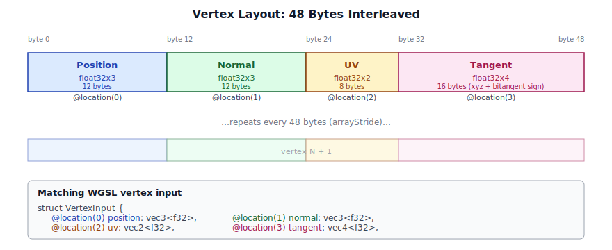
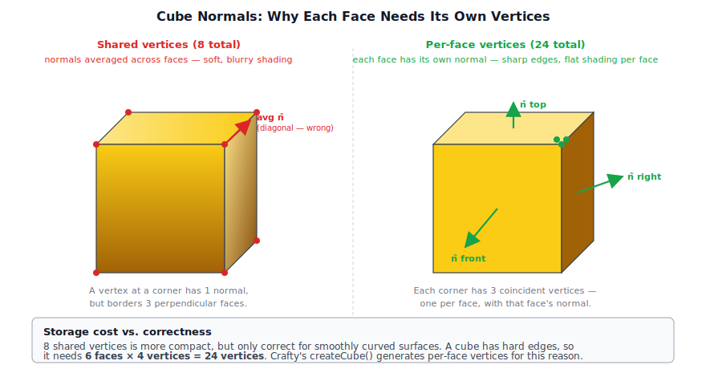
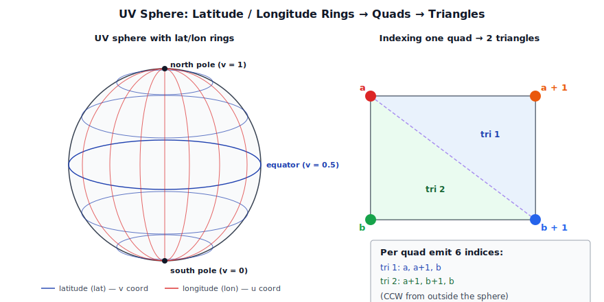
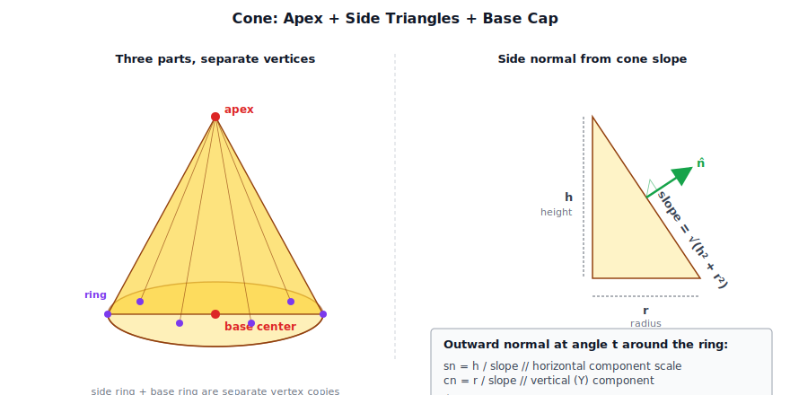
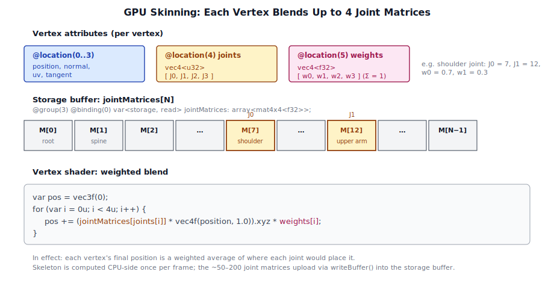

# Chapter 4: Meshes and Geometry

[Contents](../crafty.md) | [03-Rendering Architecture](03-rendering-architecture.md) | [05-Textures / Materials](05-textures-materials.md)

Every visible object in Crafty is represented by a **mesh** — a collection of vertices and indices that define its shape. This chapter covers how meshes are defined, uploaded to the GPU, and rendered.

## 4.1 Vertex and Index Buffers

A mesh in WebGPU lives in two GPU buffers: a **vertex buffer** holding per-vertex data (positions, normals, UVs, tangents) and an **index buffer** specifying which vertices form triangles.

Crafty's `Mesh` class (`src/assets/mesh.ts`) owns these buffers:

```typescript
// ── from src/assets/mesh.ts ──
export class Mesh {
  readonly vertexBuffer: GPUBuffer;
  readonly indexBuffer: GPUBuffer;
  readonly indexCount: number;
}
```

### Vertex Layout

Each vertex is 48 bytes — 12 consecutive 32-bit floats. The four attributes are packed back-to-back, with their byte offsets matching the `@location(N)` slots that the WGSL vertex shader reads:




| Offset | Size | Attribute | Location |
|--------|------|-----------|----------|
| 0 | 12 bytes (float32x3) | Position | 0 |
| 12 | 12 bytes (float32x3) | Normal | 1 |
| 24 | 8 bytes (float32x2) | UV | 2 |
| 32 | 16 bytes (float32x4) | Tangent (xyz + bitangent sign) | 3 |

This is defined by the exported constants:

```typescript
// ── from src/assets/mesh.ts ──
export const VERTEX_STRIDE = 48;

export const VERTEX_ATTRIBUTES: GPUVertexAttribute[] = [
  { shaderLocation: 0, offset:  0, format: 'float32x3' }, // position
  { shaderLocation: 1, offset: 12, format: 'float32x3' }, // normal
  { shaderLocation: 2, offset: 24, format: 'float32x2' }, // uv
  { shaderLocation: 3, offset: 32, format: 'float32x4' }, // tangent
];
```

The `shaderLocation` values correspond to `@location(N)` in the WGSL vertex shader input:

```wgsl
// ── from src/shaders/geometry.wgsl ──
struct VertexInput {
  @location(0) position: vec3<f32>,
  @location(1) normal  : vec3<f32>,
  @location(2) uv      : vec2<f32>,
  @location(3) tangent : vec4<f32>,
}
```

### Buffer Creation

Meshes are created via `Mesh.fromData()`, which uploads CPU-side arrays to the GPU:

```typescript
// ── from src/assets/mesh.ts ──
static fromData(device: GPUDevice, vertices: Float32Array, indices: Uint32Array): Mesh {
  const vb = device.createBuffer({
    label: 'Mesh VertexBuffer',
    size: vertices.byteLength,
    usage: GPUBufferUsage.VERTEX | GPUBufferUsage.COPY_DST,
  });
  device.queue.writeBuffer(vb, 0, vertices.buffer as ArrayBuffer,
    vertices.byteOffset, vertices.byteLength);

  const ib = device.createBuffer({
    label: 'Mesh IndexBuffer',
    size: indices.byteLength,
    usage: GPUBufferUsage.INDEX | GPUBufferUsage.COPY_DST,
  });
  device.queue.writeBuffer(ib, 0, indices.buffer as ArrayBuffer,
    indices.byteOffset, indices.byteLength);

  return new Mesh(vb, ib, indices.length);
}
```

Both buffers use `COPY_DST` so they can be populated with `queue.writeBuffer()`. This is a one-time upload — once populated, the vertex and index data lives entirely on the GPU.

## 4.2 Vertex Attributes and Layouts

The vertex buffer layout is specified when creating a render pipeline:

```typescript
// ── from src/renderer/passes/geometry_pass.ts ──
vertex: {
  module: shaderModule,
  entryPoint: 'vs_main',
  buffers: [
    {
      arrayStride: VERTEX_STRIDE,     // 48 bytes between vertices
      attributes: VERTEX_ATTRIBUTES,  // position, normal, uv, tangent
    },
  ],
},
```

WebGPU supports multiple vertex buffers (for separate position/normal/UV streams), but Crafty uses **interleaved** vertices — all attributes for a single vertex are packed into one buffer entry. This is simpler and more cache-efficient for the typical rendering pattern of iterating vertices sequentially.

## 4.3 The Mesh Asset Type

Crafty's `Mesh` class is the sole mesh representation. There is no higher-level "model" class — a model is simply a collection of `Mesh` + `Material` pairs enumerated during rendering.

## 4.4 Procedural Geometry

### Plane

The plane mesh is the simplest procedural geometry — two triangles forming a square:

```typescript
// ── from src/assets/mesh.ts ──
static createPlane(device: GPUDevice, size = 1): Mesh {
  const h = size / 2;
  // Four corners, two triangles
  const vertices = new Float32Array([
    // position      normal         uv       tangent
    -h, 0, -h,      0, 1, 0,      0, 0,    1, 0, 0, 1,
    h, 0, -h,       0, 1, 0,      1, 0,    1, 0, 0, 1,
    h, 0, h,        0, 1, 0,      1, 1,    1, 0, 0, 1,
    -h, 0, h,       0, 1, 0,      0, 1,    1, 0, 0, 1,
  ]);
  const indices = new Uint32Array([0, 1, 2, 0, 2, 3]);
  return Mesh.fromData(device, vertices, indices);
}
```

### Cube

```typescript
// ── from src/assets/mesh.ts ──
static createCube(device: GPUDevice, size = 1): Mesh {
  const h = size / 2;
  // Six faces, each with 4 vertices
  // Each vertex: position(3) + normal(3) + uv(2) + tangent(4) = 12 floats
  const faces = [
    { normal:[0,0,1],  tangent:[1,0,0,1],
      verts: [[-h,-h,h],[h,-h,h],[h,h,h],[-h,h,h]] },    // front
    { normal:[0,0,-1], tangent:[-1,0,0,1],
      verts: [[h,-h,-h],[-h,-h,-h],[-h,h,-h],[h,h,-h]] },// back
    // ... four more faces ...
  ];
  // Builds vertex array and index array, calls fromData()
}
```

Each face has its own normal and tangent, enabling correct per-face lighting. The winding order is counter-clockwise (standard for WebGPU).

A common mistake with cube meshes is sharing vertices across faces (so a vertex has a single normal that is an average of the adjacent face normals). Crafty's cube creates **unique vertices per face**, so each face has its own explicit normal:

```
Face   Normal   Tangent        Vertices
─────  ───────  ────────────   ──────────────────────
front  (0,0,1)  (1,0,0,1)     (-h,-h,h)-(h,-h,h)-(h,h,h)-(-h,h,h)
back   (0,0,-1) (-1,0,0,1)    (h,-h,-h)-(-h,-h,-h)-(-h,h,-h)-(h,h,-h)
right  (1,0,0)  (0,0,-1,1)    (h,-h,h)-(h,-h,-h)-(h,h,-h)-(h,h,h)
left   (-1,0,0) (0,0,1,1)     (-h,-h,-h)-(-h,-h,h)-(-h,h,h)-(-h,h,-h)
top    (0,1,0)  (1,0,0,1)     (-h,h,h)-(h,h,h)-(h,h,-h)-(-h,h,-h)
bottom (0,-1,0) (1,0,0,-1)    (-h,-h,-h)-(h,-h,-h)-(h,-h,h)-(-h,-h,h)
```

This is important for correct lighting — without explicit per-face normals, a cube with hard edges would appear softly shaded at the corners:



### UV Sphere

`Mesh.createSphere(device, radius, latSegments, lonSegments)` generates a **UV sphere** — a sphere built from latitude and longitude rings. Each pair of adjacent rings forms a band of quads, and each quad is split into two triangles:




```typescript
// ── from src/assets/mesh.ts ──
static createSphere(device: GPUDevice, radius = 0.5,
                    latSegments = 32, lonSegments = 32): Mesh {
  const vertData: number[] = [];
  const idxData: number[] = [];

  for (let lat = 0; lat <= latSegments; lat++) {
    const theta    = (lat / latSegments) * Math.PI;
    const sinTheta = Math.sin(theta);
    const cosTheta = Math.cos(theta);

    for (let lon = 0; lon <= lonSegments; lon++) {
      const phi    = (lon / lonSegments) * Math.PI * 2;
      const sinPhi = Math.sin(phi);
      const cosPhi = Math.cos(phi);

      const nx = sinTheta * cosPhi;
      const ny = cosTheta;
      const nz = sinTheta * sinPhi;

      vertData.push(
        nx * radius, ny * radius, nz * radius,  // position
        nx, ny, nz,                              // normal
        lon / lonSegments, lat / latSegments,    // uv
        -sinPhi, 0, cosPhi, 1,                    // tangent
      );
    }
  }

  for (let lat = 0; lat < latSegments; lat++) {
    for (let lon = 0; lon < lonSegments; lon++) {
      const a = lat * (lonSegments + 1) + lon;
      const b = a + lonSegments + 1;
      idxData.push(a, a + 1, b);
      idxData.push(a + 1, b + 1, b);
    }
  }

  return Mesh.fromData(device, new Float32Array(vertData),
                       new Uint32Array(idxData));
}
```

Because the sphere is centerd at the origin, the **normal at each vertex equals the normalized vertex position** — the unit vector `(nx, ny, nz)`. The vertex position is simply that normal scaled by `radius`. This gives smooth, continuous normals across the entire surface, producing correct Lambertian and specular lighting.

The **tangent** is the derivative of the surface position with respect to longitude — `(-sinPhi, 0, cosPhi)` — which points eastward along the latitude ring. This gives the normal map a consistent local reference frame.

**UV coordinates** wrap `u` around the longitude (0 at the prime meridian, 1 at the same seam) and `v` across the latitude (0 at the south pole, 1 at the north pole). The seam at `lon = lonSegments` overlaps with `lon = 0` — two distinct vertices share the same spatial position but have different UVs, creating a single sharp seam where the texture wraps.

**Indexing** produces two triangles per quad:

```
a ─── a+1         a = lat * (lonSegments + 1) + lon
│ \     │         b = a + lonSegments + 1
│   \   │
b ─── b+1
```

The winding is counter-clockwise when viewed from outside the sphere, which matches WebGPU's default front face.

**Segment count** trades quality for performance:

- **16×16** — 1,058 vertices, used for distant or small objects.
- **32×32** — 4,194 vertices, the default — smooth enough for most uses.
- **64×64** — 16,514 vertices, used when the sphere fills a large portion of the screen.

The sphere is used for debug light markers (showing point/spot light positions and colors) and for any procedural object requiring a round shape.

### Cone

`Mesh.createCone(device, radius, height, segments)` generates a cone with its apex at `(0, height, 0)` and its base centerd at the origin on the XZ plane:

```typescript
// ── from src/assets/mesh.ts ──
static createCone(device: GPUDevice, radius = 0.5,
                  height = 1.0, segments = 16): Mesh {
  const vertData: number[] = [];
  const idxData: number[] = [];

  const slope = Math.sqrt(height * height + radius * radius);
  const sn = height / slope;   // outward normal x/z scale
  const cn = radius / slope;   // outward normal y component

  // Apex
  vertData.push(0, height, 0,  0, 1, 0,  0.5, 0,  1, 0, 0, 1);

  // Side ring — segments+1 to close the seam
  const sideRingStart = 1;
  for (let i = 0; i <= segments; i++) {
    const t = (i / segments) * Math.PI * 2;
    const c = Math.cos(t), s = Math.sin(t);
    vertData.push(
      c * radius, 0, s * radius,
      c * sn, cn, s * sn,
      i / segments, 1,
      c, 0, s, 1,
    );
  }

  // Side triangles — apex, ring[i+1], ring[i]
  for (let i = 0; i < segments; i++) {
    idxData.push(0, sideRingStart + i + 1, sideRingStart + i);
  }

  // Base cap center
  const capCenter = sideRingStart + segments + 1;
  vertData.push(0, 0, 0,  0, -1, 0,  0.5, 0.5,  1, 0, 0, 1);

  // Base cap ring
  const capRingStart = capCenter + 1;
  for (let i = 0; i <= segments; i++) {
    const t = (i / segments) * Math.PI * 2;
    const c = Math.cos(t), s = Math.sin(t);
    vertData.push(
      c * radius, 0, s * radius,
      0, -1, 0,
      0.5 + c * 0.5, 0.5 + s * 0.5,
      1, 0, 0, 1,
    );
  }

  // Base triangles — center, ring[i], ring[i+1]
  for (let i = 0; i < segments; i++) {
    idxData.push(capCenter, capRingStart + i, capRingStart + i + 1);
  }

  return Mesh.fromData(device, new Float32Array(vertData),
                       new Uint32Array(idxData));
}
```

The cone is built from three parts: the **apex** (a single vertex at the tip), the **side** (a triangle fan from the apex to the base ring), and the **base cap** (a triangle fan from the center of the base to the ring). Side normals come from the cone's slope — perpendicular to the slanted surface in cross-section:




**Side normals** are computed from the slope of the cone. For a cone with radius `r` and height `h`, the outward normal on the side has a horizontal component proportional to `h / sqrt(h² + r²)` and a vertical component proportional to `r / sqrt(h² + r²)`:

```typescript
// ── from src/assets/mesh.ts ──
const slope = Math.sqrt(height * height + radius * radius);
const sn = height / slope;   // horizontal scale factor
const cn = radius / slope;   // vertical (Y) component
```

This produces normals that are perpendicular to the cone's slanted surface, giving correct Lambertian lighting across the sides.

**Base cap normals** are `(0, -1, 0)` — straight down — shared by both the center vertex and the ring vertices. The base and side use separate vertices at the same ring positions (the `sideRingStart` and `capRingStart` loops each generate their own copy of the ring), so the side and base can have different normals at the same spatial location.

**UVs** for the side map `u` around the circumference and `v` to the vertical position (0 at the apex, 1 at the base). The base cap uses a radial projection: `(0.5 + cos(t) * 0.5, 0.5 + sin(t) * 0.5)`, creating a circular UV layout centerd on the base.

**Tangents** for the side are `(cos(t), 0, sin(t))` — the derivative of the vertex position around the ring. The apex and base center use a fixed `(1, 0, 0, 1)` tangent since they are singular points connected to all segments.

The cone is useful for rendering volumetric light cones (spot lights), particle emission cones, and any conical procedural shape.

## 4.5 Skinned Meshes and Skeletons

Skinned meshes extend the basic mesh with **joint influences** — each vertex is bound to up to four bones with corresponding weights. The actual deformation happens entirely on the GPU: every vertex carries 4 joint indices and 4 weights, and the vertex shader looks up the matching joint matrices in a storage buffer to produce the final position:




```typescript
// ── from src/renderer/passes/skinned_geometry_pass.ts ──
// Additional vertex attributes for skinned geometry
// location 4: joint indices (uint32x4 packed)
// location 5: joint weights (float32x4)
```

The skinning is computed on the GPU in the vertex shader, using a storage buffer of joint matrices:

```wgsl
// ── from src/shaders/skinned_geometry.wgsl ──

@group(3) @binding(0) var<storage, read> jointMatrices: array<mat4x4<f32>>;

fn skin_position(position: vec3f, joints: vec4u, weights: vec4f) -> vec3f {
  var pos = vec3f(0);
  for (var i = 0u; i < 4u; i++) {
    pos += (jointMatrices[joints[i]] * vec4f(position, 1.0)).xyz * weights[i];
  }
  return pos;
}
```

The `SkinnedGeometryPass` renders these meshes into the G-buffer, applying the joint transform before the standard vertex transform chain.

## 4.6 Animation

Animation in Crafty is stored as **clips** — sequences of joint transforms sampled at a fixed rate. Animation playback interpolates between keyframes:

```typescript
// ── from src/engine/animation.ts ──
// Animation clip playback
class AnimationClip {
  // Samples per joint: translation, rotation (quaternion), scale
  sample(time: number, jointIndex: number): { translation: Vec3; rotation: Quaternion; scale: Vec3 };
}
```

Joint transforms are computed on the CPU each frame and uploaded to a GPU storage buffer:

```typescript
// ── from src/renderer/passes/skinned_geometry_pass.ts ──
// Per frame: compute joint matrices, upload to GPU
const jointCount = skeleton.jointCount;
const jointBuffer = device.createBuffer({
  size: jointCount * 64,  // mat4x4 = 64 bytes per joint
  usage: GPUBufferUsage.STORAGE | GPUBufferUsage.COPY_DST,
});
queue.writeBuffer(jointBuffer, 0, jointMatrices.buffer);
```

The storage buffer is bound at group 3 of the skinned geometry pipeline, separate from the group-2 material bindings, so the same material system works for both static and skinned meshes.

## 4.7 GLTF 2.0 Binary Loader

Crafty's `GltfLoader` (`src/assets/gltf_loader.ts`) loads animated, skinned models from binary glTF 2.0 (`.glb`) files. It parses the GLB container, decodes accessors, generates tangents, and produces GPU-ready meshes, materials, skeletons, and animation clips.

### GLB Container Format

A `.glb` file is a little-endian binary container with a 12-byte header followed by chunks:

```
┌────────────────────────────────────────────┐
│ Magic  (0x46546C67 = "glTF") | Version (2) │  12 bytes
│ File length                                 │
├────────────────────────────────────────────┤
│ Chunk length (JSON)   | Type (0x4E4F534A)  │  8 bytes + chunk data
│ Chunk: UTF-8 JSON describing the scene     │
├────────────────────────────────────────────┤
│ Chunk length (BIN)    | Type (0x004E4942)  │  8 bytes + chunk data  
│ Chunk: binary buffer for accessors/images │
└────────────────────────────────────────────┘
```

The parser reads these chunks in sequence — the JSON chunk is decoded with `TextDecoder` and parsed, the BIN chunk is kept as an `ArrayBuffer` for direct `DataView` access:

```typescript
// ── from src/assets/gltf_loader.ts ──
const magic   = view.getUint32(0, true);
const version = view.getUint32(4, true);
if (magic !== 0x46546C67 || version !== 2) throw Error('Not a valid GLB 2.0');

while (offset < arrayBuf.byteLength) {
  const chunkLength = view.getUint32(offset, true);
  const chunkType   = view.getUint32(offset + 4, true);
  offset += 8;
  if (chunkType === 0x4E4F534A) { /* JSON chunk */ }
  else if (chunkType === 0x004E4942) { /* BIN chunk */ }
  offset += chunkLength;
}
```

### Accessor Decoding

glTF accessors describe typed views into the binary buffer. The loader handles all common formats:

| `componentType` | C type | Method |
|---|---|---|
| 5126 | `float32` | `DataView.getFloat32` |
| 5125 | `uint32` | `DataView.getUint32` |
| 5123 | `uint16` | `DataView.getUint16` |
| 5121 | `uint8` | `DataView.getUint8` |

Accessors respect the buffer view's `byteStride`, allowing interleaved vertex data in the source file:

```typescript
// ── from src/assets/gltf_loader.ts ──
const n      = TYPE_COUNT[acc.type] ?? 1;
const bv     = bufferViews[acc.bufferView!];
const stride = bv.byteStride ?? (n * 4);

for (let i = 0; i < count; i++) {
  for (let c = 0; c < n; c++) {
    out[i * n + c] = src.getFloat32(i * stride + c * 4, true);
  }
}
```

### MikkTSpace Tangent Generation

Many glTF files omit tangents, relying on the engine to generate them. Crafty's `computeTangents` implements the **MikkTSpace** algorithm — it accumulates per-triangle tangent/bitangent contributions into vertex arrays, then applies Gram-Schmidt orthonormalization and calculates the bitangent sign (`w`):

```typescript
// ── from src/assets/gltf_loader.ts ──
for each triangle (i0, i1, i2):
  const e1 = p1 - p0, e2 = p2 - p0;
  const duv1 = uv1 - uv0, duv2 = uv2 - uv0;
  const r = 1 / (du1*dv2 - du2*dv1);
  const t = (dv2*e1 - dv1*e2) * r;
  const b = (du1*e2 - du2*e1) * r;
  accumulate t into tan1[i0,i1,i2], b into tan2[i0,i1,i2]

for each vertex i:
  Gram-Schmidt: t' = normalize(t - n * dot(n, t))
  w = sign(dot(cross(n, t'), tan2[i]))
  store t'.xyz and w as the 4-component tangent
```

### Vertex Packing

The loader packs parsed attributes into an 80-byte interleaved vertex (20 floats):

| Offset | Size | Attribute |
|---|---|---|
| 0 | 12 bytes | `position` (float32x3) |
| 12 | 12 bytes | `normal` (float32x3) |
| 24 | 8 bytes | `uv` (float32x2) |
| 32 | 16 bytes | `tangent` (float32x4) |
| 48 | 16 bytes | `joints` (uint32x4, written via `Uint32Array` view) |
| 64 | 16 bytes | `weights` (float32x4) |

Joints and weights are packed at fixed offsets using a `Uint32Array` view over the same `Float32Array` buffer — a common pattern for writing uint data into an f32 array without allocation:

```typescript
// ── from src/assets/gltf_loader.ts ──
const vertBuf = new Float32Array(vertCount * 20);
const vertU32 = new Uint32Array(vertBuf.buffer);

vertU32[f+12] = jointsRaw[i*4];   // joint 0-3 as uint32
vertBuf[f+16] = weights[i*4];     // weight 0-3 as float32
```

If the mesh has no joints or weights, a default weight of `1.0` is assigned to make it compatible with the skinned pipeline.

### Material and Texture Resolution

PBR materials are constructed from the glTF metallic-roughness model. Base color and normal textures embedded in the BIN chunk are extracted as Blobs, decoded via `createImageBitmap`, and uploaded to the GPU as `Texture` objects:

```typescript
// ── from src/assets/gltf_loader.ts ──
if (img.bufferView != null) {
  const bv  = gltf.bufferViews![img.bufferView];
  const bytes = new Uint8Array(bin, bv.byteOffset, bv.byteLength);
  const blob  = new Blob([bytes], { type: img.mimeType ?? 'image/png' });
  const bitmap = await createImageBitmap(blob, { colorSpaceConversion: 'none' });
  return Texture.fromBitmap(device, bitmap, { srgb });
}
```

External URI-based textures are loaded via `Texture.fromUrl` as a fallback.

### Skeleton and Animation Import

Skinning data is reconstructed from glTF's node hierarchy. The loader builds a `Skeleton` by mapping joint nodes, computing parent indices, and reading inverse bind matrices. A root transform accumulates ancestor nodes above the skeleton root that contribute to the model-space transform:

```typescript
// ── from src/assets/gltf_loader.ts ──
let rootTransform = identity();
let anc = nodeParent[jointNodes[0]];
while (anc >= 0) {
  rootTransform = mat4Mul(nodeLocalMatrix(nodes[anc]), rootTransform);
  anc = nodeParent[anc];
}
skeleton = new Skeleton(parentIndices, invBindMats, restT, restR, restS, rootTransform);
```

Animation channels are grouped into `AnimationClip` objects, each containing per-joint keyframe sequences with configurable interpolation (LINEAR, STEP, CUBICSPLINE). The loader returns all parsed resources in a `GltfModel` object that owns the GPU buffers — the caller must call `model.destroy()` to release them.

### 4.8 Summary

The mesh system is self-contained and minimal:

- `Mesh` owns vertex/index GPU buffers with a fixed interleaved layout (48 bytes/vertex).
- Procedural creation methods (`createCube`, `createPlane`, `createSphere`) provide common geometry.
- Skinned meshes add joint-weight vertex attributes and a storage buffer for GPU skinning.
- Animation clips sample joint transforms and upload them per-frame.

Meshes are drawn by render passes that iterate `DrawItem` lists — each item pairing a `Mesh` with a `Material` and a transform matrix.

**Further reading:**
- `src/assets/mesh.ts` — Mesh class and all procedural generators
- `src/shaders/geometry.wgsl` — Vertex/fragment shader for static geometry
- `src/shaders/skinned_geometry.wgsl` — Vertex/fragment shader for skinned geometry
- `src/renderer/passes/geometry_pass.ts` — Draws static meshes into the G-buffer
- `src/renderer/passes/skinned_geometry_pass.ts` — Draws skinned meshes into the G-buffer

----
[Contents](../crafty.md) | [03-Rendering Architecture](03-rendering-architecture.md) | [05-Textures / Materials](05-textures-materials.md)
