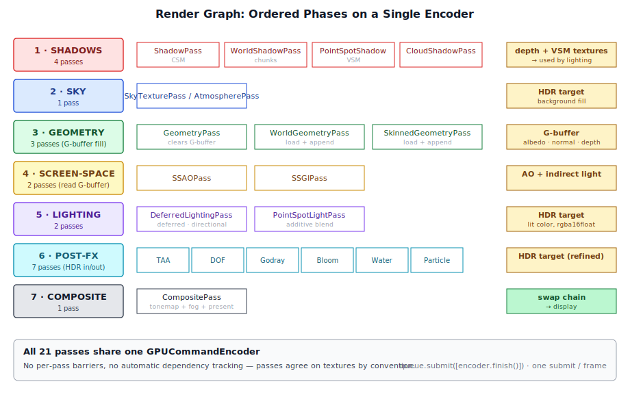
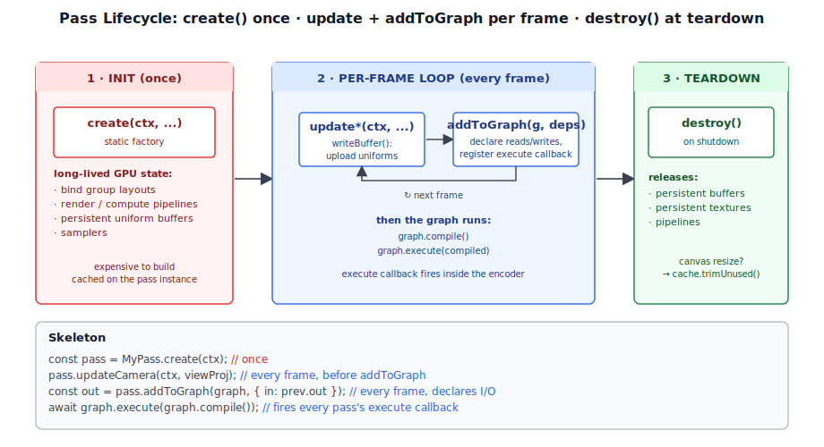
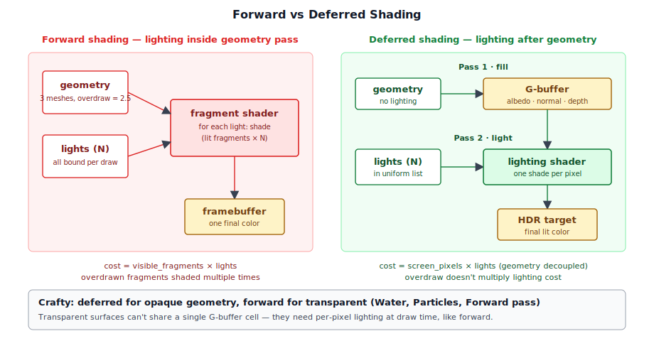
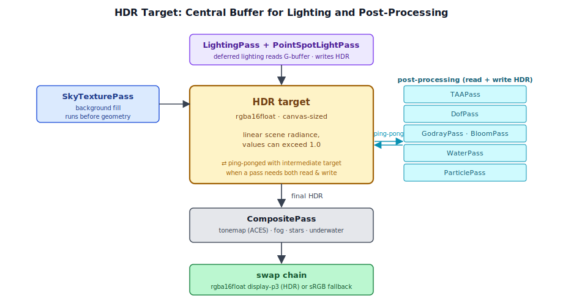
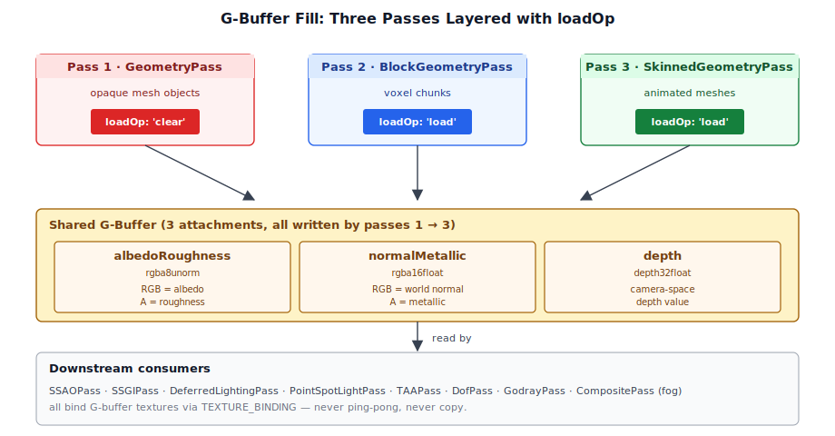

# Chapter 4: Rendering Architecture

[Contents](../crafty.md) | [03-Webgpu Fundamentals](03-webgpu-fundamentals.md) | [05-Meshes](05-meshes.md)

This chapter presents the architectural backbone of Crafty's renderer — the **render graph**, its **passes**, and how they compose to produce every frame.

## 4.1 The Render Graph



The render graph (`src/renderer/render_graph.ts`) is a straightforward ordered sequence of render passes. It is deliberately simple — no automatic dependency analysis, no resource barrier management, no topological sort. Passes are registered in execution order and run sequentially.

```typescript
// ── from src/renderer/render_graph.ts ──
export class RenderGraph {
  private _passes: RenderPass[] = [];

  addPass(pass: RenderPass): void {
    this._passes.push(pass);
  }

  async execute(ctx: RenderContext): Promise<void> {
    ctx.pushFrameErrorScope();

    const encoder = ctx.device.createCommandEncoder();
    for (const pass of this._passes) {
      if (pass.enabled) {
        pass.execute(encoder, ctx);
      }
    }
    ctx.queue.submit([encoder.finish()]);

    await ctx.popFrameErrorScope();
  }
}
```

The key design decisions are:

**Single command encoder per frame.** Every pass appends commands to the same `GPUCommandEncoder`. This means the GPU sees the entire frame's work as one atomic submission. There is no per-pass command buffer overhead, and the driver can optimise across passes (e.g., merge adjacent draw calls or eliminate redundant resource barriers).

**Passes are responsible for their own resource management.** The render graph does not track which textures or buffers a pass reads or writes. Passes must agree on texture `loadOp` and `storeOp` conventions. For example, the `BlockGeometryPass` uses `depthLoadOp: 'load'` because it runs after `GeometryPass` and must preserve the depth buffer from the first pass.

**The graph is the frame.** The order of `addPass()` calls determines the order of GPU work. Crafty's main renderer setup typically registers passes in this order:

```
1. ShadowPass             — CSM depth
2. BlockShadowPass        — chunk shadow cascades (appends)
3. PointSpotShadowPass    — VSM for point/spot lights
4. CloudShadowPass        — top-down cloud shadow
5. SkyTexturePass         — HDR sky background
6. GeometryPass           — mesh G-buffer
7. BlockGeometryPass      — chunk G-buffer (appends)
8. SkinnedGeometryPass    — skinned mesh G-buffer (appends)
9. SSAOPass               — screen-space ambient occlusion
10. SSGIPass              — screen-space global illumination
11. DeferredLightingPass  — deferred HDR lighting
12. PointSpotLightPass    — additive point/spot lighting
13. TAAPass               — temporal anti-aliasing
14. DofPass               — depth of field
15. GodrayPass            — volumetric light shafts
16. BloomPass             — HDR bloom
17. WaterPass             — refractive water surfaces
18. ParticlePass          — compute-driven particles
19. DebugLightPass        — debug light markers
20. BlockHighlightPass    — targeted block outline
21. CompositePass         — final tonemap + fog + presentation
```

Not all passes are always enabled. The composite pass, for instance, replaces the legacy `TonemapPass` and encompasses fog, stars, underwater effects, and tone-mapping in a single shader.

## 4.2 Render Passes

Every pass extends the abstract `RenderPass` base class (`src/renderer/render_pass.ts`):

```typescript
// ── from src/renderer/render_pass.ts ──
export abstract class RenderPass {
  abstract readonly name: string;
  enabled = true;

  abstract execute(encoder: GPUCommandEncoder, ctx: RenderContext): void;
  destroy(): void {}
}
```

The interface is minimal by design. A pass is just something that:

1. Has a **name** for debugging.
2. Can be **enabled or disabled** at runtime.
3. **Executes** by recording commands into the shared encoder.
4. **Destroys** its GPU resources when the graph is torn down.

### Pass Construction Pattern

Every pass follows the same creation pattern: a **static `create()` factory** that allocates all GPU resources and returns a fully initialized instance. The constructor is private:

```typescript
// ── from src/renderer/passes/geometry_pass.ts ──
export class GeometryPass extends RenderPass {
  readonly name = 'GeometryPass';

  private constructor(
    gbuffer: GBuffer,
    cameraBGL: GPUBindGroupLayout,
    modelBGL: GPUBindGroupLayout,
    cameraBuffer: GPUBuffer,
    cameraBindGroup: GPUBindGroup,
  ) { /* ... */ }

  static create(ctx: RenderContext, gbuffer: GBuffer): GeometryPass {
    const { device } = ctx;
    // Create layouts, buffers, bind groups...
    return new GeometryPass(gbuffer, cameraBGL, modelBGL, cameraBuffer, cameraBindGroup);
  }
}
```

This pattern ensures that:

- All GPU resource creation happens at init time, not during the frame loop.
- Error scopes can wrap the entire `create()` call to catch validation errors during development.
- The pass owns its resources and cleans them up in `destroy()`.

### Per-Frame Update Pattern



Passes expose `update*()` methods that are called **before** `execute()` each frame. These methods upload per-frame data via `queue.writeBuffer()`:

```typescript
// Called before execute() each frame
pass.updateCamera(ctx, view, proj, viewProj, invViewProj, cameraPos, near, far);
```

This separation of **update** (uploading uniforms to GPU buffers) and **execute** (encoding draw commands) mirrors the GPU's own separation of upload and execution work.

## 4.3 Multi-Pass Deferred Rendering



Crafty uses a **deferred shading** pipeline for its main geometry. The core idea: render surface properties (albedo, normal, depth, etc.) into a **G-buffer** in a first set of passes, then compute lighting in a separate pass that reads the G-buffer.

### Why Deferred?

- **Decoupled geometry from lighting.** The cost of shading a pixel depends only on screen resolution, not on the number of lights or geometric complexity.
- **Supports many lights.** The deferred lighting pass can sample hundreds of point and spot lights without re-executing the vertex shader for each one.
- **Enables screen-space effects.** Post-processing passes (SSAO, SSGI, TAA, DOF) operate on the G-buffer, giving them rich surface information for their computations.

### The Deferred Pipeline

```
Frame N:
  ┌─────────────────────────────────────────────────────────────┐
  │ 1. Shadow passes  ───►  depth / VSM textures               │
  │ 2. Sky pass        ───►  HDR color target (background)    │
  │ 3. Geometry pass   ───►  G-buffer (albedo, normal, depth)  │
  │ 4. World geom pass ───►  G-buffer (appends to above)       │
  │ 5. SSAO pass       ───►  AO texture                        │
  │ 6. SSGI pass       ───►  Indirect light buffer              │
  │ 7. Lighting pass   ───►  HDR color (fullscreen quad)      │
  │ 8. Point/Spot pass ───►  HDR color (additive blend)       │
  │ 9. Post-processing  ───►  HDR color (TAA, DOF, bloom)     │
  │10. Composite pass  ───►  Swap chain (tonemapped)           │
  └─────────────────────────────────────────────────────────────┘
```

### Forward Rendering

Crafty also supports forward rendering for special cases:

- **The forward pass** (`ForwardPass`) renders transparent objects with per-pixel lighting. Transparent materials cannot use deferred shading because the G-buffer stores only a single surface per pixel.
- **Water pass** (`WaterPass`) uses forward rendering with screen-space refraction, reading the HDR target from the previous passes.
- **Particles** (`ParticlePass`) render as camera-facing billboards through a forward pass.

These forward passes run after the deferred passes are complete, typically with additive blending or depth tests configured for transparency.

## 4.4 HDR Rendering Pipeline



Crafty renders in **HDR** (high dynamic range) throughout the lighting and post-processing stages, then tone-maps to SDR for display at the end.

### The HDR Target

The lighting pass creates an HDR color texture:

```typescript
// ── from src/renderer/passes/deferred_lighting_pass.ts ──
export const HDR_FORMAT: GPUTextureFormat = 'rgba16float';
```

This 16-bit-per-channel floating-point texture is the central framebuffer for the second half of the pipeline:

```
DeferredLightingPass  ──►  HDR Texture (rgba16float)
                      │
                      ├──► TAAPass (temporal resolve)
                      ├──► DofPass (depth-of-field blur)
                      ├──► GodrayPass (additive shafts)
                      ├──► BloomPass (prefilter + blur + composite)
                      ├──► WaterPass (refraction source)
                      │
                      ▼
                  CompositePass  ──►  Swap Chain (sRGB or HDR)
```

### Tone Mapping

The final `CompositePass` converts HDR to SDR (or passes through if the swap chain is HDR):

```wgsl
// ── from src/shaders/tonemap.wgsl ──
// Tone-mapping in the composite pass (ACES filmic approximation)
fn tonemap(color: vec3f) -> vec3f {
  let a = 2.51;
  let b = 0.03;
  let c = 2.43;
  let d = 0.59;
  let e = 0.14;
  return clamp((color * (a * color + b)) / (color * (c * color + d) + e), 0.0, 1.0);
}
```

## 4.5 The GBuffer

The G-buffer (`src/renderer/gbuffer.ts`) stores three textures sized to the canvas:

| Texture | Format | Channel | Loaded by |
|---------|--------|---------|-----------|
| `albedoRoughness` | `rgba8unorm` | RGB = albedo, A = roughness | Geometry, World, Skinned geometry passes |
| `normalMetallic` | `rgba16float` | RGB = world-space normal, A = metallic | Geometry, World, Skinned geometry passes |
| `depth` | `depth32float` | depth | Above passes write; later passes read |

```typescript
// ── from src/renderer/gbuffer.ts ──
export class GBuffer {
  readonly albedoRoughness: GPUTexture;
  readonly normalMetallic: GPUTexture;
  readonly depth: GPUTexture;

  static create(ctx: RenderContext): GBuffer {
    const { device, width, height } = ctx;
    // All three textures allocated at canvas resolution
    // Usage: RENDER_ATTACHMENT | TEXTURE_BINDING
    // so they can be written by geometry passes and read by
    // lighting/post-processing passes.
  }
}
```

The G-buffer is allocated once per canvas size and re-created on resize. It is shared across the geometry-fill passes (which write to it) and the lighting/post-processing passes (which read from it via `TEXTURE_BINDING`).

### GBuffer Fill Strategy



Multiple passes write into the same G-buffer attachments:

1. **GeometryPass** — renders opaque mesh objects. Clears all three attachments.
2. **BlockGeometryPass** — renders voxel chunks. Uses `loadOp: 'load'` to append to the existing G-buffer.
3. **SkinnedGeometryPass** — renders animated skinned meshes. Also appends.

This layering allows the pipeline to separate concerns — mesh geometry, voxel geometry, and animated geometry all have different shaders and vertex formats, but they all write the same G-buffer structure.

## 4.6 Swap Chain and Presentation

The swap chain is configured when `RenderContext.create()` is called. Crafty attempts an HDR swap chain (`rgba16float` + `display-p3` + extended tone mapping) and falls back to SDR:

```typescript
// ── from src/renderer/render_context.ts ──
context.configure({
  device,
  format: 'rgba16float',
  alphaMode: 'opaque',
  colorSpace: 'display-p3',
  toneMapping: { mode: 'extended' },
});
```

The terminal pass of the render graph reads the current swap chain texture and writes the final composited image into it:

```typescript
// ── from src/renderer/passes/composite_pass.ts ──
execute(encoder: GPUCommandEncoder, ctx: RenderContext): void {
  const swapChainTexture = ctx.getCurrentTexture();
  const swapChainView = swapChainTexture.createView();
  // ... render pass using swapChainView as the color attachment ...
}
```

WebGPU automatically presents the swap chain texture to the display when the command buffer finishes execution. No explicit `present()` call is needed.

### Canvas Resize

When the browser window is resized, Crafty updates the canvas pixel dimensions and reconstructs the render graph:

```typescript
// ── from src/renderer/render_context.ts ──
canvas.width = canvas.clientWidth * devicePixelRatio;
canvas.height = canvas.clientHeight * devicePixelRatio;
```

All passes that depend on canvas size (GBuffer, HDR texture, SSAO textures, etc.) are destroyed and re-created. The render graph is rebuilt with the same pass structure but new resource sizes.

### 4.7 Summary

The render graph architecture is deliberately minimal. There is no automatic dependency tracking or barrier management. Instead, passes are ordered explicitly and agree on a shared resource convention:

- **Frame structure**: single encoder, ordered passes, single submit.
- **Resource sharing**: passes read/write common textures by convention (GBuffer, HDR target).
- **Update/Execute separation**: uniforms are uploaded via `update*()` methods before `execute()`.
- **Factory pattern**: all GPU resources created in static `create()`, destroyed in `destroy()`.

This simplicity makes the rendering pipeline easy to debug — each pass is an independent unit that can be enabled, disabled, or reordered in isolation.

**Further reading:**
- `src/renderer/render_graph.ts` — Render graph orchestration
- `src/renderer/render_pass.ts` — Abstract `RenderPass` base class
- `src/renderer/gbuffer.ts` — GBuffer texture layout
- `src/renderer/passes/` — All concrete pass implementations

----
[Contents](../crafty.md) | [03-Webgpu Fundamentals](03-webgpu-fundamentals.md) | [05-Meshes](05-meshes.md)
