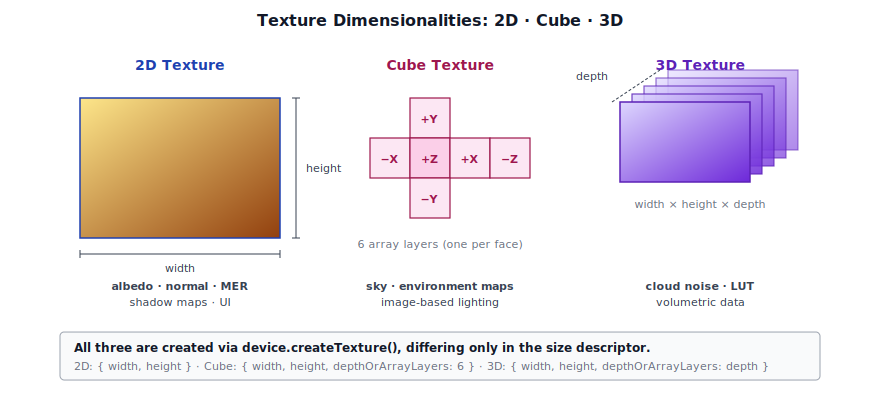
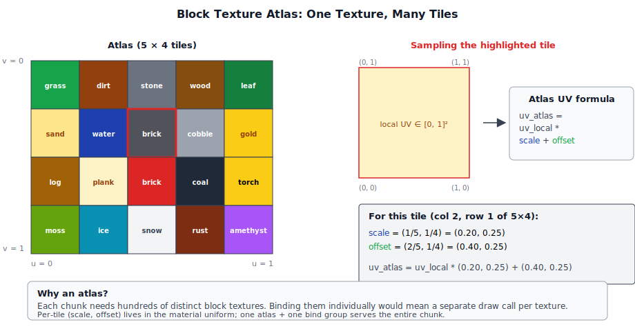
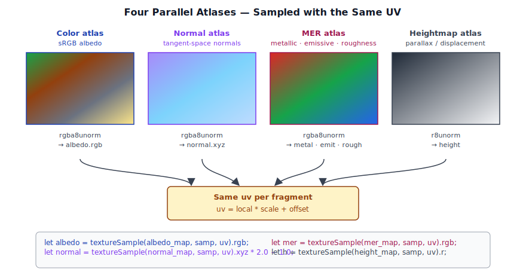
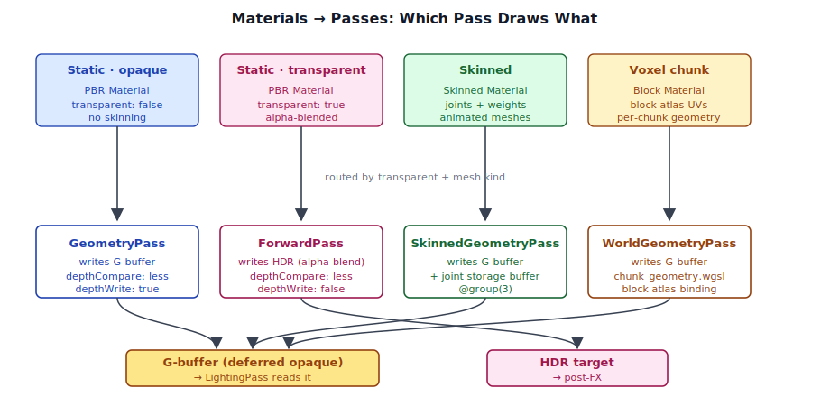

# Chapter 6: Textures and Materials

[Contents](../crafty.md) | [05-Meshes](05-meshes.md) | [07-Lighting](07-lighting.md)

Textures provide surface detail beyond what geometry alone can express. Materials bundle shaders, textures, and parameters into a unit the renderer can consume. This chapter shows how Crafty loads, manages, and binds textures and materials.

## 6.1 2D, 3D, and Cube Textures

Crafty supports three texture dimensionalities:




**2D textures** are the most common — albedo maps, normal maps, roughness/metallic/emissive (MER) maps, and shadow maps. They are created with a single `width` × `height` size.

**Cube textures** are used for the sky and image-based lighting (IBL). A cube texture has 6 array layers (one per face: +X, -X, +Y, -Y, +Z, -Z):

```typescript
// HDR sky cubemap texture
const skyTexture = device.createTexture({
  label: 'SkyCubemap',
  size: { width: 1024, height: 1024, depthOrArrayLayers: 6 },
  format: 'rgba16float',
  usage: GPUTextureUsage.TEXTURE_BINDING | GPUTextureUsage.COPY_DST,
});
```

Cube textures are sampled in WGSL with `texture_cube<f32>`:

```wgsl
@group(3) @binding(0) var sky_cube: texture_cube<f32>;
// ...
let skyColor = textureSample(sky_cube, sampler, direction);
```

**3D textures** are used for volumetric data like cloud noise. They have a depth dimension in addition to width and height.

## 6.2 Texture Loading

### Runtime Loading

Textures are loaded at runtime using the browser's built-in image decoding. Crafty's texture loading pipeline:

1. **Fetch** the image file via `fetch()` (typically as a `Blob` or URL).
2. **Decode** using `createImageBitmap()` or `` element loading.
3. **Upload** pixel data to a `GPUTexture` via `queue.writeTexture()` or `copyExternalImageToTexture()`.

HDR environment maps (.hdr files) use a custom RGBE decoder (`src/shaders/rgbe_decode.wgsl`) that converts the Radiance HDR format to floating-point values on the GPU.

### Block Texture Atlas

Voxel games face a unique texturing challenge: there can be hundreds of unique block types, each with up to 6 face textures. Rather than binding individual textures per chunk, Crafty packs all block textures into a **texture atlas**. Each block face stores its UV offset and scale within the atlas as part of its material parameters, so a fragment's local UV gets remapped into the atlas at sample time:



The atlas is built at development time via `npm run build-atlas`, which runs `scripts/build_atlas.js`.

Multiple atlas textures exist for different channel groups — all four are sampled in parallel at the same UV per fragment:




| Atlas | Channels | Format |
|-------|----------|--------|
| Color atlas | sRGB albedo | Compressed or `rgba8unorm` |
| Normal atlas | Tangent-space normals | `rgba8unorm` |
| MER atlas | Metallic (R), Emissive (G), Roughness (B) | `rgba8unorm` |
| Heightmap atlas | Parallax/height data | `r8unorm` |

The chunk geometry pass samples the atlas using per-vertex UV coordinates combined with per-face atlas tile parameters:

```wgsl
let uv = input.uv * material.uvScale + material.uvOffset;
let albedo = textureSample(albedo_map, mat_samp, uv);
```

## 6.3 Textures in the GBuffer

The deferred G-buffer writes two color textures that encode surface properties for the lighting pass:

**Albedo + Roughness** (`rgba8unorm`):
```
R = albedo red
G = albedo green
B = albedo blue
A = roughness (0 = smooth, 1 = rough)
```

**Normal + Metallic** (`rgba16float`):
```
R = world-space normal X
G = world-space normal Y
B = world-space normal Z
A = metallic (0 = dielectric, 1 = metal)
```

The `rgba16float` format for the normal-metallic texture is critical — world-space normals can be negative and require higher precision than `unorm` provides.

## 6.4 The PBR Material System

The `Material` abstract class (`src/engine/material.ts`) defines the interface that all materials must implement:

```typescript
export abstract class Material {
  abstract readonly shaderId: string;
  transparent: boolean = false;

  abstract getShaderCode(passType: MaterialPassType): string;
  abstract getBindGroupLayout(device: GPUDevice): GPUBindGroupLayout;
  abstract getBindGroup(device: GPUDevice): GPUBindGroup;
  update?(queue: GPUQueue): void;
  destroy?(): void;
}
```

### Material Pass Types

A material can provide different shader code for different render passes:

```typescript
export enum MaterialPassType {
  Forward = 'forward',             // Forward rendering (transparent objects)
  Geometry = 'geometry',           // Deferred G-buffer fill (opaque)
  SkinnedGeometry = 'skinnedGeometry',  // Skinned mesh G-buffer fill
}
```

Most materials use only `Geometry` (opaque objects). Transparent materials use `Forward`. Skinned meshes use `SkinnedGeometry` (which adds joint matrix bindings).

### Shared Bind Group Slot

All materials place their resources at `@group(2)`, which is reserved in the render pass pipeline layouts:

```typescript
export const MATERIAL_GROUP = 2;
```

This means a material's bind group can contain:

```wgsl
@group(2) @binding(0) var<uniform> material: MaterialUniforms;
@group(2) @binding(1) var albedo_map: texture_2d<f32>;
@group(2) @binding(2) var normal_map: texture_2d<f32>;
@group(2) @binding(3) var mer_map   : texture_2d<f32>;
@group(2) @binding(4) var mat_samp  : sampler;
```

The material uniform struct contains PBR parameters:

```wgsl
struct MaterialUniforms {
  albedo   : vec4<f32>,     // RGBA base color (+ padding)
  roughness: f32,
  metallic : f32,
  uvOffset : vec2<f32>,     // Atlas tile offset
  uvScale  : vec2<f32>,     // Atlas tile scale
  uvTile   : vec2<f32>,     // UV tiling repetition
}
```

### Pipeline Caching

Pipelines are cached by `shaderId` — a stable identifier shared by all instances of a material subclass:

```typescript
private _pipelineCache = new Map<string, GPURenderPipeline>();

private _getPipeline(device: GPUDevice, material: Material): GPURenderPipeline {
  let pipeline = this._pipelineCache.get(material.shaderId);
  if (pipeline) return pipeline;
  // Create and cache pipeline
  const shaderModule = device.createShaderModule({
    code: material.getShaderCode(MaterialPassType.Geometry),
  });
  pipeline = device.createRenderPipeline({
    layout: device.createPipelineLayout({
      bindGroupLayouts: [
        cameraBGL,                        // group 0
        modelBGL,                         // group 1
        material.getBindGroupLayout(device), // group 2
      ],
    }),
    // ... vertex, fragment, depth, primitive state ...
  });
  this._pipelineCache.set(material.shaderId, pipeline);
  return pipeline;
}
```

Materials sharing a `shaderId` MUST return identical WGSL source and bind group layouts — the cache assumes they are interchangeable.

### Material Update Pattern

Materials can implement an optional `update()` method that the pass calls once per draw to flush dirty uniforms:

```typescript
// In the geometry pass execute():
for (let i = 0; i < this._drawItems.length; i++) {
  const item = this._drawItems[i];
  // Upload model matrix
  ctx.queue.writeBuffer(this._modelBuffers[i], 0, modelData.buffer);
  // Flush material updates
  item.material.update?.(ctx.queue);
}
```

This pattern allows materials to lazily update GPU uniform buffers only when their CPU-side properties change, using a dirty flag internally.

## 6.5 Material Passes

Different render passes use different subsets of the material system. The mesh kind (static / skinned / voxel) and the `transparent` flag determine which pass actually draws an object:




**GeometryPass** draws opaque materials into the G-buffer. It expects materials to output albedo+roughness and normal+metallic in the fragment shader.

**BlockGeometryPass** draws voxel chunk geometry. Chunks use a dedicated shader (`chunk_geometry.wgsl`) that samples the block texture atlas and packs the same G-buffer format.

**ForwardPass** renders transparent materials with per-pixel lighting. Transparent materials use `depthWriteEnabled: false` and alpha blending:

```typescript
fragment: {
  module: shaderModule,
  entryPoint: 'fs_main',
  targets: [{
    format: HDR_FORMAT,
    blend: {
      color: { srcFactor: 'src-alpha', dstFactor: 'one-minus-src-alpha' },
      alpha: { srcFactor: 'one', dstFactor: 'one-minus-src-alpha' },
    },
  }],
},
```

## 6.6 Shader Management and Caching

WGSL shaders are stored in `src/shaders/` and loaded at module scope via Vite's `?raw` import:

```typescript
import lightingWgsl from '../../shaders/lighting.wgsl?raw';
```

This inlines the shader source as a JavaScript string at build time. No runtime fetch is needed.

### Common Shader Module

The `src/shaders/common.wgsl` file defines shared types and utility functions used across multiple shaders:

```wgsl
struct CameraUniforms {
  view       : mat4x4<f32>,
  proj       : mat4x4<f32>,
  viewProj   : mat4x4<f32>,
  invViewProj: mat4x4<f32>,
  position   : vec3<f32>,
  near       : f32,
  far        : f32,
}
```

Each `Material` subclass returns complete WGSL source from `getShaderCode()`, which may concatenate shared code with specific implementations. Reinventing this per material avoids the complexity of a full shader include system while keeping the shader source self-contained.

### Summary

The material system decouples surface appearance from the renderer:

- **Textures** are GPU images with a specific dimensionality (2D, cube, 3D).
- **The block atlas** packs all voxel textures into a single texture with per-tile UV remapping.
- **Materials** implement an abstract interface providing WGSL, bind group layouts, and per-frame uniform updates.
- **Pipeline caching** by `shaderId` ensures materials sharing a shader also share compilation results.

**Further reading:**
- `src/engine/material.ts` — Abstract Material base class
- `src/assets/mesh.ts` — Vertex layout matching the shader inputs
- `src/shaders/geometry.wgsl` — G-buffer fill shader
- `src/shaders/forward_pbr.wgsl` — Forward PBR shader (transparency)
- `src/shaders/common.wgsl` — Shared struct definitions

----
[Contents](../crafty.md) | [05-Meshes](05-meshes.md) | [07-Lighting](07-lighting.md)
