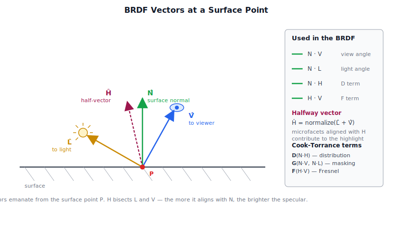
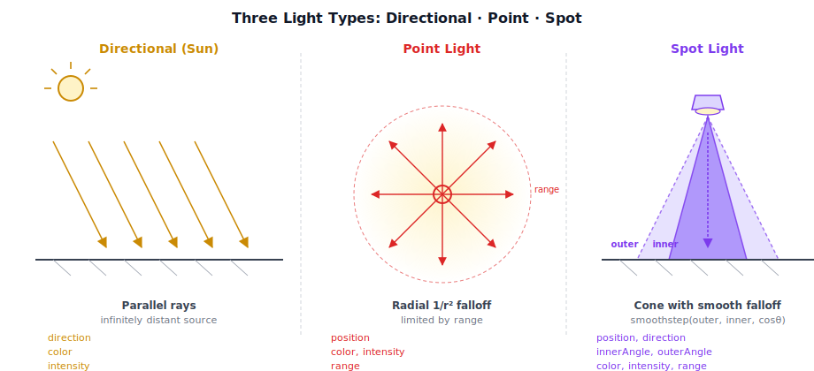
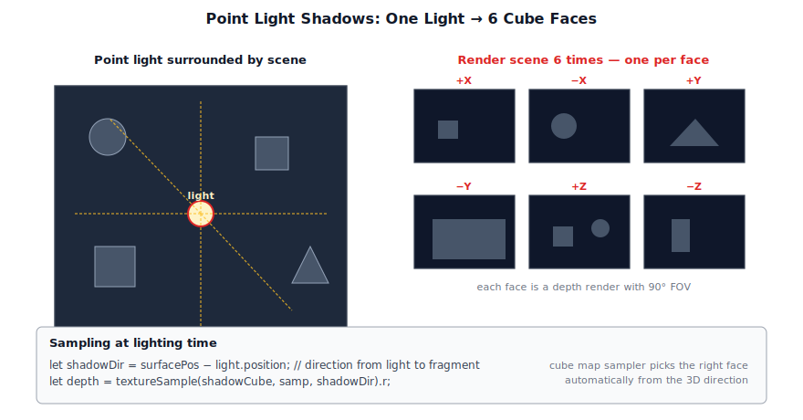
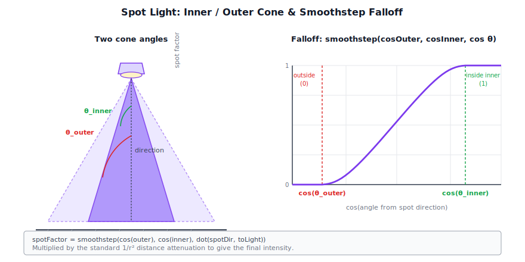
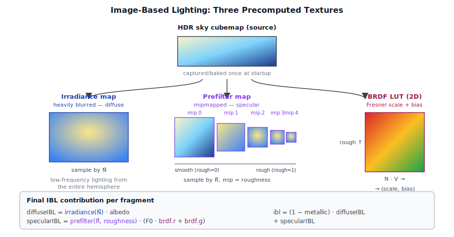
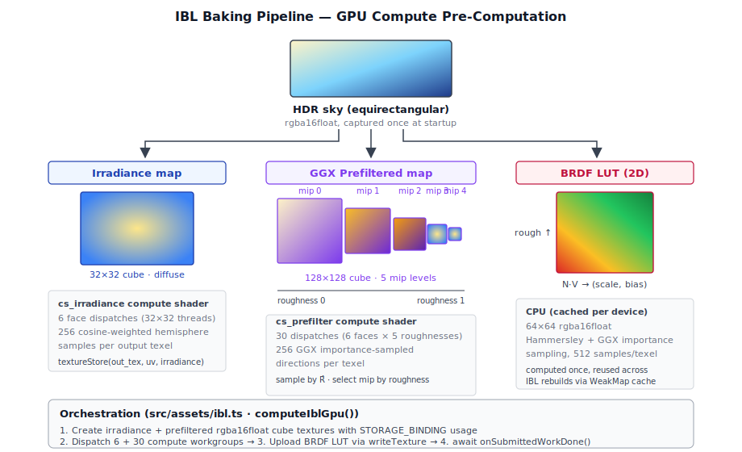
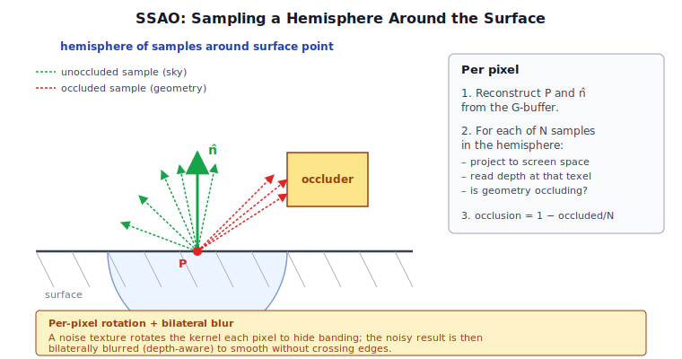

# Chapter 7: Lighting

[Contents](../crafty.md) | [06-Textures / Materials](06-textures-materials.md) | [08-Shadow Mapping](08-shadow-mapping.md)

Lighting is the heart of any renderer. Crafty implements a full physically-based shading pipeline supporting directional (sun), point, and spot lights, plus image-based lighting from environment maps.

## 7.1 Physically-Based Rendering Theory

Crafty uses the **Cook-Torrance** microfacet BRDF (bidirectional reflectance distribution function), which models a surface as a collection of microscopic facets. Every PBR shading calculation revolves around four vectors at the surface point — the surface normal, the directions to the light and the viewer, and the half-vector between them:



The BRDF has three terms, each evaluated from dot products of these vectors:

**Normal distribution function** (GGX/Trowbridge-Reitz) — describes the statistical orientation of microfacets relative to the surface normal:

```wgsl
fn D_GGX(n dot h: f32, roughness: f32) -> f32 {
  let a = roughness * roughness;
  let a2 = a * a;
  let denom = (n dot h * n dot h * (a2 - 1.0) + 1.0);
  return a2 / (PI * denom * denom);
}
```

**Geometry function** (Smith GGX with Schlick-GGX) — describes microfacet self-shadowing:

```wgsl
fn G_SmithGGX(n dot v: f32, n dot l: f32, roughness: f32) -> f32 {
  let a = roughness * roughness;
  let GGX = G_GGX(n dot v, a) * G_GGX(n dot l, a);
  return GGX;
}
```

**Fresnel function** (Schlick approximation) — describes how reflectance varies with viewing angle:

```wgsl
fn F_Schlick(cosTheta: f32, F0: vec3f) -> vec3f {
  return F0 + (1.0 - F0) * pow(1.0 - cosTheta, 5.0);
}
```

The full BRDF for a single light is:

```wgsl
let NdotL = max(dot(N, L), 0.0);
let NdotV = max(dot(N, V), 0.0);
let H = normalize(L + V);
let NdotH = max(dot(N, H), 0.0);
let HdotV = max(dot(H, V), 0.0);

let D = D_GGX(NdotH, roughness);
let G = G_SmithGGX(NdotV, NdotL, roughness);
let F = F_Schlick(HdotV, F0);

let specular = (D * G * F) / (4.0 * NdotV * NdotL + 0.0001);
let diffuse = (1.0 - F) * (1.0 - metallic) * albedo / PI;
return (diffuse + specular) * radiance * NdotL;
```

The `metallic` parameter blends between dielectric behaviour (specular highlights on a diffuse base) and metallic behaviour (no diffuse, colored specular). `F0` is `0.04` for dielectrics and `albedo` for metals, interpolated by `metallic`:

```wgsl
let F0 = mix(vec3f(0.04), albedo, metallic);
```

## 7.2 The Directional Light (Sun)

Crafty supports three light types — directional, point, and spot — each with a distinct geometry and falloff model:



The directional light represents the sun — an infinitely distant light source with parallel rays. It is defined by the `DirectionalLight` interface (`src/renderer/directional_light.ts`):

```typescript
export interface DirectionalLight {
  direction: Vec3;
  intensity: number;
  color: Vec3;
  castShadows: boolean;
  lightViewProj?: Mat4;
  shadowMap?: GPUTextureView;
}
```

The `direction` is a unit vector pointing toward the light (from the surface toward the sun). `intensity` controls the overall brightness, and `color` tints the light.

### Directional Light in the Lighting Pass

The deferred lighting pass evaluates the directional light in a fullscreen shader. The light direction and cascade data are uploaded per frame:

```typescript
// ── from lighting_pass.ts updateLight() ──
updateLight(
  ctx: RenderContext,
  light: DirectionalLight,
  cascadeData: CascadeData[],
  cascadeCount: number,
  shadowTexView: GPUTextureView | null,
  debugCascades: boolean,
  shadowSoftness: number,
): void {
  // Pack direction, intensity, color, cascade data into lightBuffer
  const data = this._lightScratch;
  data.set(light.direction.toArray(), 0);
  data[3] = light.intensity;
  data.set(light.color.toArray(), 4);
  data[7] = cascadeCount;
  // ... cascade view-proj matrices, split depths, texel sizes ...
  ctx.queue.writeBuffer(this.lightBuffer, 0, data.buffer as ArrayBuffer);
}
```

## 7.3 Point Lights

A point light emits light equally in all directions from a position in space. It is defined by the `PointLight` interface (`src/renderer/point_light.ts`):

```typescript
export interface PointLight {
  position: Vec3;
  range: number;
  color: Vec3;
  intensity: number;
  castShadows?: boolean;
}
```

The `range` field limits the light's influence — the engine culls point lights outside this radius from the camera. The attenuation is physically-based (inverse square law) with a smooth falloff at the range boundary.

Point lights are processed in the `PointSpotLightPass`, which renders additive lighting for all active point and spot lights:

```typescript
// ── from point_spot_light_pass.ts updateLights() ──
interface PackedPointLight {
  position: [number, number, number, 0];     // vec4 (w unused)
  color: [number, number, number, number];   // rgb + intensity
  range: number;
}
```

Each point light's world position is tested against the camera frustum; lights outside the frustum are skipped. Up to `MAX_POINT_LIGHTS` (typically 128) can be active per frame.

### Shadow Mapping Point Lights

Point light shadows use **cube-map depth textures**. A single point light renders its scene to 6 faces of a cube map, then samples that cube map during lighting:




```typescript
// ── from point_shadow_pass.ts ──
// Renders scene 6 times (once per cube face)
for (let face = 0; face < 6; face++) {
  const view = cubeFaceViewMatrix(light.position, face);
  const proj = perspective(90°_to_radians, 1.0, near, light.range);
  // ... render geometry from this view ...
}
```

In the lighting shader, the shadow is sampled by computing the vector from the light to the surface point and using it as the cube-map sampling direction:

```wgsl
let shadowDir = surfacePos - light.position;
let shadowDepth = textureSample(shadowCube, sampler, shadowDir).r;
```

## 7.4 Spot Lights

A spot light emits light in a cone from a position in a specific direction. Crafty's `SpotLight` class (`src/renderer/spot_light.ts`) includes a lazy view-projection matrix computation:

```typescript
export class SpotLight {
  position: Vec3;
  range: number;
  direction: Vec3;
  innerAngle: number;  // Full brightness cone half-angle (degrees)
  color: Vec3;
  outerAngle: number;  // Falloff cone half-angle (degrees)
  intensity: number;
  castShadows?: boolean;

  // Lazily computed from position + direction + outerAngle + range
  get lightViewProj(): Mat4;
  computeLightViewProj(near?: number): Mat4;
  markDirty(): void;
}
```

The view-projection matrix is computed from the light's parameters:

```typescript
private _compute(near = 0.1): void {
  // Build a lookAt view from the light's position and direction
  const up = Math.abs(this.direction.y) > 0.99
    ? new Vec3(1, 0, 0)    // Avoid gimbal lock when pointing straight up/down
    : new Vec3(0, 1, 0);
  const view = Mat4.lookAt(this.position, this.position.add(this.direction), up);
  // Perspective projection matching the spot's cone angle
  const proj = Mat4.perspective(this.outerAngle * 2 * Math.PI / 180, 1.0, near, this.range);
  this._cachedLvp = proj.multiply(view);
  this._dirty = false;
}
```

A dirty flag avoids recomputation when the light's parameters haven't changed. Call `markDirty()` after mutating `position`, `direction`, `outerAngle`, or `range`.

### Spot Light Attenuation

The GPU evaluates spot light falloff using the inner and outer angles. A `smoothstep` between `cos(outer)` and `cos(inner)` gives a soft transition from the bright inner cone to the dark exterior:




```wgsl
// Spot cone attenuation
let cosAngle = dot(normalize(lightDirection), -toLightDir);
let cosInner = cos(spotLight.innerAngle * PI / 180);
let cosOuter = cos(spotLight.outerAngle * PI / 180);
let spotFactor = smoothstep(cosOuter, cosInner, cosAngle);
// Full point-light attenuation * spot cone factor
let attenuation = spotFactor / (distSq + 0.01);
```

## 7.5 Image-Based Lighting (IBL)

Image-based lighting uses an HDR environment map to illuminate surfaces with distant light. This provides ambient lighting that matches the sky and surrounding environment.

IBL requires three textures derived from the HDR sky cubemap — one for diffuse, one for specular at varying roughness, and a 2D table that captures the Fresnel integral:




```typescript
interface IblTextures {
  irradianceMap: GPUTexture;      // Diffuse irradiance (low-frequency)
  prefilterMap: GPUTexture;       // Specular prefilter (mipmapped)
  brdfLut: GPUTexture;            // BRDF integration lookup table (2D)
}
```

**Irradiance map.** A heavily blurred version of the sky cubemap (lowest mip). Sampled by the surface normal to give diffuse ambient light:

```wgsl
let irradiance = textureSample(irradianceMap, sampler, normal).rgb;
let diffuseIBL = irradiance * albedo;
```

**Prefilter map.** A mipmapped cubemap where each mip level represents a different roughness. Sampled by the reflection direction and roughness level:

```wgsl
let roughnessLevel = roughness * MAX_PREFILTER_MIP_LEVEL;
let prefiltered = textureSampleLevel(prefilterMap, sampler, reflection, roughnessLevel);
```

**BRDF LUT.** A 2D lookup table encoding the Fresnel-integral term of the split-sum approximation. Sampled by `NdotV` and roughness:

```wgsl
let brdf = textureSample(brdfLut, sampler, vec2f(NdotV, roughness)).rg;
let specularIBL = prefiltered * (F0 * brdf.r + brdf.g);
```

The complete IBL contribution is:

```wgsl
let ibl = (1.0 - metallic) * diffuseIBL + specularIBL;
```

## 7.6 The BRDF

The Crafty BRDF implementation lives inside the lighting and forward shaders. The key functions are shared across shaders:

| Function | Description |
|----------|-------------|
| `D_GGX(n_dot_h, roughness)` | Normal distribution — controls highlight shape |
| `G_SmithGGX(n_dot_v, n_dot_l, roughness)` | Geometry masking/shadowing |
| `F_Schlick(cos_theta, F0)` | Fresnel reflectance |
| `tonemap(color)` | ACES filmic tone-mapping |
| `computeDirectLight(N, V, L, albedo, roughness, metallic, radiance)` | Full direct-light evaluation |

The `computeDirectLight` function composes the three terms and returns the final radiance for a single light.

## 7.7 The Deferred Lighting Pass

The `DeferredLightingPass` (`src/renderer/passes/deferred_lighting_pass.ts`) is the core of the deferred renderer. It renders a fullscreen triangle that samples the G-buffer and all shadow/lighting inputs:

```typescript
export class DeferredLightingPass extends RenderPass {
  readonly hdrTexture: GPUTexture;      // Output: HDR color target
  readonly cameraBuffer: GPUBuffer;     // Shared with other passes
  readonly lightBuffer: GPUBuffer;      // Directional light + cascade data
  // ...
}
```

The fullscreen triangle approach avoids a vertex buffer — three vertices cover the entire clip space:

```wgsl
@vertex
fn vs_main(@builtin(vertex_index) vi: u32) -> @builtin(position) vec4f {
  // Fullscreen triangle: covers NDC without a vertex buffer
  let uv = vec2f(f32((vi << 1) & 2), f32(vi & 2));
  return vec4f(uv * 2.0 - 1.0, 0.0, 1.0);
}
```

Each fragment samples the G-buffer, reconstructs the world position from depth, evaluates the directional light with cascade shadow maps, adds AO/SSGI, adds IBL, and writes the HDR result:

```typescript
// Lighting pass fragment shader (conceptual flow):
// 1. Sample G-buffer: albedo, normal, roughness, metallic, depth
// 2. Reconstruct world position from depth + inverse view-proj
// 3. Evaluate directional light (sun) with shadow cascade
// 4. Add ambient occlusion (from SSAO texture)
// 5. Add indirect light (from SSGI texture)
// 6. Add IBL diffuse + specular
// 7. Write HDR color
```

## 7.8 The Forward Lighting Path

Transparent objects cannot use deferred shading (the G-buffer stores only one surface per pixel). Crafty's `ForwardPass` evaluates the same PBR lighting model but in a forward rendering path.

The forward pass handles:

- **Directional light** with cascade shadow sampling (same as deferred).
- **Point lights** sampled in a loop over the active point light list.
- **Spot lights** with spotlight cone attenuation and shadow maps.
- **IBL** from the same irradiance / prefilter / BRDF textures.

The forward pass uses the same camera and light uniform buffers as the deferred passes, ensuring consistent lighting between opaque and transparent objects.

### Forward+ (Tiled Shading)

Crafty's forward pass uses a simple **Forward+** optimisation: active lights are culled per-tile on the CPU using the camera frustum, and only lights intersecting the tile are evaluated for each fragment. This prevents the O(N × M) scaling of naive forward rendering (N fragments, M lights).

## 7.9 GPU-Based IBL Pre-Computation

The three IBL textures — irradiance map, GGX prefiltered environment map, and BRDF LUT — could be pre-computed offline and shipped as assets, but Crafty computes them at runtime on the GPU. This allows the IBL to adapt to the current sky (procedural or HDR) without managing additional texture assets per environment.



### BRDF LUT (CPU)

The split-sum BRDF lookup table is view-independent (depends only on NdotV and roughness), so it is computed once on the CPU and cached per device. For each texel `(NdotV, roughness)`, the function importance-samples the GGX distribution using a Hammersley low-discrepancy sequence and integrates the Smith G₂ visibility term weighted by the Fresnel coefficient:

```typescript
function computeBrdfLutData(outW: number, outH: number, samples: number): Float32Array {
  for (let py = 0; py < outH; py++) {
    for (let px = 0; px < outW; px++) {
      const NdotV = (px + 0.5) / outW;
      const roughness = (py + 0.5) / outH;
      // Importance-sample GGX, accumulate scale (A) and bias (B)
      A += G_vis * (1 - Fc);
      B += G_vis * Fc;
    }
  }
}
```

The result is a 64×64 `rgba16float` texture (A in R, B in G). Because it depends only on the BRDF model and not on the environment, it is computed exactly once per `GPUDevice` and reused across IBL rebuilds.

### Irradiance Map (GPU Compute)

The diffuse irradiance map is a heavily blurred version of the HDR sky that stores the cosine-weighted hemisphere integral at every direction. The `cs_irradiance` compute shader (`src/shaders/ibl.wgsl`) dispatches once per cube face (6 dispatches), each thread computing one output texel:

```wgsl
@compute @workgroup_size(8, 8, 1)
fn cs_irradiance(@builtin(global_invocation_id) id: vec3u) {
  let uv = (vec2f(id.xy) + 0.5) / f32(IRR_SIZE);
  let dir = cube_face_dir(u32(params.face), uv * 2.0 - 1.0);
  var irradiance = vec3f(0.0);
  for (var i = 0u; i < SAMPLES; i++) {
    let xi = hammersley(i, SAMPLES);
    let local_dir = cosine_sample_hemisphere(xi);
    let world_dir = tangent_frame(dir) * local_dir;
    irradiance += textureSampleLevel(sky_tex, sky_samp, equirect_uv(world_dir), 0).rgb;
  }
  textureStore(out_tex, id.xy, vec4f(irradiance / f32(SAMPLES) * params.exposure, 1.0));
}
```

Each output direction `dir` is the centre of a cube face texel transformed to a unit vector. A tangent frame is built around that vector and 256 cosine-weighted hemisphere samples are taken from the equirectangular sky texture. The result is a 32×32 `rgba16float` cube map — low resolution since irradiance is very low-frequency.

### GGX Prefiltered Environment Map (GPU Compute)

The specular prefiltered cube follows the same pattern but uses importance sampling of the GGX distribution. Each mip level corresponds to a different roughness value (0, 0.25, 0.5, 0.75, 1.0), allowing the lighting shader to sample a mip level matching the surface roughness:

```wgsl
@compute @workgroup_size(8, 8, 1)
fn cs_prefilter(@builtin(global_invocation_id) id: vec3u) {
  let uv = (vec2f(id.xy) + 0.5) / f32(mipSize);
  let dir = cube_face_dir(u32(params.face), uv * 2.0 - 1.0);
  var color = vec3f(0.0); var weight = 0.0;
  for (var i = 0u; i < SAMPLES; i++) {
    let xi = hammersley(i, SAMPLES);
    let h  = ggx_importance_sample(xi, params.roughness);
    let l  = reflect(-dir, h);
    let ndotl = max(dot(dir, l), 0.0);
    if (ndotl > 0.0) {
      color += textureSampleLevel(sky_tex, sky_samp, equirect_uv(l), 0).rgb * ndotl;
      weight += ndotl;
    }
  }
  textureStore(out_tex, id.xy, vec4f(color / weight * params.exposure, 1.0));
}
```

The dispatch is 6 faces × 5 roughness levels = 30 workgroups, each sampling 256 GGX-importance-weighted directions per texel. The base mip is 128×128 per face, halving at each roughness level down to 8×8 at roughness 1.0.

These compute dispatches run once when the sky changes (e.g., on world load or a new HDR map), and the results persist until the next rebuild. The `computeIblGpu()` function in `src/assets/ibl.ts` orchestrates the entire pipeline and awaits `onSubmittedWorkDone()` before returning the ready-to-use textures.

## 7.10 Screen-Space Ambient Occlusion (SSAO)

SSAO estimates ambient light occlusion by sampling the depth buffer around each pixel. The `SSAOPass` (`src/renderer/passes/ssao_pass.ts`) computes an occlusion factor for each screen pixel by sending sample rays into a hemisphere oriented to the surface normal:



### Algorithm

For each pixel, the shader samples the depth buffer at several positions within a sphere around the pixel's world position. The number of samples that fall inside the scene geometry (closer to the camera) determines the occlusion:

```wgsl
let occlusion = 0.0;
let radius = 1.0;
let samples = 16;
for (var i = 0u; i < samples; i++) {
  let samplePos = pixelPos + sampleKernel[i] * radius;
  let sampleDepth = textureSample(depthMap, sampler, samplePos.xy).r;
  // Reconstruct world position from depth
  let sampleWorldPos = reconstructWorldPos(samplePos.xy, sampleDepth);
  let dist = sampleWorldPos.z - pixelPos.z;
  occlusion += step(dist, 0.0) * max(0.0, 1.0 - dist / radius);
}
occlusion = 1.0 - occlusion / f32(samples);
```

The sample kernel is oriented by the surface normal to bias samples toward the visible hemisphere. A noise texture rotates the kernel per-pixel to hide banding, which is then resolved by a bilateral blur.

### Bilateral Blur

The raw SSAO output is noisy and requires blurring. A separable bilateral blur preserves edges by weighting the blur kernel by the depth difference:

```wgsl
let weight = exp(-abs(depthCenter - depthNeighbour) * sigmaDepth);
blurred += neighbourValue * weight * gaussianWeight;
totalWeight += weight * gaussianWeight;
```

## Summary

Lighting is a composition of several systems:

| System | Pass | Purpose |
|--------|------|---------|
| Directional (sun) | `DeferredLightingPass` | Main light, CSM shadows |
| Point lights | `PointSpotLightPass` | Additive deferred, cube shadow maps |
| Spot lights | `PointSpotLightPass` | Additive deferred, 2D shadow maps |
| IBL | `DeferredLightingPass` | Environment-based ambient + specular |
| SSAO | `SSAOPass` | Local ambient occlusion from depth buffer |
| Forward transparency | `ForwardPass` | PBR for transparent surfaces |

All paths share the same PBR BRDF functions, ensuring consistent appearance regardless of rendering path.

**Further reading:**
- `src/shaders/lighting.wgsl` — Deferred lighting shader (full PBR evaluation)
- `src/shaders/forward_pbr.wgsl` — Forward PBR shader
- `src/shaders/ibl.wgsl` — IBL sampling functions and baking compute shaders
- `src/assets/ibl.ts` — GPU-based IBL pre-computation pipeline
- `src/renderer/passes/deferred_lighting_pass.ts` — Deferred lighting pass
- `src/renderer/passes/forward_pass.ts` — Forward lighting pass
- `src/renderer/passes/point_spot_light_pass.ts` — Additive point/spot pass
- `src/renderer/passes/ssao_pass.ts` — Screen-space ambient occlusion

----
[Contents](../crafty.md) | [06-Textures / Materials](06-textures-materials.md) | [08-Shadow Mapping](08-shadow-mapping.md)
