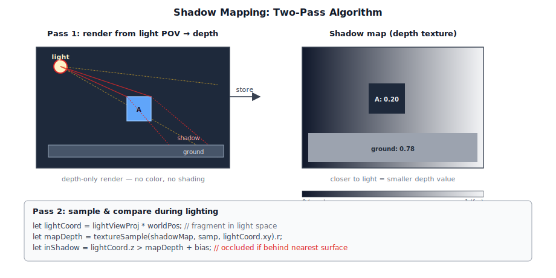
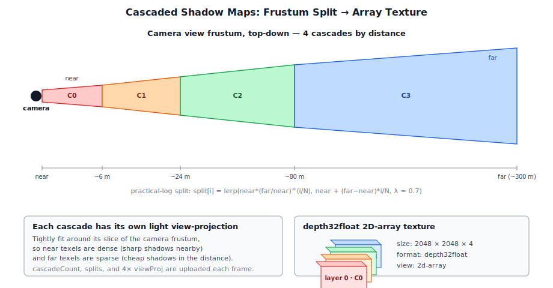
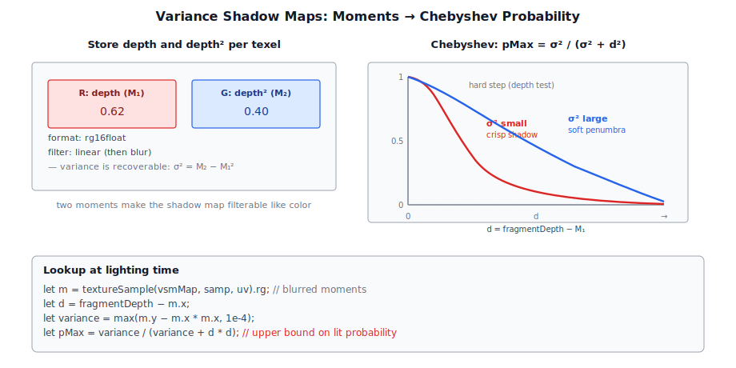
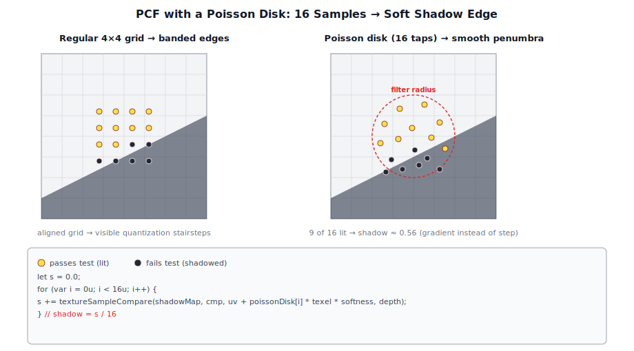
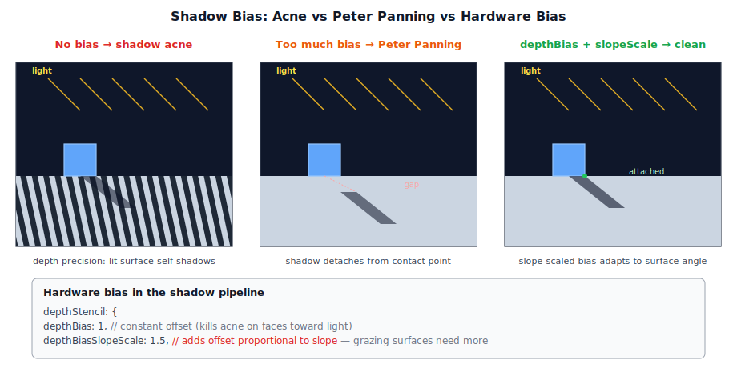
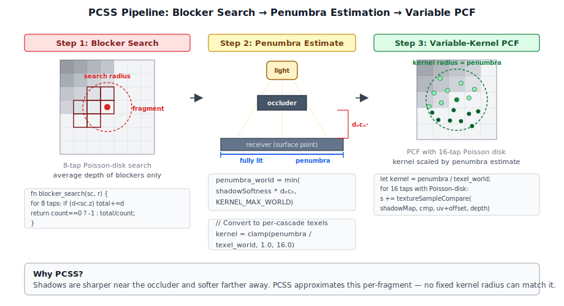

# Chapter 8: Shadow Mapping

[Contents](../crafty.md) | [07-Lighting](07-lighting.md) | [09-Particle System](09-particle-system.md)

Shadows are essential for spatial perception. Crafty implements three shadow techniques: **cascaded shadow maps** (CSM) for the directional sun light, **variance shadow maps** (VSM) for point and spot lights, and basic depth-only shadow maps for individual shadow-casting lights.

## 8.1 Shadow Map Theory

The fundamental idea of shadow mapping is simple: render the scene from the light's perspective into a depth buffer (the shadow map), then during shading, compare each surface point's depth against the shadow map at the corresponding light-space coordinate. If the surface point is farther from the light than the closest surface recorded in the shadow map, it is in shadow.



In WGSL, this comparison is:

```wgsl
let shadowUV = lightViewProj * worldPos;
shadowUV.xyz = shadowUV.xyz / shadowUV.w;  // perspective divide
shadowUV.xy = shadowUV.xy * 0.5 + 0.5;     // NDC to UV
shadowUV.y = 1.0 - shadowUV.y;              // flip Y for WebGPU

let shadowDepth = textureSample(shadowMap, shadowSampler, shadowUV.xy).r;
let fragmentDepth = shadowUV.z;
let shadowFactor = fragmentDepth > shadowDepth + bias ? 0.0 : 1.0;
```

### Shadow Bias

A depth bias prevents **shadow acne** — self-shadowing artifacts caused by the limited precision of the depth buffer. WebGPU supports hardware depth bias:

```typescript
depthStencil: {
  format: 'depth32float',
  depthWriteEnabled: true,
  depthCompare: 'less',
  depthBias: 1,              // Constant depth offset
  depthBiasSlopeScale: 1.5,  // Slope-dependent offset (reduces peter-panning)
}
```

The `depthBiasSlopeScale` term adds bias proportional to the polygon's slope relative to the light direction, preventing "Peter Panning" (shadows detaching from the caster) on flat surfaces while avoiding excessive bias on steep ones.

## 8.2 Cascade Shadow Maps (CSM)

A single shadow map for a directional light covers too large an area to be useful — texels near the camera appear blocky. Cascade shadow maps split the view frustum into multiple depth ranges, each rendered into its own shadow map with texel density matched to that range.



### Cascade Setup

The `ShadowPass` (`src/renderer/passes/shadow_pass.ts`) creates a `depth32float` 2D array texture with up to 4 layers:

```typescript
const SHADOW_SIZE = 2048;
const MAX_CASCADES = 4;

const shadowMap = device.createTexture({
  label: 'ShadowMap',
  size: { width: SHADOW_SIZE, height: SHADOW_SIZE, depthOrArrayLayers: MAX_CASCADES },
  format: 'depth32float',
  usage: GPUTextureUsage.RENDER_ATTACHMENT | GPUTextureUsage.TEXTURE_BINDING,
});

const shadowMapView = shadowMap.createView({ dimension: '2d-array' });
const shadowMapArrayViews = Array.from({ length: MAX_CASCADES }, (_, i) =>
  shadowMap.createView({ dimension: '2d', baseArrayLayer: i, arrayLayerCount: 1 }),
);
```

Each cascade has a single `GPUTextureView` into one layer of the array, allowing render passes to target individual cascades.

### Cascade Partitioning

The camera's view frustum is split using the **practical logarithmic split** scheme, which blends between logarithmic (better for far cascades) and uniform (better for near cascades):

```
split[i] = near * (far / near)^(i / N)       // logarithmic
split[i] = near + (far - near) * (i / N)     // uniform
split[i] = lerp(logSplit, uniformSplit, lambda)  // blended (lambda ≈ 0.7)
```

### Rendering Cascades

During execution, the `ShadowPass` iterates over cascades, setting the scissor rect and viewport to the full shadow map size and binding the appropriate layer:

```typescript
for (let cascade = 0; cascade < this._cascadeCount; cascade++) {
  const pass = encoder.beginRenderPass({
    label: `ShadowCascade_${cascade}`,
    colorAttachments: [],
    depthStencilAttachment: {
      view: this.shadowMapArrayViews[cascade],
      depthClearValue: 1.0,
      depthLoadOp: 'clear',
      depthStoreOp: 'store',
    },
  });
  // ... draw scene from this cascade's light view-projection ...
  pass.end();
}
```

### Cascade Selection in the Lighting Pass

During the deferred lighting pass, each fragment determines which cascade to sample based on its view-space depth:

```wgsl
let viewDepth = -camera.view[3].z;  // negative for right-handed

// Select cascade based on view depth
var cascadeIndex = 0;
for (var i = 0; i < cascadeCount - 1; i++) {
  if (viewDepth > cascadeSplits[i]) {
    cascadeIndex = i + 1;
  }
}

// Sample the selected cascade
let shadowUV = cascadeViewProj[cascadeIndex] * worldPos;
// ... compare depth with shadowMapArray at cascadeIndex ...
```

The cascade count, split depths, and per-cascade view-projection matrices are uploaded to the light uniform buffer each frame.

## 8.3 Variance Shadow Maps (VSM)

Crafty uses **VSM** for point and spot light shadows. VSM stores the depth *and* depth-squared in a `rg16float` texture, and uses variance-based filtering to produce soft, pre-filtered shadows without hardware PCF:



```typescript
// Fragment shader writes depth and depth²
// Shader output: rg16float
output.depth = fragmentDepth;
output.depthSq = fragmentDepth * fragmentDepth;
```

In the lighting shader, the shadow test uses Chebyshev's inequality to estimate the probability that the fragment is occluded:

```wgsl
let moments = textureSample(vsmMap, sampler, uv).rg;
let dist = fragmentDepth - moments.x;
let variance = max(moments.y - moments.x * moments.x, 0.0001);
let pMax = variance / (variance + dist * dist);
return smoothstep(0.4, 1.0, pMax);  // Soft shadow
```

VSM's advantage is that the shadow map can be pre-filtered with a separable blur (like a Gaussian), producing soft, band-limited shadows without expensive PCF sampling. The `PointSpotShadowPass` (`src/renderer/passes/point_spot_shadow_pass.ts`) renders all active point and spot light shadows into a single VSM atlas.

## 8.4 Spot Light Shadows

The `SpotShadowPass` (`src/renderer/passes/spot_shadow_pass.ts`) renders a single spot light's shadow into a 2D depth texture. It is a minimal depth-only pass:

```typescript
export class SpotShadowPass extends RenderPass {
  readonly name = 'SpotShadowPass';

  updateLight(ctx: RenderContext, light: SpotLight): void {
    // Compute view-projection from light's position, direction, cone angle
    const vp = light.computeLightViewProj();
    const data = new Float32Array(16);
    data.set(vp.data, 0);
    ctx.queue.writeBuffer(this._cameraBuffer, 0, data);
  }

  execute(encoder: GPUCommandEncoder, ctx: RenderContext): void {
    // ... begin depth-only render pass ...
    const pass = encoder.beginRenderPass({
      colorAttachments: [],
      depthStencilAttachment: {
        view: this._shadowMapView,
        depthClearValue: 1.0,
        depthLoadOp: 'clear',
        depthStoreOp: 'store',
      },
    });
    // Draw all registered meshes from the light's perspective
  }
}
```

The vertex shader for shadow mapping only needs the position attribute:

```typescript
vertex: {
  buffers: [{
    arrayStride: VERTEX_STRIDE,
    attributes: [VERTEX_ATTRIBUTES[0]],  // Only position (location 0)
  }],
},
```

No fragment shader output is needed (depth-only), so `targets: []` is used in the pipeline.

## 8.5 Point Light (Omnidirectional) Shadows

Point light shadows use a **cube-map depth texture** — 6 faces rendered from the light position, each covering a 90° field of view:

```typescript
// ── from point_shadow_pass.ts ──
for (let face = 0; face < 6; face++) {
  const view = cubeFaceViewMatrix(light.position, face);
  const proj = Mat4.perspective(90° * Math.PI / 180, 1.0, near, light.range);
  // Render scene from this face's view
}
```

The cube map is sampled directly in the lighting shader using the direction from the light to the surface point:

```wgsl
let shadowDir = surfacePos - light.position;     // Direction to sample
let shadowDepth = textureSample(shadowCube, sampler, shadowDir).r;
let fragDist = length(shadowDir);
let shadow = fragDist > shadowDepth + bias ? 0.0 : 1.0;
```

Cube shadow maps are expensive — they require 6 draw calls per light per frame. Crafty limits point light shadows to a small number of active lights.

## 8.6 Shadow Sampling and Filtering

### Percentage-Closer Filtering (PCF)

For directional CSM shadows, Crafty uses hardware PCF with a `depth32float` texture and a comparison sampler:



```typescript
const shadowSampler = device.createSampler({
  compare: 'less',  // Enables PCF
  magFilter: 'linear',
  minFilter: 'linear',
});
```

A Poisson-disk kernel distributes samples within the filter radius to reduce banding:

```wgsl
let shadow = 0.0;
let kernelSize = 16;
for (var i = 0u; i < kernelSize; i++) {
  let offset = poissonDisk[i] * shadowTexelSize * shadowSoftness;
  shadow += textureSampleCompare(shadowMap, shadowSampler,
    uv + offset, fragmentDepth);
}
shadow /= f32(kernelSize);
```

### VSM Blurring

VSM shadows are blurred with a separable Gaussian kernel (two-pass: horizontal + vertical). The `PointSpotShadowPass` performs this blur in the same pass by writing to an intermediate `rg16float` render target and then to the final VSM atlas.

## 8.7 Shadow Acne and Peter Panning



Crafty addresses shadow artifacts through two mechanisms:

**Depth bias** (hardware, applied during shadow map rasterization) prevents acne on surfaces facing the light:

```typescript
depthBias: 1,
depthBiasSlopeScale: 1.5,
```

**Second-depth shadow mapping** (for VSM) stores the depth of the second-closest surface, eliminating the need for bias entirely but requiring a double render.

Crafty's CSM uses a **cascade border** — each cascade is rendered slightly larger than its theoretical frustum, and a blend region between cascades smooths the transition:

```wgsl
// Blend between adjacent cascades near the split boundary
let blend = smoothstep(cascadeSplits[cascadeIndex] - blendRegion,
                        cascadeSplits[cascadeIndex], viewDepth);
shadow = mix(shadowCascade, shadowNextCascade, blend);
```

## 8.8 Percentage-Closer Soft Shadows (PCSS)

Standard PCF uses a fixed kernel radius, producing shadows that are equally soft everywhere. In reality, shadows are sharper near the occluder and softer farther away. **Percentage-Closer Soft Shadows (PCSS)** approximate this by estimating the penumbra width per-fragment and scaling the PCF kernel accordingly.

PCSS adds two steps before the standard PCF sample loop:



**1. Blocker search.** A small fixed-radius search (8 taps, 0.3 world units) samples the shadow map around the fragment and averages the depth of all texels that are closer than the fragment. If no blockers are found, the fragment is fully lit and we skip PCF entirely:

```wgsl
fn pcss_blocker_search(cascade: u32, sc: vec3f, search_radius: f32) -> f32 {
  var total = 0.0; var count = 0.0;
  for (var i = 0u; i < 8u; i++) {
    let offset = poissonDisk[i] * search_radius / SHADOW_MAP_SIZE;
    let d = textureLoad(shadowMap, tc, i32(cascade), 0);
    if (d < sc.z) { total += d; count += 1.0; }
  }
  if (count == 0.0) { return -1.0; }
  return total / count;
}
```

**2. Penumbra estimation.** The penumbra width is proportional to the distance from the fragment to the average blocker, multiplied by a configurable `shadowSoftness` factor. This width is converted from world units to texels in the selected cascade:

```wgsl
let avg_blocker = pcss_blocker_search(cascade, sc0, search_tex);
if (avg_blocker >= 0.0) {
  let occluder_dist = (sc0.z - avg_blocker) * depth_world;
  let penumbra = min(shadowSoftness * occluder_dist, KERNEL_MAX_WORLD);
  kernel = clamp(penumbra / texel_world, 1.0, 16.0);
}
```

**3. PCF with variable kernel.** The standard 16-tap Poisson-disk PCF loop runs with the per-fragment kernel radius:

```wgsl
let s = pcf_shadow(cascade, sc0, bias, kernel, screen_pos);
```

The penumbra estimation runs in world units and is converted to per-cascade texels. This keeps the visual softness consistent across cascade boundaries — without this, a sudden change in texel size at the split would reveal a hard transition in shadow appearance.

Crafty applies PCSS to the directional sun light's cascaded shadow maps. The `shadowSoftness` parameter is exposed through the settings UI (`effect_settings.ts`), giving the player control over how quickly shadows transition from sharp to soft.

### Summary

| Technique | Used for | Texture | Resolution | Filtering |
|-----------|----------|---------|------------|-----------|
| CSM + PCSS | Directional light | `depth32float` 2D array | 2048 × 2048 × 4 | PCSS (blocker search + variable PCF) |
| VSM | Point and spot lights | `rg16float` 2D array | 1024 × 1024 | Separable Gaussian blur |
| Depth-only | Individual spot lights | `depth32float` | 1024 × 1024 | Hardware PCF |

**Further reading:**
- `src/renderer/passes/shadow_pass.ts` — CSM for directional light
- `src/shaders/lighting.wgsl` — PCSS blocker search and variable-kernel PCF
- `src/renderer/passes/block_shadow_pass.ts` — Chunk shadow maps (appends to CSM)
- `src/renderer/passes/point_shadow_pass.ts` — Point light cube shadows
- `src/renderer/passes/spot_shadow_pass.ts` — Spot light depth shadows
- `src/renderer/passes/point_spot_shadow_pass.ts` — VSM for point + spot lights
- `src/shaders/shadow.wgsl` — Depth-only vertex/fragment shadow shader
- `src/shaders/point_spot_shadow.wgsl` — VSM shadow shader

----
[Contents](../crafty.md) | [07-Lighting](07-lighting.md) | [09-Particle System](09-particle-system.md)
