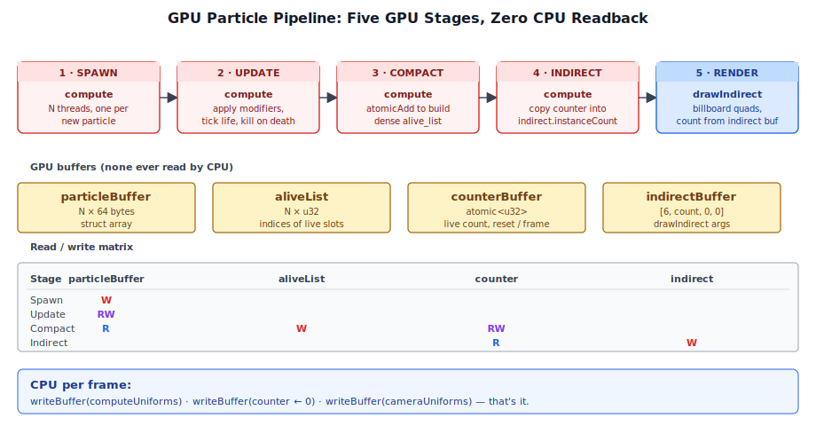
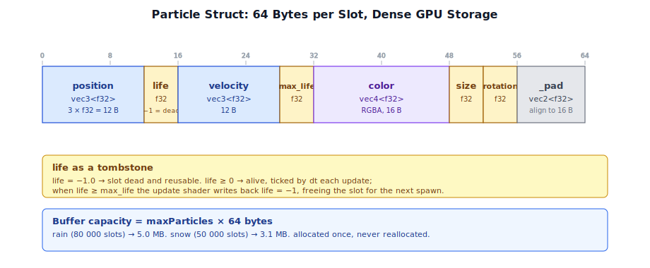
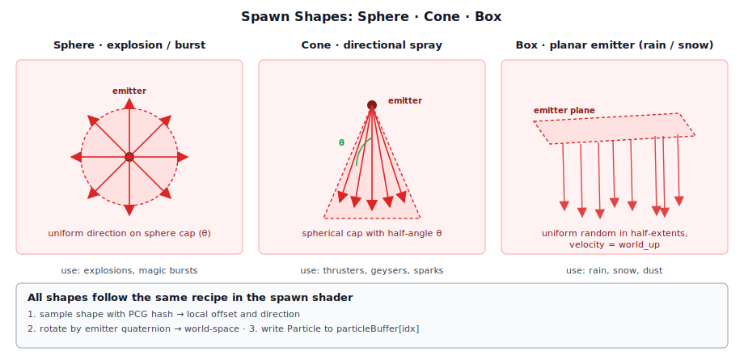
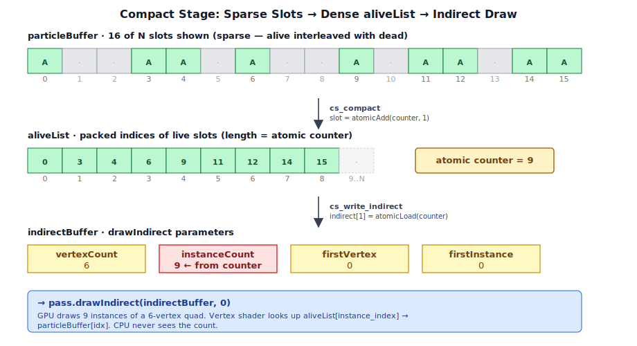
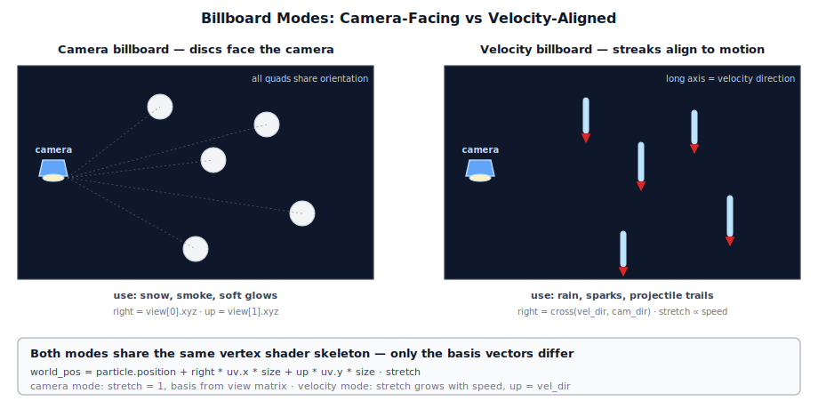

# Chapter 9: GPU Particle System

[Contents](../crafty.md) | [08-Shadow Mapping](08-shadow-mapping.md) | [10-Sky Atmosphere](10-sky-atmosphere.md)

Particle effects bring a scene to life — rain streaking past the player, snow drifting through the air, smoke rising from an explosion, sparks flying from a mining pick. Crafty implements a **fully GPU-driven particle system** where every phase (spawn, update, compaction, render) runs on the GPU via compute shaders. There is no CPU readback of particle state and no per-particle CPU work at runtime.

## 9.1 Architecture Overview



The particle system is built around a **four-stage compute pipeline** executed each frame:

```
Spawn ──► Update ──► Compact ──► Indirect Write ──► Render
```

Each stage is a compute (or render) pass that operates on GPU-resident buffers. The host CPU only uploads a small uniform block (time, camera matrices, emitter transform) once per frame.

| Stage | Shader | Purpose |
|-------|--------|---------|
| Spawn | Generated per-config | Initialize new particles from the emitter |
| Update | Generated per-config | Apply modifiers (gravity, drag, noise, etc.) |
| Compact | `particle_compact.wgsl` | Build aligned list of alive particles |
| Indirect Write | `particle_compact.wgsl` | Write alive count into indirect draw buffer |
| Render | `particle_render.wgsl` / `particle_render_forward.wgsl` | Draw billboard quads via indirect draw |

The spawn and update shaders are **generated at pipeline creation time** from a `ParticleGraphConfig` description, producing specialized WGSL that inlines only the needed modifiers — no runtime branching over uniforms.

## 9.2 Particle Graph Config

The particle system is described declaratively through the `ParticleGraphConfig` interface (`src/particles/particle_types.ts`):

```typescript
interface ParticleGraphConfig {
  emitter: EmitterNode;
  modifiers: ModifierNode[];
  renderer: RenderNode;
  events?: EventNode[];
}
```

### EmitterNode

The emitter controls how many particles exist, how fast they spawn, their initial properties, and the geometric region they emerge from:

```typescript
interface EmitterNode {
  maxParticles: number;           // GPU buffer capacity
  spawnRate: number;              // particles per second
  lifetime: [min: number, max: number];
  shape: SpawnShape;              // sphere | cone | box
  initialSpeed: [min: number, max: number];
  initialColor: [r, g, b, a];
  initialSize: [min: number, max: number];
  roughness: number;              // PBR for deferred renderer
  metallic: number;
}
```

### ModifierNode

Modifiers are per-frame behaviours applied in order during the update compute pass. Each type produces a different WGSL code snippet:

| Modifier | Effect |
|----------|--------|
| `gravity` | Constant downward acceleration |
| `drag` | Velocity-proportional deceleration |
| `force` | Constant directional acceleration |
| `swirl_force` | Circular force rotating over time |
| `vortex` | Solid-body rotation around the emitter axis |
| `curl_noise` | Turbulent flow via curl of a noise field |
| `size_random` | Stable random size per particle slot |
| `size_over_lifetime` | Linear size interpolation |
| `color_over_lifetime` | Linear color + alpha interpolation |
| `block_collision` | Kill particle on terrain contact (heightmap) |

### RenderNode

Controls how particles are rasterised:

```typescript
type RenderNode =
  | { type: 'sprites'; blendMode: 'additive' | 'alpha';
      billboard: 'camera' | 'velocity';
      renderTarget?: 'gbuffer' | 'hdr' }
  | { type: 'points' };
```

Two billboard modes exist:
- **`camera`** — soft disc always facing the camera (snow, smoke).
- **`velocity`** — streak aligned to the velocity vector (rain, sparks).

Two render targets are supported:
- **`hdr`** — forward alpha-blended rendering into the HDR color buffer (transparent effects).
- **`gbuffer`** — deferred opaque rendering into the G-buffer (hard billboards, e.g. debris).

## 9.3 The Particle Struct



Every particle is a fixed-size 64-byte struct stored in a GPU storage buffer:

```wgsl
struct Particle {
  position : vec3<f32>,  // offset  0
  life     : f32,        // offset 12  (-1 = dead)
  velocity : vec3<f32>,  // offset 16
  max_life : f32,        // offset 28
  color    : vec4<f32>,  // offset 32
  size     : f32,        // offset 48
  rotation : f32,        // offset 52
  _pad     : vec2<f32>,  // offset 56
}                        // total: 64 bytes
```

The `life` field serves double duty: a value of `-1.0` marks the slot as dead (available for recycling), while a non-negative value counts upward toward `max_life`. When `life >= max_life` the particle is killed in the update shader.

On construction, the entire particle buffer is initialized with `life = -1.0` so every slot starts dead.

## 9.4 GPU Buffers

Each `ParticlePass` owns five GPU buffers:

| Buffer | Size | Usage |
|--------|------|-------|
| `particleBuffer` | `maxParticles × 64` | STORAGE | COPY_DST | Particle struct array |
| `aliveList` | `maxParticles × 4` | STORAGE | Indices of alive particles |
| `counterBuffer` | 4 | STORAGE | COPY_DST | Atomic counter for compaction |
| `indirectBuffer` | 16 | INDIRECT | STORAGE | COPY_DST | Indirect draw parameters |
| `computeUniforms` | 80 | UNIFORM | COPY_DST | Per-frame compute uniforms |

The indirect draw buffer layout is `[vertexCount, instanceCount, firstVertex, firstInstance]`. It is initialized to `[6, 0, 0, 0]` — six vertices (two triangles for a quad) with zero instances. The compact pass writes the live particle count into the `instanceCount` field.

## 9.5 The Spawn Stage

The spawn shader is **generated** by `buildSpawnShader()` in `src/particles/particle_builder.ts`. It inlines:

- The emitter's spawn shape code (sphere, cone, or box).
- Initial value ranges (lifetime, speed, size, color).
- Any `on_spawn` event actions.

Each workgroup thread handles one new particle:

```wgsl
@compute @workgroup_size(64)
fn cs_main(@builtin(global_invocation_id) gid: vec3<u32>) {
  if (gid.x >= uniforms.spawn_count) { return; }

  let idx  = (uniforms.spawn_offset + gid.x) % uniforms.max_particles;
  let seed = pcg_hash(uniforms.spawn_offset + gid.x);

  let speed = rand_range(speedMin, speedMax, seed + 1u);

  var p: Particle;
  p.life     = 0.0;
  p.max_life = rand_range(lifeMin, lifeMax, seed + 2u);
  p.color    = vec4<f32>(cr, cg, cb, ca);
  p.size     = rand_range(sizeMin, sizeMax, seed + 3u);
  p.rotation = rand_f32(seed + 4u) * 6.28318530717958647;

  // Inline spawn shape code:
  //   sphere:  sample cone, rotate by emitter quaternion, offset by radius
  //   cone:    sample cone, rotate by emitter quaternion, offset by radius
  //   box:     uniform random in half-extents, rotate by emitter quaternion

  particles[idx] = p;
}
```

The number of particles spawned this frame is computed on the CPU by accumulating `spawnRate × dt` and then rounding down. This accumulator-based approach handles variable frame rates smoothly — particles are not created or lost when the frame rate fluctuates.

### Spawn Shapes



**Sphere.** Samples a direction from a spherical cap (solid angle `θ`), rotates it by the emitter's world rotation, and places the particle at the emitter position plus that direction times the sphere radius.

**Cone.** Identical math to sphere — the cone is a spherical cap with half-angle `θ`; the particle emerges from the cap surface.

**Box.** Uniformly samples `[-hx, hx] × [-hy, hy] × [-hz, hz]`, rotates the offset by the emitter quaternion, and adds it to the emitter position. The velocity direction is always `world_up` (used for rain/snow falling from a horizontal plane).

## 9.6 The Update Stage

The update shader is also **generated** by `buildUpdateShader()`. It iterates every particle slot (not just alive ones — dead slots are skipped) and applies the configured modifiers in order:

```wgsl
@compute @workgroup_size(64)
fn cs_main(@builtin(global_invocation_id) gid: vec3<u32>) {
  let idx = gid.x;
  if (idx >= uniforms.max_particles) { return; }

  var p = particles[idx];
  if (p.life < 0.0) { return; }

  p.life += uniforms.dt;
  if (p.life >= p.max_life) {
    // on_death event actions
    particles[idx].life = -1.0;
    return;
  }

  let t = p.life / p.max_life;

  // Inline modifier code:
  //   gravity:          p.velocity.y -= strength * dt;
  //   drag:             p.velocity -= p.velocity * coefficient * dt;
  //   force:            p.velocity += direction * strength * dt;
  //   curl_noise:       p.velocity += curl_noise_FBM(position * scale + time * timeScale) * strength * dt;
  //   color_lifetime:   p.color = mix(startColor, endColor, t);
  //   size_lifetime:    p.size = mix(start, end, t);
  //   block_collision:  if (p.position.y <= heightmap_sample) { p.life = -1.0; return; }

  p.position += p.velocity * uniforms.dt;
  particles[idx] = p;
}
```

### Curl Noise Turbulence

The `curl_noise` modifier generates turbulent flow patterns by taking the curl of a noise field — this produces divergence-free velocity fields that look like natural wind or water turbulence. The implementation computes the curl via finite differences of three decorrelated Perlin noise potentials:

```wgsl
fn curl_noise(p: vec3<f32>) -> vec3<f32> {
  // Finite difference: sample noise at ±ε on each axis
  // curl(F) = ∇ × F = (dFz/dy - dFy/dz, dFx/dz - dFz/dx, dFy/dx - dFx/dy)
}
```

FBM (fractal Brownian motion) sums multiple octaves for richer detail.

### Block Collision

The `block_collision` modifier checks whether a particle has hit the terrain surface. It samples a **heightmap** — a 2D array of `HEIGHTMAP_RES × HEIGHTMAP_RES` (128×128) float heights centered on the emitter. If the particle's Y position falls below the terrain height at its XZ coordinate, it is killed immediately (`life = -1.0`).

This heightmap is uploaded each frame via `ParticlePass.updateHeightmap()`, which reads the chunk data around the player to produce a compact elevation array. The check is a single texture-like lookup:

```wgsl
let _bc_uv = (p.position.xz - vec2<f32>(hm.origin_x, hm.origin_z)) / (hm.extent * 2.0) + 0.5;
if (all(_bc_uv >= vec2<f32>(0.0)) && all(_bc_uv <= vec2<f32>(1.0))) {
  let _bc_xi = clamp(u32(_bc_uv.x * f32(hm.resolution)), 0u, hm.resolution - 1u);
  let _bc_zi = clamp(u32(_bc_uv.y * f32(hm.resolution)), 0u, hm.resolution - 1u);
  if (p.position.y <= hm_data[_bc_zi * hm.resolution + _bc_xi]) {
    particles[idx].life = -1.0; return;
  }
}
```

Only particles within the heightmap's axis-aligned rectangle are tested — particles outside pass through unchanged.

## 9.7 The Compact Stage



After update, the particle buffer contains a mix of alive and dead particles. The compact stage rebuilds a dense `alive_list` array and writes the count into the indirect draw buffer — all on the GPU with no CPU involvement.

**First dispatch** (`cs_compact`): every thread checks one particle slot. If alive, it atomically increments the counter and writes its index:

```wgsl
@compute @workgroup_size(64)
fn cs_compact(@builtin(global_invocation_id) gid: vec3<u32>) {
  let idx = gid.x;
  if (idx >= uniforms.max_particles) { return; }
  if (particles[idx].life < 0.0) { return; }
  let slot = atomicAdd(&counter, 1u);
  alive_list[slot] = idx;
}
```

**Second dispatch** (`cs_write_indirect`): a single workgroup copies the atomic counter into the indirect buffer's `instanceCount` field:

```wgsl
@compute @workgroup_size(1)
fn cs_write_indirect() {
  indirect[1] = atomicLoad(&counter);
}
```

The counter buffer is reset to zero at the start of each frame (written by the CPU before the compute pass).

## 9.8 The Render Stage



Particles are drawn via **indirect draw** — the `indirectBuffer` is bound as the draw parameters, so the GPU decides how many instances to render without CPU intervention.

### Forward HDR (Transparent)

For alpha-blended effects like rain and snow, the `particle_render_forward.wgsl` shader writes directly into the HDR color buffer with depth read-only:

```typescript
// Forward HDR pipeline: alpha blend, no depth write
const renderPipeline = device.createRenderPipeline({
  vertex:   { module: renderModule, entryPoint: vsEntry },
  fragment: {
    module: renderModule,
    entryPoint: fsEntry,
    targets: [{
      format: HDR_FORMAT,
      blend: {
        color: { srcFactor: 'src-alpha', dstFactor: 'one-minus-src-alpha', operation: 'add' },
      },
    }],
  },
  depthStencil: { format: 'depth32float', depthWriteEnabled: false, depthCompare: 'less' },
});
```

**Velocity billboard** (`vs_main`). The quad is aligned with the particle's velocity direction. The long axis stretches proportionally to speed, creating streak-shaped raindrops:

```wgsl
let vel_dir = normalize(velocity);
let right   = normalize(cross(vel_dir, cam_dir));
let stretch = 1.0 + speed * 0.04;
let world_pos = p.position
  + right   * ofs.x * p.size
  + vel_dir * ofs.y * p.size * stretch;
```

The fragment shader fades the alpha at the tips of the streak and multiplies the color by `EMIT_SCALE` (4×) to produce bright, visible raindrops against the dark sky.

**Camera billboard** (`vs_camera`). The quad always faces the camera, creating a soft disc. Used for snow and smoke:

```wgsl
let right = camera.view[0].xyz;   // world-space right
let up    = camera.view[1].xyz;   // world-space up
let world_pos = p.position + right * ofs.x * p.size + up * ofs.y * p.size;
```

The snow fragment shader applies a radial alpha falloff from the center, producing circular flakes:

```wgsl
let uv = in.uv * 2.0 - 1.0;
let d2 = dot(uv, uv);
if (d2 > 1.0) { discard; }
let alpha = in.color.a * (1.0 - d2);
```

### Deferred GBuffer (Opaque)

For opaque billboard particles (debris, solid projectiles), the `particle_render.wgsl` shader writes into the G-buffer (albedo + normal) with full depth testing:

```typescript
// GBuffer pipeline: writes albedo+normal, depth write on
targets: [
  { format: 'rgba8unorm'  },   // albedo_roughness
  { format: 'rgba16float' },   // normal_metallic
],
depthStencil: { format: 'depth32float', depthWriteEnabled: true, depthCompare: 'less' },
```

The vertex shader constructs a camera-facing quad (identical to the camera billboard path). The fragment shader clips to a circle and encodes the face normal (camera-to-particle direction) into the G-buffer:

```wgsl
@fragment
fn fs_main(in: VertexOutput) -> GBufferOutput {
  let d = length(in.uv - 0.5) * 2.0;
  if (d > 1.0) { discard; }
  let N = normalize(in.face_norm);
  out.albedo_roughness = vec4<f32>(in.color.rgb, mat_params.roughness);
  out.normal_metallic  = vec4<f32>(N * 0.5 + 0.5, mat_params.metallic);
}
```

This allows opaque particles to receive lighting from the deferred shading pass naturally.

## 9.9 Per-Frame CPU Upload

The CPU's per-frame work is limited to one `writeBuffer` call for compute uniforms and one for camera uniforms. The `ParticlePass.update()` method:

1. Advances the internal clock (`_time += dt`).
2. Accumulates spawn count from `spawnRate × dt`.
3. Decomposes the emitter's world transform into position + rotation quaternion.
4. Packs a `ComputeUniforms` struct (20 floats) and writes it to the GPU.
5. Resets the atomic counter and updates the spawn ring-buffer offset.
6. Packs `CameraUniforms` (72 floats: view, proj, viewProj, invViewProj, camera position, near/far) and writes them to the GPU.

```typescript
update(ctx, dt, view, proj, viewProj, invViewProj, camPos, near, far, worldTransform): void {
  this._time += dt;
  this._spawnAccum += this._config.emitter.spawnRate * dt;
  this._spawnCount = Math.min(Math.floor(this._spawnAccum), this._maxParticles);
  this._spawnAccum -= this._spawnCount;
  // ... decompose world transform, write uniforms ...
  ctx.queue.writeBuffer(this._computeUniforms, 0, cu.buffer as ArrayBuffer);
  ctx.queue.writeBuffer(this._counterBuffer, 0, this._resetArr);
  ctx.queue.writeBuffer(this._cameraBuffer, 0, camData.buffer as ArrayBuffer);
}
```

## 9.10 Runtime Spawn Rate Adjustment

The `setSpawnRate()` method allows changing the particle emission rate without rebuilding the render graph:

```typescript
setSpawnRate(rate: number): void {
  this._config.emitter.spawnRate = rate;
}
```

This is used by the weather system to adjust rain/snow intensity dynamically. Changing the rate only writes a new float in the config object — no shader regeneration, no pipeline rebuild, no buffer reallocation. The new rate takes effect on the next frame's spawn accumulation.

## 9.11 Rain and Snow Configurations

Crafty ships with two pre-defined particle configurations (`crafty/config/particle_configs.ts`):

### Rain

```typescript
export const rainConfig: ParticleGraphConfig = {
  emitter: {
    maxParticles: 80000,
    spawnRate: 24000,
    lifetime: [2.0, 3.5],
    shape: { kind: 'box', halfExtents: [35, 0.1, 35] },
    initialSpeed: [0, 0],
    initialColor: [0.75, 0.88, 1.0, 0.55],
    initialSize: [0.005, 0.009],
  },
  modifiers: [
    { type: 'gravity', strength: 9.0 },
    { type: 'drag', coefficient: 0.05 },
    { type: 'color_over_lifetime', startColor: [0.75, 0.88, 1.0, 0.55], endColor: [0.75, 0.88, 1.0, 0.0] },
    { type: 'block_collision' },
  ],
  renderer: { type: 'sprites', blendMode: 'alpha', billboard: 'velocity', renderTarget: 'hdr' },
};
```

Rain uses a wide, flat box emitter (70×0.2×70 blocks), velocity-aligned billboards for streak effect, gravity at 9 m/s², mild drag, and fades out via alpha over lifetime. Particles that hit the terrain are immediately removed via `block_collision`.

### Snow

```typescript
export const snowConfig: ParticleGraphConfig = {
  emitter: {
    maxParticles: 50000,
    spawnRate: 1500,
    lifetime: [30.0, 45.0],
    shape: { kind: 'box', halfExtents: [35, 0.1, 35] },
    initialSpeed: [0, 0],
    initialColor: [0.92, 0.96, 1.0, 0.85],
    initialSize: [0.025, 0.055],
  },
  modifiers: [
    { type: 'gravity', strength: 1.5 },
    { type: 'drag', coefficient: 0.8 },
    { type: 'curl_noise', scale: 1.0, strength: 1.0, timeScale: 1.0, octaves: 1 },
    { type: 'block_collision' },
  ],
  renderer: { type: 'sprites', blendMode: 'alpha', billboard: 'camera', renderTarget: 'hdr' },
};
```

Snow uses camera-facing billboards (soft discs), very slow fall speed (gravity 1.5 m/s², high drag), long lifetimes (30–45 seconds), and curl noise turbulence for drifting motion.

### Summary

The GPU-driven particle system features:

- **Five-stage pipeline**: Spawn → Update → Compact → Indirect Write → Render, all on GPU
- **Configurable graphs**: `ParticleGraphConfig` with emitter, modifier, and renderer nodes
- **Shader generation**: WGSL code generated from config for spawn shapes and update modifiers
- **Indirect rendering**: Compact pass produces dense alive lists; indirect draw eliminates CPU round-trips
- **Two render paths**: Forward HDR (alpha blend) and deferred GBuffer billboards
- **Weather integration**: Rain and snow configs driven by the weather system

## File Reference

| File | Purpose |
|------|---------|
| `src/particles/particle_types.ts` | `ParticleGraphConfig`, `EmitterNode`, `ModifierNode`, `RenderNode` type definitions |
| `src/particles/particle_builder.ts` | WGSL code generation for spawn and update shaders |
| `src/shaders/particles/particle_compact.wgsl` | Compact and indirect-write compute shaders |
| `src/shaders/particles/particle_render.wgsl` | Deferred GBuffer billboard render shader |
| `src/shaders/particles/particle_render_forward.wgsl` | Forward HDR billboard render shader (velocity + camera) |
| `src/renderer/passes/particle_pass.ts` | `ParticlePass` — full pipeline create/update/execute/destroy |
| `crafty/config/particle_configs.ts` | Rain and snow particle configurations |

**Further reading:**
- `src/renderer/passes/particle_pass.ts` — Complete particle pass implementation
- `src/particles/particle_builder.ts` — WGSL shader generation
- `crafty/config/particle_configs.ts` — Rain and snow configs
- `crafty/game/weather_system.ts` — Weather integration with particle passes

----
[Contents](../crafty.md) | [08-Shadow Mapping](08-shadow-mapping.md) | [10-Sky Atmosphere](10-sky-atmosphere.md)
