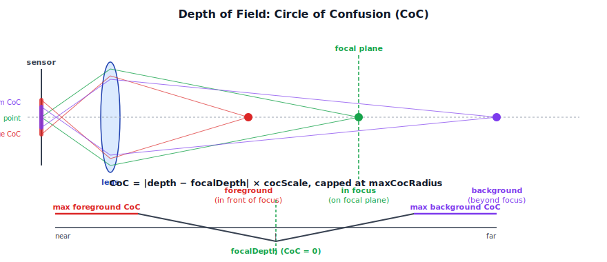
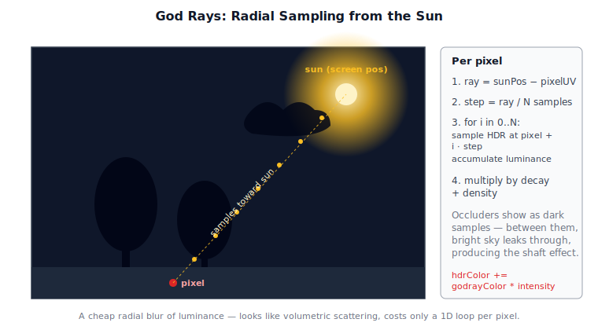
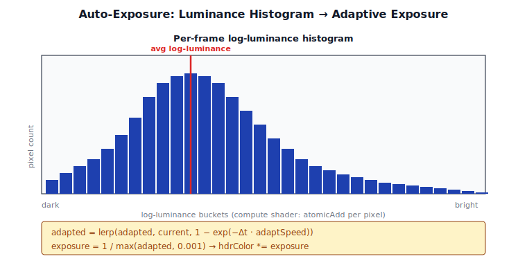

# Chapter 10: Post-Processing

[Contents](../crafty.md) | [08-Shadow Mapping](08-shadow-mapping.md) | [11-Sky Atmosphere](11-sky-atmosphere.md)

After the scene is rendered into the HDR target, a series of post-processing passes refines the image. This chapter covers tonemapping, bloom, temporal anti-aliasing, screen-space ambient occlusion, depth of field, and god rays.

## 10.1 Tone Mapping and HDR Display

The final step before presentation is **tone mapping** — converting HDR pixel values to the SDR (or HDR) display range. Crafty's `CompositePass` performs this as the last operation before the swap chain.

### ACES Filmic Tone Mapping

Crafty uses the **ACES** (Academy Color Encoding System) filmic tone mapping curve, which provides a natural, cinematic look with good highlight rolloff. Compared to a hard clamp (which clips bright values) or Reinhard (which desaturates the midtones aggressively), ACES holds the midrange and rolls off smoothly:


```wgsl
// ── from composite pass shader ──
fn tonemap(color: vec3f) -> vec3f {
  let a = 2.51;
  let b = 0.03;
  let c = 2.43;
  let d = 0.59;
  let e = 0.14;
  return clamp((color * (a * color + b)) / (color * (c * color + d) + e), 0.0, 1.0);
}
```

This curve maps unlimited HDR input to [0, 1] with smooth saturation at the high end, preventing the hard clipping of simple `clamp()` or Reinhard tone mapping.

### HDR Passthrough

When the swap chain is in HDR mode (`rgba16float` + `display-p3`), the composite pass can skip tonemapping entirely or apply only a small amount of output-referred grading:

```typescript
// If swap chain is HDR, write linear HDR values directly
if (ctx.hdr) {
  // Passthrough — the display handles the EOTF
} else {
  // Apply ACES tone map for SDR output
}
```

### Gamma Correction

For SDR output, the tone-mapped value is converted from linear to sRGB gamma space. This is done in the shader just before the final display by applying a gamma curve to the output color:

```typescript
return vec4<f32>(pow(max(ldr, vec3<f32>(0.0)), vec3<f32>(1.0 / 2.2)), 1.0);
```

## 10.2 Bloom

Bloom simulates the scattering of bright light in a camera lens, creating a soft glow around bright regions. Crafty's `BloomPass` follows a standard three-step process — extract the bright pixels, blur them, and add the result back:


**1. Prefilter.** Extract bright pixels from the HDR target, applying a knee curve that smoothly transitions from unbloomed to bloomed:

```wgsl
let luminance = dot(hdrColor, vec3f(0.2126, 0.7152, 0.0722));
let knee = max(luminance - threshold, 0.0);
let softKnee = knee / (knee + kneeThreshold);
let brightness = max(softKnee, 0.0);
output = hdrColor * brightness;
```

**2. Separable Gaussian blur.** The prefiltered bright-pass texture is blurred with a two-pass separable Gaussian. Ping-ponging between two half-resolution textures:

```
BrightPass ──► Horizontal Blur ──► Vertical Blur ──► Blurred Bloom
```

The blur kernel is a 9-tap Gaussian:

```wgsl
let weights = [0.061, 0.122, 0.183, 0.204, 0.183, 0.122, 0.061];
// 7-tap separable — extend to 9 or 13 for stronger bloom
```

**3. Composite.** The blurred bloom texture is added to the original HDR image:

```wgsl
hdrColor += bloomColor * bloomIntensity;
```

The bloom intensity and threshold are adjustable parameters exposed through the settings UI.

## 10.3 Temporal Anti-Aliasing (TAA)

TAA `TAAPass` reduces aliasing by averaging the current frame with previous frames, using sub-pixel jitter to shift the sample pattern each frame. The Halton (2,3) sequence spreads samples evenly within a pixel, so accumulating ~8 frames approximates 8× supersampling:


### Jitter

The projection matrix is jittered by a sub-pixel offset each frame. The jitter pattern is a Halton sequence (2,3) that provides good temporal coverage:

```typescript
const jitterX = halton2(frameIndex) - 0.5;
const jitterY = halton3(frameIndex) - 0.5;
// Apply jitter to projection matrix
proj[8] += jitterX / width;   // column 2, row 0
proj[9] += jitterY / height;  // column 2, row 1
```

### Reprojection

Each frame, the previous frame's color is reprojected into the current frame using the motion vector (the difference in clip-space position between frames):

```wgsl
// Sample history using motion vector
let historyUV = currentUV + motionVector;
let historyColor = textureSample(historyTexture, sampler, historyUV);

// Blend with current frame (clamp to neighbourhood to avoid ghosting)
let currentColor = textureSample(currentTexture, sampler, currentUV);
let result = lerp(historyColor, currentColor, 0.1);  // 0.1 = feedback factor
```

### Neighbourhood Clamping

To prevent ghosting from rapid scene changes, the history sample is clamped to the bounding box (AABB) of the current pixel's neighbourhood:

```wgsl
let neighbourhood = [
  textureSample(currentTexture, sampler, currentUV + vec2f( 1, 0) * texelSize),
  textureSample(currentTexture, sampler, currentUV + vec2f(-1, 0) * texelSize),
  textureSample(currentTexture, sampler, currentUV + vec2f( 0, 1) * texelSize),
  textureSample(currentTexture, sampler, currentUV + vec2f( 0,-1) * texelSize),
];
let minColor = min(neighbourhood);
let maxColor = max(neighbourhood);
historyColor = clamp(historyColor, minColor, maxColor);
```

## 10.4 Screen-Space Ambient Occlusion (SSAO)

SSAO estimates ambient light occlusion by sampling the depth buffer around each pixel. The `SSAOPass` (`src/renderer/passes/ssao_pass.ts`) computes an occlusion factor for each screen pixel by sending sample rays into a hemisphere oriented to the surface normal:


### Algorithm

For each pixel, the shader samples the depth buffer at several positions within a sphere around the pixel's world position. The number of samples that fall inside the scene geometry (closer to the camera) determines the occlusion:

```wgsl
let occlusion = 0.0;
let radius = 1.0;
let samples = 16;
for (var i = 0u; i < samples; i++) {
  let samplePos = pixelPos + sampleKernel[i] * radius;
  let sampleDepth = textureSample(depthMap, sampler, samplePos.xy).r;
  // Reconstruct world position from depth
  let sampleWorldPos = reconstructWorldPos(samplePos.xy, sampleDepth);
  let dist = sampleWorldPos.z - pixelPos.z;
  occlusion += step(dist, 0.0) * max(0.0, 1.0 - dist / radius);
}
occlusion = 1.0 - occlusion / f32(samples);
```

The sample kernel is oriented by the surface normal to bias samples toward the visible hemisphere. A noise texture rotates the kernel per-pixel to hide banding, which is then resolved by a bilateral blur.

### Bilateral Blur

The raw SSAO output is noisy and requires blurring. A separable bilateral blur preserves edges by weighting the blur kernel by the depth difference:

```wgsl
let weight = exp(-abs(depthCenter - depthNeighbour) * sigmaDepth);
blurred += neighbourValue * weight * gaussianWeight;
totalWeight += weight * gaussianWeight;
```

## 10.5 Depth of Field (DOF)

The `DofPass` (`src/renderer/passes/dof_pass.ts`) simulates camera lens defocus blur. Objects at a specific focal distance are sharp; objects farther or closer become increasingly blurred. Geometrically, off-focus points project to a disk on the sensor instead of a single point — that disk's diameter is the **circle of confusion**:




### Circle of Confusion

The **circle of confusion** (CoC) is computed per pixel from the depth buffer:

```wgsl
let depth = linearizeDepth(textureSample(depthMap, sampler, uv).r);
let coc = abs(depth - focalDepth) * cocScale;
coc = clamp(coc, 0.0, maxCocRadius);
```

A positive CoC means the pixel is behind the focal plane (background). Negative means foreground.

### Separable Blur

The DOF pass renders at half resolution for performance:

1. **CoC prefilter.** Compute CoC and optionally downsample.
2. **Separable blur.** Horizontal then vertical blur using the CoC as a radius. Foreground and background are blurred separately to prevent bleeding.
3. **Composite.** Blend the blurred result with the original sharp image based on CoC magnitude.

The blur uses a Poisson-disk kernel where the number of samples is proportional to the CoC radius, capped at `maxCocRadius` (typically 8-16 texels).

## 10.6 God Rays (Crepuscular Rays)

The `GodrayPass` (`src/renderer/passes/godray_pass.ts`) renders volumetric light shafts — rays of light that appear when sunlight filters through semitransparent occluders (clouds, tree leaves). The trick is that we don't actually march through 3D space: we just sample the screen-space HDR image along a 1D ray pointing back toward the sun, accumulating luminance as we go:




### Radial Blur from Light Source

The algorithm determines the sun's position in screen space, then samples the HDR target along rays radiating from that position:

```wgsl
let sunScreenPos = projectToScreen(sunDirection);
let ray = sunScreenPos - uv;
let step = ray / f32(numSamples);
var godray = 0.0;
for (var i = 0u; i < numSamples; i++) {
  let sampleUV = uv + step * f32(i);
  let sampleColor = textureSample(hdrTexture, sampler, sampleUV).rgb;
  godray += luminance(sampleColor) * density;
}
godray = godray * decay / f32(numSamples);
```

The result is composited additively onto the HDR target:

```wgsl
hdrColor += godrayColor * intensity;
```

The sun screen position, density, decay, and intensity are configurable parameters that produce different godray effects — from subtle shafts to dramatic crepuscular rays.

## 10.7 Auto-Exposure

The `AutoExposurePass` (`src/renderer/passes/auto_exposure_pass.ts`) computes a scene-adaptive exposure value using compute shaders. It adapts the overall brightness when the scene changes (e.g., walking from indoors to sunlight). The mechanism is a per-frame log-luminance histogram, smoothed temporally so that exposure tracks scene changes without snapping:




### Histogram Computation

A compute shader divides the HDR image into workgroups and each thread computes the luminance of a pixel, incrementing a histogram bucket:

```wgsl
let luminance = dot(hdrColor, vec3f(0.2126, 0.7152, 0.0722));
let bucket = u32(log2(luminance + 0.0001) * HISTOGRAM_SCALE + HISTOGRAM_OFFSET);
atomicAdd(&histogram[bucket], 1u);
```

### Average Luminance

The histogram is read back to compute the average log-luminance, which is then smoothed temporally:

```typescript
let adaptedLuminance = lerp(previousLuminance, currentLuminance,
                            1.0 - exp(-deltaTime * adaptationSpeed));
```

The adapted luminance drives exposure:

```wgsl
let exposure = 1.0 / max(adaptedLuminance, 0.001);
hdrColor *= exposure;
```

This provides a smooth, automatic transition between lighting conditions.

## 10.8 Color Grading

The `CompositePass` optionally applies color grading via a **lookup table (LUT)**. A 3D LUT texture maps input colors to graded output colors, enabling cinematic color grading:

```wgsl
let gradedColor = textureSampleLevel(colorGradingLut, lutSampler,
  color * lutScale + lutOffset, 0.0).rgb;
```

When no LUT is active, the composite pass applies a simple contrast, saturation, and vibrance adjustment as a post-tonemapping step.

### Summary

Post-processing transforms the raw HDR render into the final image. The diagram below shows how the passes chain together — every post-FX stage reads from and writes back to the HDR target until the composite pass produces SDR output for the swap chain:


| Pass | Input | Output | Purpose |
|------|-------|--------|---------|
| SSAO | G-buffer depth/normal | AO texture | Local ambient occlusion |
| SSGI | G-buffer + history | Indirect light | Bounce light approximation |
| TAA | HDR + history + motion | Anti-aliased HDR | Temporal supersampling |
| DOF | HDR + depth | Blurred HDR | Lens defocus simulation |
| Godrays | HDR + sun position | HDR + shafts | Volumetric light scattering |
| Bloom | HDR bright pass | HDR + glow | Lens glare simulation |
| Auto-exposure | HDR → histogram → exposure | Adapts HDR brightness | Automatic exposure |
| Composite | HDR + all of the above | Swap chain output | Tonemapping + grading |

**Further reading:**
- `src/renderer/passes/taa_pass.ts` — Temporal anti-aliasing
- `src/renderer/passes/ssao_pass.ts` — Screen-space ambient occlusion
- `src/renderer/passes/ssgi_pass.ts` — Screen-space global illumination
- `src/renderer/passes/bloom_pass.ts` — HDR bloom
- `src/renderer/passes/godray_pass.ts` — Volumetric god rays
- `src/renderer/passes/dof_pass.ts` — Depth of field
- `src/renderer/passes/auto_exposure_pass.ts` — Auto-exposure
- `src/renderer/passes/composite_pass.ts` — Final composition + tonemap
- `src/shaders/composite.wgsl` — Composite shader

----
[Contents](../crafty.md) | [08-Shadow Mapping](08-shadow-mapping.md) | [11-Sky Atmosphere](11-sky-atmosphere.md)
