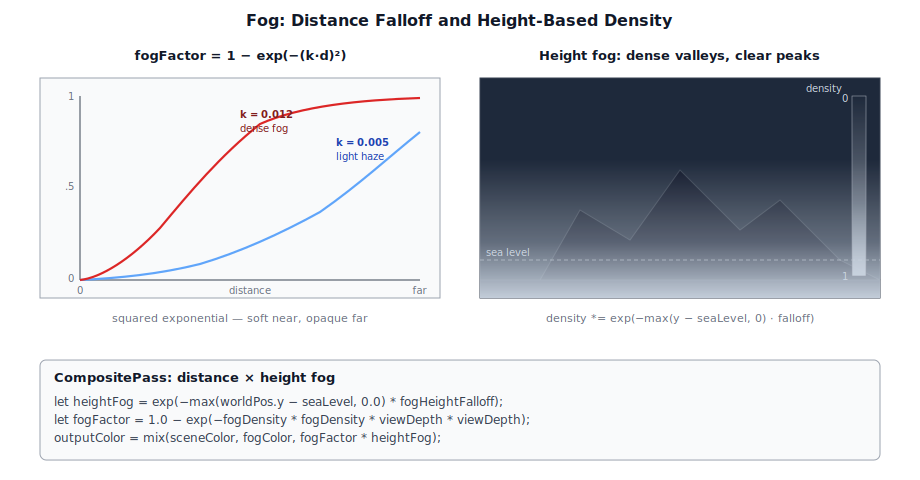
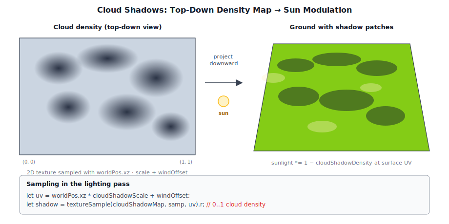

# Chapter 10: Sky and Atmosphere

[Contents](../crafty.md) | [09-Particle System](09-particle-system.md) | [11-Terrain](11-terrain.md)

The sky is the largest object in any outdoor scene. Crafty supports multiple sky rendering techniques: HDR environment maps, procedural atmospheric sky, and volumetric clouds.

## 10.1 HDR Environment Maps


The simplest sky is a **fixed HDR cubemap** — a 360° photograph of a real sky, stored in the Radiance HDR format (.hdr). The `SkyTexturePass` renders this cubemap as a fullscreen background:

```wgsl
let skyDir = normalize(camera.viewToWorld * screenRay);
let skyColor = textureSample(skyCubemap, skySampler, skyDir).rgb;
```

HDR maps preserve the full dynamic range of the sky, allowing the sun to be thousands of times brighter than the blue sky — essential for physically-based bloom and eye adaptation.

### RGBE Decoding

Radiance HDR files use RGBE encoding (one shared exponent for three color channels). Crafty decodes this on the GPU using `src/shaders/rgbe_decode.wgsl`:

```wgsl
fn rgbeToFloat(rgbe: vec4f) -> vec3f {
  let exponent = rgbe.a * 255.0 - 128.0;
  return rgbe.rgb * pow(2.0, exponent);
}
```

## 10.2 Atmospheric Sky


The `AtmospherePass` (`src/renderer/passes/atmosphere_pass.ts`) renders a procedural sky using a simplified atmospheric scattering model. Rayleigh scattering (blue sky at zenith, red at sunset) and Mie scattering (sun halo) are computed per-pixel based on the view direction and sun position.

### Single Scattering Approximation

```wgsl
fn rayleighPhase(cosTheta: f32) -> f32 {
  return (3.0 / (16.0 * PI)) * (1.0 + cosTheta * cosTheta);
}

fn miePhase(cosTheta: f32) -> f32 {
  let g = 0.76;  // Asymmetry factor for Mie
  return (3.0 / (8.0 * PI)) *
    ((1.0 - g * g) * (1.0 + cosTheta * cosTheta)) /
    ((2.0 + g * g) * pow(1.0 + g * g - 2.0 * g * cosTheta, 1.5));
}
```

The atmosphere pass writes directly into the HDR target with a fullscreen draw. It supports a day/night cycle driven by the sun's elevation angle.

## 10.3 Cloud Rendering


The `CloudPass` (`src/renderer/passes/cloud_pass.ts`) renders volumetric clouds using a raymarching technique. Cloud density is sampled from a 3D Perlin noise texture with multiple octaves:

```wgsl
let cloudDensity = 0.0;
for (var i = 0u; i < numOctaves; i++) {
  let samplePos = worldPos * cloudScale * pow(2.0, f32(i)) + windOffset;
  cloudDensity += textureSample(cloudNoise3D, sampler, samplePos).r / f32(i + 1);
}
cloudDensity = smoothstep(cloudThreshold, 1.0, cloudDensity);
```

The raymarch accumulates transmittance and color along the view ray, producing soft, volumetric cloud shapes with realistic self-shadowing.

### Silver's Multi-Scattering Approximation

Real clouds scatter light many times — single scattering alone is too dark because it ignores energy that bounces between droplets. Silver's approximation models multi-scattering as an additional isotropic ambient term added at each raymarch step, avoiding the cost of explicit secondary ray marches:

```wgsl
// Per-step accumulation in the cloud raymarch
let sun_energy = light.color * light.intensity * shadow_t * phase;
let amb_energy = cloud.ambientColor * mix(0.5, 1.0, height_frac);

cloud_color += (sun_energy + amb_energy) * (1.0 - t_step) * total_trans;
```

The direct `sun_energy` term uses the Henyey-Greenstein phase function for forward-peaked single scattering. The `amb_energy` term represents the multiply-scattered light that has lost its directional dependence after many collisions, becoming nearly isotropic. Its strength varies with height within the cloud: denser regions deeper in the cloud receive more scattered energy, while cloud edges are dominated by single scattering.

The ambient color is derived from the cloud's extinction and the light color. Silver's key insight is that the ratio of multiply-scattered to singly-scattered light at a point depends primarily on the local optical depth and the scattering albedo — this can be pre-integrated or approximated as a function of density rather than computed recursively:

```wgsl
let dens = sample_density(p);
let opt  = dens * cloud.extinction * step_size;
let t_step = exp(-opt);

// Multi-scatter boost: thicker clouds scatter more light forward
let ms_boost = 1.0 + opt * (1.0 - cloud.anisotropy);
amb_energy *= ms_boost;
```

This produces the characteristic bright, fluffy appearance of cumulus clouds that single-scattering models fail to capture — the cloud interior glows rather than appearing as dark gray volume.

### Cloud Noise Texture Generation

The cloud density textures are generated on the CPU at startup by `src/assets/cloud_noise.ts`. Two tileable 3D textures are created:

| Texture | Size | Channels | Content |
|---|---|---|---|
| `baseNoise` | 64×64×64 | R | 4-octave Perlin FBM — cloud bulk shape |
| | | G/B/A | Worley cellular noise at 2×, 4×, 8× frequency — erosion layers |
| `detailNoise` | 32×32×32 | R/G/B | Worley noise at 4×, 8×, 16× frequency — fine edge detail |

#### Tileable Perlin Noise

The Perlin implementation wraps lattice coordinates via modular arithmetic so the noise tiles seamlessly at the texture boundaries. Gradient vectors are drawn from the classic 12-edge set stored as parallel `Int8Array`s to avoid heap allocation on the hot path:

```typescript
const GRAD3_X = new Int8Array([ 1, -1,  1, -1,  1, -1,  1, -1,  0,  0,  0,  0]);
const GRAD3_Y = new Int8Array([ 1,  1, -1, -1,  0,  0,  0,  0,  1, -1,  1, -1]);
const GRAD3_Z = new Int8Array([ 0,  0,  0,  0,  1,  1, -1, -1,  1,  1, -1, -1]);

function gradDot(lx, ly, lz, period, seed, dx, dy, dz) {
  const wx = ((lx % period) + period) % period;
  const wy = ((ly % period) + period) % period;
  const wz = ((lz % period) + period) % period;
  const gi = Math.floor(hashS(wx, wy, wz, seed) * 12) % 12;
  return GRAD3_X[gi] * dx + GRAD3_Y[gi] * dy + GRAD3_Z[gi] * dz;
}
```

Trilinear interpolation uses a quintic smoothstep (`6t⁵ - 15t⁴ + 10t³`) to eliminate second-order discontinuities at lattice boundaries:

```typescript
function smoothstep5(t: number): number {
  return t * t * t * (t * (t * 6 - 15) + 10);
}
```

#### Fractal Brownian Motion

Four octaves of Perlin noise are summed with halved amplitude and doubled frequency per octave, then remapped from the approximate range ±0.7 to [0, 1] for storage as `unorm8`:

```typescript
function perlinGradFbmTile(px, py, pz, octaves, baseFreq, seed) {
  let v = 0, a = 0.5, f = 1, tot = 0;
  for (let i = 0; i < octaves; i++) {
    v += perlinGradTile(px * f, py * f, pz * f, baseFreq * f, seed + i * 17) * a;
    tot += a;
    a *= 0.5;  f *= 2;
  }
  return Math.max(0, Math.min(1, v / tot * 0.85 + 0.5));
}
```

#### Tileable Worley Noise

Worley (cellular) noise measures the distance to the nearest randomly-placed feature point in a 3D grid. Each cell contains one point at a hash-derived offset within the cell, and the search covers the 27-cell neighbourhood. The modulo-wrapped cell coordinates ensure seam-free tiling:

```typescript
function worleyTile(px, py, pz, freq, seed) {
  const fx = px * freq, fy = py * freq, fz = pz * freq;
  const ix = Math.floor(fx), iy = Math.floor(fy), iz = Math.floor(fz);
  let minD2 = Infinity;
  for (let dz = -1; dz <= 1; dz++) {
    for (let dy = -1; dy <= 1; dy++) {
      for (let dx = -1; dx <= 1; dx++) {
        const cx = ix + dx, cy = iy + dy, cz = iz + dz;
        const wcx = ((cx % freq) + freq) % freq;
        const wcy = ((cy % freq) + freq) % freq;
        const wcz = ((cz % freq) + freq) % freq;
        const fpx = cx + hashS(wcx, wcy, wcz, seed);
        const fpy = cy + hashS(wcx, wcy, wcz, seed + 1);
        const fpz = cz + hashS(wcx, wcy, wcz, seed + 2);
        const d2 = (fx - fpx) ** 2 + (fy - fpy) ** 2 + (fz - fpz) ** 2;
        if (d2 < minD2) minD2 = d2;
      }
    }
  }
  return 1.0 - Math.min(Math.sqrt(minD2), 1.0);
}
```

#### Texture Upload

The generated noise arrays are uploaded to the GPU as `rgba8unorm` 3D textures with a single `queue.writeTexture()` call — no staging buffer needed for a one-time upload:

```typescript
function make3dTexture(device, label, size, data) {
  const tex = device.createTexture({
    label, dimension: '3d',
    size: { width: size, height: size, depthOrArrayLayers: size },
    format: 'rgba8unorm',
    usage: GPUTextureUsage.TEXTURE_BINDING | GPUTextureUsage.COPY_DST,
  });
  device.queue.writeTexture(
    { texture: tex },
    data.buffer,
    { bytesPerRow: size * 4, rowsPerImage: size },
    { width: size, height: size, depthOrArrayLayers: size },
  );
  return tex;
}
```

The four-channel packing means a single texture sample fetches both the bulk density (R) and three erosion frequencies (GBA) simultaneously — the shader combines them in the `sample_density()` function to carve realistic cloud shapes with wispy edges:

```wgsl
fn sample_pw(samp_uv: vec3f) -> f32 {
  let s = textureSampleLevel(base_noise, noise_samp, samp_uv, 0.0);
  let w = s.g * 0.5 + s.b * 0.35 + s.a * 0.15;
  return remap(s.r, 1.0 - w, 1.0, 0.0, 1.0);
}
```

This CPU-generation approach was chosen over GPU compute for simplicity — the noise is generated once at boot and needs no runtime modification. For a 64³ base texture and a 32³ detail texture, the total generation time is ~5 ms on a modern CPU.

## 10.4 Volumetric Fog



Fog is rendered as part of the final `CompositePass`. The fog density is computed from the fragment depth and mixed with the scene color:

```wgsl
let fogFactor = 1.0 - exp(-fogDensity * fogDensity * viewDepth * viewDepth);
outputColor = mix(sceneColor, fogColor, fogFactor);
```

Height-based fog varies the density with altitude, creating mist in valleys and clear air at higher elevations:

```wgsl
let heightFog = exp(-max(worldPos.y - seaLevel, 0.0) * fogHeightFalloff);
fogDensity *= heightFog;
```

## 10.5 Cloud Shadows



The `CloudShadowPass` renders a top-down cloud shadow map — a 2D texture storing cloud density as seen from above. The lighting pass samples this texture at the surface position to modulate direct sunlight, producing dynamic cloud shadows on the terrain.

## 10.6 Oren-Nayar Diffuse Ground

The standard atmosphere model treats the ground as fully absorbing — light reaching the surface is lost. In reality, the ground reflects scattered sunlight back into the sky, brightening the lower atmosphere, especially near the horizon. An **Oren-Nayar BRDF** models this reflection more accurately than a simple Lambertian for rough surfaces like terrain.

```wgsl
fn orenNayar(cosThetaI: f32, cosThetaR: f32, phiDiff: f32, roughness: f32) -> f32 {
  let sigma2 = roughness * roughness;
  let A = 1.0 - 0.5 * sigma2 / (sigma2 + 0.33);
  let B = 0.45 * sigma2 / (sigma2 + 0.09);
  let alpha = max(acos(cosThetaI), acos(cosThetaR));
  let beta  = min(acos(cosThetaI), acos(cosThetaR));
  return A + B * max(0.0, cos(phiDiff)) * sin(alpha) * tan(beta);
}
```

The roughness parameter controls the surface microfacets: low roughness behaves close to Lambertian, while high roughness widens the reflection lobe, scattering light back across a broader angle. In the atmosphere pass, the Oren-Nayar contribution is added during the scattering integral by treating the ground as a secondary light source:

```wgsl
// Ground-reflected radiance at the surface point
let groundAlbedo = vec3f(0.2, 0.25, 0.15);  // terrain tint
let groundIrradiance = SUN_INTENSITY * max(dot(normal, u.sunDir), 0.0);
let groundReflected = groundAlbedo * groundIrradiance * orenNayar(..., roughness);
```

This adds a subtle warm tint to the lower sky that improves realism, particularly during sunrise and sunset when the ground reflection path is longest.

## 10.7 Ozone Absorption (Chappuis Band)

Ozone in the stratosphere absorbs visible light in the **Chappuis band** (500–700 nm, peak ~600 nm). While the effect is negligible at high sun angles, it becomes visible at twilight when sunlight travels through a long path in the ozone layer. The absorption gives the zenith sky a subtle purple-pink hue at sunset.

The absorption is modeled as an additional wavelength-dependent extinction coefficient added to the Rayleigh term in the ozone layer (20–40 km altitude):

```wgsl
const OZONE_ABSORPTION : vec3f = vec3f(0.00065, 0.0044, 0.0125);
  // Per-metre absorption at 440/550/680 nm (weak in blue, strong in red)

fn ozoneOpticalDepth(pos: vec3f, sunDir: vec3f) -> f32 {
  // Integrate density only in the ozone layer (20–40 km)
  let h = length(pos) - R_E;
  let ozoneDensity = smoothstep(20_000.0, 40_000.0, h) *
                     (1.0 - smoothstep(40_000.0, 50_000.0, h));
  // ...
}
```

The extinction from ozone is applied to the transmittance alongside Rayleigh and Mie:

```wgsl
let transmittance = exp(
  -(BETA_R * odR + BETA_M * 1.1 * odM + OZONE_ABSORPTION * odOzone)
);
```

This produces the characteristic **purple-pink zenith glow** at sunset that a Rayleigh+Mie-only model misses.

## 10.8 Day/Night Cycle and Star Rendering

The day/night cycle is driven from the game loop in `crafty/main.ts`. A single linear angle `sunAngle` controls the entire cycle:

```typescript
let sunAngle = welcome?.sunAngle ?? savedWorld?.sunAngle ?? Math.PI * 0.3;
```

Each frame the angle advances at a fixed rate, giving a full cycle of roughly 10.5 minutes:

```typescript
sunAngle += dt * 0.01;
```

### Sun Position Skew

The linear angle is skewed so the sun spends more time above the horizon than below, preventing unrealistically short days. A `_dayFraction` of 0.80 maps the first 80% of the linear cycle to the visible hemisphere (sun above horizon) and the remaining 20% to night:

```typescript
const _dayFraction = 0.80;
const _norm = ((sunAngle % (2 * Math.PI)) + 2 * Math.PI) % (2 * Math.PI);
const _dayPortion = _dayFraction * 2 * Math.PI;
const _skewed = _norm < _dayPortion
  ? (_norm / _dayPortion) * Math.PI
  : Math.PI + ((_norm - _dayPortion) / (2 * Math.PI - _dayPortion)) * Math.PI;
```

`_skewed` is remapped from `[0, 2π]` to `[0, π]` during the day portion (sun rises, peaks, sets) and `[π, 2π]` during the night portion (sun below the horizon). This produces a smooth sinusoidal elevation profile throughout the day.

### Sun Direction, Intensity, and Color

The sun direction uses a fixed X component (the sun arcs across the sky rather than passing directly overhead) with Y and Z driven by the skewed angle:

```typescript
const sinA = Math.sin(_skewed);
const rawDirX = 0.25;
const rawDirY = -sinA;
const rawDirZ = Math.cos(_skewed);
const dLen = Math.sqrt(rawDirX * rawDirX + rawDirY * rawDirY + rawDirZ * rawDirZ);
sun.direction.set(rawDirX / dLen, rawDirY / dLen, rawDirZ / dLen);
```

The sun's elevation (`sinA`) directly controls intensity and color. Intensity ramps from 0 at the horizon to 6.0 at zenith. The color shifts from warm orange-red at sunrise/sunset to cool white at midday:

```typescript
const elev = sinA;
sun.intensity = Math.max(0, elev) * 6.0;
const t = Math.max(0, elev);
sun.color.set(1.0, 0.8 + 0.2 * t, 0.6 + 0.4 * t);
```

At sunrise (`elev ≈ 0`) the color is `(1.0, 0.8, 0.6)` — warm amber. At noon (`elev = 1`) it reaches `(1.0, 1.0, 1.0)` — pure white.

### Sky and Cloud Driven by Day Fraction

The elevation also feeds into the cloud ambient color and water reflection brightness:

```typescript
const dayT = Math.max(0, elev);
const cloudAmbient: [number, number, number] =
  [0.02 + 0.38 * dayT, 0.03 + 0.52 * dayT, 0.05 + 0.65 * dayT];
passes.waterPass!.updateTime(ctx, waterTime, Math.max(0.01, dayT));
```

Clouds are illuminated with a dim blueish ambient at night that brightens to warm white during the day. The water pass uses `dayT` as `skyIntensity` to control the brightness of sky reflections on the water surface.

### Persistence

The `sunAngle` is saved to `SavedWorld.sunAngle` each time the world is persisted (`crafty/game/world_storage.ts`), and restored on load. This means the time of day is preserved between sessions — when you re-enter a world, the sun is at the same position you left it.

### Moon Rendering

The moon is rendered in the atmosphere shader (`src/shaders/atmosphere.wgsl`) as a disk antipodal to the sun direction. It fades in after sunset using a `night_t` factor:

```wgsl
let moonDir = -u.sunDir;
if (dot(rd, moonDir) > MOON_COS_THRESH) {
  let night_t = saturate((-u.sunDir.y - 0.05) * 10.0);
  color += transmittance(ro, moonDir) * vec3<f32>(0.85, 0.90, 1.0) * 15.0 * night_t;
}
```

The `night_t` factor ramps from 0 to 1 as the sun drops below the horizon, so the moon is invisible during the day and fully visible at night. The moon color has a cool blue tint `(0.85, 0.90, 1.0)` and the disk size is controlled by `MOON_COS_THRESH = 0.9997`.

### Star Rendering

Stars are rendered in the `CompositePass` (`src/renderer/passes/composite_pass.ts`) using a GPU-generated star field. The sun direction is uploaded to the star uniform buffer:

```typescript
data[20] = sunDir.x;  data[21] = sunDir.y;  data[22] = sunDir.z;  data[23] = 0;
```

In the composite shader (`src/shaders/composite.wgsl`), stars are drawn only on sky pixels (`depth >= 1.0`) and faded by `night_t` computed from the sun's Y component:

```wgsl
if (depth >= 1.0) {
  let world_h = star_uni.invViewProj * vec4<f32>(in.uv * 2.0 - 1.0, 1.0, 1.0);
  let ray_dir = normalize(world_h.xyz / world_h.w - star_uni.cam_pos);
  if (ray_dir.y > -0.05) {
    let night_t     = saturate((-star_uni.sun_dir.y - 0.05) * 10.0);
    let above_horiz = saturate(ray_dir.y * 20.0);
    let star_fade   = night_t * above_horiz;
    if (star_fade > 0.001) {
      scene += sample_stars(ray_dir) * (star_fade * 2.0);
    }
  }
}
```

Three factors gate star visibility:
- `night_t` — fades stars in as the sun drops below the horizon (same factor used for the moon)
- `above_horiz` — prevents stars from rendering below the horizon even at night
- `depth >= 1.0` — restricts stars to sky pixels only (they are not reflected on geometry)

The `sample_stars()` function (in the same shader) generates a procedural star field using a pseudo-random hash of the view direction, producing thousands of stars of varying brightness without any texture. This keeps the star field crisp at any resolution.

## 10.9 God Rays (Crepuscular Rays)

The `GodrayPass` (`src/renderer/passes/godray_pass.ts`) renders volumetric light shafts — rays of light that appear when sunlight filters through semitransparent occluders (clouds, tree leaves). The trick is that we don't actually march through 3D space: we just sample the screen-space HDR image along a 1D ray pointing back toward the sun, accumulating luminance as we go:


### Radial Blur from Light Source

The algorithm determines the sun's position in screen space, then samples the HDR target along rays radiating from that position:

```wgsl
let sunScreenPos = projectToScreen(sunDirection);
let ray = sunScreenPos - uv;
let step = ray / f32(numSamples);
var godray = 0.0;
for (var i = 0u; i < numSamples; i++) {
  let sampleUV = uv + step * f32(i);
  let sampleColor = textureSample(hdrTexture, sampler, sampleUV).rgb;
  godray += luminance(sampleColor) * density;
}
godray = godray * decay / f32(numSamples);
```

The result is composited additively onto the HDR target:

```wgsl
hdrColor += godrayColor * intensity;
```

The sun screen position, density, decay, and intensity are configurable parameters that produce different godray effects — from subtle shafts to dramatic crepuscular rays.

### 10.10 Summary

The sky and atmosphere system combines several layered techniques:

- **HDR environment maps**: RGBE decoding and equirectangular-to-cubemap conversion on GPU
- **Atmospheric scattering**: Rayleigh and Mie single scattering with ozone absorption
- **Volumetric clouds**: 3D Perlin noise raymarching with Silver's multi-scattering approximation
- **Day/night cycle**: Sun position skew with color intensity ramping and moon rendering
- **God rays**: Radial blur from sun screen position composited onto the HDR target
- **Cloud shadows**: Shadow map from cloud density projected onto the scene

**Further reading:**
- `src/renderer/passes/sky_texture_pass.ts` — HDR cubemap sky
- `src/renderer/passes/atmosphere_pass.ts` — Procedural atmospheric sky
- `src/renderer/passes/cloud_pass.ts` — Volumetric clouds
- `src/renderer/passes/cloud_shadow_pass.ts` — Cloud shadow maps
- `src/renderer/passes/godray_pass.ts` — Volumetric god rays
- `src/shaders/sky.wgsl` — Sky shader
- `src/shaders/atmosphere.wgsl` — Atmosphere scattering shader
- `src/shaders/clouds.wgsl` — Cloud raymarching shader

----
[Contents](../crafty.md) | [09-Particle System](09-particle-system.md) | [11-Terrain](11-terrain.md)
