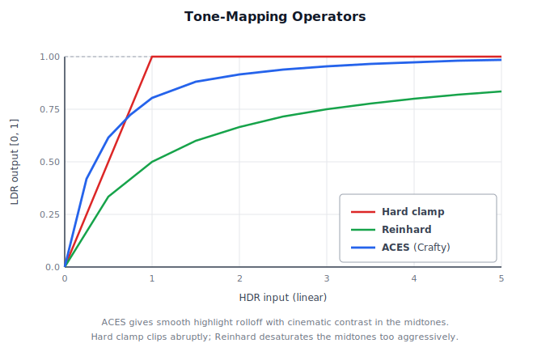
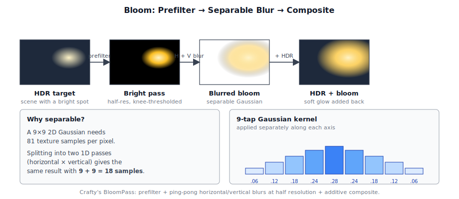
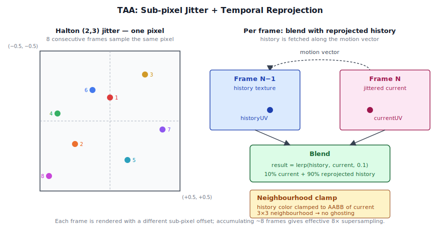
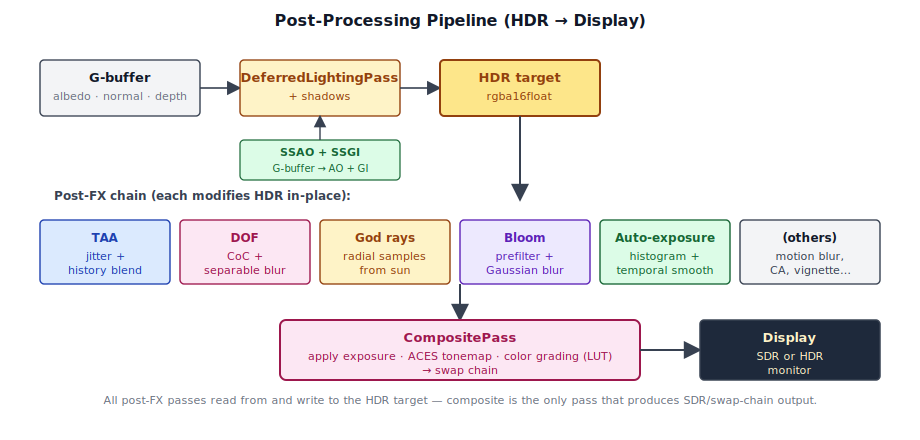

# Chapter 11: Post-Processing

[Contents](../crafty.md) | [10-Terrain](10-terrain.md) | [12-Game Engine](12-game-engine.md)

After the scene is rendered into the HDR target, a series of post-processing passes refines the image. This chapter covers tonemapping, bloom, temporal anti-aliasing, and depth of field.

## 11.1 Tone Mapping and HDR Display

The final step before presentation is **tone mapping** — converting HDR pixel values to the SDR (or HDR) display range. Crafty's `CompositePass` performs this as the last operation before the swap chain.

### ACES Filmic Tone Mapping

Crafty uses the **ACES** (Academy Color Encoding System) filmic tone mapping curve, which provides a natural, cinematic look with good highlight rolloff. Compared to a hard clamp (which clips bright values) or Reinhard (which desaturates the midtones aggressively), ACES holds the midrange and rolls off smoothly:




```wgsl
// ── from composite pass shader ──
fn tonemap(color: vec3f) -> vec3f {
  let a = 2.51;
  let b = 0.03;
  let c = 2.43;
  let d = 0.59;
  let e = 0.14;
  return clamp((color * (a * color + b)) / (color * (c * color + d) + e), 0.0, 1.0);
}
```

This curve maps unlimited HDR input to [0, 1] with smooth saturation at the high end, preventing the hard clipping of simple `clamp()` or Reinhard tone mapping.

### HDR Passthrough

When the swap chain is in HDR mode (`rgba16float` + `display-p3`), the composite pass can skip tonemapping entirely or apply only a small amount of output-referred grading:

```typescript
// ── from src/renderer/render_graph/passes/composite_pass.ts ──
// If swap chain is HDR, write linear HDR values directly
if (ctx.hdr) {
  // Passthrough — the display handles the EOTF
} else {
  // Apply ACES tone map for SDR output
}
```

### Gamma Correction

For SDR output, the tone-mapped value is converted from linear to sRGB gamma space. This is done in the shader just before the final display by applying a gamma curve to the output color:

```typescript
// ── from src/shaders/composite.wgsl ──
return vec4<f32>(pow(max(ldr, vec3<f32>(0.0)), vec3<f32>(1.0 / 2.2)), 1.0);
```

## 11.2 Bloom

Bloom simulates the scattering of bright light in a camera lens, creating a soft glow around bright regions. Crafty's `BloomPass` follows a standard three-step process — extract the bright pixels, blur them, and add the result back:




**1. Prefilter.** Extract bright pixels from the HDR target, applying a knee curve that smoothly transitions from unbloomed to bloomed:

```wgsl
// ── from src/shaders/bloom.wgsl ──
let luminance = dot(hdrColor, vec3f(0.2126, 0.7152, 0.0722));
let knee = max(luminance - threshold, 0.0);
let softKnee = knee / (knee + kneeThreshold);
let brightness = max(softKnee, 0.0);
output = hdrColor * brightness;
```

**2. Separable Gaussian blur.** The prefiltered bright-pass texture is blurred with a two-pass separable Gaussian. Ping-ponging between two half-resolution textures:

```
BrightPass ──► Horizontal Blur ──► Vertical Blur ──► Blurred Bloom
```

The blur kernel is a 9-tap Gaussian:

```wgsl
// ── from src/shaders/bloom.wgsl ──
let weights = [0.061, 0.122, 0.183, 0.204, 0.183, 0.122, 0.061];
// 7-tap separable — extend to 9 or 13 for stronger bloom
```

**3. Composite.** The blurred bloom texture is added to the original HDR image:

```wgsl
// ── from src/shaders/bloom.wgsl ──
hdrColor += bloomColor * bloomIntensity;
```

The bloom intensity and threshold are adjustable parameters exposed through the settings UI.

## 11.3 Temporal Anti-Aliasing (TAA)

The `TAAPass` reduces aliasing by averaging the current frame with previous frames, using sub-pixel jitter to shift the sample pattern each frame. The Halton (2,3) sequence spreads samples evenly within a pixel, so accumulating ~8 frames approximates 8× supersampling:




### updateCamera: jitter and reprojection uniforms

The pass exposes a single per-frame setter that does three things at once:

```typescript
// ── from src/renderer/render_graph/passes/taa_pass.ts ──
updateCamera(ctx: RenderContext): void {
  const camera = ctx.activeCamera;
  if (!camera) {
    throw new Error('TAAPass.updateCamera: ctx.activeCamera is null');
  }
  const hi = (this._frameIndex % this.sampleCount) + 1;
  const jx = (halton(hi, 2) - 0.5) * (2 / ctx.width);
  const jy = (halton(hi, 3) - 0.5) * (2 / ctx.height);
  camera.applyJitter(jx, jy);

  const data = this._scratch;
  data.set(camera.inverseViewProjectionMatrix().data, 0);
  data.set(camera.previousViewProjectionMatrix().data, 16);
  ctx.queue.writeBuffer(this._uniformBuffer, 0, data.buffer as ArrayBuffer);
  this._frameIndex++;
}
```

The Halton-(2, 3) offset is in clip-space units: a ±1/`width` shift in *NDC* moves the projected position by half a pixel in screen space. `camera.applyJitter(jx, jy)` adds that offset into a *separate* matrix on the camera (`_jitteredViewProj`) — the un-jittered `viewProj` and `prevViewProj` are left intact so reprojection, frustum culling, and shadow fitting see the stable camera.

The other two writes pack the TAA uniform buffer: the current frame's inverse view-projection (for reconstructing world position from depth) and the previous frame's view-projection (for re-projecting that world position back into the prior frame's NDC).

### Camera.jitteredViewProj and Camera.prevViewProj

Two matrix accessors on the `Camera` component carry the temporal state TAA needs:

```typescript
// ── from src/engine/components/camera.ts ──
/** Returns the TAA-jittered viewProj if applyJitter ran this frame,
 *  otherwise falls back to the un-jittered viewProjectionMatrix(). */
jitteredViewProjectionMatrix(): Mat4 {
  return this._jitteredViewProj ?? this.viewProjectionMatrix();
}

/** Previous frame's un-jittered view-projection, snapshotted by updateRender.
 *  Falls back to viewProjectionMatrix() on the first frame so reprojection
 *  sees no apparent motion (and no ghosting). */
previousViewProjectionMatrix(): Mat4 {
  return this._prevViewProj ?? this.viewProjectionMatrix();
}
```

The lifecycle is symmetric: every frame the camera's `updateRender()` runs first, which (a) snapshots last frame's `_viewProj` into `_prevViewProj` and (b) clears `_jitteredViewProj` back to null. Then `taaPass.updateCamera(ctx)` calls `camera.applyJitter(jx, jy)` to fill in this frame's jittered matrix. The fall-throughs to the un-jittered `viewProj` make both accessors safe to call regardless of whether TAA ran — geometry passes don't need to special-case it.

Every geometry-fill pass uploads the *jittered* viewProj as part of its camera uniform, so vertices land at sub-pixel-shifted positions in the G-buffer. The geometry pass shows the pattern:

```typescript
// ── from src/renderer/render_graph/passes/geometry_pass.ts ──
data.set(camera.viewMatrix().data, 0);
data.set(camera.projectionMatrix().data, 16);
data.set(camera.jitteredViewProjectionMatrix().data, 32);  // ← jittered
data.set(camera.inverseViewProjectionMatrix().data, 48);
```

`BlockGeometryPass`, `SkinnedGeometryPass`, and `ForwardPass` follow the same pattern. SSGI also pulls `previousViewProjectionMatrix()` for its own reprojection step.

### Ordering: updateCamera before geometry uploads

Because the geometry passes upload `camera.jitteredViewProjectionMatrix()` during *their* `updateCamera()` calls, TAA's `updateCamera()` must run first in the host frame loop:

```typescript
// ── from crafty/main.ts ──
ctx.activeCamera = camera;
// TAA picks the next sub-pixel jitter and applies it to the camera so
// subsequent geometry passes (geometry, block_geometry, skinned, forward)
// pick it up via camera.jitteredViewProjectionMatrix().
passes.taaPass!.updateCamera(ctx);
```

If the order is reversed, the geometry passes see a null `_jitteredViewProj`, fall back to the un-jittered VP, and TAA has nothing to converge — the image accumulates the same un-jittered samples every frame, defeating the algorithm.

When TAA is disabled in a sample or in the deferred factory, this call is simply skipped. Geometry passes still ask for the jittered matrix; the accessor's null-coalesce returns the un-jittered VP, and rendering is correct (just without anti-aliasing).

### Place in the Render Graph

`TAAPass.addToGraph()` declares two sub-passes — a render pass that produces the resolved frame, and a transfer pass that copies the resolved frame into the persistent history texture for next frame:

```typescript
// ── from src/renderer/render_graph/passes/taa_pass.ts ──
const history = graph.importPersistentTexture(TAA_HISTORY_KEY, {
  ...HISTORY_DESC, width: ctx.width, height: ctx.height,
});

// Pass 1: render the resolved frame from {hdr, history, depth}.
graph.addPass('TAAPass.resolve', 'render', (b) => {
  const target = b.createTexture({ /* TAAResolved, rgba16float */ });
  resolved = b.write(target, 'attachment', { loadOp: 'clear', /* ... */ });
  b.read(deps.hdr, 'sampled');
  b.read(history, 'sampled');
  b.read(deps.depth, 'sampled');
  // ... setExecute draws a fullscreen triangle that blends hdr × history.
});

// Pass 2: copy resolved → history for next frame.
graph.addPass('TAAPass.copyHistory', 'transfer', (b) => {
  b.read(resolved, 'copy-src');
  nextHistory = b.write(history, 'copy-dst');
  // ... setExecute calls encoder.copyTextureToTexture(resolved, history).
});

return { resolved, history: nextHistory };
```

Three things to note about how this fits into the graph:

- **The history texture is persistent.** `graph.importPersistentTexture(TAA_HISTORY_KEY, ...)` returns a handle backed by a single physical `GPUTexture` in the `PhysicalResourceCache` keyed by `"taa:history"`. The same physical texture is bound across frames, so what the copy pass writes today is what the resolve pass reads tomorrow. See [§3.3 Persistent and External Resources](03-rendering-architecture.md#persistent-and-external-resources).
- **The copy participates in the dependency graph.** The transfer pass is `type: 'transfer'`, declares the resolved frame as `'copy-src'` and the history handle as `'copy-dst'`, and its execute callback issues a `copyTextureToTexture`. Because the write produces a new handle version, the compile-time culling treats it as a sink — the copy is never dropped even if nothing else in the current frame reads the new history version.
- **SSGI reads last frame's history.** In Crafty's deferred wiring, the SSGI pass imports the same `"taa:history"` key earlier in the frame, before TAA's copy bumps the version. SSGI consumes `v=0` (the previous frame's contents) and TAA produces `v=1` later — the versioning makes the read-old / write-new sequence explicit and prevents the compiler from re-ordering them:

```typescript
// ── from crafty/renderer_setup.ts ──
// 6. SSGI uses last frame's TAA history as previous-radiance source.
// The TAA pass owns the persistent key; we import it here so SSGI reads
// the v=0 (previous frame's) contents before TAA bumps it later this frame.
const taaHistory = graph.importPersistentTexture('taa:history', {
  label: 'TAAHistory', format: 'rgba16float',
  width: ctxArg.width, height: ctxArg.height,
});
ssgi = ssgiPass.addToGraph(graph, { prevRadiance: taaHistory, /* ... */ }).result;
```

### Reprojection

In the resolve shader, each fragment's NDC is multiplied by the current frame's `invViewProj` to reconstruct world position, then by `prevViewProj` to find where that point was in the previous frame. The difference is the motion vector used to sample history:

```wgsl
// ── from src/shaders/taa.wgsl ──
// Sample history using motion vector
let historyUV = currentUV + motionVector;
let historyColor = textureSample(historyTexture, sampler, historyUV);

// Blend with current frame (clamp to neighbourhood to avoid ghosting)
let currentColor = textureSample(currentTexture, sampler, currentUV);
let result = lerp(historyColor, currentColor, 0.1);  // 0.1 = feedback factor
```

The feedback factor (~0.1) means each frame contributes ~10% of the resolved image and the rest comes from accumulated history — convergence takes roughly the Halton sample count (16 frames) for static scenes.

### Neighbourhood Clamping

To prevent ghosting from rapid scene changes, the history sample is clamped to the bounding box (AABB) of the current pixel's neighbourhood:

```wgsl
// ── from src/shaders/taa.wgsl ──
let neighbourhood = [
  textureSample(currentTexture, sampler, currentUV + vec2f( 1, 0) * texelSize),
  textureSample(currentTexture, sampler, currentUV + vec2f(-1, 0) * texelSize),
  textureSample(currentTexture, sampler, currentUV + vec2f( 0, 1) * texelSize),
  textureSample(currentTexture, sampler, currentUV + vec2f( 0,-1) * texelSize),
];
let minColor = min(neighbourhood);
let maxColor = max(neighbourhood);
historyColor = clamp(historyColor, minColor, maxColor);
```

## 11.4 Depth of Field (DOF)

The `DofPass` (`src/renderer/render_graph/passes/dof_pass.ts`) simulates camera lens defocus blur. Objects at a specific focal distance are sharp; objects farther or closer become increasingly blurred. Geometrically, off-focus points project to a disk on the sensor instead of a single point — that disk's diameter is the **circle of confusion**:


### Circle of Confusion

The **circle of confusion** (CoC) is computed per pixel from the depth buffer:

```wgsl
// ── from src/shaders/dof.wgsl ──
let depth = linearizeDepth(textureSample(depthMap, sampler, uv).r);
let coc = abs(depth - focalDepth) * cocScale;
coc = clamp(coc, 0.0, maxCocRadius);
```

A positive CoC means the pixel is behind the focal plane (background). Negative means foreground.

### Separable Blur

The DOF pass renders at half resolution for performance:

1. **CoC prefilter.** Compute CoC and optionally downsample.
2. **Separable blur.** Horizontal then vertical blur using the CoC as a radius. Foreground and background are blurred separately to prevent bleeding.
3. **Composite.** Blend the blurred result with the original sharp image based on CoC magnitude.

The blur uses a Poisson-disk kernel where the number of samples is proportional to the CoC radius, capped at `maxCocRadius` (typically 8-16 texels).

## 11.5 Auto-Exposure

The `AutoExposurePass` (`src/renderer/render_graph/passes/auto_exposure_pass.ts`) computes a scene-adaptive exposure value using compute shaders. It adapts the overall brightness when the scene changes (e.g., walking from indoors to sunlight). The mechanism is a per-frame log-luminance histogram, smoothed temporally so that exposure tracks scene changes without snapping:


### Histogram Computation

A compute shader divides the HDR image into workgroups and each thread computes the luminance of a pixel, incrementing a histogram bucket:

```wgsl
// ── from src/shaders/auto_exposure.wgsl ──
let luminance = dot(hdrColor, vec3f(0.2126, 0.7152, 0.0722));
let bucket = u32(log2(luminance + 0.0001) * HISTOGRAM_SCALE + HISTOGRAM_OFFSET);
atomicAdd(&histogram[bucket], 1u);
```

### Average Luminance

The histogram is read back to compute the average log-luminance, which is then smoothed temporally:

```typescript
// ── from src/renderer/render_graph/passes/auto_exposure_pass.ts ──
let adaptedLuminance = lerp(previousLuminance, currentLuminance,
                            1.0 - exp(-deltaTime * adaptationSpeed));
```

The adapted luminance drives exposure:

```wgsl
// ── from src/shaders/auto_exposure.wgsl ──
let exposure = 1.0 / max(adaptedLuminance, 0.001);
hdrColor *= exposure;
```

This provides a smooth, automatic transition between lighting conditions.

## 11.6 Color Grading

The `CompositePass` optionally applies color grading via a **lookup table (LUT)**. A 3D LUT texture maps input colors to graded output colors, enabling cinematic color grading:

```wgsl
// ── from src/shaders/composite.wgsl ──
let gradedColor = textureSampleLevel(colorGradingLut, lutSampler,
  color * lutScale + lutOffset, 0.0).rgb;
```

When no LUT is active, the composite pass applies a simple contrast, saturation, and vibrance adjustment as a post-tonemapping step.

## 11.7 Underwater Screen-Space Effects

When the camera is submerged, the `CompositePass` applies a series of screen-space effects that simulate the visual experience of being underwater. These are implemented as a single extra code path in the composite fragment shader (`src/shaders/composite.wgsl`).

### UV Distortion

Before sampling the HDR scene, the UV coordinates are perturbed by a pair of animated sine/cosine waves that create a gentle, caustic-like shimmer:

```wgsl
// ── from src/shaders/composite.wgsl ──
if (params.is_underwater > 0.5) {
  let t = params.uw_time;
  let distort = vec2f(
    sin(in.uv.y * 18.0 + t * 1.4) * 0.006,
    cos(in.uv.x * 14.0 + t * 1.1) * 0.004,
  );
  sample_uv = clamp(in.uv + distort, vec2f(0.001), vec2f(0.999));
}
```

The distortion is small (≤0.6% of screen width), anisotropic (horizontal distortion is stronger), and animated over time to simulate moving water ripples above the camera.

### Color Tint and Vignette

After fog is applied, submerged fragments receive a strong blue-green color cast and a vignette that darkens the screen periphery:

```wgsl
// ── from src/shaders/composite.wgsl ──
if (params.is_underwater > 0.5) {
  scene = scene * vec3f(0.20, 0.55, 0.90);
  let d = length(in.uv * 2.0 - 1.0);
  scene *= clamp(1.0 - d * d * 0.55, 0.0, 1.0);
}
```

The tint absorbs red light preferentially (0.20× red vs 0.90× blue), mimicking the wavelength-dependent attenuation of water. The vignette uses a quadratic falloff from the screen center, smoothly reaching 45% darkening at the corners.

The `is_underwater` flag is set per-frame by the game code when the camera position is below the water surface, and `uw_time` provides the animation time for the distortion.

### 11.8 Summary

Post-processing transforms the raw HDR render into the final image. The diagram below shows how the passes chain together — every post-FX stage reads from and writes back to the HDR target until the composite pass produces SDR output for the swap chain:




| Pass | Input | Output | Purpose |
|------|-------|--------|---------|
| TAA | HDR + history + motion | Anti-aliased HDR | Temporal supersampling |
| DOF | HDR + depth | Blurred HDR | Lens defocus simulation |
| Bloom | HDR bright pass | HDR + glow | Lens glare simulation |
| Auto-exposure | HDR → histogram → exposure | Adapts HDR brightness | Automatic exposure |
| Composite | HDR + all of the above | Swap chain output | Tonemapping + grading + underwater |

**Further reading:**
- `src/renderer/render_graph/passes/taa_pass.ts` — Temporal anti-aliasing
- `src/renderer/render_graph/passes/bloom_pass.ts` — HDR bloom
- `src/renderer/render_graph/passes/dof_pass.ts` — Depth of field
- `src/renderer/render_graph/passes/auto_exposure_pass.ts` — Auto-exposure
- `src/renderer/render_graph/passes/composite_pass.ts` — Final composition + tonemap
- `src/shaders/composite.wgsl` — Composite shader

----
[Contents](../crafty.md) | [10-Terrain](10-terrain.md) | [12-Game Engine](12-game-engine.md)
