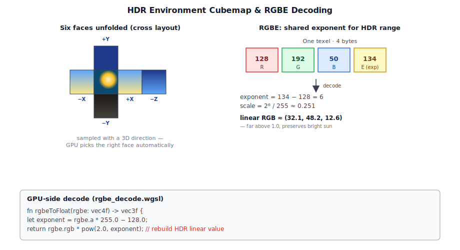
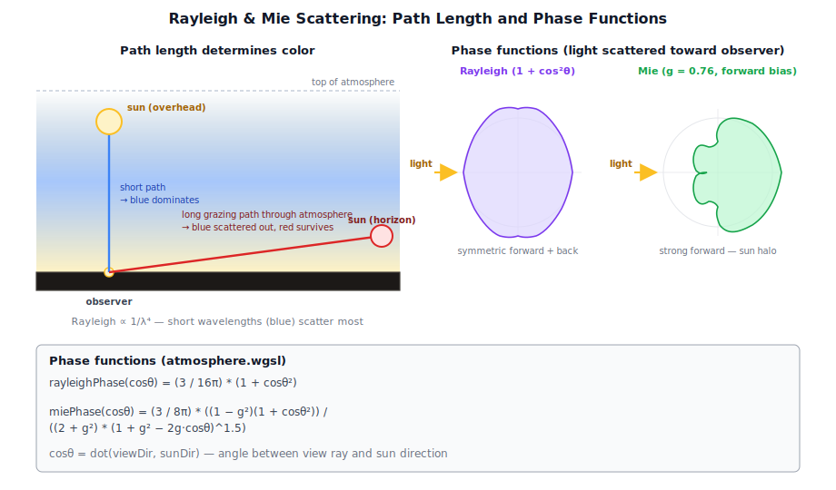
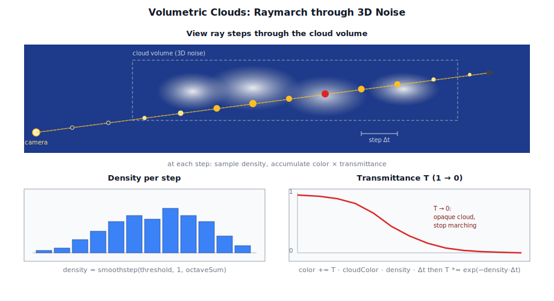

# Chapter 11: Sky and Atmosphere

[Contents](../crafty.md) | [10-Post-Processing](10-post-processing.md) | [12-Terrain](12-terrain.md)

The sky is the largest object in any outdoor scene. Crafty supports multiple sky rendering techniques: HDR environment maps, procedural atmospheric sky, and volumetric clouds.

## 11.1 HDR Environment Maps



The simplest sky is a **fixed HDR cubemap** — a 360° photograph of a real sky, stored in the Radiance HDR format (.hdr). The `SkyTexturePass` renders this cubemap as a fullscreen background:

```wgsl
let skyDir = normalize(camera.viewToWorld * screenRay);
let skyColor = textureSample(skyCubemap, skySampler, skyDir).rgb;
```

HDR maps preserve the full dynamic range of the sky, allowing the sun to be thousands of times brighter than the blue sky — essential for physically-based bloom and eye adaptation.

### RGBE Decoding

Radiance HDR files use RGBE encoding (one shared exponent for three colour channels). Crafty decodes this on the GPU using `src/shaders/rgbe_decode.wgsl`:

```wgsl
fn rgbeToFloat(rgbe: vec4f) -> vec3f {
  let exponent = rgbe.a * 255.0 - 128.0;
  return rgbe.rgb * pow(2.0, exponent);
}
```

## 11.2 Atmospheric Sky



The `AtmospherePass` (`src/renderer/passes/atmosphere_pass.ts`) renders a procedural sky using a simplified atmospheric scattering model. Rayleigh scattering (blue sky at zenith, red at sunset) and Mie scattering (sun halo) are computed per-pixel based on the view direction and sun position.

### Single Scattering Approximation

```wgsl
fn rayleighPhase(cosTheta: f32) -> f32 {
  return (3.0 / (16.0 * PI)) * (1.0 + cosTheta * cosTheta);
}

fn miePhase(cosTheta: f32) -> f32 {
  let g = 0.76;  // Asymmetry factor for Mie
  return (3.0 / (8.0 * PI)) *
    ((1.0 - g * g) * (1.0 + cosTheta * cosTheta)) /
    ((2.0 + g * g) * pow(1.0 + g * g - 2.0 * g * cosTheta, 1.5));
}
```

The atmosphere pass writes directly into the HDR target with a fullscreen draw. It supports a day/night cycle driven by the sun's elevation angle.

## 11.3 Cloud Rendering



The `CloudPass` (`src/renderer/passes/cloud_pass.ts`) renders volumetric clouds using a raymarching technique. Cloud density is sampled from a 3D Perlin noise texture with multiple octaves:

```wgsl
let cloudDensity = 0.0;
for (var i = 0u; i < numOctaves; i++) {
  let samplePos = worldPos * cloudScale * pow(2.0, f32(i)) + windOffset;
  cloudDensity += textureSample(cloudNoise3D, sampler, samplePos).r / f32(i + 1);
}
cloudDensity = smoothstep(cloudThreshold, 1.0, cloudDensity);
```

The raymarch accumulates transmittance and colour along the view ray, producing soft, volumetric cloud shapes with realistic self-shadowing.

## 11.4 Volumetric Fog


Fog is rendered as part of the final `CompositePass`. The fog density is computed from the fragment depth and mixed with the scene colour:

```wgsl
let fogFactor = 1.0 - exp(-fogDensity * fogDensity * viewDepth * viewDepth);
outputColor = mix(sceneColor, fogColor, fogFactor);
```

Height-based fog varies the density with altitude, creating mist in valleys and clear air at higher elevations:

```wgsl
let heightFog = exp(-max(worldPos.y - seaLevel, 0.0) * fogHeightFalloff);
fogDensity *= heightFog;
```

## 11.5 Cloud Shadows


The `CloudShadowPass` renders a top-down cloud shadow map — a 2D texture storing cloud density as seen from above. The lighting pass samples this texture at the surface position to modulate direct sunlight, producing dynamic cloud shadows on the terrain.

**Further reading:**
- `src/renderer/passes/sky_texture_pass.ts` — HDR cubemap sky
- `src/renderer/passes/atmosphere_pass.ts` — Procedural atmospheric sky
- `src/renderer/passes/cloud_pass.ts` — Volumetric clouds
- `src/renderer/passes/cloud_shadow_pass.ts` — Cloud shadow maps
- `src/shaders/sky.wgsl` — Sky shader
- `src/shaders/atmosphere.wgsl` — Atmosphere scattering shader
- `src/shaders/clouds.wgsl` — Cloud raymarching shader

----
[Contents](../crafty.md) | [10-Post-Processing](10-post-processing.md) | [12-Terrain](12-terrain.md)
