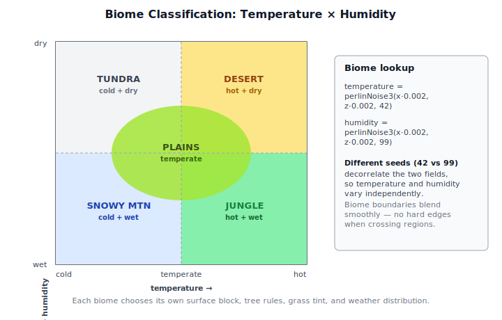
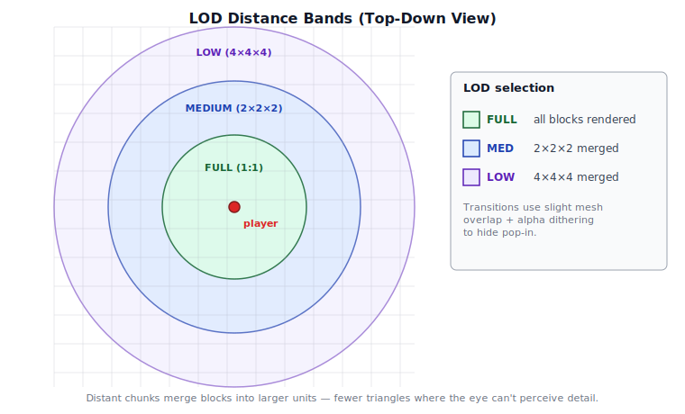
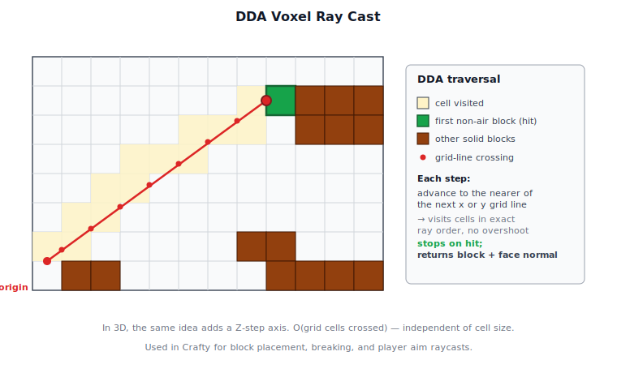
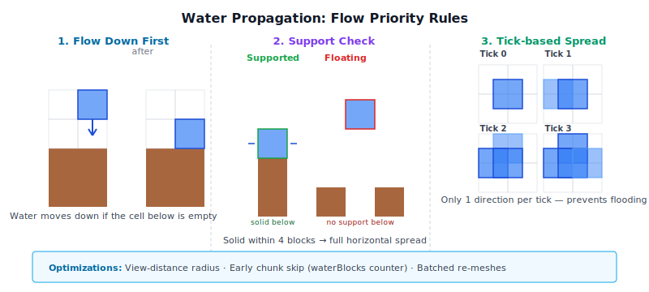
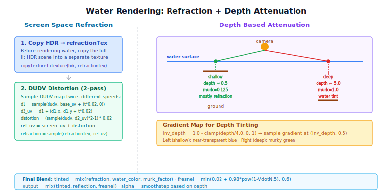
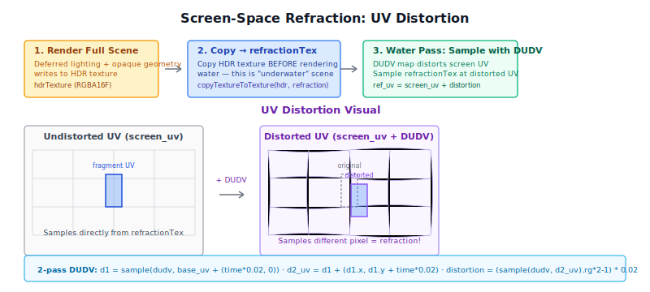
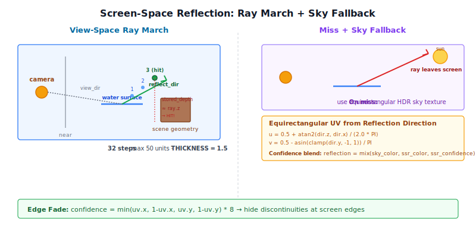
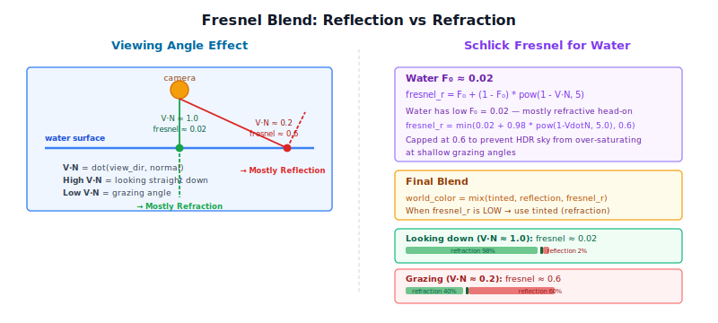
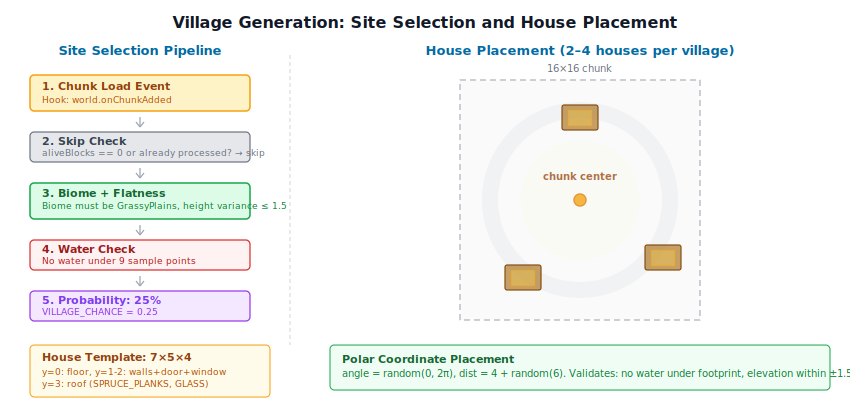

# Chapter 11: Terrain and Voxel World

[Contents](../crafty.md) | [10-Sky / Atmosphere](10-sky-atmosphere.md) | [12-Post-Processing](12-post-processing.md)

The voxel world is what distinguishes Crafty from a generic rendering demo. This chapter covers the data structures, generation, and rendering of a block-based terrain.

## 11.1 Voxel Data Structure

The world is divided into **chunks** — fixed-size 3D arrays of block IDs. Each chunk is a 16×256×16 volume (X, Y, Z):


```typescript
class Chunk {
  readonly cx: number;       // Chunk X index
  readonly cz: number;       // Chunk Z index
  readonly blocks: Uint8Array; // 16 × 256 × 16 = 65,536 blocks

  getBlock(x: number, y: number, z: number): BlockType;
  setBlock(x: number, y: number, z: number, type: BlockType): void;
}
```

Block types are stored as small integers (0 = air, 1 = grass, 2 = dirt, etc.). The `BlockType` enum maps to material and rendering properties: color, texture atlas tile, opacity, hardness, and so on.

## 11.2 Chunk Management

Chunks are loaded and unloaded based on distance from the player. The `World` class maintains a map of loaded chunks:

```typescript
class World {
  private _chunks = new Map<string, Chunk>();

  getChunk(cx: number, cz: number): Chunk | undefined;
  loadChunk(cx: number, cz: number): Promise<Chunk>;
  unloadChunk(cx: number, cz: number): void;
}
```

Chunk coordinates are computed from world position:

```typescript
function worldToChunkCoord(worldX: number, worldZ: number): [number, number] {
  return [Math.floor(worldX / CHUNK_SIZE_X), Math.floor(worldZ / CHUNK_SIZE_Z)];
}
```

### Frustum Culling

Before rendering, each chunk is tested against the camera frustum. Only chunks that intersect the view frustum are submitted to the GPU. This culling is performed on the CPU each frame.

## 11.3 Procedural World Generation

### Noise-Based Terrain

The world uses `perlinFbmNoise3` from `src/math/noise.ts` to generate terrain height:

```typescript
function generateHeight(worldX: number, worldZ: number): number {
  const n = perlinFbmNoise3(
    worldX * 0.01, worldZ * 0.01, 0,
    2.0,    // lacunarity
    0.5,    // gain
    6,      // octaves
  );
  return (n + 1) * 64 + 32;  // Map [-1,1] to [32, 160]
}
```

### Biomes

Biomes are determined by a secondary noise layer that encodes temperature and humidity. Each block of world space gets two independent noise values, and where it lands in temperature × humidity space picks the biome:




```typescript
function getBiome(worldX: number, worldZ: number): Biome {
  const temperature = perlinNoise3(worldX * 0.002, worldZ * 0.002, 42);
  const humidity = perlinNoise3(worldX * 0.002, worldZ * 0.002, 99);
  // Blend between forest, desert, plains, tundra based on temperature/humidity
}
```

Each biome has its own surface block type, tree generation rules, and color palette for the grass overlay.

### Ores and Caves

Underground features are generated using additional noise passes. Caves use a cellular/Perlin threshold that defines underground voids. Ore veins use clustered noise with biome-specific depth distributions.

## 11.4 Greedy Meshing

Rendering each visible block face as two triangles creates millions of quads — far too many for real-time performance. **Greedy meshing** solves this by merging adjacent faces of the same block type into larger quads:


### Algorithm

For each face direction (6 directions), the algorithm:

1. **Mask generation.** For each slice perpendicular to the face direction, generate a 2D binary mask of solid blocks whose neighbour in the face direction is air.
2. **Greedy merge.** Scan the mask and merge contiguous runs into the largest possible rectangle.
3. **Emit quad.** Each merged rectangle becomes a single quad (4 vertices, 6 indices).

This reduces the vertex count by 10-100× compared to naive face-per-block rendering. The result is stored in a chunk's mesh, which is regenerated when blocks in the chunk change.

```typescript
class ChunkMesh {
  vertexBuffer: GPUBuffer;
  indexBuffer: GPUBuffer;
  indexCount: number;
  opaque: boolean;  // Separate meshes for opaque and transparent blocks
}
```

### Separate Opaque and Transparent Meshes

Each chunk produces two meshes: one for opaque blocks (dirt, stone, etc.) and one for transparent/translucent blocks (water, leaves, glass). The opaque mesh writes depth and G-buffer normally. The transparent mesh uses alpha blending in the forward pass.

## 11.5 Level-of-Detail (LOD)

Distant chunks use a simplified mesh to reduce triangle count. LOD levels merge 2×2×2 or 4×4×4 blocks into single blocks, reducing geometric detail where the player cannot perceive it. Concentric distance bands around the player select which LOD each chunk uses:




```typescript
enum LODLevel {
  Full = 0,    // 1:1 resolution
  Medium = 1,  // 2×2×2 merged
  Low = 2,     // 4×4×4 merged
}
```

LOD selection is based on distance from the camera. Transitions between LOD levels use a slight mesh overlap with alpha dithering to hide pop-in.

## 11.6 Block Interaction

### Ray Casting

The player interacts with blocks by aiming at them. A ray is cast from the camera through the crosshair, and the voxel traversal uses a **DDA (digital differential analyzer)** algorithm — at each step it advances to whichever grid line is closer along the ray, visiting cells in exact order:




```typescript
function raycastVoxels(origin: Vec3, direction: Vec3, world: World, maxDist: number): BlockHit | null {
  // DDA traversal through the voxel grid
  // Returns the first non-air block intersected, plus the face normal
}
```

### Block Placement and Breaking

When a block is broken or placed:

1. The block ID is updated in the chunk's `blocks` array.
2. The chunk's mesh is marked dirty and regenerated on the next frame.
3. If the modification is at a chunk boundary, neighbouring chunks are also marked dirty.

Breaking blocks uses a gradual animation — the block shows cracks at progressive stages (mined over ~0.75 seconds for stone, instant for dirt).

## 11.7 Erosion Simulation

Crafty includes an optional erosion simulation for more realistic terrain. A compute shader simulates water flow and sediment transport:

1. **Water deposition.** Rain adds water to heightfield cells.
2. **Flow.** Water moves downhill, carrying sediment.
3. **Erosion and deposition.** Fast-moving water erodes the terrain; slow-moving water deposits sediment.

The simulation runs as a background compute pass and updates the terrain height map, which is sampled during chunk generation.

## 11.8 Water Propagation

When water blocks are placed or generated in the world, they spread according to a simple cellular automaton run on the CPU each tick. The algorithm lives in `World._tickWater()` in `src/block/world.ts`.



### Flow Rules

Water spreads in a fixed priority order:

1. **Flow down first.** Water always attempts to flow downward first before spreading horizontally. If the block below is air or a prop, the water block moves down and the original position becomes air.

2. **Support check.** Horizontal spreading only occurs when the water has "support" — defined as a solid block within 4 blocks vertically below it. Without support, water behaves as "fountain" water and can still spread 1 block horizontally.

3. **Horizontal spread.** If supported, water spreads to adjacent empty cells in the four horizontal directions (N, S, E, W). Only one direction is filled per tick to prevent instant flooding.

```typescript
// In src/block/world.ts
private _flowWater(wx: number, wy: number, wz: number): void {
  const below = this.getBlockType(wx, wy - 1, wz);
  if (below === BlockType.NONE || isBlockProp(below)) {
    this.setBlockType(wx, wy - 1, wz, BlockType.WATER);
    this.setBlockType(wx, wy, wz, BlockType.NONE);
    return;
  }
  // ... then horizontal spreading logic
}
```

### Performance Optimizations

- **Scanning radius.** Only water blocks within a fixed radius around the player are ticked (determined by the view distance). This saves scanning the entire loaded world.
- **Early skip for chunks.** Chunks track their `waterBlocks` count — if zero, the chunk is skipped during scanning.
- **Batched re-meshing.** Instead of regenerating a chunk's mesh every time a single water block changes, changes are accumulated in a `_dirtyChunks` set and re-meshed exactly once per tick.

## 11.9 Water Rendering

Water is a transparent block type rendered through the `WaterPass` (`src/renderer/passes/water_pass.ts`), a forward pass that runs after deferred lighting. It composites over the HDR buffer using `src-alpha` blending, combining screen-space refraction, depth-based murkiness, and screen-space reflections.



### Screen-Space Refraction

Before rendering water, the current HDR scene is copied to a `refractionTex`. During water shading, the scene behind the water is sampled with UV distortion driven by an animated DUDV normal map:



```wgsl
// Animated DUDV distortion — two-pass stacked sampling for complex ripples
let base_uv = vec2<f32>(world_pos.x, world_pos.z) * (1.0 / 8.0);
let d1 = textureSample(dudv_tex, samp, vec2<f32>(base_uv.x + water.time * 0.02, base_uv.y)).rg;
let d2_uv = d1 + vec2<f32>(d1.x, d1.y + water.time * 0.02);
let distortion = (textureSample(dudv_tex, samp, d2_uv).rg * 2.0 - 1.0) * 0.02;

let ref_uv = clamp(screen_uv + distortion, vec2<f32>(0.001), vec2<f32>(0.999));
let refraction = textureSample(refraction_tex, samp, ref_uv).rgb;
```

The DUDV map is sampled twice with different time offsets to create a more complex wave pattern than a single scroll.

### Depth-Based Attenuation

Water opacity and tint are determined by the **water depth** — the distance from the water surface to the solid geometry below, computed by linearizing the G-buffer depth and comparing it to the water fragment's depth:

```wgsl
let water_depth = floor_lin - water_lin;
const MURKY_DEPTH: f32 = 4.0;
let murk_factor = clamp(water_depth / MURKY_DEPTH, 0.0, 1.0);
let inv_depth = clamp(1.0 - murk_factor, 0.1, 0.99);
let water_color = textureSample(gradient_tex, samp, vec2<f32>(inv_depth, 0.5)).rgb;
let tinted = mix(refraction, water_color, murk_factor);
```

A gradient texture (`gradient_tex`) encodes the water color progression: shallow water is nearly transparent (showing the refracted background), while deep water transitions to a murky blue-green tint. Depth also controls alpha: shallow edges fade to transparent, while deep water becomes opaque.

### Screen-Space Reflection + Sky Fallback

Reflections use a hybrid approach:

1. **Screen-space reflection (SSR)** ray-marches the reflected view direction in view space, sampling the refraction texture (pre-water HDR scene).
2. **HDR sky panorama** is used as a fallback for rays that miss scene geometry or leave the screen bounds.

## 11.10 Screen-Space Reflections (SSR)



The SSR implementation in `water.wgsl` uses a view-space ray march with 32 steps:

```wgsl
fn ssr(world_pos: vec3<f32>, normal: vec3<f32>, view_dir: vec3<f32>) -> vec4<f32> {
  let reflect_dir = reflect(-view_dir, normal);
  let ray_vs = normalize((cam.view * vec4<f32>(reflect_dir, 0.0)).xyz);
  let origin_vs = (cam.view * vec4<f32>(world_pos, 1.0)).xyz;

  if (ray_vs.z >= -0.001) { return vec4<f32>(0.0); }  // only trace rays away from camera

  let NUM_STEPS: u32 = 32u;
  let MAX_DIST : f32 = 50.0;
  let THICKNESS: f32 = 1.5;

  for (var s = 0u; s < NUM_STEPS; s++) {
    let t = (f32(s) + 1.0) * MAX_DIST / f32(NUM_STEPS);
    let p = origin_vs + ray_vs * t;
    // project to UV, compare against stored G-buffer depth...
  }
}
```

### Algorithm

1. **Transform to view space.** Both the reflection origin (water surface point) and reflected direction are transformed into view space.
2. **Ray march.** For each of 32 steps along the ray (up to 50 world units), the ray point is projected to screen UV.
3. **Depth test.** The stored G-buffer depth is linearized and compared against the ray point's view-space Z. If they differ by less than `THICKNESS` (1.5 units), it's a hit.
4. **Sky fallback.** On miss, the equirectangular HDR sky texture is sampled using the reflection direction:

```wgsl
fn sky_uv(d: vec3<f32>) -> vec2<f32> {
  let u = 0.5 + atan2(d.z, d.x) / (2.0 * PI);
  let v = 0.5 - asin(clamp(d.y, -1.0, 1.0)) / PI;
  return vec2<f32>(u, v);
}
```

### Confidence Blending

SSR hits are not binary. The function returns `vec4(color, confidence)` where confidence fades:

- **Edge fade:** `min(uv.x, 1-uv.x, uv.y, 1-uv.y) * 8` — rays hitting near screen edges have low confidence, hiding discontinuities.
- **Sky intensity:** The HDR sky reflection is multiplied by `sky_intensity` (0 at night, 1 at noon) to match diurnal lighting.

### Fresnel Blend

The final reflection contribution is controlled by Schlick Fresnel with water's F₀ ≈ 0.02:

```wgsl
let VdotN = clamp(dot(view_dir, normal), 0.0, 1.0);
let fresnel_r = min(0.02 + 0.98 * pow(1.0 - VdotN, 5.0), 0.6);  // capped at 0.6
let world_color = mix(tinted, reflection, fresnel_r);
```



Reflection is minimal when looking straight down (high V·N), rising towards grazing angles. The 0.6 cap prevents bright HDR sky values from washing out the water at shallow viewing angles.

## 11.11 Village Generation

Villages are generated procedurally when chunks load, in `crafty/game/village_gen.ts`. The system hooks into the chunk load event and places clusters of houses under the right conditions.



### Site Selection

Villages only spawn in the `GrassyPlains` biome. When a chunk loads, the generator checks:

1. **Water check.** No water blocks under the candidate chunk (sampled at 9 grid points).
2. **Flatness check.** Terrain height varies by ≤ 1.5 blocks across the chunk.
3. **Probability roll.** 25% chance if all other conditions pass.

```typescript
const VILLAGE_CHANCE = 0.25;

function _isFlatEnough(world: World, baseX: number, baseZ: number, refY: number): boolean {
  for (let dx = 0; dx < CHUNK_SIZE; dx += 4) {
    for (let dz = 0; dz < CHUNK_SIZE; dz += 4) {
      const y = world.getTopBlockY(baseX + dx, baseZ + dz, 200);
      if (y <= 0 || Math.abs(y - refY) > 1.5) return false;
    }
  }
  return true;
}
```

### House Placement

When a village is selected, 2–4 houses are placed in a cluster around the chunk center. Each house position:

- Uses polar coordinates (random angle + random distance 4–10 blocks from center)
- Validates that the house footprint sits on ground (not water)
- Places the house only if the local terrain elevation is within 1.5 blocks of the village reference height

### House Template

Houses are simple 7×5×4 structures defined as layered arrays:

| Layer | Purpose |
|-------|---------|
| y=0 | Solid plank floor |
| y=1–2 | Walls with door opening (front) and glass window (back) |
| y=3 | Flat plank roof |

```typescript
const _WALL_L1: number[][] = [
  [1,1,1,2,1,1,1],  // z=0: back wall, glass at center x=3
  [1,0,0,0,0,0,1],
  [1,0,0,0,0,0,1],
  [1,0,0,0,0,0,1],
  [1,1,1,0,1,1,1],  // z=4: front wall, door opening at x=3
];
```

Currently, all houses use `SPRUCE_PLANKS` for structure and `GLASS` for windows.

**Further reading:**
- `src/block/` — Block types, chunk, world classes
- `src/block/chunk.ts` — Chunk data structure
- `src/block/mesher.ts` — Greedy meshing algorithm
- `src/block/generator.ts` — Terrain generation
- `crafty/game/village_gen.ts` — Village and house placement
- `src/renderer/passes/block_geometry_pass.ts` — Block G-buffer rendering
- `src/renderer/passes/water_pass.ts` — Water surface rendering
- `src/shaders/water.wgsl` — Water shader (SSR, refraction, depth tinting)
- `src/shaders/chunk_geometry.wgsl` — Chunk G-buffer shader

----
[Contents](../crafty.md) | [10-Sky / Atmosphere](10-sky-atmosphere.md) | [12-Post-Processing](12-post-processing.md)
