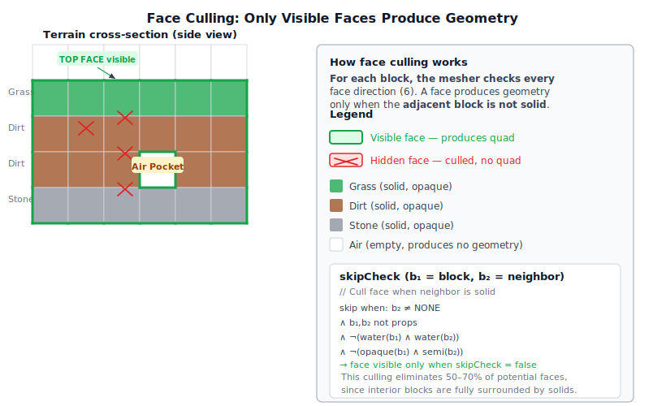
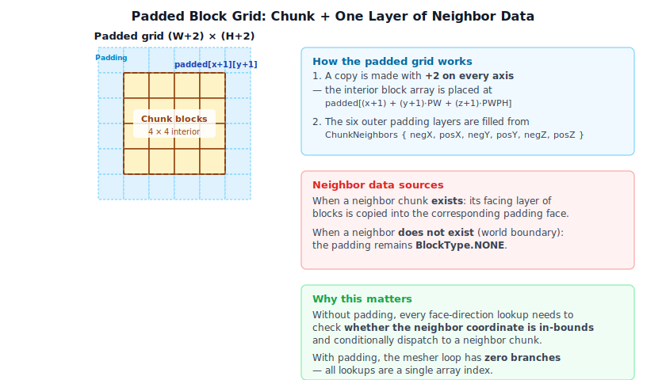

# Chapter 11: Terrain and Voxel World

[Contents](../crafty.md) | [10-Sky / Atmosphere](10-sky-atmosphere.md) | [12-Post-Processing](12-post-processing.md)

The voxel world is what distinguishes Crafty from a generic rendering demo. This chapter covers the data structures, generation, and rendering of a block-based terrain.

## 11.1 Voxel Data Structure

The world is divided into **chunks** — fixed-size 3D arrays of block IDs. Each chunk is a 16×256×16 volume (X, Y, Z):


```typescript
class Chunk {
  readonly cx: number;       // Chunk X index
  readonly cz: number;       // Chunk Z index
  readonly blocks: Uint8Array; // 16 × 256 × 16 = 65,536 blocks

  getBlock(x: number, y: number, z: number): BlockType;
  setBlock(x: number, y: number, z: number, type: BlockType): void;
}
```

Block types are stored as small integers (0 = air, 1 = grass, 2 = dirt, etc.). The `BlockType` enum maps to material and rendering properties: color, texture atlas tile, opacity, hardness, and so on.

## 11.2 Chunk Management

Chunks are loaded and unloaded based on distance from the player. The `World` class maintains a map of loaded chunks:

```typescript
class World {
  private _chunks = new Map<string, Chunk>();

  getChunk(cx: number, cz: number): Chunk | undefined;
  loadChunk(cx: number, cz: number): Promise<Chunk>;
  unloadChunk(cx: number, cz: number): void;
}
```

Chunk coordinates are computed from world position:

```typescript
function worldToChunkCoord(worldX: number, worldZ: number): [number, number] {
  return [Math.floor(worldX / CHUNK_SIZE_X), Math.floor(worldZ / CHUNK_SIZE_Z)];
}
```

### Frustum Culling

Before rendering, each chunk is tested against the camera frustum. Only chunks that intersect the view frustum are submitted to the GPU. This culling is performed on the CPU each frame.

## 11.3 Procedural World Generation

### Noise-Based Terrain

The world uses `perlinFbmNoise3` from `src/math/noise.ts` to generate terrain height:

```typescript
function generateHeight(worldX: number, worldZ: number): number {
  const n = perlinFbmNoise3(
    worldX * 0.01, worldZ * 0.01, 0,
    2.0,    // lacunarity
    0.5,    // gain
    6,      // octaves
  );
  return (n + 1) * 64 + 32;  // Map [-1,1] to [32, 160]
}
```

### Deterministic Seed-Based Randomness

All terrain generation uses `perlinNoise3Seed` — a seeded variant of Perlin noise — rather than the unseeded `perlinFbmNoise3`. Every noise call receives the world seed combined with a unique per-feature offset so that the same world seed always produces identical terrain:

```typescript
// Each terrain feature uses a unique seed offset
const continentalness = perlinNoise3Seed(gx / 2048.0, 10, gz / 2048.0, 0, 0, 0, seed);
const heightMult     = perlinNoise3Seed(gx / 1024.0, 0, gz / 1024.0, 0, 0, 0, seed);
const temperature    = perlinNoise3Seed(gx / 512.0, -5, gz / 512.0, 0, 0, 0, seed + 31337);
```

Internally the seed is hashed into the permutation-table lookup (`seed & 0xFF`), shifting which gradient vectors are chosen at each lattice point. Two noise calls with different seeds sample independently and produce decorrelated values, even at the same spatial coordinate.

**Why seed offsets matter.** If the same `seed` were used for every feature, the continental shelf, the mountain ridges, the biome temperature, and the cave networks would all share the same base pattern — a player would see ridges precisely where caves appear, for example. Each feature is given a large, prime-like offset (`seed + 777`, `seed + 13579`, `seed + 31337`, etc.) so the eight-bit hash lands on different permutation entries and the features are statistically independent:

| Feature | Seed offset | Scale |
|---------|-------------|-------|
| Continental shape | `seed` | 2048 |
| Height multiplier | `seed` | 1024 |
| Temperature | `seed + 31337` | 512 |
| Cheese caves | `seed + 777` | 75 |
| Grand caverns | `seed + 1111` | 200 |
| Spaghetti tunnels | `seed + 13579`, `seed + 24680` | 24 / 14 |
| Underground lakes | `seed + 44444` | 100 |

This approach gives **deterministic worlds**: any player visiting world `seed = 42` sees mountains at the same coordinates, the same cave systems, and the same village locations, regardless of platform or renderer.

### Biomes

Biomes are determined by a secondary noise layer that encodes temperature and humidity. Each block of world space gets two independent noise values, and where it lands in temperature × humidity space picks the biome:


```typescript
function getBiome(worldX: number, worldZ: number): Biome {
  const temperature = perlinNoise3(worldX * 0.002, worldZ * 0.002, 42);
  const humidity = perlinNoise3(worldX * 0.002, worldZ * 0.002, 99);
  // Blend between forest, desert, plains, tundra based on temperature/humidity
}
```

Each biome has its own surface block type, tree generation rules, and color palette for the grass overlay.

### Ores and Caves

Underground features are generated using additional noise passes. Caves use a cellular/Perlin threshold that defines underground voids. Ore veins use clustered noise with biome-specific depth distributions.

## 11.4 Chunk Meshing

Before a chunk can be rendered, its block data must be converted into vertex buffers — a process called **meshing**. Each frame, every visible chunk submits its mesh as instanced draw calls in the block geometry pass. Meshes are regenerated whenever a block in the chunk changes (placement, breaking, water flow).

### Face Culling

The core principle of chunk meshing is to only generate geometry for faces that are actually visible. A block face should produce a quad only when the adjacent block in that direction is **not solid**. "Solid" here means a block whose faces would obstruct the view — opaque blocks are solid, semi-transparent blocks (leaves, glass) are not, and water is handled separately.



The `skipCheck` function in `Chunk.generateVertices` encodes this logic:

```
b1 = current block type
b2 = neighbor block type in the face direction

skip face if:
  b2 is not BlockType.NONE              (something is there)
  AND neither b1 nor b2 is a prop       (props are always rendered as billboards)
  AND (b1 is not water OR b2 is not water)   (water-water faces are hidden)
  AND (b1 is not opaque OR b2 is not semi-transparent) (semi-transparent blocks
       do not hide opaque faces behind them)
```

A face is only emitted when `skipCheck` returns false, meaning the neighbor is either air (`BlockType.NONE`), water adjacent to a non-water block, or a prop. This culling typically eliminates 50–70% of potential faces, since interior blocks are entirely surrounded by other solids.

### The Padded Block Grid

To avoid per-axis boundary checks in the hot mesher loop, the chunk first builds a **(W+2)×(H+2)×(D+2)** padded copy of its block array. The interior (indices `[1..W]×[1..H]×[1..D]`) is a direct copy of the chunk's own blocks. The six outer faces are filled from the `ChunkNeighbors` object, which exposes the raw `Uint8Array` block data of each adjacent chunk:

```
ChunkNeighbors:
  negX, posX — east/west neighbor block arrays
  negY, posY — bottom/top (depth) neighbor block arrays
  negZ, posZ — north/south neighbor block arrays
```



When a neighbor exists, its facing layer of blocks is copied into the padding. When no neighbor exists (chunk at world boundary), the padding remains `BlockType.NONE`, which causes all chunk-edge faces to emit geometry — the correct behavior for open edges.

With this padded grid, the mesher always reads `getType(x, y, z)` via a single array index `padded[(x+1) + (y+1)*PW + (z+1)*PWPH]` with no conditional logic for chunk boundaries.

### Vertex Layout

Each vertex is encoded as five float32 values packed into a single interleaved buffer:

| Component | Description |
|-----------|-------------|
| `x, y, z` | World-space position of the vertex (after greedy merge scaling) |
| `face` | Face normal index: 0=back(-Z), 1=front(+Z), 2=left(-X), 3=right(+X), 4=bottom(-Y), 5=top(+Y), 6=billboard |
| `blockType` | Numeric block type ID, used by the fragment shader to look up texture atlas tiles |

Texture coordinates are **not stored per vertex**. Instead, the fragment shader computes UVs from the world position and face normal using the `atlas_uv` function in `chunk_geometry.wgsl`:

```wgsl
fn atlas_uv(world_pos: vec3<f32>, face: u32, block_type: u32) -> vec2<f32> {
  let bd = block_data[block_type];
  // Select tile based on face: bottomTile (face 4), topTile (face 5), sideTile (others)
  var tile: u32;
  if face == 4u      { tile = bd.bottomTile; }
  else if face == 5u { tile = bd.topTile; }
  else               { tile = bd.sideTile; }

  // Compute local UV from fractional world position, mapping the face axis
  var local_uv: vec2<f32>;
  if face == 2u || face == 3u {           // left/right: ZY plane
    local_uv = fract(world_pos.zy);
  } else if face == 4u || face == 5u {   // bottom/top: XZ plane
    local_uv = fract(world_pos.xz);
  } else {                                // back/front: XY plane
    local_uv = fract(world_pos.xy);
  }

  // Offset into the texture atlas by the block's tile indices
  let tileX = f32(tile % ATLAS_COLS);
  let tileY = f32(tile / ATLAS_COLS);
  return (vec2<f32>(tileX, tileY) + local_uv) * vec2<f32>(INV_COLS, INV_ROWS);
}
```

Each block type specifies three atlas tiles (`topTile`, `sideTile`, `bottomTile`) so that a grass block, for example, shows grass on top, dirt on the bottom, and a grass-dirt blend on the sides. The face index selects which tile to use. The local UV is derived from `fract(world_pos)` of the two axes that lie in the face plane, giving a continuous 0–1 tiling along each block face.

### Mesh Categories

Blocks are classified into four material categories, each producing a separate vertex buffer:

| Category | Block types | Rendering | Vertex count |
|----------|-------------|-----------|-------------|
| **Opaque** | Dirt, stone, sand, planks, etc. | G-buffer (deferred) | 36 per non-culled face, merged into greedy quads |
| **Semi-transparent** | Leaves, glass | G-buffer (deferred) with alpha test | Same as opaque |
| **Water** | Water | Forward pass with refraction/SSR | 3 floats per vertex, 6 verts per face, no greedy merge |
| **Prop** | Flowers, torches, dead bushes | Forward billboard | 6 verts per block at center position, expanded in vertex shader |

**Opaque and semi-transparent** meshes use the same vertex layout (5 floats, greedy-merged quads) and are rendered together in the block geometry pass. The fragment shader discards fragments where the texture alpha is below 0.5, which handles leaf and glass edges naturally.

**Water** is meshed as individual non-merged quads using a simpler 3-float layout (position only). The water surface always emits a top face, plus any side faces that are not adjacent to another water block. At chunk edges, water sides are only suppressed when the neighbor chunk is truly absent (not loaded), not merely when the neighbor has air — this prevents visual gaps at chunk boundaries.

**Props** are single-point billboards: each prop emits 6 vertices all at the block center position `(x+0.5, y+0.5, z+0.5)` with face index `6`. The vertex shader expands these into camera-facing quads using the `billboard_offset` function, which maps the vertex index modulo 6 to a corner offset scaled by the camera right/up vectors.

### Greedy Merge

The mesher does not emit one quad per block face. Instead it scans each axis plane and merges adjacent faces of the same block type into the largest possible rectangle (the full algorithm is described in [11.5 Greedy Meshing](#115-greedy-meshing)). The merge is tracked with a `drawnFaces` bitfield (`uint16` per `(x, y, face)` combination, with the z bit marking faces that have already been claimed by a larger quad). This merge step is what makes chunk rendering viable — a flat terrain chunk may have only a few hundred quads instead of tens of thousands.

## 11.5 Greedy Meshing

Rendering each visible block face as two triangles creates millions of quads — far too many for real-time performance. **Greedy meshing** solves this by merging adjacent faces of the same block type into larger quads:


### Algorithm

For each face direction (6 directions), the algorithm:

1. **Mask generation.** For each slice perpendicular to the face direction, generate a 2D binary mask of solid blocks whose neighbor in the face direction is air.
2. **Greedy merge.** Scan the mask and merge contiguous runs into the largest possible rectangle.
3. **Emit quad.** Each merged rectangle becomes a single quad (4 vertices, 6 indices).

This reduces the vertex count by 10-100× compared to naive face-per-block rendering. The result is stored in a chunk's mesh, which is regenerated when blocks in the chunk change.

```typescript
class ChunkMesh {
  vertexBuffer: GPUBuffer;
  indexBuffer: GPUBuffer;
  indexCount: number;
  opaque: boolean;  // Separate meshes for opaque and transparent blocks
}
```

### Separate Opaque and Transparent Meshes

Each chunk produces two meshes: one for opaque blocks (dirt, stone, etc.) and one for transparent/translucent blocks (water, leaves, glass). The opaque mesh writes depth and G-buffer normally. The transparent mesh uses alpha blending in the forward pass.

## 11.6 Level-of-Detail (LOD)

Distant chunks use a simplified mesh to reduce triangle count. LOD levels merge 2×2×2 or 4×4×4 blocks into single blocks, reducing geometric detail where the player cannot perceive it. Concentric distance bands around the player select which LOD each chunk uses:


```typescript
enum LODLevel {
  Full = 0,    // 1:1 resolution
  Medium = 1,  // 2×2×2 merged
  Low = 2,     // 4×4×4 merged
}
```

LOD selection is based on distance from the camera. Transitions between LOD levels use a slight mesh overlap with alpha dithering to hide pop-in.

## 11.7 Block Interaction

### Ray Casting

The player interacts with blocks by aiming at them. A ray is cast from the camera through the crosshair, and the voxel traversal uses a **DDA (digital differential analyzer)** algorithm — at each step it advances to whichever grid line is closer along the ray, visiting cells in exact order:


```typescript
function raycastVoxels(origin: Vec3, direction: Vec3, world: World, maxDist: number): BlockHit | null {
  // DDA traversal through the voxel grid
  // Returns the first non-air block intersected, plus the face normal
}
```

### Block Placement

Right-clicking a block face places a new block adjacent to the targeted face. Placement is instantaneous — the block ID is written to the chunk's `blocks` array and the chunk mesh is marked dirty for regeneration. The `BlockInteractionState` fires an `onLocalEdit` callback with `{ kind: 'place', x, y, z, blockType }`.

### Instant Breaks

Blocks with `hardness = 0` (props: flowers, torches, dead bushes; also water and air) are removed immediately with no crack animation. The `BlockInteractionState` detects hardness 0 and calls `completeBreak()` directly without entering the progressive mining loop.

### Chunk Dirtying

Both placement and breaking follow the same re-meshing pattern:

1. The block ID is updated in the chunk's `blocks` array via `chunk.setBlock()`.
2. The chunk is marked for re-mesh via `world._updateChunk()`.
3. If the modified block lies at a chunk boundary (within 1 block of the edge), neighboring chunks are also marked dirty, since their face-culling depends on this chunk's blocks.
4. Re-meshing is deferred: changes are accumulated in a `_dirtyChunks` set and processed once per frame.

On the server side (`server/src/world_state.ts`), edits are validated (integer coords, deduplicated against prior edits at the same cell) and broadcast to all clients as `{ t: 'block_edit', edit }` messages.

### Block Breaking Progression

When the player holds left-click on a block within reach, the break timer advances each frame. The `BlockInteractionState` in `crafty/game/block_interaction.ts` tracks:

```typescript
interface BlockInteractionState {
  targetBlock: Vec3 | null;
  breakProgress: number;        // accumulated ms spent mining this block
  breakingBlock: Vec3 | null;   // world position of the block being broken
  breakTime: number;            // total ms required (hardness × 1500)
  crackStage: number;           // -1 = none, 0-9 = current crack overlay stage
  onBlockBroken: (x: number, y: number, z: number, blockType: BlockType) => void;
  onBlockChip: (x: number, y: number, z: number, blockType: BlockType) => void;
}
```

#### Break Time

The total time to break a block is determined from its hardness value in `blockHardness[]` (`src/block/block_type.ts`):

```typescript
function getBreakTime(blockType: BlockType): number {
  return blockHardness[blockType] * 1500;  // ms
}
```

A hardness of 0 means the block breaks instantly (no crack animation). Examples:

| Block | Hardness | Break Time |
|-------|----------|------------|
| Dirt, Sand | 0.5 | 750 ms |
| Grass | 0.6 | 900 ms |
| Stone, Amethyst | 1.5 | 2250 ms |
| Trunk, Planks | 2.0 | 3000 ms |
| Diamond, Iron ore | 3.0 | 4500 ms |
| Obsidian | 10.0 | 15000 ms |

#### Per-Frame Accumulation

Each frame, `updateBlockInteraction()` in `crafty/game/block_interaction.ts:233` accumulates breaking time:

```typescript
// Called every frame with dt in seconds
this.breakProgress += dt * 1000;
```

The current crack stage is computed from progress:

```typescript
const newStage = Math.floor(this.breakProgress / this.breakTime * 10);
if (newStage !== this.crackStage && newStage < 10) {
  this.crackStage = newStage;
  this.onBlockChip(x, y, z, blockType);  // emit chip particles
}
if (this.breakProgress >= this.breakTime) {
  this.completeBreak();  // remove block, emit break particles + sound
}
```

When the player releases the mouse button or looks away from the block, all break state resets to zero — progress is not preserved between attempts.

#### Crack Overlay Rendering

The `BlockHighlightPass` (`src/renderer/passes/block_highlight_pass.ts`) renders a crack overlay on the targeted block face. The crack atlas occupies the rightmost column of the block texture atlas: 9 crack stages stacked vertically, mapped by `crackStage (0-9)`. The WGSL shader in `block_highlight.wgsl` samples this tile and composites a dark overlay with luminance-based alpha:

```wgsl
// Crack alpha from luminance of the crack tile sample
let crack_luma = dot(crack_sample.rgb, vec3<f32>(0.299, 0.587, 0.114));
let crack_alpha = smoothstep(0.3, 0.7, crack_luma);
let final_alpha = min(0.35 + crack_alpha * 0.5, 0.9);
```

The final fragment combines a base dark overlay (0.35 alpha) with the crack texture, capped at 0.9 alpha. This is drawn as 36 face vertices and 144 edge wireframe vertices around the targeted block.

### Particle Emission

Block breaking produces two kinds of particles, both emitted through a dedicated GPU particle pass (`ParticlePass` with `blockBreakConfig`):

#### Chip Particles on Crack Stage Advance

Each time the crack stage advances (every 10% of break time), a burst of **4 particles** is emitted from the block center:

```typescript
blockInteraction.onBlockChip = (x, y, z, blockType) => {
  const [r, g, b] = getBlockColor(blockType);
  passes.blockBreakPass?.burst(
    { x: x + 0.5, y: y + 0.5, z: z + 0.5 },
    [r, g, b, 1],
    4
  );
};
```

The block color is extracted at startup by `loadBlockColors()` (`crafty/game/block_colors.ts`), which samples each block type's top-face tile from the texture atlas and averages it into an sRGB-to-linear converted `[r, g, b]` triplet.

#### Break Particles on Destruction

When the block is fully broken, a larger burst of **14 particles** is emitted from the same position, following the same color-tinting scheme.

#### Particle Configuration

Both bursts use the `blockBreakConfig` in `crafty/config/particle_configs.ts`:

```typescript
export const blockBreakConfig: ParticleGraphConfig = {
  emitter: {
    maxParticles: 1024,
    spawnRate: 0,          // bursts only — no continuous emission
    lifetime: [0.5, 1.0],
    shape: { kind: 'sphere', radius: 0.15, solidAngle: Math.PI },
    initialSpeed: [2.0, 4.5],
    initialColor: [1, 1, 1, 1],  // overridden per burst by the block's tint
    initialSize: [0.025, 0.05],
    roughness: 0.9, metallic: 0.0,
  },
  modifiers: [
    { type: 'gravity', strength: 14.0 },
    { type: 'drag', coefficient: 0.6 },
  ],
  renderer: { type: 'sprites', blendMode: 'alpha', billboard: 'camera', shape: 'pixel', renderTarget: 'hdr' },
};
```

Key properties:
- **Spawn shape:** A hemisphere (solidAngle: π) of radius 0.15 blocks, centered on the block position — particles scatter outward from the block face.
- **Initial speed:** Random between 2.0 and 4.5 blocks/second, giving a snappy ejection.
- **Lifetime:** Random between 0.5 and 1.0 seconds, after which the particle fades.
- **Gravity:** 14.0 blocks/s² pulls particles downward, creating an arc.
- **Drag:** 0.6 coefficient decelerates particles for a natural settling look.
- **Render shape:** `'pixel'` — each particle is a small square sprite, always camera-facing via `billboard: 'camera'`.
- **Color:** The config's `initialColor` is overridden per burst call. The block's linear-RGB average color from the atlas is passed as the tint, so dirt particles are brown, stone particles are gray, grass particles are green, etc.

The `ParticlePass` (`src/renderer/passes/particle_pass.ts`) simulates particles entirely on the GPU via compute shaders generated by `ParticleBuilder` (`src/particles/particle_builder.ts`). The `burst()` method queues a one-shot spawn that replaces any prior pending burst:

```typescript
burst(position: Vec3, color: [number, number, number, number], count: number): void {
  this._pendingBurst = { position, color, count };
}
```

On the next GPU dispatch, these particles are emitted into the simulation buffer and rendered as billboard sprites into the HDR render target, composite over the scene.

### Audio

Block breaking and placement trigger spatial audio via the `AudioManager` (`crafty/game/audio_manager.ts`).

#### Surface-to-Sound Mapping

Each block type maps to a `SurfaceGroup` via `blockTypeToSurface()` (`src/engine/audio_surface.ts`):

| Surface Group | Block Types |
|---------------|-------------|
| `grass` | GRASS, DIRT, TREELEAVES, SNOW, GRASS_SNOW, GRASS_PROP, SNOWYLEAVES |
| `sand` | SAND |
| `wood` | TRUNK, SPRUCE_PLANKS |
| `stone` | STONE, GLASS, GLOWSTONE, MAGMA, OBSIDIAN, DIAMOND, IRON, SPECULAR, CACTUS, AMETHYST |

#### Dig Sound Playback

When a block is fully broken, the `onBlockBroken` callback fires:

```typescript
blockInteraction.onBlockBroken = (x, y, z, blockType) => {
  const [r, g, b] = getBlockColor(blockType);
  passes.blockBreakPass?.burst(/* ... */, 14);     // break particles
  const surface = blockTypeToSurface(blockType);
  audio.playDig(surface, new Vec3(x + 0.5, y + 0.5, z + 0.5));  // dig sound
};
```

`playDig()` selects a random audio buffer from the matching surface group's pre-loaded pool (`assets/sounds/player/dig/`) — each surface has 4 `.wav` variants for variety — and plays it as a spatial one-shot:

```typescript
playDig(surface: SurfaceGroup, pos: Vec3): void {
  const list = this._digBuffers.get(surface);
  const buf = list[Math.floor(Math.random() * list.length)];
  this.playBufferAt(buf, pos, 0.8);
}
```

#### Spatial Audio Pipeline

`playBufferAt()` creates a `OneShot` instance with Web Audio API nodes:

1. **AudioBufferSourceNode** — plays the sound buffer once.
2. **PannerNode** — HRTF-based 3D panning with inverse distance model:
   - `maxDistance`: 50 blocks
   - `refDistance`: 5 blocks  
   - `rolloffFactor`: 1.0
3. **GainNode** — final volume = `volume × sfxVolume × masterVolume` (0.8 × 0.7 × 0.5 = 0.28 by default).

The listener position and orientation are updated each frame from the camera transform via `updateListener()` in `AudioManager`. Finished one-shots are automatically pruned.

#### Audio Asset Inventory

| Category | Files | Purpose |
|----------|-------|---------|
| `dig/grass1-4.wav` | 4 | Breaking grass, dirt, leaves |
| `dig/sand1-4.wav` | 4 | Breaking sand |
| `dig/stone1-4.wav` | 4 | Breaking stone, ores, glass |
| `dig/wood1-4.wav` | 4 | Breaking wood trunks, planks |

#### Audio Initialization

The Web Audio `AudioContext` is created lazily on the first user gesture (click/touch) in `crafty/main.ts:189` to comply with browser autoplay policies. Sound buffers are loaded asynchronously and cached in `AudioManager._digBuffers`, `_stepBuffers`, and `_fallBuffers` maps.

## 11.8 Erosion Simulation

Crafty includes an optional erosion simulation for more realistic terrain. A compute shader simulates water flow and sediment transport:

1. **Water deposition.** Rain adds water to heightfield cells.
2. **Flow.** Water moves downhill, carrying sediment.
3. **Erosion and deposition.** Fast-moving water erodes the terrain; slow-moving water deposits sediment.

The simulation runs as a background compute pass and updates the terrain height map, which is sampled during chunk generation.

## 11.9 Water Propagation

When water blocks are placed or generated in the world, they spread according to a simple cellular automaton run on the CPU each tick. The algorithm lives in `World._tickWater()` in `src/block/world.ts`.


### Flow Rules

Water spreads in a fixed priority order:

1. **Flow down first.** Water always attempts to flow downward first before spreading horizontally. If the block below is air or a prop, the water block moves down and the original position becomes air.

2. **Support check.** Horizontal spreading only occurs when the water has "support" — defined as a solid block within 4 blocks vertically below it. Without support, water behaves as "fountain" water and can still spread 1 block horizontally.

3. **Horizontal spread.** If supported, water spreads to adjacent empty cells in the four horizontal directions (N, S, E, W). Only one direction is filled per tick to prevent instant flooding.

```typescript
// In src/block/world.ts
private _flowWater(wx: number, wy: number, wz: number): void {
  const below = this.getBlockType(wx, wy - 1, wz);
  if (below === BlockType.NONE || isBlockProp(below)) {
    this.setBlockType(wx, wy - 1, wz, BlockType.WATER);
    this.setBlockType(wx, wy, wz, BlockType.NONE);
    return;
  }
  // ... then horizontal spreading logic
}
```

### Performance Optimizations

- **Scanning radius.** Only water blocks within a fixed radius around the player are ticked (determined by the view distance). This saves scanning the entire loaded world.
- **Early skip for chunks.** Chunks track their `waterBlocks` count — if zero, the chunk is skipped during scanning.
- **Batched re-meshing.** Instead of regenerating a chunk's mesh every time a single water block changes, changes are accumulated in a `_dirtyChunks` set and re-meshed exactly once per tick.

## 11.10 Water Rendering

Water is a transparent block type rendered through the `WaterPass` (`src/renderer/passes/water_pass.ts`), a forward pass that runs after deferred lighting. It composites over the HDR buffer using `src-alpha` blending, combining screen-space refraction, depth-based murkiness, and screen-space reflections.


### Screen-Space Refraction

Before rendering water, the current HDR scene is copied to a `refractionTex`. During water shading, the scene behind the water is sampled with UV distortion driven by an animated DUDV normal map:


```wgsl
// Animated DUDV distortion — two-pass stacked sampling for complex ripples
let base_uv = vec2<f32>(world_pos.x, world_pos.z) * (1.0 / 8.0);
let d1 = textureSample(dudv_tex, samp, vec2<f32>(base_uv.x + water.time * 0.02, base_uv.y)).rg;
let d2_uv = d1 + vec2<f32>(d1.x, d1.y + water.time * 0.02);
let distortion = (textureSample(dudv_tex, samp, d2_uv).rg * 2.0 - 1.0) * 0.02;

let ref_uv = clamp(screen_uv + distortion, vec2<f32>(0.001), vec2<f32>(0.999));
let refraction = textureSample(refraction_tex, samp, ref_uv).rgb;
```

The DUDV map is sampled twice with different time offsets to create a more complex wave pattern than a single scroll.

### Depth-Based Attenuation

Water opacity and tint are determined by the **water depth** — the distance from the water surface to the solid geometry below, computed by linearizing the G-buffer depth and comparing it to the water fragment's depth:

```wgsl
let water_depth = floor_lin - water_lin;
const MURKY_DEPTH: f32 = 4.0;
let murk_factor = clamp(water_depth / MURKY_DEPTH, 0.0, 1.0);
let inv_depth = clamp(1.0 - murk_factor, 0.1, 0.99);
let water_color = textureSample(gradient_tex, samp, vec2<f32>(inv_depth, 0.5)).rgb;
let tinted = mix(refraction, water_color, murk_factor);
```

A gradient texture (`gradient_tex`) encodes the water color progression: shallow water is nearly transparent (showing the refracted background), while deep water transitions to a murky blue-green tint. Depth also controls alpha: shallow edges fade to transparent, while deep water becomes opaque.

### Screen-Space Reflection + Sky Fallback

Reflections use a hybrid approach:

1. **Screen-space reflection (SSR)** ray-marches the reflected view direction in view space, sampling the refraction texture (pre-water HDR scene).
2. **HDR sky panorama** is used as a fallback for rays that miss scene geometry or leave the screen bounds.

## 11.11 Screen-Space Reflections (SSR)


The SSR implementation in `water.wgsl` uses a view-space ray march with 32 steps:

```wgsl
fn ssr(world_pos: vec3<f32>, normal: vec3<f32>, view_dir: vec3<f32>) -> vec4<f32> {
  let reflect_dir = reflect(-view_dir, normal);
  let ray_vs = normalize((cam.view * vec4<f32>(reflect_dir, 0.0)).xyz);
  let origin_vs = (cam.view * vec4<f32>(world_pos, 1.0)).xyz;

  if (ray_vs.z >= -0.001) { return vec4<f32>(0.0); }  // only trace rays away from camera

  let NUM_STEPS: u32 = 32u;
  let MAX_DIST : f32 = 50.0;
  let THICKNESS: f32 = 1.5;

  for (var s = 0u; s < NUM_STEPS; s++) {
    let t = (f32(s) + 1.0) * MAX_DIST / f32(NUM_STEPS);
    let p = origin_vs + ray_vs * t;
    // project to UV, compare against stored G-buffer depth...
  }
}
```

### Algorithm

1. **Transform to view space.** Both the reflection origin (water surface point) and reflected direction are transformed into view space.
2. **Ray march.** For each of 32 steps along the ray (up to 50 world units), the ray point is projected to screen UV.
3. **Depth test.** The stored G-buffer depth is linearized and compared against the ray point's view-space Z. If they differ by less than `THICKNESS` (1.5 units), it's a hit.
4. **Sky fallback.** On miss, the equirectangular HDR sky texture is sampled using the reflection direction:

```wgsl
fn sky_uv(d: vec3<f32>) -> vec2<f32> {
  let u = 0.5 + atan2(d.z, d.x) / (2.0 * PI);
  let v = 0.5 - asin(clamp(d.y, -1.0, 1.0)) / PI;
  return vec2<f32>(u, v);
}
```

### Confidence Blending

SSR hits are not binary. The function returns `vec4(color, confidence)` where confidence fades:

- **Edge fade:** `min(uv.x, 1-uv.x, uv.y, 1-uv.y) * 8` — rays hitting near screen edges have low confidence, hiding discontinuities.
- **Sky intensity:** The HDR sky reflection is multiplied by `sky_intensity` (0 at night, 1 at noon) to match diurnal lighting.

### Fresnel Blend

The final reflection contribution is controlled by Schlick Fresnel with water's F₀ ≈ 0.02:

```wgsl
let VdotN = clamp(dot(view_dir, normal), 0.0, 1.0);
let fresnel_r = min(0.02 + 0.98 * pow(1.0 - VdotN, 5.0), 0.6);  // capped at 0.6
let world_color = mix(tinted, reflection, fresnel_r);
```


Reflection is minimal when looking straight down (high V·N), rising towards grazing angles. The 0.6 cap prevents bright HDR sky values from washing out the water at shallow viewing angles.

## 11.12 Village Generation

Villages are generated procedurally when chunks load, in `crafty/game/village_gen.ts`. The system hooks into the chunk load event and places clusters of houses under the right conditions.


### Site Selection

Villages only spawn in the `GrassyPlains` biome. When a chunk loads, the generator checks:

1. **Water check.** No water blocks under the candidate chunk (sampled at 9 grid points).
2. **Flatness check.** Terrain height varies by ≤ 1.5 blocks across the chunk.
3. **Probability roll.** 25% chance if all other conditions pass.

```typescript
const VILLAGE_CHANCE = 0.25;

function _isFlatEnough(world: World, baseX: number, baseZ: number, refY: number): boolean {
  for (let dx = 0; dx < CHUNK_SIZE; dx += 4) {
    for (let dz = 0; dz < CHUNK_SIZE; dz += 4) {
      const y = world.getTopBlockY(baseX + dx, baseZ + dz, 200);
      if (y <= 0 || Math.abs(y - refY) > 1.5) return false;
    }
  }
  return true;
}
```

### House Placement

When a village is selected, 2–4 houses are placed in a cluster around the chunk center. Each candidate position uses polar coordinates (random angle + random distance 4–10 blocks from center) and must pass three checks:

1. **Overlap avoidance.** House footprints are 7×5 blocks. Before placing, the new house is tested against all already-placed houses using an AABB collision check with 1-block padding. If it overlaps, it is skipped.
2. **Footprint flatness.** All 35 columns of the 7×5 area must have ground height within ±1.5 blocks of the village reference height. This prevents houses from overhanging terrain edges.
3. **No water.** Scans a 5×5 grid of sample points one block below the house for water blocks.

```typescript
const placed: { x: number; z: number }[] = [];
for (const p of placed) {
  if (hx < p.x + 8 && hx + 7 > p.x && hz < p.z + 6 && hz + 5 > p.z) {
    // overlap — skip
  }
}

function _isHouseFootprintFlat(world: World, hx: number, hz: number, refY: number, tolerance: number): boolean {
  for (let dx = 0; dx < 7; dx++) {
    for (let dz = 0; dz < 5; dz++) {
      const y = world.getTopBlockY(hx + dx, hz + dz, 200);
      if (y <= 0 || Math.abs(y - refY) > tolerance) return false;
    }
  }
  return true;
}
```

### House Template

Houses are simple 7×5×4 structures defined as layered arrays:

| Layer | Purpose |
|-------|---------|
| y=0 | Solid plank floor |
| y=1–2 | Walls with door opening (front) and glass window (back) |
| y=3 | Flat plank roof |

```typescript
const _WALL_L1: number[][] = [
  [1,1,1,2,1,1,1],  // z=0: back wall, glass at center x=3
  [1,0,0,0,0,0,1],
  [1,0,0,0,0,0,1],
  [1,0,0,0,0,0,1],
  [1,1,1,0,1,1,1],  // z=4: front wall, door opening at x=3
];
```

Currently, all houses use `SPRUCE_PLANKS` for structure and `GLASS` for windows.

### 11.13 Summary

The voxel terrain system features:

- **Chunked world**: 16×256×16 chunks stored as dense `Uint8Array` with load/unload by distance
- **Procedural generation**: Noise-based height maps, biome selection from temperature/humidity, ore and cave placement
- **Greedy meshing**: Mask-based quad merging for minimal triangle counts
- **LOD system**: Three distance-based levels of detail
- **Block interaction**: DDA ray casting for placement, progressive breaking with crack overlay (10 stages), hardness-based timers
- **Break particles**: GPU-accelerated chip bursts on crack advance and break particles tinted to block color
- **Break audio**: Spatial audio with HRTF panning, surface-group sound mapping (grass, sand, stone, wood)
- **Erosion simulation**: Water flow and sediment transport via compute shader
- **Water system**: Cellular automaton propagation with screen-space refraction, SSR, and Fresnel blending
- **Village generation**: Procedural house placement with template-based layout

**Further reading:**
- `src/block/` — Block types, chunk, world classes
- `src/block/chunk.ts` — Chunk data structure
- `src/block/mesher.ts` — Greedy meshing algorithm
- `src/block/generator.ts` — Terrain generation
- `crafty/game/village_gen.ts` — Village and house placement
- `crafty/game/block_interaction.ts` — Block breaking/placement state machine and per-frame update
- `src/block/block_type.ts` — `blockHardness[]` table defining break times
- `src/renderer/passes/block_highlight_pass.ts` — Crack overlay rendering (10-stage crack texture)
- `src/shaders/block_highlight.wgsl` — Crack overlay WGSL shader
- `crafty/config/particle_configs.ts` — `blockBreakConfig` particle emitter/modifier definitions
- `src/renderer/passes/particle_pass.ts` — GPU particle simulation and burst API
- `crafty/game/block_colors.ts` — Atlas-based block color extraction for particle tinting
- `crafty/game/audio_manager.ts` — Spatial audio manager, `playDig()` and `playStep()`
- `src/engine/audio_surface.ts` — `blockTypeToSurface()` mapping for dig/step sounds
- `src/renderer/passes/block_geometry_pass.ts` — Block G-buffer rendering
- `src/renderer/passes/water_pass.ts` — Water surface rendering
- `src/shaders/water.wgsl` — Water shader (SSR, refraction, depth tinting)
- `src/shaders/chunk_geometry.wgsl` — Chunk G-buffer shader

----
[Contents](../crafty.md) | [10-Sky / Atmosphere](10-sky-atmosphere.md) | [12-Post-Processing](12-post-processing.md)
