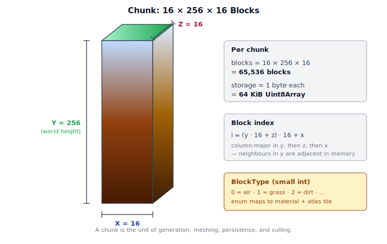
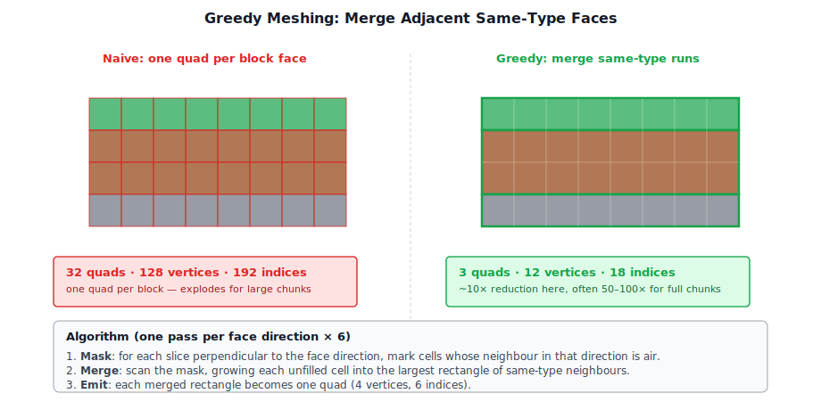

# Chapter 12: Terrain and Voxel World

[Contents](../crafty.md) | [11-Sky / Atmosphere](11-sky-atmosphere.md) | [14-Game Engine](14-game-engine.md)

The voxel world is what distinguishes Crafty from a generic rendering demo. This chapter covers the data structures, generation, and rendering of a block-based terrain.

## 12.1 Voxel Data Structure

The world is divided into **chunks** — fixed-size 3D arrays of block IDs. Each chunk is a 16×256×16 volume (X, Y, Z):




```typescript
class Chunk {
  readonly cx: number;       // Chunk X index
  readonly cz: number;       // Chunk Z index
  readonly blocks: Uint8Array; // 16 × 256 × 16 = 65,536 blocks

  getBlock(x: number, y: number, z: number): BlockType;
  setBlock(x: number, y: number, z: number, type: BlockType): void;
}
```

Block types are stored as small integers (0 = air, 1 = grass, 2 = dirt, etc.). The `BlockType` enum maps to material and rendering properties: colour, texture atlas tile, opacity, hardness, and so on.

## 12.2 Chunk Management

Chunks are loaded and unloaded based on distance from the player. The `World` class maintains a map of loaded chunks:

```typescript
class World {
  private _chunks = new Map<string, Chunk>();

  getChunk(cx: number, cz: number): Chunk | undefined;
  loadChunk(cx: number, cz: number): Promise<Chunk>;
  unloadChunk(cx: number, cz: number): void;
}
```

Chunk coordinates are computed from world position:

```typescript
function worldToChunkCoord(worldX: number, worldZ: number): [number, number] {
  return [Math.floor(worldX / CHUNK_SIZE_X), Math.floor(worldZ / CHUNK_SIZE_Z)];
}
```

### Frustum Culling

Before rendering, each chunk is tested against the camera frustum. Only chunks that intersect the view frustum are submitted to the GPU. This culling is performed on the CPU each frame.

## 12.3 Procedural World Generation

### Noise-Based Terrain

The world uses `perlinFbmNoise3` from `src/math/noise.ts` to generate terrain height:

```typescript
function generateHeight(worldX: number, worldZ: number): number {
  const n = perlinFbmNoise3(
    worldX * 0.01, worldZ * 0.01, 0,
    2.0,    // lacunarity
    0.5,    // gain
    6,      // octaves
  );
  return (n + 1) * 64 + 32;  // Map [-1,1] to [32, 160]
}
```

### Biomes

Biomes are determined by a secondary noise layer that encodes temperature and humidity. Each block of world space gets two independent noise values, and where it lands in temperature × humidity space picks the biome:


```typescript
function getBiome(worldX: number, worldZ: number): Biome {
  const temperature = perlinNoise3(worldX * 0.002, worldZ * 0.002, 42);
  const humidity = perlinNoise3(worldX * 0.002, worldZ * 0.002, 99);
  // Blend between forest, desert, plains, tundra based on temperature/humidity
}
```

Each biome has its own surface block type, tree generation rules, and colour palette for the grass overlay.

### Ores and Caves

Underground features are generated using additional noise passes. Caves use a cellular/Perlin threshold that defines underground voids. Ore veins use clustered noise with biome-specific depth distributions.

## 12.4 Greedy Meshing

Rendering each visible block face as two triangles creates millions of quads — far too many for real-time performance. **Greedy meshing** solves this by merging adjacent faces of the same block type into larger quads:




### Algorithm

For each face direction (6 directions), the algorithm:

1. **Mask generation.** For each slice perpendicular to the face direction, generate a 2D binary mask of solid blocks whose neighbour in the face direction is air.
2. **Greedy merge.** Scan the mask and merge contiguous runs into the largest possible rectangle.
3. **Emit quad.** Each merged rectangle becomes a single quad (4 vertices, 6 indices).

This reduces the vertex count by 10-100× compared to naive face-per-block rendering. The result is stored in a chunk's mesh, which is regenerated when blocks in the chunk change.

```typescript
class ChunkMesh {
  vertexBuffer: GPUBuffer;
  indexBuffer: GPUBuffer;
  indexCount: number;
  opaque: boolean;  // Separate meshes for opaque and transparent blocks
}
```

### Separate Opaque and Transparent Meshes

Each chunk produces two meshes: one for opaque blocks (dirt, stone, etc.) and one for transparent/translucent blocks (water, leaves, glass). The opaque mesh writes depth and G-buffer normally. The transparent mesh uses alpha blending in the forward pass.

## 12.5 Level-of-Detail (LOD)

Distant chunks use a simplified mesh to reduce triangle count. LOD levels merge 2×2×2 or 4×4×4 blocks into single blocks, reducing geometric detail where the player cannot perceive it. Concentric distance bands around the player select which LOD each chunk uses:


```typescript
enum LODLevel {
  Full = 0,    // 1:1 resolution
  Medium = 1,  // 2×2×2 merged
  Low = 2,     // 4×4×4 merged
}
```

LOD selection is based on distance from the camera. Transitions between LOD levels use a slight mesh overlap with alpha dithering to hide pop-in.

## 12.6 Block Interaction

### Ray Casting

The player interacts with blocks by aiming at them. A ray is cast from the camera through the crosshair, and the voxel traversal uses a **DDA (digital differential analyzer)** algorithm — at each step it advances to whichever grid line is closer along the ray, visiting cells in exact order:


```typescript
function raycastVoxels(origin: Vec3, direction: Vec3, world: World, maxDist: number): BlockHit | null {
  // DDA traversal through the voxel grid
  // Returns the first non-air block intersected, plus the face normal
}
```

### Block Placement and Breaking

When a block is broken or placed:

1. The block ID is updated in the chunk's `blocks` array.
2. The chunk's mesh is marked dirty and regenerated on the next frame.
3. If the modification is at a chunk boundary, neighbouring chunks are also marked dirty.

Breaking blocks uses a gradual animation — the block shows cracks at progressive stages (mined over ~0.75 seconds for stone, instant for dirt).

## 12.7 Erosion Simulation

Crafty includes an optional erosion simulation for more realistic terrain. A compute shader simulates water flow and sediment transport:

1. **Water deposition.** Rain adds water to heightfield cells.
2. **Flow.** Water moves downhill, carrying sediment.
3. **Erosion and deposition.** Fast-moving water erodes the terrain; slow-moving water deposits sediment.

The simulation runs as a background compute pass and updates the terrain height map, which is sampled during chunk generation.

## 12.8 Water Rendering

Water is a transparent block type rendered through the `WaterPass` (`src/renderer/passes/water_pass.ts`). It uses **screen-space refraction** — the scene behind the water is sampled with an offset based on a DUDV normal map:

```wgsl
let normal = textureSample(waterNormalMap, sampler, uv + time * flowSpeed).rgb * 2.0 - 1.0;
let refractionUV = screenUV + normal.xy * refractionStrength;
let background = textureSample(hdrTexture, sampler, refractionUV).rgb;
```

The water surface combines:

- **Refracted background** — the scene behind the water (distorted).
- **Specular reflection** — the sky and sun reflected on the water surface.
- **Fresnel blend** — mix between refraction and reflection based on viewing angle.
- **Subsurface scattering** — light absorbing and scattering through the water volume (blue tint).

**Further reading:**
- `src/block/` — Block types, chunk, world classes
- `src/block/chunk.ts` — Chunk data structure
- `src/block/mesher.ts` — Greedy meshing algorithm
- `src/block/generator.ts` — Terrain generation
- `src/renderer/passes/world_geometry_pass.ts` — Chunk G-buffer rendering
- `src/renderer/passes/water_pass.ts` — Water surface rendering
- `src/shaders/chunk_geometry.wgsl` — Chunk G-buffer shader

----
[Contents](../crafty.md) | [11-Sky / Atmosphere](11-sky-atmosphere.md) | [14-Game Engine](14-game-engine.md)
