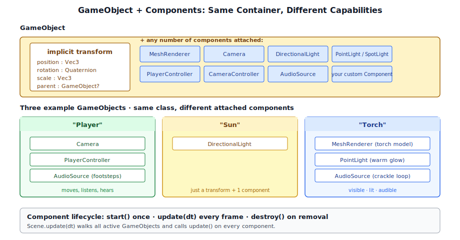
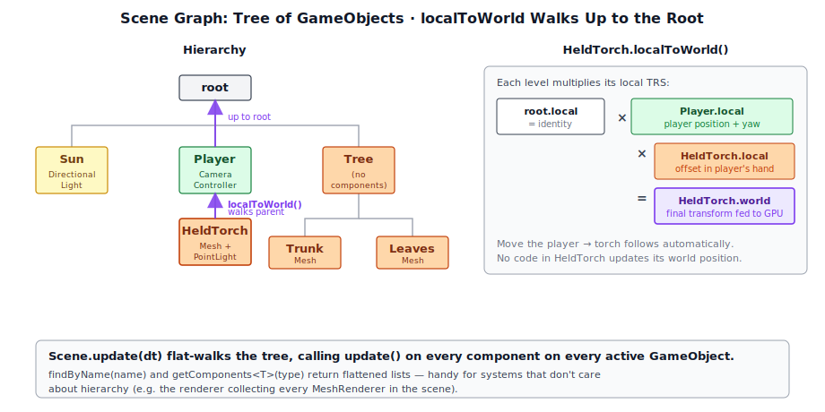
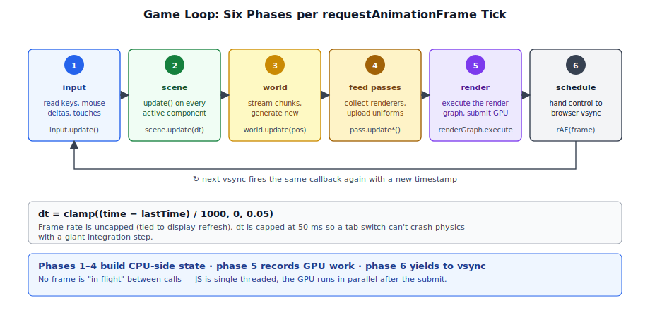
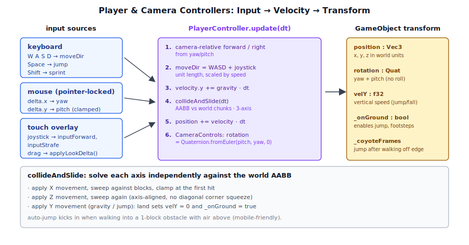

# Chapter 13: Game Engine Design

[Contents](../crafty.md) | [12-Post-Processing](12-post-processing.md) | [14-Physics](14-physics.md)

The game engine provides the structure for placing objects in the world, updating them each frame, and responding to user input.

## 13.1 The Component/Entity System



Crafty uses a **component/entity** pattern, though it is simplified compared to pure ECS architectures. A `GameObject` is a container for components, each component adding a specific capability.

```
GameObject
├── Transform (implicit: position, rotation, scale)
├── Camera           — view matrix, projection
├── MeshRenderer     — draws a mesh with a material
├── DirectionalLight — sun light with cascade data
├── PointLight       — point light source
├── SpotLight        — cone light source
├── PlayerController — first-person movement
└── AudioSource      — spatial audio emitter
```

## 13.2 GameObject and Component

```typescript
class GameObject {
  readonly id: number;
  name: string;
  position: Vec3 = Vec3.zero();
  rotation: Quaternion = Quaternion.identity();
  scale: Vec3 = Vec3.one();
  parent: GameObject | null = null;
  children: GameObject[] = [];

  addComponent<T extends Component>(c: T): T;
  getComponent<T extends Component>(type: ComponentType<T>): T | null;
  getComponents<T extends Component>(type: ComponentType<T>): T[];
  localToWorld(): Mat4;
}
```

Components attach to a GameObject and implement lifecycle methods:

```typescript
abstract class Component {
  readonly gameObject: GameObject;

  start?(): void;          // Called once when added to the scene
  update?(dt: number): void;  // Called every frame
  destroy?(): void;        // Cleanup
}
```

## 13.3 The Scene Graph



The `Scene` class manages the hierarchy of GameObjects:

```typescript
class Scene {
  readonly root: GameObject;

  addObject(obj: GameObject, parent?: GameObject): void;
  removeObject(obj: GameObject): void;

  findByName(name: string): GameObject | null;
  getComponents<T>(type: ComponentType<T>): T[];  // Flattened list

  update(dt: number): void;  // Calls update on all active components
}
```

The scene graph is a tree. Each `GameObject` has a local transform relative to its parent. The `localToWorld()` method walks up the tree to compute the absolute transform.

## 13.4 The Game Loop



The main game loop (`crafty/main.ts`) follows the standard pattern:

```typescript
function frame(time: number) {
  const dt = Math.min((time - lastTime) / 1000, 0.05);  // Cap at 50ms
  lastTime = time;

  // 1. Update input state
  input.update();

  // 2. Update scene (all components)
  scene.update(dt);

  // 3. Update world (chunk loading, generation)
  world.update(camera.position);

  // 4. Feed render passes
  shadowPass.updateScene(scene, camera);
  geometryPass.setDrawItems(scene.getComponents(MeshRenderer));
  lightingPass.updateCamera(ctx, view, proj, viewProj, ...);
  lightingPass.updateLight(ctx, sunLight, ...);
  // ...

  // 5. Execute the render graph
  renderGraph.execute(ctx);

  // 6. Request next frame
  requestAnimationFrame(frame);
}
```

The frame rate is uncapped (tied to display refresh via `requestAnimationFrame`). `dt` is capped to prevent physics explosion on tab-switch.

## 13.5 Input Handling

Input is managed by the `Input` class, which aggregates keyboard, mouse, and touch events:

```typescript
class Input {
  isKeyDown(key: string): boolean;
  wasKeyPressed(key: string): boolean;
  getMouseDelta(): Vec2;
  isMouseDown(button: number): boolean;
  isPointerLocked(): boolean;
}
```

The pointer lock API is used for first-person controls — the mouse cursor is hidden and mouse movement is reported as deltas.

## 13.6 Camera Controls

The `CameraControls` component interprets input to move and rotate the camera. Yaw (horizontal) and pitch (vertical) are accumulated from mouse deltas:

```typescript
class CameraControls extends Component {
  sensitivity = 0.002;
  yaw = 0;
  pitch = 0;

  update(dt: number): void {
    const delta = input.getMouseDelta();
    this.yaw -= delta.x * this.sensitivity;
    this.pitch -= delta.y * this.sensitivity;
    this.pitch = clamp(this.pitch, -PI/2, PI/2);

    this.gameObject.rotation = Quaternion.fromEuler(this.pitch, this.yaw, 0);
  }
}
```

## 13.7 The Player Controller



The `PlayerController` extends camera controls with WASD movement, jumping, gravity, and collision:

```typescript
class PlayerController extends Component {
  speed = 5;        // m/s
  jumpSpeed = 8;
  gravity = -20;    // m/s²
  velocity = Vec3.zero();

  update(dt: number): void {
    // Horizontal movement from WASD
    const forward = ...;  // Camera-relative forward direction
    const right = ...;    // Camera-relative right direction
    let moveDir = Vec3.zero();
    if (input.isKeyDown('w')) moveDir = moveDir.add(forward);
    if (input.isKeyDown('s')) moveDir = moveDir.sub(forward);
    if (input.isKeyDown('a')) moveDir = moveDir.sub(right);
    if (input.isKeyDown('d')) moveDir = moveDir.add(right);

    // Apply gravity
    this.velocity.y += this.gravity * dt;

    // Collision detection (AABB against world)
    this.collideAndSlide(dt);

    // Update position
    this.gameObject.position = this.gameObject.position.add(this.velocity.scale(dt));
  }
}
```

## 13.8 Touch Controls (Mobile)


Mobile devices get a completely separate input overlay (`crafty/game/touch_controls.ts`). Desktop pointer-lock and keyboard don't work on a touchscreen, so a DOM-based overlay provides virtual controls:

### Lazy Initialization

The overlay is **not** created at page load. Instead, `setupTouchControlsLazy` registers a one-shot `touchstart` listener on the window. The first real touch anywhere on the page creates the `TouchControls` instance and attaches all the DOM elements. This avoids adding unused DOM for desktop users and works around unreliable touch-detection APIs:

```typescript
// crafty/game/touch_controls.ts
export function setupTouchControlsLazy(canvas, opts, onInit?) {
  const listener = () => {
    handle.controls = new TouchControls(canvas, opts);
    onInit?.(handle.controls);
  };
  window.addEventListener('touchstart', listener, { once: true });
  return handle;
}
```

When the overlay initialises, it disables pointer lock on the player and camera controllers since touch doesn't use it.

### Virtual Joystick

The left thumb controls movement via a virtual joystick — a 120px circular area positioned at the bottom-left. Touch position relative to the joystick center is normalized to `[-1, 1]` and written to `player.inputForward` / `player.inputStrafe`, which the `PlayerController.update` loop reads alongside keyboard input:

```typescript
private _setMovement(strafe: number, forward: number): void {
  this._opts.player.inputForward = forward;
  this._opts.player.inputStrafe  = strafe;
}
```

### Camera Look

The right half of the canvas acts as a touch-drag look area. Finger movement deltas are scaled by `lookSensitivity` and fed to `player.applyLookDelta(dx, dy)`, which adjusts yaw/pitch identically to mouse movement. A double-tap on the look area toggles between player mode and free-camera mode.

### Action Buttons

Hold-type buttons (Sneak, Jump, Mine, Place) use `_bindHoldButton`, which fires a callback on `touchstart` and another on `touchend`/`touchcancel`:

```typescript
private _bindHoldButton(el, onDown, onUp): void {
  el.addEventListener('touchstart', (e) => { e.preventDefault(); onDown(); });
  el.addEventListener('touchend',   (e) => { e.preventDefault(); onUp(); });
}
```

Toggle-type buttons use `_bindToggleButton`. The Run button (`>>`) toggles `player.inputSprint`, visually switching between a dim and bright green background to indicate the active state. The Flashlight button (`💡`) calls the `onFlashlightToggle` callback, with the button's background/border brightening when active.

### Layout and Hotbar Clearance

The action buttons are positioned with a `HOTBAR_CLEARANCE` of 70px from the bottom of the screen, keeping them above the 44px fixed hotbar. The virtual joystick uses the same clearance. A `resize` listener on the highlight overlay recalculates its position after orientation or resolution changes so the visual selection tracks the correct slot.

## 13.9 World Persistence (IndexedDB)

Crafty saves local worlds in the browser's **IndexedDB** via the `WorldStorage` class (`crafty/game/world_storage.ts`). Each world is stored as a single record in a `worlds` object store keyed by a UUID:

```typescript
export interface SavedWorld {
  id: string;
  name: string;
  seed: number;
  createdAt: number;
  lastPlayedAt: number;
  edits: BlockEdit[];          // All block changes since world creation
  player: { x, y, z, yaw, pitch };
  sunAngle: number;
  screenshot?: Blob;           // JPEG thumbnail for the launcher UI
  version?: number;            // Schema version for migration
}
```

### Database Schema

The IndexedDB database is opened with a single object store. An `onupgradeneeded` handler creates the store if it doesn't exist — IndexedDB ignores duplicate creations, so repeated opens are safe:

```typescript
static open(): Promise<WorldStorage> {
  return new Promise((resolve, reject) => {
    const req = indexedDB.open('crafty', 1);
    req.onupgradeneeded = () => {
      const db = req.result;
      if (!db.objectStoreNames.contains('worlds')) {
        db.createObjectStore('worlds', { keyPath: 'id' });
      }
    };
    req.onsuccess = () => resolve(new WorldStorage(req.result));
    req.onerror = () => reject(req.error);
  });
}
```

### CRUD Operations

All operations follow a consistent pattern: begin a transaction, get the object store, and wrap the request in a promise:

```typescript
save(world: SavedWorld): Promise<void> {
  return this._withStore('readwrite', (store) => {
    return new Promise((resolve, reject) => {
      const req = store.put(world);
      req.onsuccess = () => resolve();
      req.onerror = () => reject(req.error);
    });
  });
}

list(): Promise<SavedWorld[]> {
  return this._withStore('readonly', (store) => {
    return new Promise((resolve, reject) => {
      const req = store.getAll();
      req.onsuccess = () => {
        const all = req.result ?? [];
        all.sort((a, b) => b.lastPlayedAt - a.lastPlayedAt);
        resolve(all);
      };
    });
  });
}
```

Results are sorted by `lastPlayedAt` descending so the launcher can show the most recently played world first. The `_withStore` helper reduces boilerplate by wrapping the transaction + object store setup:

```typescript
private _withStore<T>(mode: IDBTransactionMode,
                      fn: (store: IDBObjectStore) => Promise<T>): Promise<T> {
  const tx = this._db.transaction('worlds', mode);
  return fn(tx.objectStore('worlds'));
}
```

### Schema Versioning

A `version` field on each record enables forward-compatible schema changes. Records with a missing or lower version are detected and migrated when loaded:

```typescript
export const CURRENT_FORMAT_VERSION = 1;
```

The version check happens in the load path — if `loaded.version < CURRENT_FORMAT_VERSION`, the application applies upgrade transforms before exposing the record. This avoids maintaining migration logic inside the storage layer itself.

### World Record Lifecycle

Worlds are created via the factory function `createSavedWorld`, which populates sensible defaults for a fresh world:

```typescript
export function createSavedWorld(name: string, seed: number): SavedWorld {
  return {
    id: crypto.randomUUID(),
    name, seed,
    createdAt: Date.now(),
    lastPlayedAt: Date.now(),
    edits: [],
    player: { x: 64, y: 80, z: 64, yaw: 0, pitch: 0 },
    sunAngle: Math.PI * 0.3,
    version: CURRENT_FORMAT_VERSION,
  };
}
```

During gameplay, the world record is updated periodically (every ~5 seconds) through a debounced autosave in `main.ts`. The edits array grows monotonically — every block placement or destruction appends a `BlockEdit` entry. This gives a complete undo history and enables replay-based persistence: the world is re-generated from the seed plus the edit log rather than storing the full block grid.

The start screen uses `storage.list()` to populate the saved-world selector and `storage.delete()` to remove worlds, with the screenshot Blob providing a visual thumbnail for each entry.

### Summary

The game engine layer provides:

- **Entity/component system**: `GameObject` + `Component` with scene graph tree hierarchy
- **Game loop**: Six phases — input, scene update, world update, feed passes, render, schedule
- **Input handling**: Keyboard, mouse, pointer lock, and touch controls with virtual joystick
- **Player controller**: WASD movement, gravity, collide-and-slide, sprint, and jump
- **Touch controls**: Virtual joystick, touch-drag look, action buttons, responsive layout
- **World persistence**: IndexedDB-based storage with schema versioning, autosave, and edit-log replay

**Further reading:**
- `crafty/game/touch_controls.ts` — Full touch overlay implementation
- `src/engine/player_controller.ts` — Analog input support (inputForward, inputStrafe, inputSprint)
- `crafty/ui/hotbar.ts` — Hotbar with tap-to-select and resize handling
- `crafty/main.ts` — Touch control initialization and audio context bootstrap

----
[Contents](../crafty.md) | [12-Post-Processing](12-post-processing.md) | [14-Physics](14-physics.md)
