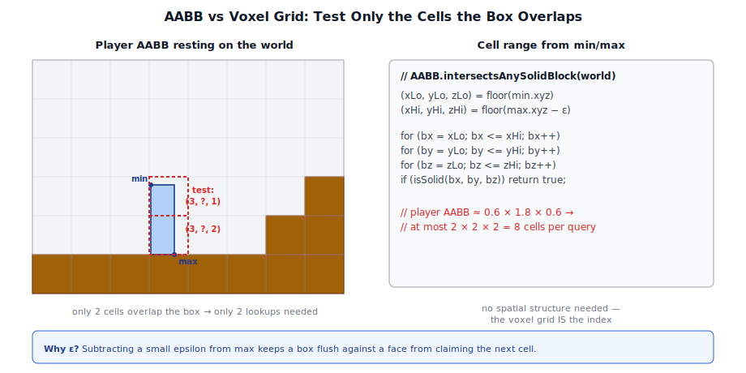
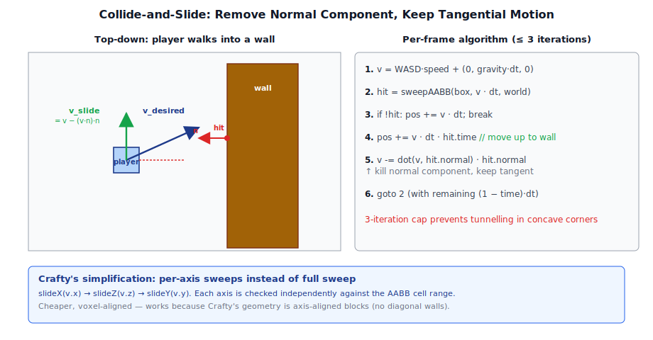
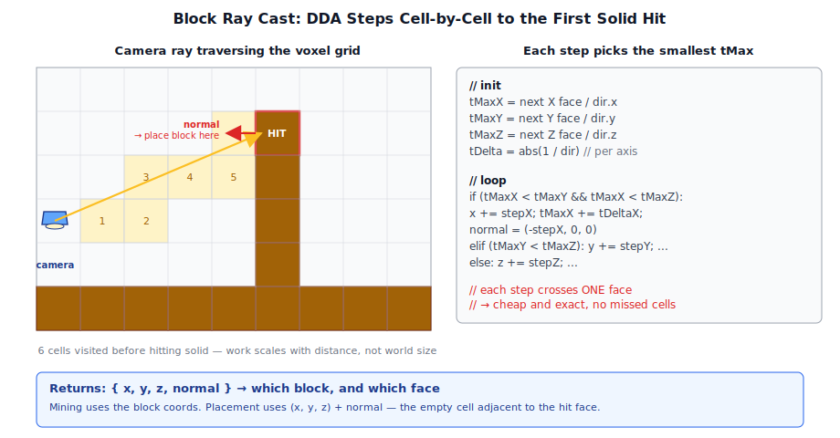
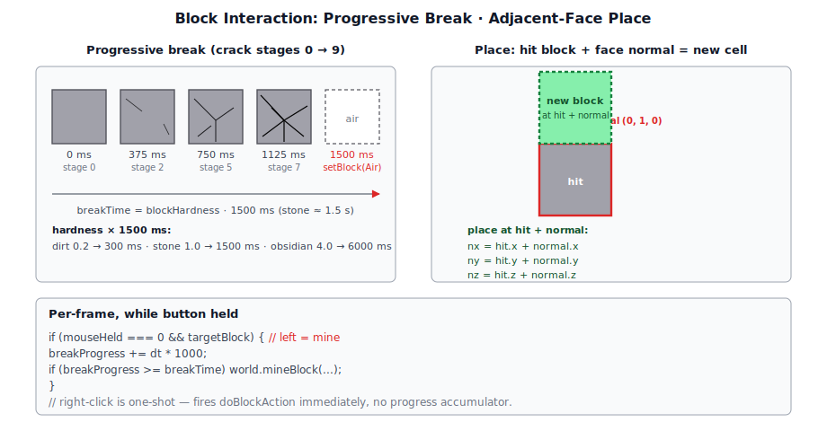

# Chapter 14: Physics and Interaction

[Contents](../crafty.md) | [13-Game Engine](13-game-engine.md) | [15-NPC AI](15-npc-ai.md)

Crafty implements a minimal physics system focused on player movement and block interaction. There is no general-purpose physics engine — only what the gameplay requires.

## 14.1 Collision Detection (AABB)



The player's collision volume is an axis-aligned bounding box (AABB). Collision detection tests the player's AABB against solid blocks in the world:

```typescript
class AABB {
  min: Vec3;
  max: Vec3;

  intersectsBlock(wx: number, wy: number, wz: number): boolean;
  sweepTest(velocity: Vec3, world: World): { hit: boolean; normal: Vec3; time: number };
}
```

The **sweep test** moves the AABB along the velocity vector and finds the first collision. This allows the player to slide along walls — if the velocity has an X component that causes collision, the X component is zeroed and the remaining Y/Z sweep continues.

## 14.2 Player Movement and Gravity



The player controller implements a simplified **collide-and-slide** algorithm:

1. Compute desired velocity from input and gravity.
2. Sweep-test the velocity against world blocks.
3. If collision, slide along the collision normal (remove the velocity component along the normal).
4. Repeat up to 3 iterations to handle corners and multiple collisions.
5. Apply the final velocity to the player position.

Gravity is constant at `-20 m/s²` (slightly higher than Earth's `-9.8` for a more responsive feel). Ground friction slows horizontal movement when the player is standing on a block.

### Coyote Time and Variable Jump Height

Two interrelated mechanics make jumping feel responsive even with imperfect input timing:

**Coyote time** gives a short grace window (~100 ms) after the player walks off a ledge during which a jump still succeeds. This prevents the frustration of pressing jump a frame too late after stepping off an edge:

```typescript
// Coyote timer: refreshed on landing, counts down while airborne
if (landed) {
  this._coyoteFrames = 6;
} else if (!inWater) {
  this._coyoteFrames = Math.max(0, this._coyoteFrames - 1);
}

// Jump triggers on ground OR within the coyote window
if (jumpHeld && (this._onGround || this._coyoteFrames > 0)) {
  this._velY        = JUMP_VEL;
  this._coyoteFrames = 0;
}
```

The counter is refreshed to 6 frames whenever the player is grounded and decrements only while airborne (and not in water). This gives a consistent ~100 ms at 60 FPS where a late jump press still connects.

**Variable jump height** emerges naturally from the single-impulse jump model: the initial upward velocity (`JUMP_VEL = 11.5 blocks/s`, peak ~2.36 blocks) is applied once on the frame the jump triggers. Because the player is airborne immediately after, releasing the jump button has no further effect — gravity decelerates the ascent at `GRAVITY = -28 blocks/s²` and the player begins descending. The perceived height varies because:

- The player can choose to jump early (near the edge) or late (deep in the coyote window), changing the height at which the jump occurs relative to the ground below.
- Holding Space through the coyote window lets the player jump from the last possible moment, preserving maximum height even after a mistimed dismount.

The auto-jump system augments this for mobile: when walking into a 1-block-high obstacle with air above it, a velocity of `AUTO_JUMP_VEL = 8.0 blocks/s` is applied automatically, stepping the player onto the block without explicit input:

```typescript
if (this.autoJump && this._onGround && hSpeed > 0.5) {
  const aheadX = Math.floor(fx + dx * (HALF_W + 0.3));
  const aheadZ = Math.floor(fz + dz * (HALF_W + 0.3));
  if (this._isSolid(aheadX, footY, aheadZ) && !this._isSolid(aheadX, footY + 1, aheadZ)) {
    this._velY = AUTO_JUMP_VEL;
  }
}
```

## 14.3 Block Ray Casting



To determine which block the player is looking at, a ray is cast from the camera through the crosshair. The DDA (Digital Differential Analyzer) algorithm traverses the voxel grid efficiently:

```typescript
function raycastVoxels(origin: Vec3, dir: Vec3, world: World, maxDist: number): BlockHit | null {
  let x = Math.floor(origin.x), y = Math.floor(origin.y), z = Math.floor(origin.z);
  const stepX = sign(dir.x), stepY = sign(dir.y), stepZ = sign(dir.z);
  let tMaxX = ((dir.x > 0 ? (x + 1) : x) - origin.x) / dir.x;
  let tMaxY = ((dir.y > 0 ? (y + 1) : y) - origin.y) / dir.y;
  let tMaxZ = ((dir.z > 0 ? (z + 1) : z) - origin.z) / dir.z;
  const tDeltaX = abs(1 / dir.x), tDeltaY = abs(1 / dir.y), tDeltaZ = abs(1 / dir.z);

  for (let i = 0; i < MAX_STEPS; i++) {
    if (world.getBlock(x, y, z) !== BlockType.Air) {
      return { x, y, z, normal: ... };
    }
    // Step to next voxel boundary
    if (tMaxX < tMaxY) { tMaxX += tDeltaX; x += stepX; }
    else if (tMaxY < tMaxZ) { tMaxY += tDeltaY; y += stepY; }
    else { tMaxZ += tDeltaZ; z += stepZ; }
  }
  return null;
}
```

The return value includes the block position and the face normal (which side was hit), used for placing new blocks adjacent to the hit face.

## 14.4 Block Interaction



Block breaking uses a **progressive crack animation** — holding the mouse button on a block gradually breaks it:

```typescript
// Block breaking state
let breakProgress = 0;
const breakTime = blockHardness * 1.5;  // Stone ~1.5s, dirt ~0.3s

function updateBreak(dt: number, hit: BlockHit) {
  breakProgress += dt;
  if (breakProgress >= breakTime) {
    world.setBlock(hit.x, hit.y, hit.z, BlockType.Air);
    breakProgress = 0;
  }
  // Update crack overlay texture
  const stage = Math.min(Math.floor(breakProgress / breakTime * 10), 9);
  blockHighlightPass.setCrackStage(stage);
}
```

Block placement inserts a block at the face adjacent to the hit position:

```typescript
function placeBlock(hit: BlockHit, blockType: BlockType) {
  const nx = hit.x + hit.normal.x;
  const ny = hit.y + hit.normal.y;
  const nz = hit.z + hit.normal.z;
  if (world.getBlock(nx, ny, nz) === BlockType.Air) {
    world.setBlock(nx, ny, nz, blockType);
  }
}

### Summary

The physics and interaction system is deliberately minimal for a creative-mode voxel game:

- **Collision detection**: AABB sweep tests with collide-and-slide algorithm (up to 3 iterations)
- **Player movement**: Gravity at −20 m/s², coyote time (100 ms), variable jump height, auto-step
- **Block targeting**: DDA voxel ray casting with progressive break animation (10 crack stages)
- **Block placement**: Adjacent to the hit face, subject to server validation in multiplayer

**Further reading:**
- `src/engine/player_controller.ts` — Collide-and-slide and movement physics
- `src/block/world.ts` — DDA ray casting and block queries
- `src/renderer/passes/block_highlight_pass.ts` — Crack overlay rendering

----
[Contents](../crafty.md) | [13-Game Engine](13-game-engine.md) | [15-NPC AI](15-npc-ai.md)
