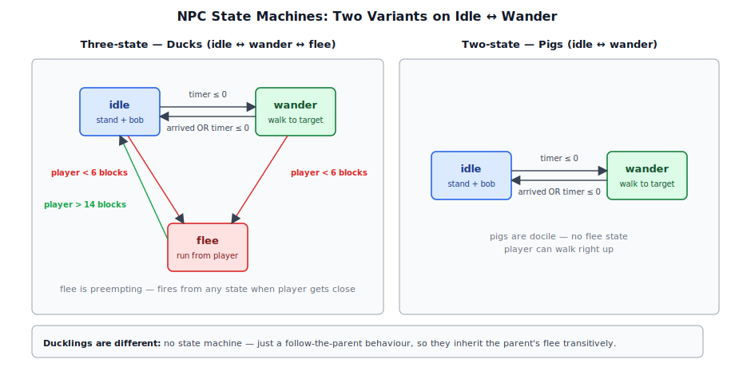
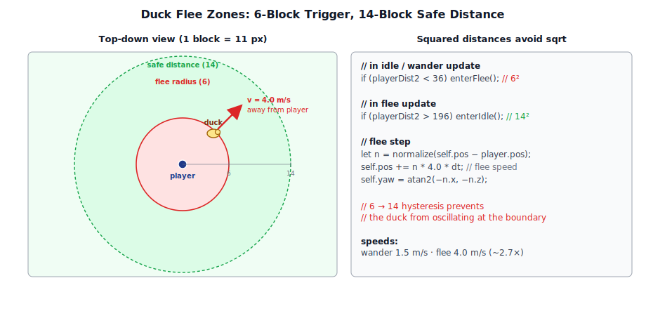
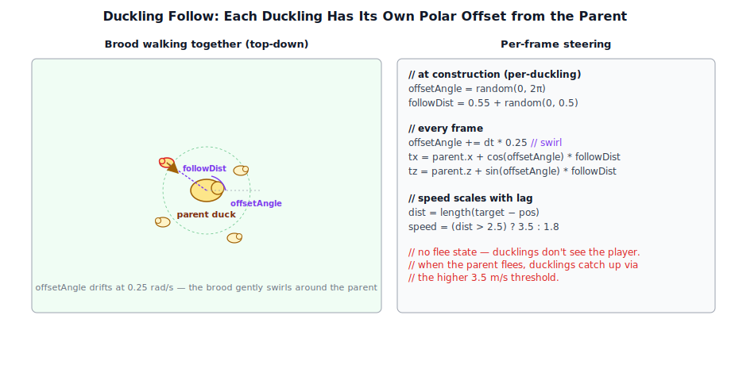
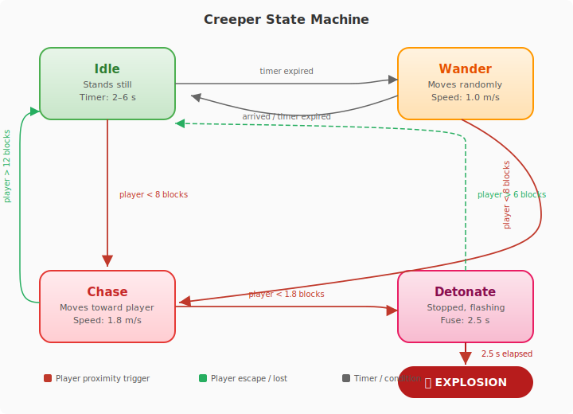
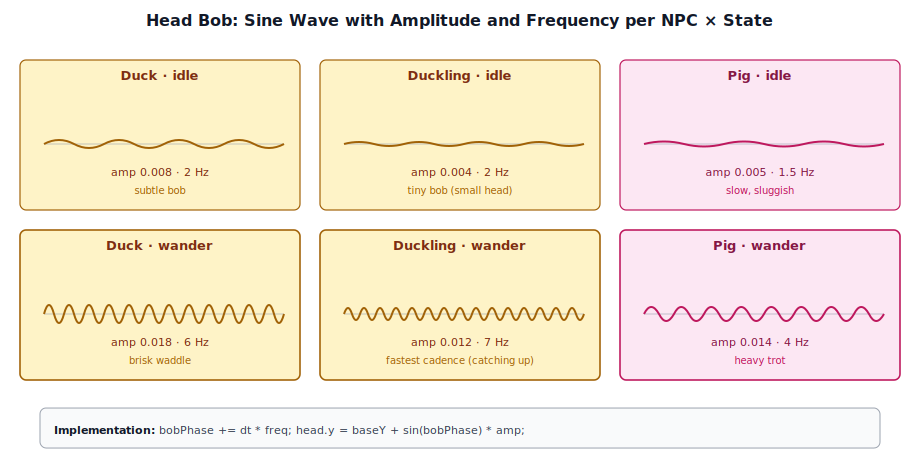
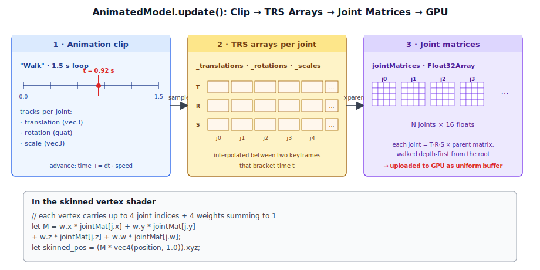

# Chapter 15: NPC AI

[Contents](../crafty.md) | [14-Physics](14-physics.md) | [16-Weather System](16-weather-system.md)

Non-playable characters (NPCs) bring the world to life. Crafty's NPC system uses lightweight state-machine components that attach to `GameObject` entities, driving movement, rotation, and animation. This chapter covers the three built-in NPC types — ducks, ducklings, and pigs — and shows how the pattern can be extended for more complex behaviours.

## 15.1 NPC Architecture

Every NPC is a `GameObject` with a `MeshRenderer` for its visual representation and an AI component that implements the `Component` interface:

```typescript
abstract class Component {
  readonly gameObject: GameObject;
  start?(): void;
  update?(dt: number): void;
  destroy?(): void;
}
```

The AI component owns the NPC's internal state, movement velocity, yaw rotation, and references to child `GameObject` nodes (such as the head) for animation. It reads the `World` for ground and water collision and accesses `DuckAI.playerPos` — a static field written once per frame by the game loop — to sense the player's position.

All NPC components share common infrastructure:

- **Gravity** — constant `-9.8 m/s²` acceleration applied each frame.
- **Ground collision** — samples `World.getTopBlockY()` to find the solid surface below the NPC.
- **Yaw rotation** — computed from movement direction and applied via `Quaternion.fromAxisAngle`.
- **Head animation** — sinusoidal bob on a named child `GameObject`.

## 15.2 The AI State Machine



The three NPC types implement one of two state-machine patterns:

| Pattern | States | Used by |
|---------|--------|---------|
| Two-state | `idle` ↔ `wander` | Pigs |
| Three-state | `idle` ↔ `wander` ↔ `flee` | Ducks |

### Idle

The NPC stands still, bobbing gently. A random timer counts down; when it expires, the NPC transitions to `wander`. In the three-state variant, the NPC also checks player distance each frame and enters `flee` immediately if the player comes within a threshold radius.

```typescript
case 'idle': {
  this._timer -= dt;
  if (playerDist2 < 36) {           // 6 blocks — flee radius
    this._enterFlee();
  } else if (this._timer <= 0) {
    this._pickWanderTarget();
  }
  break;
}
```

### Wander

The NPC picks a random target position within a distance range and walks toward it at a constant speed:

```typescript
private _pickWanderTarget(): void {
  const angle = Math.random() * Math.PI * 2;
  const dist  = 3 + Math.random() * 8;
  this._targetX = go.position.x + Math.cos(angle) * dist;
  this._targetZ = go.position.z + Math.sin(angle) * dist;
  this._hasTarget = true;
  this._state = 'wander';
  this._timer = 6 + Math.random() * 6;
}
```

Movement toward the target uses simple direct steering — the NPC moves in a straight line to the waypoint at a fixed speed:

```typescript
const dx = this._targetX - gx;
const dz = this._targetZ - gz;
const dist = Math.sqrt(dist2);
go.position.x += (dx / dist) * 1.5 * dt;
go.position.z += (dz / dist) * 1.5 * dt;
this._yaw = Math.atan2(-(dx / dist), -(dz / dist));
```

The yaw is updated each frame so the NPC's model faces the direction of travel. When the NPC arrives within 0.5 blocks of the target, or when a wander timer expires, it returns to `idle`.

### Flee (Ducks Only)

Ducks flee from the player when within detection range (6 blocks). The flee behaviour moves the duck directly away from the player at a higher speed (4.0 m/s vs 1.5 m/s wander). Once the distance exceeds 14 blocks, the duck returns to `idle`:

```typescript
case 'flee': {
  if (playerDist2 > 196) {         // 14 block safe distance
    this._enterIdle();
    break;
  }
  const nx = dist > 0 ? -dpx / dist : 0;
  const nz = dist > 0 ? -dpz / dist : 0;
  go.position.x += nx * 4.0 * dt;
  go.position.z += nz * 4.0 * dt;
  this._yaw = Math.atan2(-nx, -nz);
  break;
}
```

Pigs are docile — they never flee and remain in the two-state cycle indefinitely.

## 15.3 Duck AI



`DuckAI` (`crafty/game/components/duck_ai.ts`) implements the full three-state machine. Ducks are amphibious — they walk on land and float on water:

```typescript
// If the block below is water, float on the surface
const blockBelow = this._world.getBlockType(
  Math.floor(gx), Math.floor(groundY - 1), Math.floor(gz));
if (blockBelow === BlockType.WATER) {
  go.position.y = groundY;  // float on water surface
} else {
  go.position.y = groundY;  // stand on solid ground
}
```

The duck's model has a child GameObject named `Duck.Head` which is animated with a sinusoidal bob. The bob frequency and amplitude differ between idle and wander states:

```typescript
this._bobPhase += dt * (this._state === 'wander' ? 6 : 2);
const bobAmp = this._state === 'wander' ? 0.018 : 0.008;
this._headGO.position.y = this._headBaseY + Math.sin(this._bobPhase) * bobAmp;
```

Player position is fed to ducks via a static field `DuckAI.playerPos`, written once per frame by the game loop. This avoids coupling the AI to a specific player component.

## 15.4 Duckling AI



`DucklingAI` (`crafty/game/components/duckling_ai.ts`) implements a **follow** behaviour rather than the idle/wander/flee pattern. Each duckling tracks its parent duck's world position and maintains a personalised polar offset so the brood spreads naturally:

```typescript
constructor(parent: GameObject, world: World) {
  this._parent = parent;
  this._offsetAngle = Math.random() * Math.PI * 2;
  this._followDist  = 0.55 + Math.random() * 0.5;
}
```

Each frame, the duckling computes its target position as the parent's position plus the polar offset, then steers toward it:

```typescript
this._offsetAngle += dt * 0.25;  // gentle swirl
const tx = this._parent.position.x + Math.cos(this._offsetAngle) * this._followDist;
const tz = this._parent.position.z + Math.sin(this._offsetAngle) * this._followDist;
```

The duckling adjusts its speed based on distance — faster when lagging behind, creating a realistic catching-up motion:

```typescript
const speed = dist > 2.5 ? 3.5 : 1.8;
go.position.x += nx * speed * dt;
go.position.z += nz * speed * dt;
```

Ducklings do not check for the player directly — they simply follow their parent, so they inherit the parent's flee behaviour automatically.

## 15.5 Pig AI

`PigAI` (`crafty/game/components/pig_ai.ts`) implements a simpler two-state machine (idle ↔ wander) with no flee response. Pigs are larger and slower than ducks:

| Property | Duck | Duckling | Pig | Creeper |
|----------|------|----------|-----|---------|
| States | idle/wander/flee | follow | idle/wander | idle/wander/chase/detonate |
| Wander speed | 1.5 m/s | 1.8–3.5 m/s | 1.2 m/s | 1.0 m/s |
| Idle head bob | 0.008 @ 2 Hz | 0.004 @ 2 Hz | 0.005 @ 1.5 Hz | — |
| Wander head bob | 0.018 @ 6 Hz | 0.012 @ 7 Hz | 0.014 @ 4 Hz | — |
| Water support | Yes (float) | No* | No | No |

*Ducklings use ground collision only — they do not float on water.

The pig's wander behaviour is identical in structure to the duck's but uses slightly different parameters: slower speed, longer wander distances, and a different head bob signature.

## 15.6 Creeper AI



`CreeperAI` (`crafty/game/components/creeper_ai.ts`) implements a hostile four-state machine that introduces the first truly threatening NPC in Crafty. Creepers spawn in any biome (unlike passive mobs which are restricted to GrassyPlains) and are distinguished by their tall green silhouette and explosive demise.

| Property | Value |
|----------|-------|
| States | idle / wander / chase / detonate |
| Wander speed | 1.0 m/s |
| Chase speed | 1.8 m/s |
| Detect radius | 8 blocks |
| Lose radius | 12 blocks (hysteresis) |
| Touch radius | 1.8 blocks (triggers detonate) |
| Detonate cancel radius | 6 blocks |
| Detonate fuse | 2.5 seconds |
| Explosion radius | 4 blocks (spherical) |
| Biome | Any |

### Four-State Machine

**Idle → Wander.** The creeper stands still or wanders aimlessly at 1.0 m/s, using the same timer-based target selection as pigs. Both states preemptively transition to `chase` if the player comes within the detect radius (8 blocks).

**Chase.** The creeper moves toward the player at 1.8 m/s. If the player moves beyond 12 blocks the creeper loses interest and returns to `idle`. If the player comes within touching distance (1.8 blocks), the creeper enters the `detonate` state.

**Detonate.** The creeper stops moving and begins flashing between green and white at an accelerating rate — the flash interval starts at 0.5 s and decreases by 0.18 s per second elapsed, capped at 0.08 s:

```typescript
const flashInterval = Math.max(0.08, 0.5 - this._detonateElapsed * 0.18);
```

While detonating, the creeper checks whether the player has retreated beyond the cancel radius (6 blocks). If so, it restores its green color and returns to `idle` with a short cooldown timer:

```typescript
if (playerDist2 > DETONATE_CANCEL_RADIUS_SQ) {
  this._exitDetonate();
  break;
}
```

If the full 2.5-second fuse elapses without the player escaping, the creeper explodes.

### Explosion

The explosion has two phases:

1. **Particle burst** — a `static onExplode` callback fires at the creeper's position, triggering an 80-particle burst via the game's `explosionPass`. The explosion config uses fire-colored particles with `color_over_lifetime` (orange → dark transparent) and `size_over_lifetime` (grow → shrink) modifiers.

2. **Block destruction** — all blocks within a 4-block spherical radius are destroyed via `world.mineBlock()`. For each destroyed block, a `static onBlockDestroyed` callback fires, routing the edit through the game's persistence and synchronisation system:

```
                ┌─ Local mode → dedup against savedWorld.edits[]
CreeperAI       │                → push to edit log
  └─ mineBlock ─┤                → stash for chunk re-entry
  └─ onBlockDestroyed ─┤         → mark save dirty
                       └─ Network mode → stash + sendBlockBreak to server
```

This ensures creeper explosions are persisted in local saves and replicated to all players in multiplayer games. The explosion respects the `break→place` dedup rule — if a player placed a block and a creeper later destroys it, both edits remain in the log so replay clears the placed block first.

### Flash Visual

The color change is applied directly to the child `MeshRenderer` materials at runtime:

```typescript
private _setColor(color: [number, number, number, number]): void {
  for (const child of go.children) {
    const renderer = child.getComponent(MeshRenderer);
    if (renderer && renderer.material instanceof PbrMaterial) {
      renderer.material.albedo = color;
      renderer.material.markDirty();
    }
  }
}
```

The creeper uses a single `CREEPER_GREEN` color for both body and head (unlike earlier NPCs which use different colors for different body parts).

### Spawning

Creepers spawn during chunk generation with an 8% probability per XZ chunk column, using the same `AnimalMeshes` interface as passive mobs. Unlike ducks and pigs, they have **no biome filter** — they can appear in any biome:

```typescript
if (Math.random() < CREEPER_CHANCE) {
  const wx = Math.floor(baseX + Math.random() * CHUNK_SIZE);
  const wz = Math.floor(baseZ + Math.random() * CHUNK_SIZE);
  spawnCreeper(wx, wz, world, scene, meshes.creeperBody, meshes.creeperHead);
}
```

The mesh stands twice as tall as a pig, with a body half-height of 0.60 and leg half-height of 0.20, giving the creeper its distinctive towering silhouette.

## 15.7 Gravity and Ground Collision

All NPC components share the same gravity and ground collision logic:

```typescript
// Apply gravity
this._velY -= 9.8 * dt;
go.position.y += this._velY * dt;

// Sample ground height from the voxel world
const groundY = this._world.getTopBlockY(
  Math.floor(gx), Math.floor(gz), Math.ceil(go.position.y) + 4);

// Snap to ground if below surface
if (groundY > 0 && go.position.y <= groundY + 0.1) {
  go.position.y = groundY;
  this._velY = 0;
}
```

The +4 offset in `getTopBlockY` provides a search range above the NPC's current position, ensuring the function can find the ground even if the NPC fell through a hole. The small 0.1-unit tolerance prevents jittering when the NPC is exactly at ground level.

Ducks extend this with a water check — if the block directly below is `BlockType.WATER`, the duck floats at the water's surface instead of sinking.

## 15.8 Head Bob Animation



Each NPC model has a child `GameObject` for the head (e.g., `Duck.Head`, `Pig.Head`, `Duckling.Head`). The AI component finds this child in `onAttach()` and animates its local Y offset each frame:

```typescript
onAttach(): void {
  for (const child of this.gameObject.children) {
    if (child.name === 'Duck.Head') {
      this._headGO = child;
      this._headBaseY = child.position.y;
      break;
    }
  }
}
```

The bob is a simple sine wave whose frequency and amplitude vary by state — faster and larger when the NPC is moving, slower and subtler when idle. This gives each NPC a distinctive gait without requiring skeletal animation.

## 15.9 Animated Models and Skeletal Animation



Beyond the simple head-bob NPCs, Crafty supports full skeletal animation via the `AnimatedModel` component (`src/engine/components/animated_model.ts`). This component plays GLTF animation clips on skinned meshes:

```typescript
class AnimatedModel extends Component {
  readonly model: GltfModel;
  readonly skeleton: Skeleton;
  currentClip: string | null = null;
  speed: number = 1.0;
  loop: boolean = true;
  readonly jointMatrices: Float32Array;

  play(clipName: string, loop = true): void { /* ... */ }
  pause(): void { /* ... */ }
  resume(): void { /* ... */ }
  stop(): void { /* ... */ }
}
```

Each frame, `AnimatedModel.update()` advances the clip time, samples the animation at that time into per-joint TRS arrays, and recomputes the final joint matrices via the `Skeleton`:

```typescript
update(dt: number): void {
  if (!this._clip || this._paused) return;
  this._time += dt * this.speed;
  if (this.loop) {
    this._time = this._time % this._clip.duration;
  }
  this._resetToPose();
  sampleClip(this._clip, this._time, this._translations, this._rotations, this._scales);
  this.skeleton.computeJointMatrices(this._translations, this._rotations, this._scales, this.jointMatrices);
}
```

The joint matrices are consumed by the skinned variant of the world geometry pass, which renders the animated mesh with GPU skinning. NPCs that need full-body animation (e.g. a character walking, waving, or performing actions) use `AnimatedModel` instead of the simple head-bob approach.

## 15.10 Extending the NPC System

The component-based architecture makes it straightforward to add new NPC types:

1. **Define the NPC GameObject** — create a `GameObject` with a `MeshRenderer` and optional child nodes.
2. **Implement the AI component** — extend `Component` with a state machine, movement logic, and animation.
3. **Register in the game loop** — ensure `DuckAI.playerPos` (or equivalent) is updated each frame.

Future NPC types could include:

- **Villagers** — diurnal cycle, trading, pathfinding to waypoints.
- **Hostile mobs** — chase, attack, patrol, and respawn behaviours.
- **Flying NPCs** — birds, bats — with three-dimensional movement and collision.
- **Fish** — aquatic NPCs constrained to water volumes.

Each new type follows the same pattern: a state machine + `Component.update()` + `World` queries, with visual variety provided by different meshes, animations, and parameter tuning.

**Further reading:**
- `crafty/game/components/duck_ai.ts` — Duck AI (three-state + water float)
- `crafty/game/components/duckling_ai.ts` — Duckling AI (follow behaviour)
- `crafty/game/components/pig_ai.ts` — Pig AI (two-state wandering)
- `crafty/game/components/creeper_ai.ts` — Creeper AI (four-state hostile + explosion)
- `src/engine/components/animated_model.ts` — Skeletal animation playback
- `src/engine/components/` — All component implementations
- `src/engine/component.ts` — Base `Component` class

----
[Contents](../crafty.md) | [14-Physics](14-physics.md) | [16-Weather System](16-weather-system.md)
