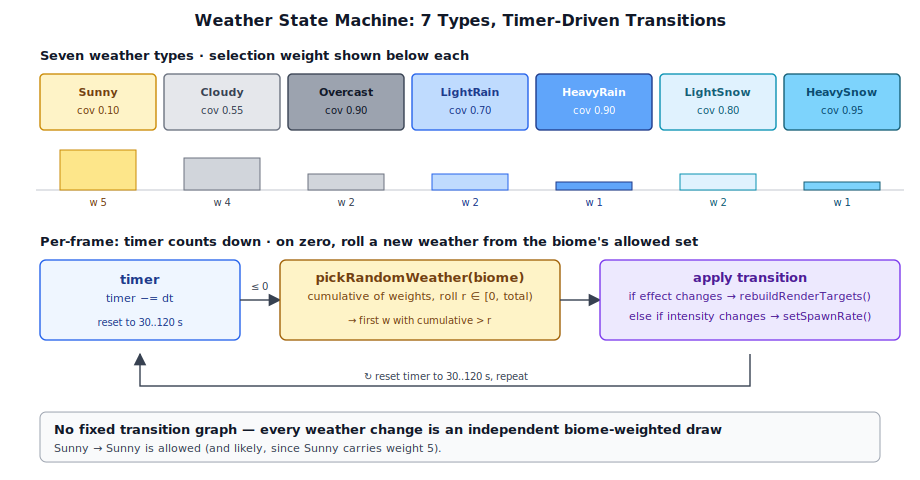
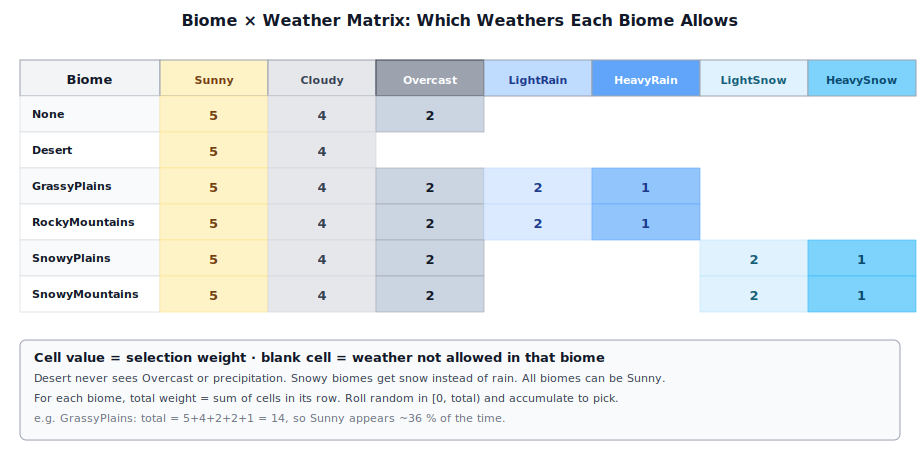
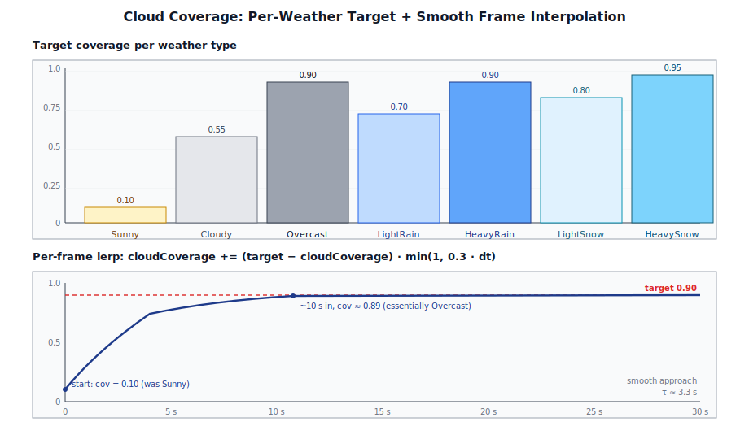
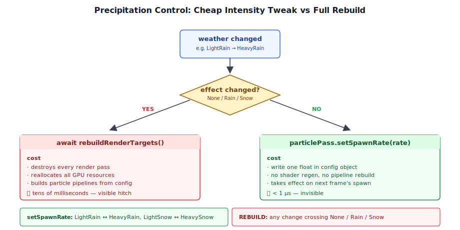
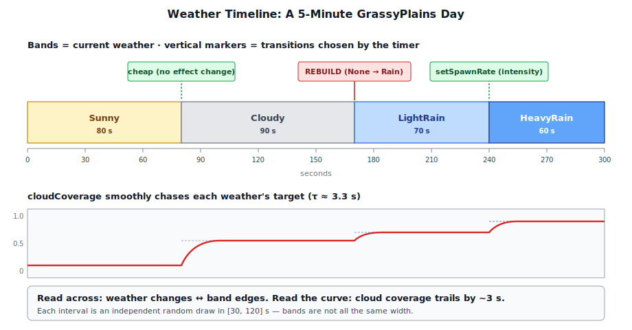

# Chapter 15: Weather System

[Contents](../crafty.md) | [14-NPC AI](14-npc-ai.md) | [16-Audio](16-audio.md)

Weather is what makes a landscape feel alive. A static blue sky is technically correct but emotionally flat — the world should cloud over, rain should sweep across the terrain, and snow should dust the peaks. This chapter covers Crafty's dynamic weather system: a lightweight state machine that transitions between weather types over time, driven by the player's current biome.

## 15.1 Weather Types



The `WeatherType` enum in `crafty/game/weather_system.ts` defines eight weather states:

| Weather | Visual appearance | Precipitation |
|---------|------------------|---------------|
| `Sunny` | Clear sky, few clouds | None |
| `Cloudy` | Moderate cloud cover | None |
| `Overcast` | Heavy cloud cover, dim | None |
| `LightRain` | Cloudy with light rain | Rain (low rate) |
| `HeavyRain` | Overcast with heavy rain | Rain (high rate) |
| `LightSnow` | Cloudy with light snow | Snow (low rate) |
| `HeavySnow` | Overcast with heavy snow | Snow (high rate) |
| `Foggy` | Ground-hugging cloud the player walks through | None |

Each weather type carries up to five derived properties:

- **Cloud coverage** — a `[0, 1]+` target that the visual cloud density lerps toward (see §16.4).
- **Environment effect** — maps to `EnvironmentEffect.None / Rain / Snow`, which controls whether the particle system is active.
- **Spawn rate** — the per-second particle spawn rate used when rain or snow is active (see §16.5).
- **Cloud bounds override** — most weather defers to the biome's `cloudBase` / `cloudTop`; `Foggy` overrides these to drop the cloud volume to ground level (see §15.4.1).
- **Cloud density override** — most weather uses the global default (`4.0`); `Foggy` reduces this so the player can see a useful distance while standing inside the cloud volume.

## 15.2 Biome Weather Tables



Different biomes have different weather patterns — you will not see snow in the desert. The `BIOME_WEATHERS` table defines which weather types are valid for each biome:

```typescript
const BIOME_WEATHERS: Record<BiomeType, WeatherType[]> = {
  [BiomeType.None]:            [Sunny, Cloudy, Overcast, Foggy],
  [BiomeType.Desert]:          [Sunny, Cloudy],
  [BiomeType.GrassyPlains]:    [Sunny, Cloudy, Overcast, LightRain, HeavyRain, Foggy],
  [BiomeType.RockyMountains]:  [Sunny, Cloudy, Overcast, LightRain, HeavyRain, Foggy],
  [BiomeType.SnowyPlains]:     [Sunny, Cloudy, Overcast, LightSnow, HeavySnow, Foggy],
  [BiomeType.SnowyMountains]:  [Sunny, Cloudy, Overcast, LightSnow, HeavySnow, Foggy],
};
```

Desert biomes never see rain, snow, or fog — the arid climate excludes anything that needs sustained moisture. Grassy plains and rocky mountains cycle through fair weather and rain. Snowy biomes get snow instead of rain. Every non-desert biome can roll into `Foggy`.

Each weather type also carries a **selection weight** — fair weather (Sunny, Cloudy) is more likely than precipitation, and light precipitation is more common than heavy:

```typescript
const WEATHER_WEIGHTS: Record<WeatherType, number> = {
  [WeatherType.Sunny]:       5,
  [WeatherType.Cloudy]:      4,
  [WeatherType.Overcast]:    2,
  [WeatherType.LightRain]:   2,
  [WeatherType.HeavyRain]:   1,
  [WeatherType.LightSnow]:   2,
  [WeatherType.HeavySnow]:   1,
  [WeatherType.Foggy]:       2,
};
```

The `pickRandomWeather` function builds a cumulative distribution from the available weathers and their weights, then rolls a random number:

```typescript
export function pickRandomWeather(biome: BiomeType): WeatherType {
  const available = BIOME_WEATHERS[biome];
  const totalWeight = available.reduce((sum, w) => sum + WEATHER_WEIGHTS[w], 0);
  let r = Math.random() * totalWeight;
  for (const w of available) {
    r -= WEATHER_WEIGHTS[w];
    if (r <= 0) return w;
  }
  return available[available.length - 1];
}
```

## 15.3 Dynamic Weather Transitions

Weather changes automatically over time. A per-frame timer counts down — when it reaches zero, a new weather state is chosen and the timer resets:

```typescript
export function getWeatherChangeInterval(): number {
  return 30 + Math.random() * 90;  // 30–120 seconds
}
```

In `main.ts`, the weather update runs every frame:

```typescript
weatherTimer -= dt;
if (weatherTimer <= 0) {
  currentWeather = pickRandomWeather(biome, currentWeather);
  weatherTimer = getWeatherChangeInterval();

  const newEffect = getWeatherEnvironmentEffect(currentWeather);
  if (newEffect !== passes.currentWeatherEffect) {
    passes.currentWeatherEffect = newEffect;
    await rebuildRenderTargets();
  }
  const spawnRate = getWeatherSpawnRate(currentWeather);
  if (passes.rainPass && spawnRate > 0) {
    passes.rainPass.setSpawnRate(spawnRate);
  }
}
```

When the weather type changes, two things happen:

1. **Environment effect check** — if the new weather switches between `None`, `Rain`, or `Snow`, the persistent pass instances are rebuilt via `rebuildRenderTargets()` so the particle system is created or destroyed. (The per-frame render graph itself is always rebuilt every frame; this rebuild is the more expensive recreation of pipelines, BGLs, and chunk GPU state on the pass objects.)
2. **Spawn rate update** — if the weather intensity changes within the same effect (e.g. LightRain → HeavyRain), the particle pass adjusts its spawn rate dynamically without a rebuild, thanks to `ParticlePass.setSpawnRate()`.

## 15.4 Cloud Coverage Mapping



Each weather type dictates a target cloud coverage that the renderer lerps toward:

```typescript
export function getWeatherCloudCoverage(weather: WeatherType): number {
  switch (weather) {
    case WeatherType.Sunny:      return 0.1;
    case WeatherType.Cloudy:     return 0.55;
    case WeatherType.Overcast:   return 0.9;
    case WeatherType.LightRain:  return 0.7;
    case WeatherType.HeavyRain:  return 0.9;
    case WeatherType.LightSnow:  return 0.8;
    case WeatherType.HeavySnow:  return 0.95;
    case WeatherType.Foggy:      return 1.15;
  }
}
```

Foggy targets a coverage > 1.0 — the cloud shader clamps this implicitly, so the entire fog slab fills with cloud rather than the patchy holes you get at sub-1.0 coverage.

In the frame loop this target is blended smoothly:

```typescript
const targetCloudCoverage = getWeatherCloudCoverage(currentWeather);
cloudCoverage += (targetCloudCoverage - cloudCoverage) * Math.min(1, 0.3 * dt);
```

This feeds into `CloudSettings.coverage`, which controls the density of the volumetric cloud rendering (§10.3) and the cloud shadow map. The smooth interpolation prevents jarring visual jumps when the weather transitions.

### 15.4.1 Fog: Cloud Bounds and Density Overrides

`Foggy` is the one weather type that needs more than just a coverage tweak — it also relocates the cloud volume down to ground level and thins the cloud density. Two small helpers in `weather_system.ts` provide these overrides:

```typescript
export function getWeatherCloudBounds(
  weather: WeatherType,
  biomeBounds: { cloudBase: number; cloudTop: number },
): { cloudBase: number; cloudTop: number } {
  if (weather === WeatherType.Foggy) {
    return { cloudBase: -10, cloudTop: 80 };
  }
  return biomeBounds;
}

export function getWeatherCloudDensity(weather: WeatherType): number | null {
  switch (weather) {
    case WeatherType.Foggy: return 0.5;
    default:                return null;  // use the global default
  }
}
```

The `cloudBase: -10` is below any terrain in the world, so the player is always inside the cloud volume while Foggy is active. The `cloudTop: 80` extends well above typical play altitudes but lets very tall mountains poke above the fog. Both values fall back to the biome's own `cloudBase` / `cloudTop` in every other weather state.

The density override is the more subtle piece. The standard cloud density (4.0) is tuned for sky-high clouds that the player only marches through when looking up — fully opaque inside, but rarely sampled across more than a few units of optical depth. At ground level the player would be marching through the full slab, which at density 4.0 would render as solid white. Foggy drops the density to 0.5, giving roughly 20 m of useful visibility — enough to feel disorienting without being unplayable.

Both overrides are interpolated in the same lerp as coverage:

```typescript
const targetBounds = getWeatherCloudBounds(currentWeather, getBiomeCloudBounds(biome));
cloudBase += (targetBounds.cloudBase - cloudBase) * Math.min(1, 0.3 * dt);
cloudTop  += (targetBounds.cloudTop  - cloudTop)  * Math.min(1, 0.3 * dt);
const targetCloudDensity = getWeatherCloudDensity(currentWeather) ?? 4.0;
cloudDensity += (targetCloudDensity - cloudDensity) * Math.min(1, 0.3 * dt);
```

So transitions in and out of Foggy aren't instant — the cloud layer visibly descends, thickens, and engulfs the player over a few seconds.

This effect only reads as fog because the cloud pass runs in **overlay mode** (§10.x): premultiplied-alpha cloud color blended over the lit HDR, so clouds occlude geometry between the camera and the gbuffer depth. Without that, the cloud volume would still exist mathematically but lighting would write geometry on top of it, and fog would only be visible against the sky.

## 15.5 Precipitation Control



Rain and snow are rendered by `ParticlePass` with separate configurations (`rainConfig` and `snowConfig` in `crafty/config/particle_configs.ts`). The weather system maps each weather type to an `EnvironmentEffect` and a spawn rate:

```typescript
export function getWeatherEnvironmentEffect(weather: WeatherType): EnvironmentEffect {
  switch (weather) {
    case WeatherType.LightRain:
    case WeatherType.HeavyRain:
      return EnvironmentEffect.Rain;
    case WeatherType.LightSnow:
    case WeatherType.HeavySnow:
      return EnvironmentEffect.Snow;
    default:
      return EnvironmentEffect.None;
  }
}

export function getWeatherSpawnRate(weather: WeatherType): number {
  switch (weather) {
    case WeatherType.LightRain:  return 12000;
    case WeatherType.HeavyRain:  return 24000;
    case WeatherType.LightSnow:  return 800;
    case WeatherType.HeavySnow:  return 1500;
    default:                     return 0;
  }
}
```

The `ParticlePass.setSpawnRate()` method (added to `src/renderer/render_graph/passes/particle_pass.ts`) allows changing the spawn rate at runtime without rebuilding the entire pass:

```typescript
setSpawnRate(rate: number): void {
  this._config.emitter.spawnRate = rate;
}
```

This is a key performance optimization — rebuilding the persistent pass instances is expensive (it destroys and recreates pipelines, BGLs, and per-pass GPU state), so we only do it when the particle system type changes. Intensity changes within the same type are handled by a simple property write and picked up by the next per-frame graph build.

## 15.6 Integration in the Frame Loop



The weather system integrates at four points in the main loop (`crafty/main.ts`):

1. **Initialization** — on startup, a random weather is chosen for the player's spawn biome.

```typescript
const _initBiome = world.getBiomeAt(cameraGO.position.x, cameraGO.position.y, cameraGO.position.z);
let currentWeather = pickRandomWeather(_initBiome);
let weatherTimer = getWeatherChangeInterval();
```

2. **Per-frame update** — the timer counts down and triggers transitions (described in §16.3).

3. **Cloud coverage blending** — the weather-specific target coverage is lerped into the running `cloudCoverage` variable, which feeds `CloudSettings` (§16.4).

4. **HUD update** — the weather name, current cloud coverage, and seconds until the next change are displayed in the debug overlay:

```typescript
hud.weather.textContent = `${getWeatherName(currentWeather)}\nclouds: ${cloudCoverage.toFixed(2)}\nnext: ${weatherTimer.toFixed(0)}s`;
```

The `weather` debug element is positioned at the top-right of the screen, below the FPS and stats counters. It is hidden by default and toggled with the X key, following the same pattern as the other debug overlays.

## 15.7 Debug Overlay Display

When the X key is pressed, the debug overlay reveals a dedicated weather panel showing:

- **Weather name** — e.g. "Light Rain", "Heavy Snow"
- **Cloud coverage** — the current lerped value (0.00–1.00)
- **Time until next change** — seconds remaining

```
Light Rain
clouds: 0.68
next: 47s
```

The `hud.weather` element was added to the `HudElements` interface in `crafty/ui/hud.ts`:

```typescript
export interface HudElements {
  fps: HTMLDivElement;
  stats: HTMLDivElement;
  biome: HTMLDivElement;
  pos: HTMLDivElement;
  weather: HTMLDivElement;   // ← new
  reticle: HTMLDivElement;
}
```

### 15.8 Summary

The weather system provides dynamic environmental variation:

- **Eight weather types**: Sunny through HeavySnow plus Foggy, with biome-specific weather tables
- **Timer-driven transitions**: Random intervals (30–120 s) with weighted selection per biome
- **Cloud coverage**: Interpolated target values drive cloud density changes
- **Cloud bounds / density overrides**: Foggy drops the cloud volume to ground level and thins it to walkable visibility
- **Precipitation control**: `EnvironmentEffect` (None/Rain/Snow) with dynamic spawn rates
- **Debug overlay**: Current weather type displayed in the HUD

### Further Reading

- `crafty/game/weather_system.ts` — `WeatherType` enum, biome tables, weather selection, cloud/environment/spawn mappings
- `crafty/main.ts` — Weather state, timer, frame-loop integration, HUD update
- `src/renderer/render_graph/passes/particle_pass.ts` — `setSpawnRate()` for dynamic particle rate changes
- `crafty/ui/hud.ts` — `weather` debug overlay element
- `crafty/config/particle_configs.ts` — Rain and snow particle configs consumed by `ParticlePass`

[Contents](../crafty.md) | [14-NPC AI](14-npc-ai.md) | [16-Audio](16-audio.md)
