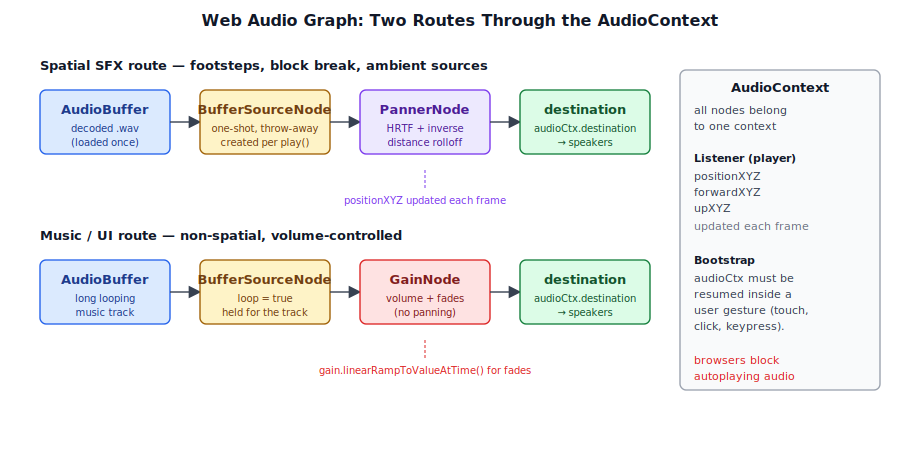
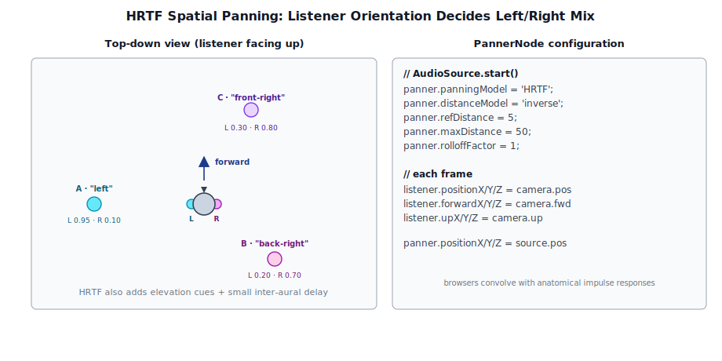
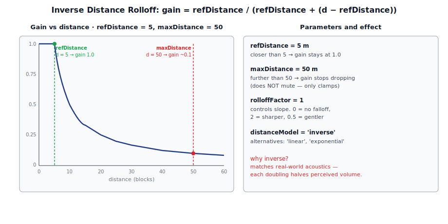
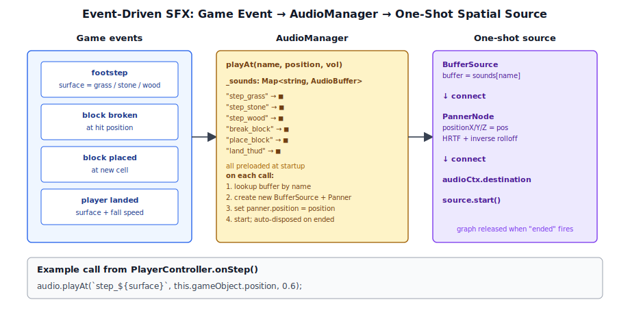

# Chapter 17: Audio

[Contents](../crafty.md) | [16-Weather System](16-weather-system.md) | [18-User Interface](18-user-interface.md)

Audio in Crafty uses the Web Audio API for spatialised sound effects and background music. Audio playback is triggered by game events and positioned in 3D space relative to the listener (the player's camera).

## 17.1 Web Audio API Fundamentals



The Web Audio API provides an `AudioContext` that manages all audio processing:

```typescript
const audioCtx = new AudioContext();
const listener = audioCtx.listener;
```

Sound effects are loaded as buffers:

```typescript
async function loadSound(url: string): Promise<AudioBuffer> {
  const response = await fetch(url);
  const arrayBuffer = await response.arrayBuffer();
  return await audioCtx.decodeAudioData(arrayBuffer);
}
```

## 17.2 Spatial Audio



Each `AudioSource` component creates a `PannerNode` that positions the sound in 3D space:

```typescript
class AudioSource extends Component {
  private _buffer: AudioBuffer;
  private _source: AudioBufferSourceNode | null = null;
  private _panner: PannerNode;

  start(): void {
    this._panner = audioCtx.createPanner();
    this._panner.panningModel = 'HRTF';
    this._panner.distanceModel = 'inverse';
    this._panner.maxDistance = 50;
    this._panner.refDistance = 5;
    this._panner.rolloffFactor = 1;
  }

  update(dt: number): void {
    // Update panner position to match the game object's world position
    const worldPos = this.gameObject.localToWorld().transformPoint(Vec3.zero());
    this._panner.positionX.value = worldPos.x;
    this._panner.positionY.value = worldPos.y;
    this._panner.positionZ.value = worldPos.z;
  }

  play(): void {
    this._source = audioCtx.createBufferSource();
    this._source.buffer = this._buffer;
    this._source.connect(this._panner).connect(audioCtx.destination);
    this._source.start();
  }
}
```

The HRTF panning model provides realistic directional audio — sounds to the left of the camera are quieter in the right ear, and vice versa.



## 17.3 Sound Effect Triggers



Sounds are triggered by game events through a simple audio manager:

```typescript
class AudioManager {
  private _sounds = new Map<string, AudioBuffer>();

  async preload(): Promise<void> {
    this._sounds.set('step_grass', await loadSound('audio/step_grass.wav'));
    this._sounds.set('step_stone', await loadSound('audio/step_stone.wav'));
    this._sounds.set('break_block', await loadSound('audio/break.wav'));
    this._sounds.set('place_block', await loadSound('audio/place.wav'));
    // ...
  }

  playAt(name: string, position: Vec3, volume = 1): void {
    // Create a one-shot AudioSource at the given position
  }
}
```

Footstep sounds are triggered by the player controller when the player moves and is on the ground. The sound varies based on the surface block type (grass, stone, wood).

## 17.4 Ambient and Music

Background music and ambient sounds use looping playback with gain nodes for volume control:

```typescript
class MusicPlayer {
  private _gain: GainNode;

  constructor() {
    this._gain = audioCtx.createGain();
    this._gain.connect(audioCtx.destination);
  }

  playTrack(url: string, volume = 0.5): void {
    // Load and loop the track through the gain node
  }

  fadeOut(duration = 2): Promise<void> {
    // Ramp gain to 0 over `duration` seconds
  }
}
```

Ambient sounds (wind, birds, water near rivers) use spatial audio sources positioned at relevant locations in the world. Multiple ambient sources fade based on the player's proximity to biomes and features.

**Further reading:**
- `crafty/game/audio_manager.ts` — Audio lifecycle management
- `src/engine/components/audio_source.ts` — Spatial audio component

----
[Contents](../crafty.md) | [16-Weather System](16-weather-system.md) | [18-User Interface](18-user-interface.md)
