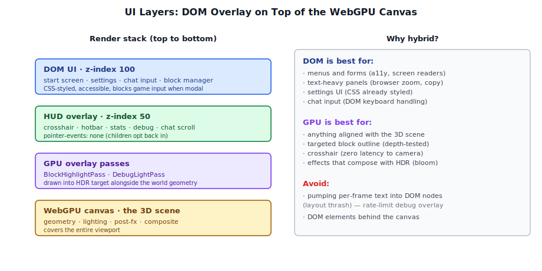
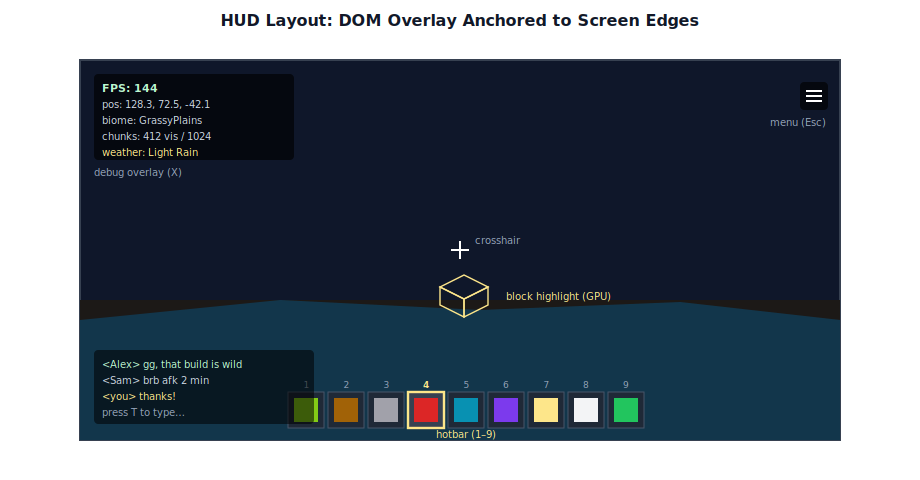
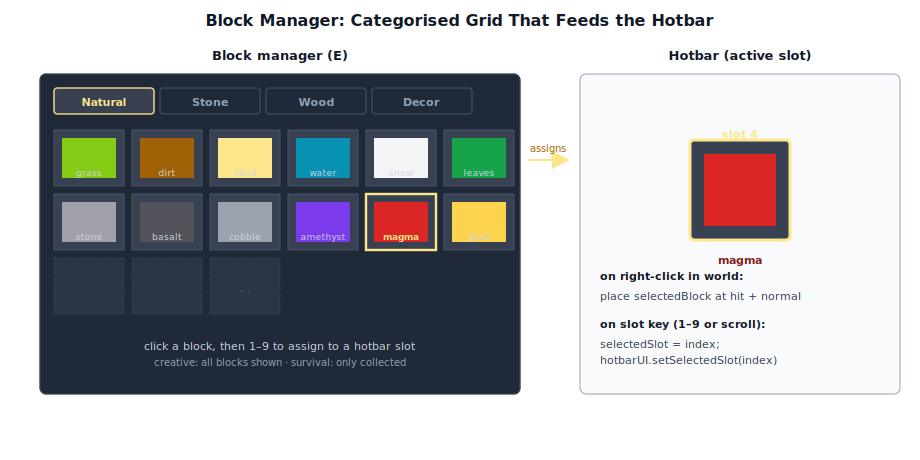

# Chapter 17: User Interface

[Contents](../crafty.md) | [16-Audio](16-audio.md) | [18-Network Architecture](18-network-architecture.md)

Crafty uses a hybrid UI approach: HTML/DOM for the menus and HUD, in-game overlays for crosshair and block interactions.

## 17.1 DOM-Based UI vs. In-Game UI



**DOM-based UI** is used for:
- Start screen (world selection, network connect)
- Settings panel (graphics, audio, controls)
- Chat window (multiplayer)

**In-game GPU-rendered overlays** are used for:
- Crosshair (rendered as a fullscreen overlay pass)
- Block highlight outline (`BlockHighlightPass`)
- Debug text overlay (FPS, position, chunk count)

The DOM approach gives us accessibility (screen readers, browser zoom) and familiar styling via CSS. The in-game approach ensures the crosshair and block highlight are correctly aligned with the 3D scene without latency.

## 17.2 The HUD



The HUD (`crafty/ui/hud.ts`) is a DOM overlay with:

- **Crosshair** — a small CSS-rendered cross at screen center.
- **Hotbar** — 9 slots showing the player's held blocks, with a selected-slot highlight.
- **Stats** — health, hunger, armour (survival mode).
- **Debug overlay** — FPS, coordinates, chunk count, render mode.
- **Chat area** — multiplayer chat messages.

```typescript
// ── from crafty/ui/hud.ts ──
class HUD {
  private _container: HTMLElement;
  private _hotbar: HotbarUI;
  private _crosshair: HTMLElement;
  private _debug: HTMLElement;

  update(player: PlayerController, stats: Stats): void {
    this._debug.textContent =
      `FPS: ${stats.fps} | Pos: ${player.position.toArray().map(v => v.toFixed(1)).join(', ')}`;
    this._hotbar.setSelectedSlot(player.selectedSlot);
  }
}
```

The HUD is styled with CSS to be transparent to mouse events (except for interactive elements like the chat input).

## 17.3 The Start Screen

The start screen (`crafty/ui/start_screen.ts`) appears before the game loads. It provides:

- **Single player** — create or load a local world.
- **Multiplayer** — enter a server address and player name to connect.
- **Settings** — graphics quality, audio volume, controls.

```typescript
// ── from crafty/ui/start_screen.ts ──
class StartScreen {
  private _container: HTMLElement;

  show(): void {
    this._container.style.display = 'flex';
  }

  hide(): void {
    this._container.style.display = 'none';
  }

  onStartSinglePlayer(worldName: string): void { /* ... */ }
  onConnectToServer(address: string, playerName: string): void { /* ... */ }
}
```

On connect to a multiplayer server, the start screen's name input is disabled to indicate the name was already sent and cannot be changed mid-session.

## 17.4 The Settings Panel

Settings are stored in `localStorage` and applied dynamically:

```typescript
// ── from crafty/ui/settings.ts ──
interface Settings {
  graphicsQuality: 'low' | 'medium' | 'high' | 'ultra';
  fov: number;
  renderDistance: number;
  masterVolume: number;
  mouseSensitivity: number;
  invertY: boolean;
}
```

Quality presets control shadow resolution, SSAO samples, bloom intensity, and particle counts.

## 17.5 The Block Manager



The block manager UI (`crafty/ui/block_manager.ts`) allows the player to select which block type to place. It shows a grid of available blocks with their textures, organized by category.

In creative mode, all block types are available. In survival mode, only blocks the player has collected are shown. The selected slot determines which block is placed on right-click.

### 17.6 Summary

The UI follows a hybrid approach combining DOM and GPU-rendered elements:

- **DOM-based UI**: Menus, HUD, and settings — fully accessible and CSS-styled
- **GPU overlays**: Crosshair and block highlight — zero latency with the 3D scene
- **HUD**: Crosshair, hotbar, stats, debug info, chat
- **Start screen**: Single player, multiplayer, and settings panels
- **Settings**: LocalStorage persistence with quality presets
- **Block manager**: Categorized grid with creative/survival mode filtering

**Further reading:**
- `crafty/ui/` — All UI components
- `crafty/ui/hud.ts` — In-game HUD
- `crafty/ui/start_screen.ts` — Start screen
- `crafty/ui/block_manager.ts` — Block selection grid

----
[Contents](../crafty.md) | [16-Audio](16-audio.md) | [18-Network Architecture](18-network-architecture.md)
