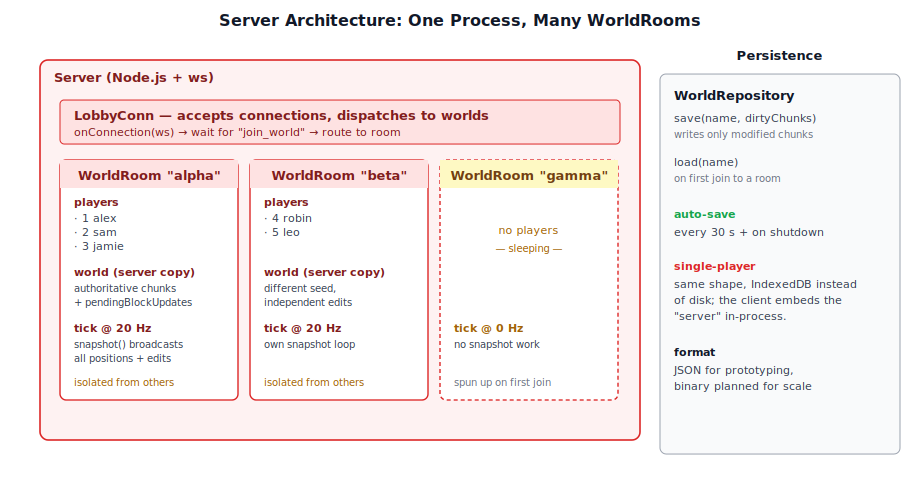
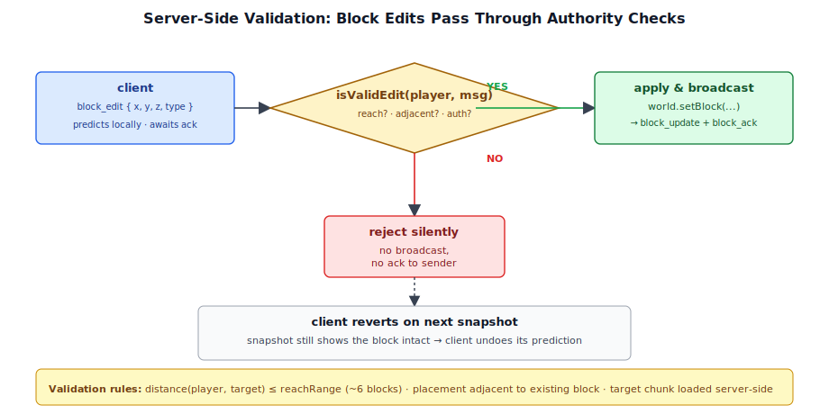

# Chapter 19: Network Architecture

[Contents](../crafty.md) | [18-User Interface](18-user-interface.md) | [20-Multiplayer Gameplay](20-multiplayer-gameplay.md)

Crafty supports multiplayer through a WebSocket-based server written in Node.js. The protocol is minimal and message-oriented.

## 19.1 WebSocket Fundamentals

WebSocket provides a persistent, full-duplex connection between the browser and the server. Crafty's client (`crafty/game/network_client.ts`) establishes the connection:

```typescript
class NetworkClient {
  private _ws: WebSocket;
  private _connected = false;

  async connect(address: string, playerName: string): Promise<void> {
    this._ws = new WebSocket(`ws://${address}`);
    // ... onopen, onmessage, onclose handlers ...

    // Send hello immediately on connect
    this._ws.onopen = () => {
      this._connected = true;
      this.send({ type: 'hello', name: playerName });
    };
  }
}
```

## 19.2 Message Protocol Design


Messages are JSON objects with a `type` field and type-specific payload. All messages are one of:

| Direction | Type | Payload | Purpose |
|-----------|------|---------|---------|
| C2S | `hello` | `{ name }` | Join request |
| S2C | `welcome` | `{ id, world }` | Accepted, world state |
| C2S | `input` | `{ seq, position, yaw, pitch, ... }` | Player input/state |
| S2C | `snapshot` | `{ seq, players[], blocks[] }` | World state broadcast |
| C2S | `block_edit` | `{ action, x, y, z, type }` | Block place/break |
| S2C | `block_update` | `{ x, y, z, type, author }` | Block change broadcast |
| C2S | `chat` | `{ message }` | Send chat message |
| S2C | `chat` | `{ from, message }` | Broadcast chat message |

## 19.3 Connection Lifecycle

```
Client                    Server
  │                         │
  │────── hello ──────────►│  Authenticate, assign ID
  │◄───── welcome ────────│  Send world state
  │                         │
  │◄───── snapshot ───────│  Periodic state broadcast (20 Hz)
  │────── input ─────────►│  Client sends player state
  │                         │
  │────── block_edit ─────►│  Block modification request
  │◄───── block_update ───│  Broadcast to all clients
```

## 19.4 The Server Architecture



The server (`server/src/server.ts`) manages multiple world rooms:

```typescript
class Server {
  private _rooms = new Map<string, WorldRoom>();

  onConnection(ws: WebSocket): void {
    const conn = new LobbyConn(ws);
    conn.on('join_world', (worldName) => {
      const room = this._rooms.get(worldName) ?? new WorldRoom(worldName);
      room.addPlayer(conn);
    });
  }
}
```

Each `WorldRoom` runs its own simulation loop, broadcasts snapshots, and validates block edits:

```typescript
class WorldRoom {
  private _players: PlayerConn[] = [];
  private _world: World;  // Server-side world state

  broadcast(data: object, except?: PlayerConn): void {
    for (const player of this._players) {
      if (player !== except) player.send(data);
    }
  }

  snapshot(): void {
    // Send all player positions and world changes
    this.broadcast({
      type: 'snapshot',
      players: this._players.map(p => p.snapshot()),
      blocks: this._pendingBlockUpdates,
    });
    this._pendingBlockUpdates = [];
  }
}
```

### Server-Side Authorisation



Block edits are validated on the server to prevent cheating. The server checks that the block being broken is within the player's reach distance and that the block being placed is adjacent to an existing block and within reach.

## 19.5 World State Persistence

Local worlds are saved to IndexedDB in the browser. Server-side worlds are persisted to disk as JSON or a simple binary format:

```typescript
class WorldRepository {
  async save(worldName: string, chunks: Chunk[]): Promise<void> {
    // Serialize chunk data and write to disk
  }

  async load(worldName: string): Promise<Chunk[]> {
    // Read and deserialize chunk data
  }
}
```

Auto-save runs every 30 seconds, writing only the chunks that have been modified since the last save. The server also saves on graceful shutdown.

**Further reading:**
- `server/src/server.ts` — WebSocket server entry point
- `server/src/world_room.ts` — Room/lobby management
- `crafty/game/network_client.ts` — Client-side networking

----
[Contents](../crafty.md) | [18-User Interface](18-user-interface.md) | [20-Multiplayer Gameplay](20-multiplayer-gameplay.md)