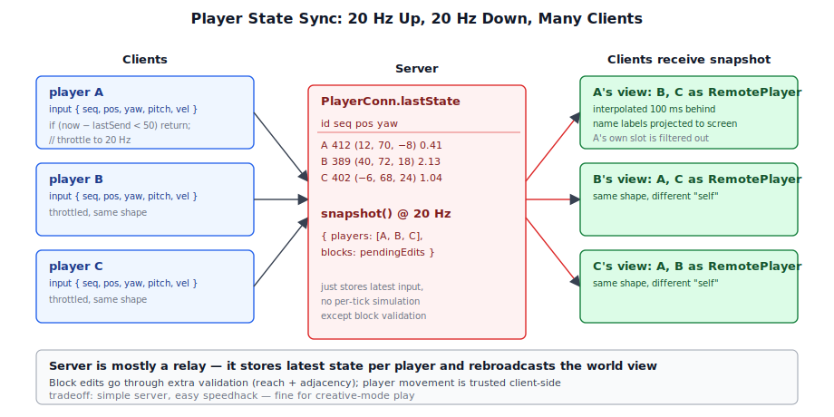
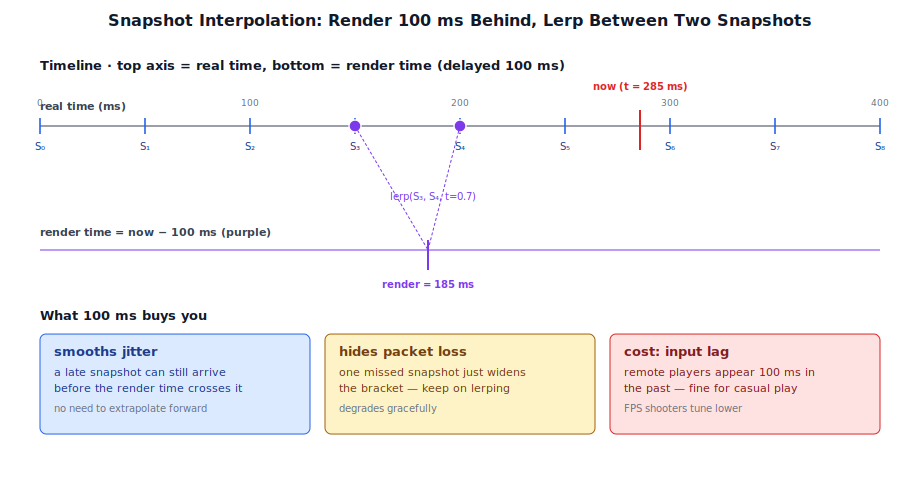
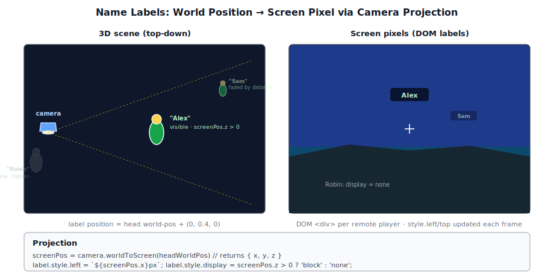
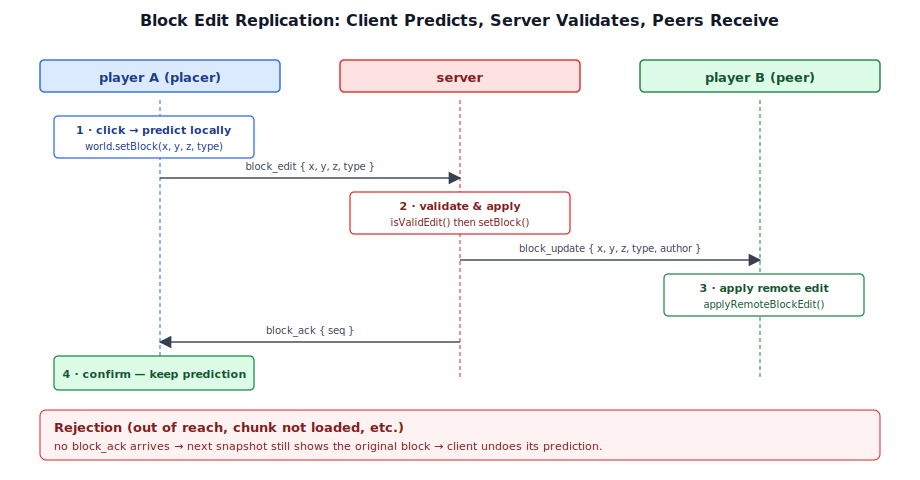

# Chapter 20: Multiplayer Gameplay

[Contents](../crafty.md) | [19-Network Architecture](19-network-architecture.md) | [21-Performance](21-performance.md)

Multiplayer gameplay adds state synchronisation, remote player rendering, and latency compensation.

## 20.1 Player State Synchronisation



The client sends its player state to the server at a fixed rate (typically 20 Hz):

```typescript
class NetworkClient {
  private _lastSend = 0;

  sendInput(): void {
    const now = performance.now();
    if (now - this._lastSend < 50) return;  // 20 Hz
    this._lastSend = now;

    this.send({
      type: 'input',
      seq: this._seq++,
      position: this._player.position.toArray(),
      yaw: this._player.yaw,
      pitch: this._player.pitch,
      velocity: this._player.velocity.toArray(),
    });
  }
}
```

The server stores the latest state for each player and broadcasts snapshots to all clients:

```typescript
class PlayerConn {
  lastState: {
    seq: number;
    position: [number, number, number];
    yaw: number;
    pitch: number;
    velocity: [number, number, number];
  };

  snapshot() {
    return {
      id: this.id,
      name: this.name,
      ...this.lastState,
    };
  }
}
```

## 20.2 Snapshot Interpolation



The client receives snapshots at 20 Hz but renders at 60+ Hz. Snapshot interpolation smooths the motion between received states:

```typescript
class SnapshotInterpolator {
  private _history: Snapshot[] = [];
  private _renderDelay = 100;  // ms behind real-time

  addSnapshot(snapshot: Snapshot): void {
    this._history.push(snapshot);
    // Keep 500ms of history
    if (this._history.length > 20) this._history.shift();
  }

  interpolate(timestamp: number): Snapshot {
    const renderTime = timestamp - this._renderDelay;

    // Find two bracketing snapshots
    const a = this._history.findLast(s => s.timestamp <= renderTime);
    const b = this._history.find(s => s.timestamp > renderTime);
    if (!a || !b) return a ?? b ?? this._history[0];

    const t = (renderTime - a.timestamp) / (b.timestamp - a.timestamp);
    return this._lerp(a, b, clamp(t, 0, 1));
  }
}
```

The 100 ms render delay gives the interpolation buffer time to fill. This introduces a small but imperceptible input lag while eliminating visible jitter.

## 20.3 Remote Player Rendering

Remote players are rendered as animated character meshes with name labels. The `RemotePlayer` component updates its position from the interpolated snapshot:

```typescript
class RemotePlayer {
  private _interpolator: SnapshotInterpolator;

  update(dt: number): void {
    const snapshot = this._interpolator.interpolate(performance.now());
    if (!snapshot) return;

    this.gameObject.position = Vec3.fromArray(snapshot.position);
    this._headYaw = snapshot.yaw;
    this._headPitch = snapshot.pitch;

    // Smooth body rotation (yaw only, no pitch for the body)
    const targetBodyYaw = snapshot.yaw;
    this._bodyYaw = lerpAngle(this._bodyYaw, targetBodyYaw, dt * 10);
  }
}
```

## 20.4 Name Labels



Each remote player has a name label rendered as a DOM element positioned above the player's head. The label position is projected from 3D world space to 2D screen space:

```typescript
function updateNameLabel(label: HTMLElement, worldPos: Vec3, camera: Camera, canvas: HTMLCanvasElement): void {
  const screenPos = camera.worldToScreen(worldPos);
  label.style.display = screenPos.z > 0 ? 'block' : 'none';
  label.style.left = `${screenPos.x}px`;
  label.style.top = `${screenPos.y}px`;
}
```

The label fades with distance and is hidden when behind the camera. Player names are sent once in the `hello` message and stored on the server; the name input is disabled after connecting to prevent confusion.

## 20.5 Block Edit Replication



When a player places or breaks a block, the client sends a `block_edit` message and immediately applies the change locally (client-side prediction). The server validates the edit and broadcasts a `block_update` to all other clients:

```typescript
// Client sends:
client.send({ type: 'block_edit', action: 'break', x, y, z });

// Server receives, validates, broadcasts:
server.onBlockEdit(player, msg) {
  if (isValidEdit(player, msg)) {
    world.setBlock(msg.x, msg.y, msg.z, msg.action === 'break' ? 0 : msg.type);
    room.broadcast({ type: 'block_update', x: msg.x, y: msg.y, z: msg.z,
                     type: msg.action === 'break' ? 0 : msg.type, author: player.id }, player);
    player.send({ type: 'block_ack', seq: msg.seq });  // Confirm to sender
  }
}
```

## 20.6 Latency Compensation

Crafty does not implement server-side rewind (lag compensation) for block interactions. Instead, the client uses a simple interpolation delay that trades a small amount of latency for smoothness:

- **Player movement**: predicted on the client, reconciled with server snapshots.
- **Block editing**: client predicts the change immediately; server validates and broadcasts.
- **Remote players**: interpolated with 100 ms delay to hide packet loss and jitter.

This approach is sufficient for a creative-mode voxel game where precise frame-perfect interaction timing is not critical.

**Further reading:**
- `crafty/game/network_client.ts` — Client network state management
- `crafty/game/remote_player.ts` — Remote player rendering
- `server/src/world_room.ts` — Server-side broadcast

----
[Contents](../crafty.md) | [19-Network Architecture](19-network-architecture.md) | [21-Performance](21-performance.md)
