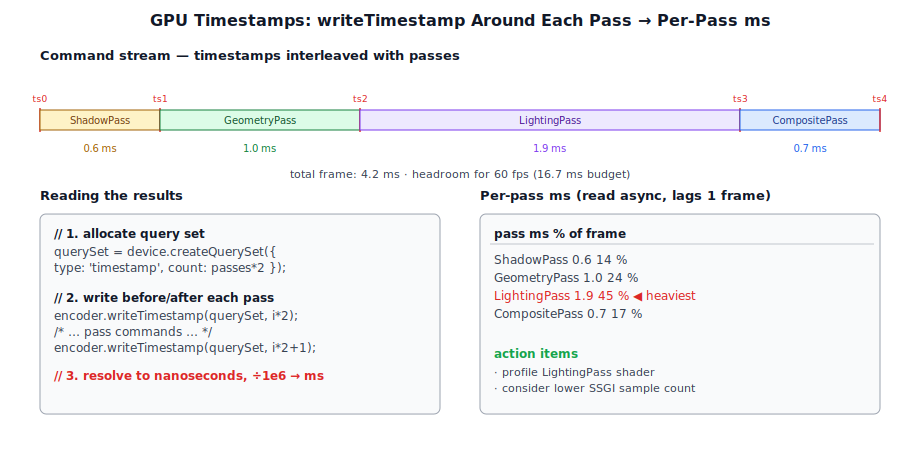
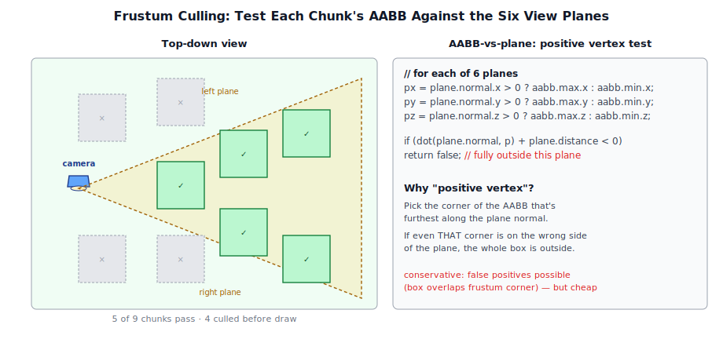
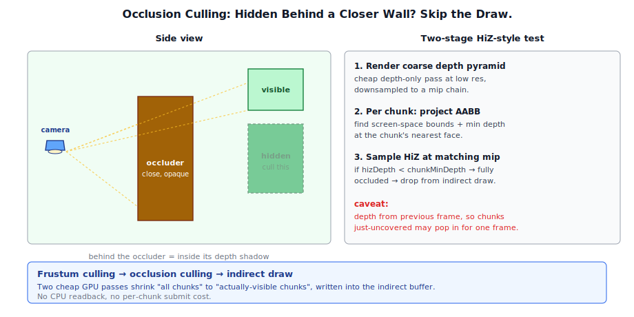
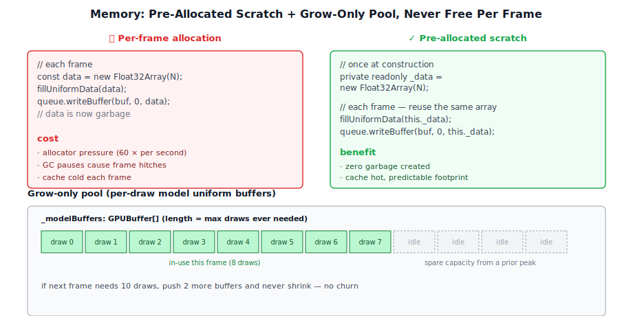

# Chapter 21: Performance

[Contents](../crafty.md) | [20-Multiplayer Gameplay](20-multiplayer-gameplay.md) | [22-Tools](22-tools.md)

This chapter covers the profiling, optimization, and culling techniques used to keep Crafty running at 60+ FPS on mid-range hardware.

## 21.1 GPU Timestamps and Profiling



Crafty uses WebGPU timestamp queries to measure per-pass GPU execution time:

```typescript
// ── from src/renderer/profiling.ts ──
const querySet = device.createQuerySet({
  type: 'timestamp',
  count: passCount * 2,  // begin + end per pass
});

// In the command encoder:
const pass = encoder.beginRenderPass({ ... });
encoder.writeTimestamp(querySet, passIndex * 2);
// ... draw calls ...
encoder.writeTimestamp(querySet, passIndex * 2 + 1);
pass.end();

// Read back results
const results = new BigUint64Array(passCount * 2);
await device.queue.readBuffer(timestampBuffer, 0, results.buffer);

for (let i = 0; i < passCount; i++) {
  const duration = Number(results[i * 2 + 1] - results[i * 2]);
  const ms = duration / 1_000_000;  // Nanoseconds to milliseconds
  console.log(`Pass ${i}: ${ms.toFixed(2)} ms`);
}
```

Timestamp queries require the `'timestamp-query'` feature, which must be requested during device creation. The results identify which passes are GPU-bound.

## 21.2 Async Shader Compilation

Pipeline compilation is expensive. Crafty uses the `getCompilationInfo()` API to diagnose shader compile errors, and creates pipelines lazily (on first use) rather than upfront:

```typescript
// ── from src/renderer/pipeline_cache.ts ──
private _getPipeline(device: GPUDevice, material: Material): GPURenderPipeline {
  let pipeline = this._pipelineCache.get(material.shaderId);
  if (pipeline) return pipeline;
  // Compile and cache — first frame with a new shader may hitch
  pipeline = device.createRenderPipeline({ ... });
  this._pipelineCache.set(material.shaderId, pipeline);
  return pipeline;
}
```

For materials that are always visible, pipelines can be compiled eagerly during the loading screen by iterating the material list and calling `_getPipeline` once.

## 21.3 Frustum Culling



Every chunk and mesh is tested against the camera frustum before rendering. The test uses the six planes of the view-projection frustum:

```typescript
// ── from src/renderer/culling.ts ──
function isVisible(aabb: AABB, frustum: Plane[]): boolean {
  for (const plane of frustum) {
    // Compute the signed distance of the AABB's positive vertex
    // (the vertex most in the direction of the plane normal)
    const px = plane.normal.x > 0 ? aabb.max.x : aabb.min.x;
    const py = plane.normal.y > 0 ? aabb.max.y : aabb.min.y;
    const pz = plane.normal.z > 0 ? aabb.max.z : aabb.min.z;
    if (plane.normal.dot(new Vec3(px, py, pz)) + plane.distance < 0) {
      return false;
    }
  }
  return true;
}
```

Frustum culling for chunks uses the chunk's axis-aligned bounding box (16×256×16 blocks). Mesh objects use their local AABB transformed to world space.

## 21.4 Occlusion Culling



Occlusion culling determines whether an object is hidden behind other objects (not just outside the frustum). Crafty uses a simple **temporal occlusion culling** approach:

1. Render a low-resolution depth buffer of occluders (large chunks in the near field).
2. For each cull candidate, test its bounding box against this depth buffer.
3. If fully occluded, skip the draw call.

This is implemented as a compute pass that reads the depth buffer and writes an indirect draw count.

## 21.5 Draw Call Batching

Chunk rendering uses **indirect draw** to issue many draws with a single call. The chunk visibility and draw parameters are computed on the GPU:

```typescript
// ── from src/renderer/indirect_draw.wgsl ──
struct DrawArraysIndirect {
  indexCount: u32;
  instanceCount: u32;
  firstIndex: u32;
  baseVertex: i32;
  firstInstance: u32;
};
```

A compute shader performs frustum culling on the GPU and packs visible chunks into the indirect buffer. This eliminates CPU-GPU round trips for chunk culling.

## 21.6 Memory Management



### Pre-Allocated Staging Arrays

Many passes pre-allocate `Float32Array` / `Uint32Array` scratch buffers to avoid per-frame GC pressure:

```typescript
// ── from src/renderer/pre_allocated.ts ──
private readonly _modelData = new Float32Array(32);
private readonly _cameraScratch = new Float32Array(CAMERA_UNIFORM_SIZE / 4);
```

### Buffer Pooling

Per-draw model uniform buffers are grown on demand but never freed during gameplay:

```typescript
// ── from src/renderer/buffer_pool.ts ──
private _ensureModelBuffers(device: GPUDevice, count: number): void {
  while (this._modelBuffers.length < count) {
    const buffer = device.createBuffer({ ... });
    this._modelBuffers.push(buffer);
  }
}
```

This avoids allocation and deallocation churn when the draw count varies between frames.

### Texture Management

Textures are reference-counted and destroyed when no longer referenced. The asset manager caches loaded textures by URL:

```typescript
// ── from crafty/game/texture_cache.ts ──
class TextureCache {
  private _cache = new Map<string, Promise<GPUTexture>>();

  get(url: string): Promise<GPUTexture> {
    if (!this._cache.has(url)) {
      this._cache.set(url, this._load(url));
    }
    return this._cache.get(url)!;
  }

  release(url: string): void {
    // Decrement reference count; destroy when zero
  }
}
```

### 21.7 Summary

Performance optimization techniques used throughout Crafty:

- **Profiling**: GPU timestamp queries for per-pass timing
- **Shader compilation**: Lazy pipeline creation with caching to avoid stalls
- **Culling**: Frustum culling (6-plane AABB) and temporal occlusion culling
- **Batching**: GPU indirect draw with compute shader culling for reduced CPU overhead
- **Memory management**: Pre-allocated staging arrays, buffer pooling, texture cache with reference counting

**Further reading:**
- `src/renderer/passes/` — Per-pass buffer pre-allocation patterns
- `src/block/chunk.ts` — Chunk culling
- `crafty/main.ts` — Frame loop and performance tracking

----
[Contents](../crafty.md) | [20-Multiplayer Gameplay](20-multiplayer-gameplay.md) | [22-Tools](22-tools.md)
