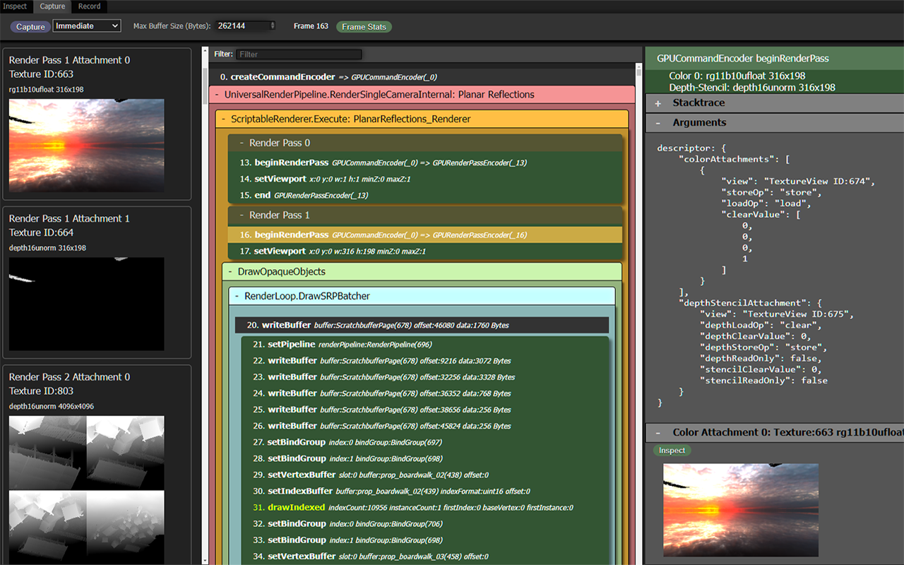

# Chapter 22: Tools and Workflow

[Contents](../crafty.md) | [21-Performance](21-performance.md) | [23-Road Ahead](23-road-ahead.md)

Crafty includes several tools and conventions for development, testing, and debugging.

## 22.1 The Sample Framework

Self-contained samples in `samples/` demonstrate individual features in isolation. Each sample has an HTML file and a TypeScript entry point:

```
samples/
├── forward_test.html
├── forward_tes.ts              — Forward renderer demo
├── engine_test.html
├── engine_test.ts              — Full deferred pipeline test
├── animal_test.html
├── animal_test.ts              — Test animal NPCs
├── cascade_shadow_test.html
└── cascade_shadow_test.ts      — CSM visualization
```

Samples share no state with each other or with the main game. Each creates its own `RenderContext`, builds a minimal render graph, and runs a dedicated frame loop. This makes them ideal for testing specific features in isolation.

To add a new sample, create two files. A typescript file:

```typescript
// ── from samples/my_feature.ts ──
import { RenderContext, RenderGraph, ... } from '../../src/index.js';

async function main() {
  const canvas = document.getElementById('canvas') as HTMLCanvasElement;
  const ctx = await RenderContext.create(canvas);
  // ... build minimal render graph ...
}

main();
```

With an associated html:

```html
<!DOCTYPE html>
<html lang="en">
<head>
  <meta charset="UTF-8">
  <meta name="viewport" content="width=device-width, initial-scale=1.0">
  <title>Test My Feature</title>
  <link rel="icon" href="../favicon.svg" type="image/svg+xml">
</head>
<body>
  <canvas id="canvas"></canvas>
  <script type="module" src="./my_feature.ts"></script>
</body>
</html>
```

## 22.2 Testing Strategy

Crafty uses **Vitest** for unit testing. Tests live in `tests/` and cover mathematical correctness, data structure invariants, and component behavior:

```typescript
// ── from tests/math/vec3.test.ts ──
test('cross product is right-handed', () => {
  const result = Vec3.up().cross(Vec3.forward());
  expect(result.x).toBeCloseTo(1);  // Should equal Vec3.right()
  expect(result.y).toBeCloseTo(0);
  expect(result.z).toBeCloseTo(0);
});

test('normalize produces unit vector', () => {
  const v = new Vec3(3, 4, 0);
  const n = v.normalize();
  expect(n.length()).toBeCloseTo(1);
});
```

Tests are run with:

| Command | Purpose |
|---------|---------|
| `npm test` | Watch mode (re-run on change) |
| `npm run test:run` | Single run (CI) |
| `npm run test:coverage` | Single run with coverage report |

WebGPU-dependent features cannot be tested in Node.js. Those are tested via sample pages and visual inspection.

## 22.3 Debugging WebGPU

### Validation Errors

WebGPU validation errors are the primary debugging tool. With `enableErrorHandling: true`, Crafty wraps each pass in error scopes:

```typescript
// ── from src/renderer/render_context.ts ──
ctx.pushPassErrorScope('GeometryPass');
pass.execute(encoder, ctx);
await ctx.popPassErrorScope('GeometryPass');
```

This captures the exact pass that caused a validation error, along with the error message.

### Shader Debugging

WGSL compilation errors are reported through `getCompilationInfo()`:

```typescript
// ── from src/renderer/shader_debug.ts ──
const info = shaderModule.getCompilationInfo();
for (const msg of info.messages) {
  if (msg.type === 'error') {
    console.error(`${msg.lineNum}:${msg.linePos}: ${msg.message}`);
    console.error(`  ${msg.offset}: ${... surrounding source ...}`);
  }
}
```

### WebGPU Inspector (Chrome Extension)

The [**WebGPU Inspector**](https://chromewebstore.google.com/detail/webgpu-inspector/holcbbnljhkpkjkhgkagjkhhpeochfal) is a Chrome extension that provides GPU debugging capabilities. Its source is at <https://github.com/brendan-duncan/webgpu_inspector>. It shows:

- Active pipelines, bind groups, and resources.
- Texture and buffer contents (viewable as images/hex).
- GPU command traces.
- Validation error messages with backtraces.



## 22.4 Asset Pipeline

### Texture Atlas Building

The block texture atlas is built by `scripts/build_atlas.js`. It packs individual block face textures into a single atlas texture:

```bash
npm run build-atlas -- --input assets/blocks/ --output assets/atlas/
```

The atlas generator outputs:

- Atlas image (PNG): packed texture tiles.
- Atlas metadata (JSON): per-block UV offsets and scales.

### HDR Map Preprocessing

HDR environment maps are processed offline to generate the IBL textures:

1. Load `.hdr` file.
2. Generate irradiance map (convolution with cosine-weighted hemisphere).
3. Generate prefilter map (importance-sampled GGX mip chain).
4. Generate BRDF LUT (2D texture).

These are pre-computed once and loaded at runtime, rather than computing them on the GPU each session.

## 22.5 Continuous Integration

The project uses GitHub Actions for CI. The workflow:

1. **Checkout** and install Node.js.
2. **Install dependencies** with `npm ci`.
3. **Type-check** with `npx tsc --noEmit`.
4. **Lint** with `npx eslint src/`.
5. **Run tests** with `npm run test:run`.
6. **Build** with `npm run build`.

The CI pipeline does not run visual tests (no WebGPU in CI environments). Visual regression testing is done manually through the sample framework.

### 22.6 Summary

The tooling and workflow infrastructure includes:

- **Sample framework**: Self-contained demos for isolated feature testing
- **Testing strategy**: Vitest for unit tests, sample pages for visual regression
- **Debugging**: WebGPU validation errors with per-pass error scopes, WGSL compilation info, Chrome extension
- **Asset pipeline**: Texture atlas building and HDR map preprocessing
- **CI pipeline**: GitHub Actions with type-check, lint, test, and build stages

**Further reading:**
- `tests/` — Unit test directory
- `scripts/` — Build and asset processing scripts
- `samples/` — Self-contained demos

----
[Contents](../crafty.md) | [21-Performance](21-performance.md) | [23-Road Ahead](23-road-ahead.md)
