<div style="text-align: center; padding-top: 30%;">
  <h1 style="font-size: 2.5em; margin-bottom: 0.2em;">Crafty</h1>
  <h2 style="font-size: 1.5em; color: #555; font-weight: normal; margin-top: 0;">Building a WebGPU Voxel Game Engine</h2>
  <p style="margin-top: 3em; font-size: 1.1em; color: #777;">Brendan Duncan</p>
</div>

<div style="page-break-after: always;"></div>


# Crafty: Building a WebGPU Voxel Game Engine

This book explores real-time graphics programming through the lens of **Crafty**,
an open-source WebGPU voxel game engine written in TypeScript.


## Who this is for

You have written a few small graphics demos and want to understand how a
complete, multi-pass deferred renderer works end-to-end. You are comfortable
with TypeScript or a C-family language and have a basic understanding of linear
algebra. You do *not* need prior WebGPU experience — we cover the API from the
ground up.

## What you will learn

| Topic | What we build |
|-------|---------------|
| WebGPU fundamentals | Device, queue, buffers, textures, bind groups |
| Shader authoring | WGSL — vertex, fragment, compute |
| Render graph architecture | Multi-pass deferred rendering |
| PBR lighting | Directional + point + spot, IBL, BRDF |
| Shadow algorithms | Cascade shadow maps, VSM, spot shadows |
| GPU particle systems | Compute-based spawn/update/compact, billboard rendering |
| Post-processing | Bloom, TAA, SSAO, DOF, tone-mapping |
| Terrain rendering | Chunked voxel world, greedy meshing, LOD |
| Game engine design | Component/entity system, scene graph |
| Networking | WebSocket multiplayer, state sync, snapshot interpolation |
| Performance | GPU timestamps, pipeline barriers, async compilation |

## How to read this book

The canonical companion is the Crafty source tree at
<https://github.com/brendan-duncan/crafty>.  Each chapter cross-references the
relevant source files — you are encouraged to open them side-by-side.

Code blocks are either **annotated excerpts** (showing the key logic) or
**complete listings** (the entire file).  Excerpts use `// ── ... ──` markers
to indicate elided boilerplate.

## The Crafty philosophy

> **Write it once, understand it forever.**

No black boxes.  Every system is built from scratch — we import only the
WebGPU API and the standard library.  If we use a third-party tool (e.g. a
texture compressor), we explain why and how it fits.

## Directory layout

```
crafty/
├── docs/                  # This book
├── src/                   # Core engine library
│   ├── math/              # Vec3, Mat4, Quaternion, etc.
│   ├── engine/            # Scene graph, components, materials
│   ├── assets/            # Mesh, Texture, shader loading
│   ├── block/             # Voxel world, chunks, biomes
│   └── renderer/          # WebGPU render graph & passes
├── crafty/                # Game application
│   ├── game/              # Multiplayer, player, interactions
│   ├── ui/                # HUD, hotbar, start screen
├── samples/               # Self-contained demos
└── server/                # Multiplayer server
```

## Status

This book is a work in progress.  Chapters are added as the engine evolves.


<div style="page-break-after: always;"></div>


# Chapter 1: Introduction


## 1.1 What is Crafty?

Crafty is a voxel game engine and rendering framework built entirely from scratch on top of WebGPU. It is written in TypeScript and runs in any browser that supports the WebGPU API.

The engine demonstrates a complete, production-quality rendering pipeline:

- **Multi-pass deferred rendering** with a GBuffer, HDR lighting, and forward+ transparency
- **Cascaded shadow maps** for a directional sun light
- **Variance shadow maps** for point and spot lights
- **Full post-processing suite**: temporal anti-aliasing (TAA), bloom, screen-space ambient occlusion (SSAO), screen-space global illumination (SSGI), depth of field (DOF), god rays, auto-exposure, and HDR tonemapping
- **Procedural voxel terrain** with chunk management, greedy meshing, and LOD
- **GPU compute particles**, water rendering, volumetric clouds, and atmospheric sky
- **A component/entity game engine** with scene graph, player controller, physics, and multiplayer networking

But Crafty is more than a demo — it is a *teaching vehicle*. Every system is built by hand. We import only the WebGPU API and the TypeScript standard library. There are no middleware rendering libraries, no physics engines, no black boxes. If you want to understand how a modern real-time renderer works from the GPU queue up, you can read every line of code here.

## 1.2 A Brief History of Graphics APIs

To understand why WebGPU exists, it helps to see where it came from.

**The fixed-function era (1990s).** OpenGL 1.0 and Direct3D 7 gave you a fixed pipeline: set a light, set a material, draw a triangle. You could configure parameters, but you could not reprogram how the GPU worked. This was simple but limiting — every effect that deviated from the standard model required expensive CPU-driven workarounds.

**The shader revolution (2000s).** OpenGL 2.0 / Direct3D 8 introduced programmable vertex and fragment shaders. Suddenly developers could write small programs that ran directly on the GPU. The fixed-function pipeline was still there as a fallback, but the industry rapidly moved toward fully programmable pipelines. OpenGL 3.2 (2009) made the core profile mandatory and deprecated the fixed-function path.

**The explicit API shift (2010s).** OpenGL and Direct3D 11 were *driver-managed* — the driver handled memory allocation, synchronization, and state validation. This made them easy to use but unpredictable. Games that pushed hardware limits needed lower overhead. Apple developed Metal (2014), Microsoft released Direct3D 12 (2015), and the Khronos group standardized Vulkan (2016). These explicit APIs gave applications direct control over GPU resources and command submission, at the cost of significantly more boilerplate.

**WebGPU — the web-native explicit API.** The web needed a modern graphics API that could run on all three native backends (Metal, D3D12, Vulkan) without the legacy baggage of WebGL (which was based on OpenGL ES 2.0/3.0). WebGPU, designed by the W3M GPU for the Web Community Group, is the result. It provides an explicit, low-overhead API with a clean, ergonomic design that feels like Metal with Vulkan's validation philosophy baked in.


## 1.3 Why WebGPU?

We chose WebGPU for Crafty for several reasons:

**Zero installation.** The user opens a URL and the engine runs. No downloads, no SDKs, no platform-specific builds. This dramatically lowers the barrier to entry for readers who want to experiment.

**First-class TypeScript.** The entire engine is written in TypeScript, which means we get static typing, modern async/await, and a rich ecosystem of developer tooling — all without a compilation step to native code. Debugging is done in the browser's DevTools, which every web developer already knows.

**Clean API design.** Compared to Vulkan, WebGPU eliminates enormous amounts of boilerplate. There are no instance/device/queue hierarchy splits, no explicit memory allocation, and no manual synchronization (the driver still handles resource tracking under the hood, just with more predictability than OpenGL). Yet WebGPU retains the explicit pipeline state objects, descriptor-based resource binding, and command buffer recording that make modern APIs efficient.

**Cross-platform.** Write once, run on Windows (D3D12), macOS/iOS (Metal), Linux/Android (Vulkan), and — eventually — all major browsers. No `#ifdef` platform paths.


**It is the future of graphics on the web.** WebGL 2.0 is in maintenance mode. All major browser vendors have committed to WebGPU as the successor. Learning WebGPU today means your skills are relevant for the next decade.

## 1.4 Literate Programming with This Book

This book follows the tradition of Donald Knuth's *Literate Programming* and, more directly, *Physically Based Rendering: From Theory to Implementation* by Pharr, Jakob, and Humphreys. The core idea is simple:

> The code *is* the explanation. We present source files alongside the reasoning that produced them.

Each chapter focuses on a subsystem of Crafty. We walk through the key source files, showing annotated excerpts that illustrate the central logic. When a full file is needed, we show it in its entirety. You are encouraged to open the actual source tree alongside this book — every code block references its file path.

The convention for annotated excerpts is:

```typescript
// ── from src/renderer/gbuffer.ts ──

// ... boilerplate context elided ...

// The three G-buffer textures share the canvas dimensions
this._width = ctx.width;
this._height = ctx.height;
// ── end of excerpt ──
```

Code blocks that are **complete file listings** are marked by listing the full path at the top and containing the entire file's content.

## 1.5 Setting Up the Development Environment

To follow along with this book, you need:

- **A browser that supports WebGPU.** Open `webgpureport.org` to check if your browser supports WebGPU. This will include a report about all of the features available to WebGPU.
- **Node.js 20+** (for development tooling).
- **A code editor** — VS Code is recommended for its TypeScript integration.

Clone the repository and install dependencies:

```bash
git clone https://github.com/brendan-duncan/crafty
cd crafty
npm install
```

Start the development server:

```bash
npm run dev
```

This launches Vite on `http://localhost:5173`. Open it in your browser and you should see a screen letting you open Crafty or one of the Samples.

Crafty can be opened at `http://localhost:5173/crafty/`.

The project uses the following toolchain:

| Tool | Purpose |
|------|---------|
| **TypeScript** (v5.4+) | All source code, strict mode enabled |
| **Vite** (v5.2+) | Development server and production bundler |
| **Vitest** | Unit testing framework |
| **@webgpu/types** | TypeScript type definitions for the WebGPU API |

You can run the test suite to verify your environment:

```bash
npm run test:run
```

The full `package.json` at `package.json` defines all available scripts:

| Command | What it does |
|---------|-------------|
| `npm run dev` | Start Vite dev server |
| `npm run build` | Type-check then production build |
| `npm test` | Run tests in watch mode |
| `npm run test:run` | Run tests once |
| `npm run test:coverage` | Run tests with coverage |
| `npm run server` | Start the multiplayer server |

There are also self-contained sample pages in `samples/`. Each sample pairs an HTML file with a TypeScript entry point. To view a sample, navigate to its HTML path, e.g. `http://localhost:5173/samples/forward_pass.html`.

## 1.6 The Crafty Codebase at a Glance

The project root is organized as follows:

```
crafty/
├── book/                   # This book (literate programming)
├── src/                    # Core engine library
│   ├── math/               # Vec3, Mat4, Quaternion, noise, random
│   ├── engine/             # Scene graph, components, materials
│   ├── assets/             # Mesh, texture, shader loading
│   ├── block/              # Voxel world, chunks, biomes
│   └── renderer/           # WebGPU render graph and passes
├── crafty/                 # Game application
│   ├── game/               # Multiplayer networking, player state
│   ├── samples/            # Self-contained demo pages
│   └── ui/                 # HUD, hotbar, start screen
├── server/                 # WebSocket multiplayer server (Node.js)
├── tests/                  # Unit tests (Vitest)
├── scripts/                # Build tools (texture atlas, etc.)
├── package.json
├── tsconfig.json
└── vite.config.ts
```

The library code in `src/` is self-contained and could be used independently from the game application in `crafty/`. The game application is the primary consumer of the library and demonstrates all its features.

These directories form a layered architecture — each layer depends only on the ones below it, with WebGPU and the TypeScript standard library at the very bottom:


**Where we go from here.** This book proceeds in five parts:

1. **Foundations** (Chapters 1–3): Mathematics, WebGPU API fundamentals.
2. **Rendering** (Chapters 4–11): The render graph, meshes, textures, lighting, shadows, post-processing, sky, terrain.
3. **Game Engine** (Chapters 12–15): Components, scenes, physics, audio, UI.
4. **Multiplayer** (Chapters 16–17): WebSocket networking, state sync, snapshot interpolation.
5. **Advanced Topics** (Chapters 18–20): Performance, tools, and future directions.


By the end, you will understand how every pixel on the screen got there — from the WGSL shader that computed it to the WebGPU pipeline that rasterized it to the game engine that placed the object in the world.

<div style="page-break-after: always;"></div>


# Chapter 2: 3D Mathematics


Before we can render anything, we need a solid foundation in 3D mathematics. This chapter presents the vector, matrix, and quaternion types that every system in Crafty depends on.

## 2.1 Coordinate Systems and Conventions

Crafty uses a **right-handed, Y-up, -Z-forward** coordinate system. This is the same convention used by OpenGL, Maya, and many game engines. WebGPU's native coordinate system is also right-handed with a [0, 1] depth range (unlike OpenGL's [-1, 1]).

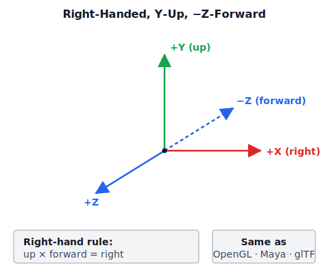

| Convention | Crafty choice |
|------------|--------------|
| Handedness | Right-handed |
| Up | +Y `(0, 1, 0)` |
| Forward | -Z `(0, 0, -1)` |
| Matrix storage | Column-major in `Float32Array` |
| Depth range | [0, 1] (WebGPU) |
| Winding order | Counter-clockwise (front faces) |

The `Vec3` class encodes these conventions through static factory methods:

```typescript
// ── from src/math/vec3.ts ──

static up(): Vec3 {
  return new Vec3(0, 1, 0);
}

static forward(): Vec3 {
  // Right-handed -Z forward convention
  return new Vec3(0, 0, -1);
}

static right(): Vec3 {
  return new Vec3(1, 0, 0);
}

// The cross product confirms right-handedness:
//   up × forward = right
//   (0,1,0) × (0,0,-1) = (1,0,0)
cross(v: Vec3): Vec3 {
  return new Vec3(
    this.y * v.z - this.z * v.y,
    this.z * v.x - this.x * v.z,
    this.x * v.y - this.y * v.x,
  );
}
```

The cross product formula above is the standard right-handed cross product. You can verify: `Vec3.up().cross(Vec3.forward()) = Vec3.right()`.

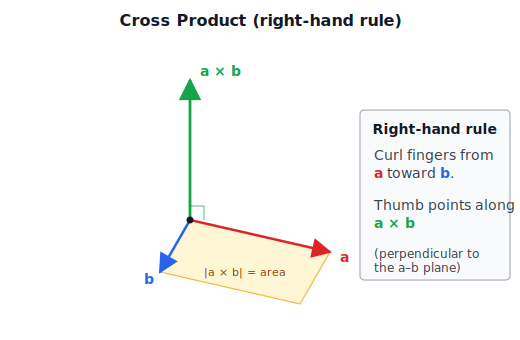

The cross product `a × b` produces a vector perpendicular to both inputs, with magnitude equal to the area of the parallelogram they span. The right-hand rule fixes the direction.

## 2.2 Vectors

### Vec2, Vec3, Vec4

Crafty defines three vector classes in `src/math/`: `Vec2` (`vec2.ts`), `Vec3` (`vec3.ts`), and `Vec4` (`vec4.ts`). All three follow the same design pattern:

- **Mutable** `x`, `y`, `z`, `w` fields (you can read and write them directly).
- **Immutable arithmetic** — every operation returns a **new** vector. The original is never modified (except by `set()`).
- Method chaining via `set()`, which mutates in place and returns `this`.

The `Vec3` class is the workhorse of the engine. It represents positions, directions, colors, and normals. Here is its interface:

```typescript
// ── from src/math/vec3.ts ──

export class Vec3 {
  x: number;
  y: number;
  z: number;

  constructor(x = 0, y = 0, z = 0);

  // Mutation
  set(x: number, y: number, z: number): this;

  // Arithmetic (all return new Vec3)
  clone(): Vec3;
  negate(): Vec3;
  add(v: Vec3): Vec3;
  sub(v: Vec3): Vec3;
  scale(s: number): Vec3;
  mul(v: Vec3): Vec3;        // Hadamard (componentwise) product
  cross(v: Vec3): Vec3;      // Right-handed cross product
  normalize(): Vec3;
  lerp(v: Vec3, t: number): Vec3;

  // Queries
  dot(v: Vec3): number;
  lengthSq(): number;
  length(): number;
  toArray(): [number, number, number];

  // Static factories
  static zero(): Vec3;
  static one(): Vec3;
  static up(): Vec3;
  static forward(): Vec3;
  static right(): Vec3;
  static fromArray(arr: ArrayLike<number>, offset?: number): Vec3;
}
```

The immutable-by-default design eliminates an entire class of bugs. When you write:

```typescript
const reflected = lightDir.sub(normal.scale(2 * dot));
```

the `sub` and `scale` calls both return new vectors. The original `lightDir` and `normal` are untouched. This makes reasoning about code much simpler, at the cost of some allocation pressure. In practice, the garbage collector handles short-lived vectors efficiently, and hot paths that need zero-allocation can always reuse a scratch vector.

### How Vec3 is Used Throughout the Engine

Vectors are everywhere in Crafty — not just for positions and directions, but also for colors and so on. Here are the common usage patterns:

**Positions and translations.** A game object's position is a `Vec3`:

```typescript
// from the engine component system
class GameObject {
  position: Vec3 = Vec3.zero();
  // ...
}
```

**Directions and normals.** Normal vectors are stored in the G-buffer as `Vec3` values encoded into `float16` textures:

```typescript
// G-buffer normal packing: world-space normal in RGB
// from src/renderer/gbuffer.ts
// normalMetallic: rg16float — RGB = world-space normal
```

**Colors.** RGB colors are also `Vec3` values, which makes arithmetic like `color.scale(intensity)` natural:

```typescript
// from src/renderer/directional_light.ts
export interface DirectionalLight {
  direction: Vec3;
  intensity: number;
  color: Vec3;
  // ...
}
```

The `Vec2` class (`vec2.ts`) is used for texture coordinates (UVs) and 2D screen positions. The `Vec4` class (`vec4.ts`) is used for homogeneous coordinates, bounding volumes, and packed data.

## 2.3 Matrices

The `Mat4` class (`src/math/mat4.ts`) is the most mathematically important type in the engine. It represents 4×4 transformation matrices in **column-major** order, stored as a `Float32Array` of 16 elements.

### Column-Major Storage

Column-major means that element at column `c`, row `r` is at index `c * 4 + r` in the flat array:

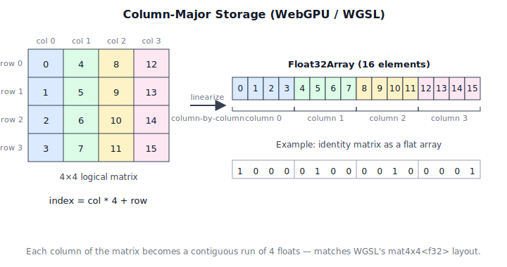


```
Column 0:  data[0]  data[1]  data[2]  data[3]    (first column)
Column 1:  data[4]  data[5]  data[6]  data[7]    (second column)
Column 2:  data[8]  data[9]  data[10] data[11]   (third column)
Column 3:  data[12] data[13] data[14] data[15]   (fourth column)
```

This matches WebGPU's WGSL layout: `matrix<mat4x4<f32>>` arrays elements column-by-column in the default `@column_major` storage. The identity matrix is constructed as:

```typescript
// from src/math/mat4.ts
static identity(): Mat4 {
  return new Mat4([
    1, 0, 0, 0,   // column 0
    0, 1, 0, 0,   // column 1
    0, 0, 1, 0,   // column 2
    0, 0, 0, 1,   // column 3
  ]);
}
```

### Matrix-Matrix Multiplication

Matrix multiplication follows the column-major convention: `a.multiply(b)` computes `a * b`, meaning `b` is applied first when transforming vectors. This matches how we compose transforms in the scene graph:

```typescript
// Composition: parent * local (parent is applied after local)
// from engine scene graph
localToWorld(): Mat4 {
  if (this._parent) {
    return this._parent.localToWorld().multiply(this.localTransform());
  }
  return this.localTransform();
}
```

### View and Projection Matrices

The `lookAt` view matrix constructs a right-handed view transformation. It builds an orthonormal camera basis by combining the eye-to-target direction with a world up reference:

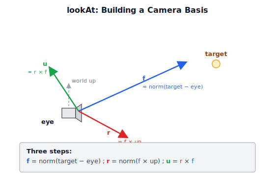


```typescript
// from src/math/mat4.ts
static lookAt(eye: Vec3, target: Vec3, up: Vec3): Mat4 {
  const f = target.sub(eye).normalize();   // forward
  const r = f.cross(up).normalize();       // right
  const u = r.cross(f);                    // true up (orthogonalized)

  return new Mat4([
    r.x, u.x, -f.x, 0,
    r.y, u.y, -f.y, 0,
    r.z, u.z, -f.z, 0,
    -r.dot(eye), -u.dot(eye), f.dot(eye), 1,
  ]);
}
```

The `perspective` projection builds a right-handed frustum with WebGPU's [0, 1] depth range. The frustum's contents get warped into a unit cube — clip space — by this matrix and the subsequent perspective divide:

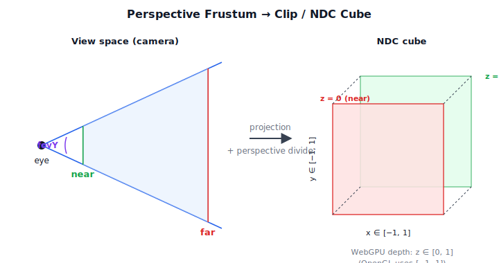


```typescript
// from src/math/mat4.ts
static perspective(fovY: number, aspect: number, near: number, far: number): Mat4 {
  const f = 1 / Math.tan(fovY / 2);
  const nf = 1 / (near - far);

  return new Mat4([
    f / aspect, 0, 0, 0,
    0, f, 0, 0,
    0, 0, far * nf, -1,
    0, 0, near * far * nf, 0,
  ]);
}
```

The `-1` at `data[11]` (column 2, row 3) is the key difference from OpenGL's projection. In OpenGL (`[-1, 1]` depth), this value is `1`. In WebGPU (`[0, 1]` depth), it is `-1`. This flips the sign of the z-divide so that depth values map to `[0, 1]` after the perspective divide.

### The TRS Transform

The static `trs` method composes translation, rotation, and scale into a single matrix:

```typescript
static trs(
  t: Vec3,
  qx: number, qy: number, qz: number, qw: number,
  s: Vec3,
): Mat4 {
  // Scale -> Rotate -> Translate
  // The matrix is identity * translation * rotation * scale
  // which, in column-major order, applies scale first, then
  // rotation, then translation.
  const rx = qx, ry = qy, rz = qz, rw = qw;
  const xx = rx * rx, yy = ry * ry, zz = rz * rz;
  const xy = rx * ry, xz = rx * rz, xw = rx * rw;
  const yz = ry * rz, yw = ry * rw, zw = rz * rw;

  return new Mat4([
    (1 - 2 * (yy + zz)) * s.x,        // column 0
    2 * (xy + zw) * s.x,
    2 * (xz - yw) * s.x,
    0,
    2 * (xy - zw) * s.y,               // column 1
    (1 - 2 * (xx + zz)) * s.y,
    2 * (yz + xw) * s.y,
    0,
    2 * (xz + yw) * s.z,               // column 2
    2 * (yz - xw) * s.z,
    (1 - 2 * (xx + yy)) * s.z,
    0,
    t.x, t.y, t.z, 1,                   // column 3
  ]);
}
```

### The Normal Matrix

When transforming surface normals, we cannot use the same matrix as for positions. If the transform contains non-uniform scale, the normals must be transformed by the **inverse transpose** of the upper-left 3×3 submatrix:

```typescript
normalMatrix(): Mat4 {
  // Extract upper-left 3x3, invert, transpose
  const m = this.invert();
  // ...
  // Result is the inverse-transpose of the 3x3, embedded
  // in a 4x4 with the rest as identity
}
```

This is used in the G-buffer fill shaders when transforming normals from local space to world space.

## 2.4 Quaternions

Quaternions (`src/math/quaternion.ts`) represent 3D rotations without the gimbal lock and interpolation problems of Euler angles. A quaternion has four components: a scalar `w` and a vector `(x, y, z)`, representing `w + xi + yj + zk`.

Geometrically, a unit quaternion encodes a rotation by angle θ around an axis n̂. The vector part stores `n̂ · sin(θ/2)` and the scalar part stores `cos(θ/2)`:

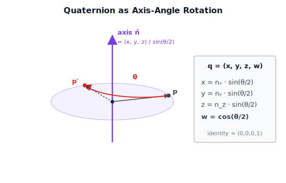

The half-angles in the encoding are why two quaternions `q` and `−q` represent the same rotation, and why SLERP needs to take the shorter arc.

### Construction and Defaults

The default quaternion is the identity `(0, 0, 0, 1)` — representing no rotation:

```typescript
export class Quaternion {
  x: number;
  y: number;
  z: number;
  w: number;

  constructor(x = 0, y = 0, z = 0, w = 1) {}
}
```

### From Euler Angles

The `fromEuler` static method converts intrinsic XYZ Euler angles (radians) to a quaternion. This is the primary way user input (yaw/pitch) becomes a rotation:

```typescript
static fromEuler(x: number, y: number, z: number): Quaternion {
  // x = pitch, y = yaw, z = roll
  // Intrinsic XYZ order: yaw (Y) * pitch (X) * roll (Z)
  const cx = Math.cos(x / 2), sx = Math.sin(x / 2);
  const cy = Math.cos(y / 2), sy = Math.sin(y / 2);
  const cz = Math.cos(z / 2), sz = Math.sin(z / 2);

  return new Quaternion(
    sx * cy * cz + cx * sy * sz,   // x
    cx * sy * cz - sx * cy * sz,   // y
    cx * cy * sz + sx * sy * cz,   // z
    cx * cy * cz - sx * sy * sz,   // w
  );
}
```

### Composition and Rotation

Quaternion multiplication uses the Hamilton product. `a.multiply(b)` means `this` is applied **after** `b`:

```typescript
multiply(b: Quaternion): Quaternion {
  const ax = this.x, ay = this.y, az = this.z, aw = this.w;
  const bx = b.x, by = b.y, bz = b.z, bw = b.w;

  return new Quaternion(
    aw * bx + ax * bw + ay * bz - az * by,
    aw * by - ax * bz + ay * bw + az * bx,
    aw * bz + ax * by - ay * bx + az * bw,
    aw * bw - ax * bx - ay * by - az * bz,
  );
}
```

To rotate a vector by a quaternion:

```typescript
rotateVec3(v: Vec3): Vec3 {
  // q * v * q^-1, implemented as:
  // v' = v + 2 * cross(q.xyz, cross(q.xyz, v) + q.w * v)
  const qx = this.x, qy = this.y, qz = this.z, qw = this.w;
  const t1 = qy * v.z - qz * v.y + qw * v.x;
  const t2 = qz * v.x - qx * v.z + qw * v.y;
  const t3 = qx * v.y - qy * v.x + qw * v.z;
  return new Vec3(
    v.x + 2 * (qy * t3 - qz * t2),
    v.y + 2 * (qz * t1 - qx * t3),
    v.z + 2 * (qx * t2 - qy * t1),
  );
}
```

This avoids constructing and multiplying a full 4×4 rotation matrix when only a single vector rotation is needed.

### Spherical Linear Interpolation (SLERP)

SLERP interpolates between two quaternions with constant angular velocity, making it ideal for smooth camera and animation blending. The intuition is that unit quaternions live on the surface of a 4D unit sphere — SLERP follows a great-circle arc on that sphere, while a naive LERP cuts a straight chord through the interior:

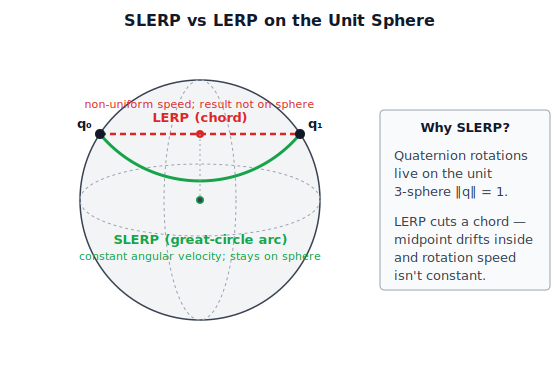


```typescript
slerp(b: Quaternion, t: number): Quaternion {
  // Compute cosine of the angle between quaternions
  let cosTheta = this.x * b.x + this.y * b.y
               + this.z * b.z + this.w * b.w;

  // Take the shorter arc
  let sign = 1;
  if (cosTheta < 0) {
    cosTheta = -cosTheta;
    sign = -1;
  }

  // Fall back to nlerp for tiny angles (performance)
  const epsilon = 1e-6;
  if (cosTheta >= 1 - epsilon) {
    return this.lerp(b, t);
  }

  const theta = Math.acos(cosTheta);
  const sinTheta = Math.sin(theta);
  const a = Math.sin((1 - t) * theta) / sinTheta;
  const d = Math.sin(t * theta) / sinTheta * sign;

  return new Quaternion(
    this.x * a + b.x * d,
    this.y * a + b.y * d,
    this.z * a + b.z * d,
    this.w * a + b.w * d,
  );
}
```

## 2.5 Transform Composition (TRS)

Every `GameObject` in the scene graph has a **local transform** built from its position (translation), rotation (quaternion), and scale. The order matters: scale is applied first (in local space), then rotation around the origin, then translation to the final position:

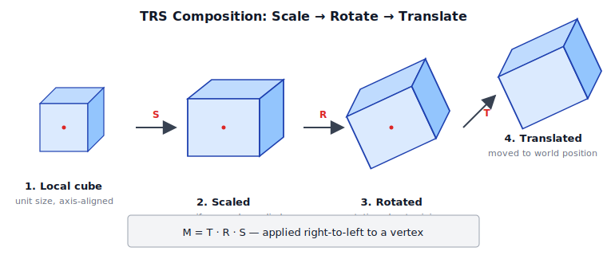


```typescript
// Composition order: T * R * S
// In column-major convention, S is applied first (local scale),
// then R (rotation around the scaled axes), then T (translation
// to world position).
localTransform(): Mat4 {
  return Mat4.trs(
    this.position,
    this.rotation.x, this.rotation.y,
    this.rotation.z, this.rotation.w,
    this.scale,
  );
}
```

The world transform composes parent and local transforms:

```typescript
localToWorld(): Mat4 {
  if (this._parent) {
    // parent * local — parent transform is applied after local
    return this._parent.localToWorld().multiply(this.localTransform());
  }
  return this.localTransform();
}
```

To go from world space to the camera's view space, we invert the camera's local-to-world matrix:

```typescript
// from the Camera component
viewMatrix(): Mat4 {
  return this.gameObject.localToWorld().invert();
}

viewProjectionMatrix(): Mat4 {
  return this.projectionMatrix.multiply(this.viewMatrix());
}
```

## 2.6 Coordinate Space Transformations

The rendering pipeline moves data through several coordinate spaces. Each stage is a single matrix multiply (or a perspective divide) applied in the vertex shader:

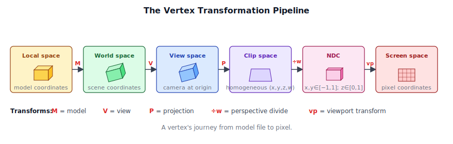

The full chain in text form:

```
Local space (model)
  ↓  localToWorld (model matrix)
World space
  ↓  viewMatrix
View (camera) space  ── right-handed, -Z forward
  ↓  projectionMatrix  
Clip space  ── [0, 1] depth, homogeneous w
  ↓  perspective divide (w)
NDC (normalized device coordinates)  ── x∈[-1,1], y∈[-1,1], z∈[0,1]
  ↓  viewport transform
Screen space (pixels)
```

In WGSL, this is:

```wgsl
// Vertex shader transformation chain
// from a typical Crafty vertex shader
struct Uniforms {
  modelMatrix: mat4x4<f32>,
  viewMatrix: mat4x4<f32>,
  projMatrix: mat4x4<f32>,
};

@group(0) @binding(0) var<uniform> u: Uniforms;

@vertex
fn vs_main(@location(0) position: vec3f) -> @builtin(position) vec4f {
  let worldPos = u.modelMatrix * vec4f(position, 1.0);
  let viewPos = u.viewMatrix * worldPos;
  return u.projMatrix * viewPos;
}
```

## 2.7 Random Numbers and Noise

Procedural generation is central to a voxel game — terrain height, biome distribution, ore placement, and cloud shapes all require controlled randomness.

### Seeded Random (`random.ts`)

The `Random` class implements the **xorshift128+** family (Xorwow variant) with explicit seeding. The instance itself is the state — it extends `Uint32Array(6)`:

```typescript
export class Random extends Uint32Array {
  static global = new Random();

  // Two core generators
  randomUint32(): number;        // Uniform [0, 2^32 - 1]
  randomFloat(min?, max?): number; // Uniform [min, max] (default [0, 1])
  randomDouble(min?, max?): number; // Higher precision [min, max]

  // State management
  get seed(): number;
  set seed(seed: number);        // Re-seed with splitmix32
  reset(): void;                 // Restore to post-construction state
}
```

The global instance `Random.global` is auto-seeded from `Date.now()` at module load. You can create additional instances with explicit seeds for reproducible terrain generation:

```typescript
// Terrain uses its own seeded RNG for reproducibility
const rng = new Random();
rng.seed = 42;  // Same seed = same terrain
```

### Perlin Noise (`noise.ts`)

Crafty ports **stb_perlin.h v0.5** by Sean Barrett to TypeScript. Six functions provide gradient noise for procedural generation. Each one produces a characteristically different look:

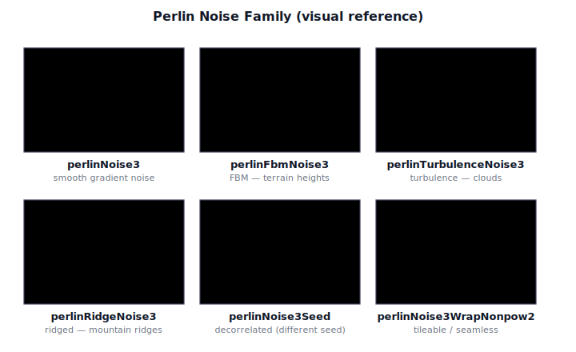


| Function | Use case |
|----------|----------|
| `perlinNoise3(x, y, z)` | Base 3D Perlin noise, range ~[-1, 1] |
| `perlinFbmNoise3(x, y, z, lacunarity, gain, octaves)` | Fractional Brownian motion — terrain height |
| `perlinTurbulenceNoise3(x, y, z, lacunarity, gain, octaves)` | Turbulence — cloud density |
| `perlinRidgeNoise3(x, y, z, lacunarity, gain, offset, octaves)` | Ridged multifractal — mountain ridges |
| `perlinNoise3Seed(x, y, z, ...seed)` | Decorrelated noise for different features |
| `perlinNoise3WrapNonpow2(x, y, z, ...wrap)` | Arbitrary-size tiling |

Terrain generation combines multiple octaves of `perlinFbmNoise3` with elevation-dependent biome blending. Each octave doubles the frequency (lacunarity ≈ 2) and halves the amplitude (gain ≈ 0.5), so coarse landforms come from the low octaves and fine surface detail from the high ones:

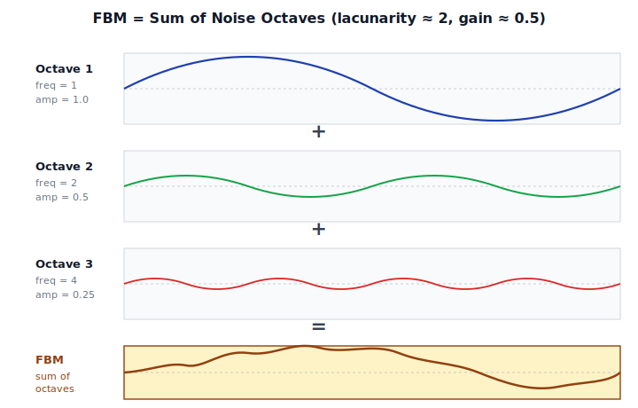

The noise functions operate on 3D coordinates, which allows overhangs and caves — a key advantage over 2D heightmap-based approaches.

### Summary

The math library provides the foundation for everything that follows. Every vertex transform, every camera motion, every light calculation, and every procedural generation step builds on these types. The conventions are consistent throughout:

- Column-major matrices for WebGPU
- Right-handed, Y-up, -Z-forward coordinates
- Immutable arithmetic throughout
- Seeded RNG and Perlin noise for procedural content

**Further reading:** The full source of each type is in:
- `src/math/vec2.ts`, `vec3.ts`, `vec4.ts` — vector types
- `src/math/mat4.ts` — 4×4 transformation matrices
- `src/math/quaternion.ts` — rotation quaternions
- `src/math/random.ts` — seeded PRNG
- `src/math/noise.ts` — Perlin noise family

<div style="page-break-after: always;"></div>


# Chapter 3: WebGPU Fundamentals


This chapter introduces the WebGPU API from the ground up. We cover every resource type and pipeline stage that Crafty uses, building toward the `RenderContext` abstraction that the rest of the engine is built on.

## 3.1 The Graphics Pipeline

Before diving into the API, it is worth reviewing the modern GPU pipeline. Every frame, the GPU executes a sequence of stages:


WebGPU exposes a subset of this pipeline with a clean, explicit API. The key programmable stages are:

- **Vertex shader** — transforms vertices from model space to clip space, passes interpolated data to the fragment shader.
- **Fragment shader** — computes the color of each rasterised pixel, performing lighting, texturing, and shading.
- **Compute shader** — a general-purpose shader that operates on arbitrary workgroups (used by Crafty for particle systems and auto-exposure).

Pipeline state is fully explicit. Every combination of shaders, vertex layout, blend mode, depth test, and primitive topology is compiled into an immutable `GPURenderPipeline` object. There is no global state — you bind a pipeline, bind resources, and draw.

## 3.2 GPUDevice and GPUAdapter

The entry point to WebGPU is `navigator.gpu`. The first step is to request an **adapter** (a physical or virtual GPU), then create a **device** (the logical handle to that GPU). The device, in turn, owns every resource you create — buffers, textures, shaders, pipelines — and exposes a single queue for submitting work:


```typescript
// ── from src/renderer/render_context.ts ──

static async create(canvas: HTMLCanvasElement, options: RenderContextOptions = {}): Promise<RenderContext> {
  if (!navigator.gpu) {
    throw new Error('WebGPU not supported');
  }

  const adapter = await navigator.gpu.requestAdapter({
    powerPreference: 'high-performance',
  });
  if (!adapter) {
    throw new Error('No WebGPU adapter found');
  }

  const device = await adapter.requestDevice({
    requiredFeatures: [],
  });
  // ...
}
```

**Adapter selection.** We request `powerPreference: 'high-performance'` to prefer the discrete GPU when one is available. The alternative `'low-power'` prefers integrated GPUs to save battery. If the returned adapter is `null`, WebGPU is not available on this system.

**Device creation.** `adapter.requestDevice()` creates a logical device that owns all GPU resources. The `requiredFeatures` array requests optional WebGPU features; Crafty currently uses none, keeping compatibility as broad as possible.

**Error handling.** When `enableErrorHandling` is true, the context registers an `uncapturederror` event listener on the device that logs validation, out-of-memory, and internal errors:

```typescript
device.addEventListener('uncapturederror', (event) => {
  const err = event.error;
  if (err instanceof GPUValidationError) {
    console.error('[WebGPU Validation Error]', err.message);
  } else if (err instanceof GPUOutOfMemoryError) {
    console.error('[WebGPU Out of Memory]');
  }
});
```

Validation errors are the most common — they occur when you misuse the API (e.g., binding a buffer with the wrong usage flags). WebGPU's validation is strict and comprehensive, which means most bugs are caught at creation time rather than appearing as graphical corruption.

### Canvas Configuration

Once we have a device, we configure the canvas to create a swap chain:

```typescript
const context = canvas.getContext('webgpu') as GPUCanvasContext;

// Attempt HDR canvas: rgba16float + display-p3 + extended tonemapping.
let format: GPUTextureFormat;
let hdr = false;
try {
  context.configure({
    device,
    format: 'rgba16float',
    alphaMode: 'opaque',
    colorSpace: 'display-p3',
    toneMapping: { mode: 'extended' },
  });
  const config = context.getConfiguration();
  // Verify that we actually got an HDR display.
  if (config.toneMapping.mode === "extended") {
    format = 'rgba16float';
    hdr = true;
  } else {
    // The display doesn't support HDR, get the format used by the canvas.
    format = navigator.gpu.getPreferredCanvasFormat();
  }
} catch {
  // Fallback to preferred SDR format
  format = navigator.gpu.getPreferredCanvasFormat();
  context.configure({ device, format, alphaMode: 'opaque' });
}
```

Crafty attempts an HDR swap chain (`rgba16float` with `display-p3` color space and extended tone mapping). If the platform does not support it (the `configure()` call throws), we fall back to the platform's preferred SDR format — typically `bgra8unorm` on Windows and `rgba8unorm` on macOS.

## 3.3 GPUBuffer

A `GPUBuffer` is a block of GPU-accessible memory. Buffers are the primary mechanism for moving data between CPU and GPU.

### Buffer Creation

Crafty provides a convenience wrapper `createBuffer` on `RenderContext`:

```typescript
// from src/renderer/render_context.ts
createBuffer(size: number, usage: GPUBufferUsageFlags, label?: string): GPUBuffer {
  return this.device.createBuffer({ size, usage, label });
}
```

The `usage` parameter specifies how the buffer can be used:

| Flag | Used for |
|------|----------|
| `UNIFORM` | Small, frequently updated per-frame data (matrices, lights) |
| `STORAGE` | Large, randomly accessed data (skinning joints, particles) |
| `VERTEX` | Vertex positions, normals, UVs |
| `INDEX` | Triangle index lists |
| `COPY_DST` | Receiving data from `queue.writeBuffer()` |
| `COPY_SRC` | Source for `commandEncoder.copyBufferToTexture()` |
| `INDIRECT` | Indirect draw/dispatch parameters |

Example from the `GeometryPass` camera uniform buffer:

```typescript
const cameraBuffer = device.createBuffer({
  label: 'GeomCameraBuffer',
  size: CAMERA_UNIFORM_SIZE,   // 4 mat4 + vec3 + near/far = 288 bytes
  usage: GPUBufferUsage.UNIFORM | GPUBufferUsage.COPY_DST,
});
```

The `COPY_DST` flag is essential here — it allows us to upload data via `queue.writeBuffer()`.

### Uploading Data

The fastest way to upload data is `GPUQueue.writeBuffer()`, which copies CPU memory directly into the GPU buffer without an explicit staging buffer:

```typescript
// ── from RenderContext.writeBuffer ──
writeBuffer(buffer: GPUBuffer, data: ArrayBuffer | ArrayBufferView, offset = 0): void {
  if (data instanceof ArrayBuffer) {
    this.queue.writeBuffer(buffer, offset, data);
  } else {
    this.queue.writeBuffer(buffer, offset,
      data.buffer as ArrayBuffer, data.byteOffset, data.byteLength);
  }
}
```

Crafty uses `writeBuffer` extensively for per-frame uniform updates. For example, the geometry pass uploads camera matrices each frame:

```typescript
// ── from GeometryPass.updateCamera ──
updateCamera(ctx: RenderContext, view: Mat4, proj: Mat4, viewProj: Mat4,
             invViewProj: Mat4, camPos: Vec3, near: number, far: number): void {
  const data = this._cameraScratch;  // pre-allocated Float32Array
  data.set(view.data,         0);
  data.set(proj.data,        16);
  data.set(viewProj.data,    32);
  data.set(invViewProj.data, 48);
  data[64] = camPos.x; data[65] = camPos.y; data[66] = camPos.z;
  data[67] = near;
  data[68] = far;
  ctx.queue.writeBuffer(this._cameraBuffer, 0, data.buffer as ArrayBuffer);
}
```

The `_cameraScratch` `Float32Array` is pre-allocated once in the constructor and reused every frame. This avoids garbage-collector pressure from per-frame allocations.

### Buffer Alignment

WebGPU imposes alignment requirements on buffer bindings:

- **Uniform buffers**: `minUniformBufferOffsetAlignment`, typically 256 bytes.
- **Storage buffers**: `minStorageBufferOffsetAlignment`, typically 16 bytes.

Crafty uses dynamic offset uniform buffers in `BlockGeometryPass` to fit per-chunk data into a single large buffer, where each chunk gets a 256-byte aligned slot.

## 3.4 GPUTexture

A `GPUTexture` is a GPU image — a 2D, 3D, or cube-map array of texels used as render targets, depth buffers, or shader-readable inputs.

### Texture Creation

The `GBuffer` class allocates three textures for deferred rendering. Each one packs different per-pixel data into its four channels — albedo + roughness, world-space normal + metallic, and depth:


```typescript
// ── from src/renderer/gbuffer.ts ──
static create(ctx: RenderContext): GBuffer {
  const { device, width, height } = ctx;

  const albedoRoughness = device.createTexture({
    label: 'GBuffer AlbedoRoughness',
    size: { width, height },
    format: 'rgba8unorm',
    usage: GPUTextureUsage.RENDER_ATTACHMENT | GPUTextureUsage.TEXTURE_BINDING,
  });

  const normalMetallic = device.createTexture({
    label: 'GBuffer NormalMetallic',
    size: { width, height },
    format: 'rgba16float',
    usage: GPUTextureUsage.RENDER_ATTACHMENT | GPUTextureUsage.TEXTURE_BINDING,
  });

  const depth = device.createTexture({
    label: 'GBuffer Depth',
    size: { width, height },
    format: 'depth32float',
    usage: GPUTextureUsage.RENDER_ATTACHMENT | GPUTextureUsage.TEXTURE_BINDING,
  });

  return new GBuffer(albedoRoughness, normalMetallic, depth, width, height);
}
```

Key texture parameters:

| Parameter | Description |
|-----------|-------------|
| `size` | `{ width, height, depthOrArrayLayers }` — 1 for a standard 2D texture |
| `format` | Texel format — `rgba8unorm`, `rgba16float`, `depth32float`, etc. |
| `usage` | Bitfield specifying how the texture is used (`RENDER_ATTACHMENT`, `TEXTURE_BINDING`, `COPY_DST`, etc.) |
| `mipLevelCount` | Number of mip levels (default 1) |
| `sampleCount` | MSAA sample count (default 1, no multisampling) |

### Texture Views

A `GPUTextureView` is a window into a texture — a specific subresource (mip level, array layer, aspect) that can be bound as a render target or shader input. Most of the time you just want the default view:

```typescript
this.albedoRoughnessView = albedoRoughness.createView();
```

But some passes need specialised views — for example, reading only the depth aspect of a depth-stencil texture, or binding a single array layer of a cube map.

### HDR Render Target

The lighting pass writes into an HDR color attachment with format `rgba16float`:

```typescript
export const HDR_FORMAT: GPUTextureFormat = 'rgba16float';
```

This is a 16-bit-per-channel floating-point format, giving a wider dynamic range and color precision than the 8-bit sRGB swap chain. The HDR texture persists through post-processing (bloom, TAA, DOF) before being tone-mapped to SDR for display.

## 3.5 GPUSampler

A `GPUSampler` controls how textures are sampled in shaders — filtering mode, addressing mode (wrap/clamp/mirror), and level-of-detail behaviour. Samplers are created once and reused across passes.

Typical creation pattern from Crafty's passes:

```typescript
const sampler = device.createSampler({
  addressModeU: 'repeat',
  addressModeV: 'repeat',
  magFilter: 'linear',
  minFilter: 'nearest',
  mipmapFilter: 'linear',
});
```

Samplers are lightweight objects that are bound to shaders through bind groups.

## 3.6 GPUBindGroup and GPUBindGroupLayout

Resources are made available to shaders through **bind groups**. A `GPUBindGroupLayout` describes the types and visibility of resources a shader expects. A `GPUBindGroup` binds actual resources (buffers, textures, samplers) to that layout.

The bind group index from `setBindGroup(N, …)` on the CPU lines up with the `@group(N)` annotation in the shader, and the per-entry `binding` numbers line up with `@binding(M)`. This is how Crafty's geometry pass connects camera, model, and material data to its WGSL:


### Bind Group Layout

Layouts are immutable descriptions of resource bindings. Here is the geometry pass creating layouts for its camera and model uniforms:

```typescript
// from src/renderer/passes/geometry_pass.ts
const cameraBGL = device.createBindGroupLayout({
  label: 'GeomCameraBGL',
  entries: [
    {
      binding: 0,
      visibility: GPUShaderStage.VERTEX | GPUShaderStage.FRAGMENT,
      buffer: { type: 'uniform' },
    },
  ],
});

const modelBGL = device.createBindGroupLayout({
  label: 'GeomModelBGL',
  entries: [
    {
      binding: 0,
      visibility: GPUShaderStage.VERTEX,
      buffer: { type: 'uniform' },
    },
  ],
});
```

The `visibility` field controls which shader stages can access the resource. The `type` field specifies the resource type (`uniform`, `storage`, `read-only-storage`, `texture`, `sampler`, etc.).

Why does WebGPU use a BindGroupLayout, when a BindGroup should be enough? The answer is about validation. The BindGroupLayouts that will be used with a shader are included when creating a Pipeline object. This validates that the shader will be compatible with the resources you intend to use with the shader. The BindGroupLayout is also used to create a BindGroup, validating the BindGroup will be compatible with the Pipeline. Since everything has now been validated at object creation time, WebGPU doesn't need to do that validation at runtime.

### Bind Group

Bind groups are the actual resource handles bound to a layout:

```typescript
const cameraBindGroup = device.createBindGroup({
  label: 'GeomCameraBindGroup',
  layout: cameraBGL,
  entries: [
    { binding: 0, resource: { buffer: cameraBuffer } },
  ],
});
```

During draw, the pipeline sets bind groups at indices matching the WGSL `@group(N)` attribute:

```typescript
pass.setBindGroup(0, this._cameraBindGroup);   // @group(0) in shader
pass.setBindGroup(1, this._modelBindGroups[i]); // @group(1)
pass.setBindGroup(2, item.material.getBindGroup(device)); // @group(2)
```

In the WGSL shader, these correspond to:

```wgsl
// from src/shaders/geometry.wgsl
@group(0) @binding(0) var<uniform> camera  : CameraUniforms;
@group(1) @binding(0) var<uniform> model   : ModelUniforms;
@group(2) @binding(0) var<uniform> material: MaterialUniforms;
@group(2) @binding(1) var albedo_map: texture_2d<f32>;
@group(2) @binding(2) var normal_map: texture_2d<f32>;
@group(2) @binding(3) var mer_map   : texture_2d<f32>;
@group(2) @binding(4) var mat_samp  : sampler;
```

Bind groups are lightweight to create and can be updated each frame when the underlying resource changes (e.g., a new shadow map texture).

## 3.7 GPUShaderModule and WGSL

WebGPU shaders are written in **WGSL** (WebGPU Shading Language), a concise, SPIR-V-derived language designed for the web.

### Shader Structure

A WGSL shader module contains a sequence of declarations — structs, bindings, functions, and entry points. Here is the geometry pass vertex shader:

```wgsl
// ── from src/shaders/geometry.wgsl ──

struct CameraUniforms {
  view       : mat4x4<f32>,
  proj       : mat4x4<f32>,
  viewProj   : mat4x4<f32>,
  invViewProj: mat4x4<f32>,
  position   : vec3<f32>,
  near       : f32,
  far        : f32,
}

struct ModelUniforms {
  model       : mat4x4<f32>,
  normalMatrix: mat4x4<f32>,
}

struct VertexInput {
  @location(0) position: vec3<f32>,
  @location(1) normal  : vec3<f32>,
  @location(2) uv      : vec2<f32>,
  @location(3) tangent : vec4<f32>,
}

struct VertexOutput {
  @builtin(position) clip_pos  : vec4<f32>,
  @location(0)       world_pos : vec3<f32>,
  @location(1)       world_norm: vec3<f32>,
  @location(2)       uv        : vec2<f32>,
  @location(3)       world_tan : vec4<f32>,
}

@group(0) @binding(0) var<uniform> camera : CameraUniforms;
@group(1) @binding(0) var<uniform> model  : ModelUniforms;

@vertex
fn vs_main(input: VertexInput) -> VertexOutput {
  let world_pos = model.model * vec4f(input.position, 1.0);
  var output: VertexOutput;
  output.clip_pos = camera.viewProj * world_pos;
  output.world_pos = world_pos.xyz;
  output.world_norm = (model.normalMatrix * vec4f(input.normal, 0.0)).xyz;
  output.uv = input.uv;
  output.world_tan = model.normalMatrix * input.tangent;
  return output;
}
```

Key WGSL features visible here:

- **Struct types** define shader interfaces.
- `@group(N) @binding(M)` attributes link bindings to the bind groups set from the CPU.
- `@location(N)` specifies vertex attribute locations and inter-stage varying slots.
- `@builtin(position)` marks the clip-space position output.
- `var<uniform>` declares a uniform buffer; `var texture_2d<f32>` declares a sampled texture.

### Shader Compilation

Shader modules are created from WGSL source code at runtime:

```typescript
const shaderModule = device.createShaderModule({
  label: `GeometryShader[${material.shaderId}]`,
  code: material.getShaderCode(MaterialPassType.Geometry),
});
```

WebGPU validates WGSL to native GPU instructions as part of `createShaderModule()`. Compilation errors are reported through `getCompilationInfo()`:

```typescript
const info = shaderModule.getCompilationInfo();
for (const msg of info.messages) {
  if (msg.type === 'error') {
    console.error(`Shader error at ${msg.lineNum}:${msg.linePos}: ${msg.message}`);
  }
}
```

Note that WebGPU doesn't actually compile the shader for the GPU backend (D3D, Vulkan, Metal) until a Pipeline object is created using the ShaderModule. This is because the other state information provided by the Pipeline can affect the shader that is compiled for the GPU backend. Because of this, you will find that creating Pipeline objects is significantly more time consuming than createShaderModule.

Crafty loads shaders at module scope via Vite's `?raw` import syntax:

```typescript
import lightingWgsl from '../../shaders/lighting.wgsl?raw';
```

This inlines the WGSL source as a string at build time, avoiding runtime fetch requests.

## 3.8 GPURenderPipeline and GPUComputePipeline

Pipelines are the immutable, compiled representation of the entire GPU state for a draw or dispatch call.

### Render Pipeline Creation

Creating a render pipeline requires specifying vertex buffers, shader stages, fragment targets, depth/stencil state, and primitive topology — every piece of state needed to issue draw calls is funneled into one immutable object:


```typescript
// ── from geometry_pass.ts _getPipeline ──
pipeline = device.createRenderPipeline({
  label: `GeometryPipeline[${material.shaderId}]`,
  layout: device.createPipelineLayout({
    bindGroupLayouts: [
      this._cameraBGL,
      this._modelBGL,
      material.getBindGroupLayout(device),
    ],
  }),
  vertex: {
    module: shaderModule,
    entryPoint: 'vs_main',
    buffers: [
      {
        arrayStride: VERTEX_STRIDE,        // bytes per vertex
        attributes: VERTEX_ATTRIBUTES,     // position, normal, uv, tangent
      },
    ],
  },
  fragment: {
    module: shaderModule,
    entryPoint: 'fs_main',
    targets: [
      { format: 'rgba8unorm' },    // albedo+roughness
      { format: 'rgba16float' },   // normal+metallic
    ],
  },
  depthStencil: {
    format: 'depth32float',
    depthWriteEnabled: true,
    depthCompare: 'less',
  },
  primitive: {
    topology: 'triangle-list',
    cullMode: 'back',
  },
});
```

**Pipeline layout.** The `GPU PipelineLayout` aggregates all bind group layouts used by the pipeline. This is optional — you can use `layout: 'auto'` — but explicit layouts give you portability and validation across different WebGPU implementations.

**Vertex buffers.** The `buffers` array describes the vertex input layout: `arrayStride` (bytes between consecutive vertices) and `attributes` (location, format, and offset within the stride).

**Fragment targets.** The `targets` array must match the color attachments in the render pass — one entry per attachment.

**Depth/stencil.** We use `depth32float` with `less` comparison and write enabled for the opaque geometry pass.

**Culling.** Back-face culling with counter-clockwise winding order (the default) assumes triangles are wound correctly during mesh creation.

### Pipeline Caching

Creating pipelines is expensive — compilation can take tens of milliseconds on complex shaders. Crafty caches pipelines in a `Map<string, GPURenderPipeline>` keyed by material shader ID:

```typescript
private _pipelineCache = new Map<string, GPURenderPipeline>();

private _getPipeline(device: GPUDevice, material: Material): GPURenderPipeline {
  let pipeline = this._pipelineCache.get(material.shaderId);
  if (pipeline) return pipeline;
  // ... create and cache ...
  this._pipelineCache.set(material.shaderId, pipeline);
  return pipeline;
}
```

Materials that share the same WGSL shader source reuse the same pipeline.

### Compute Pipelines

Compute pipelines are simpler — they have no vertex/fragment state, only a compute shader and layout:

```typescript
const computePipeline = device.createComputePipeline({
  layout: pipelineLayout,
  compute: {
    module: shaderModule,
    entryPoint: 'cs_main',
  },
});
```

Crafty uses compute pipelines for particle simulation, auto-exposure histogram computation, and temporal SSGI.

## 3.9 GPUCommandEncoder and GPUQueue

All GPU work is recorded into a **command buffer** via a `GPUCommandEncoder`, then submitted to the GPU through a `GPUQueue`. Every render pass for the frame writes into a single shared encoder, which is then finished and submitted as one command buffer:


### The Frame Recording Pattern

The render graph creates a single encoder per frame and shares it across all passes:

```typescript
// ── from render_graph.ts execute() ──
async execute(ctx: RenderContext): Promise<void> {
  ctx.pushFrameErrorScope();

  const encoder = ctx.device.createCommandEncoder();
  for (const pass of this._passes) {
    if (pass.enabled) {
      pass.execute(encoder, ctx);
    }
  }
  ctx.queue.submit([encoder.finish()]);

  await ctx.popFrameErrorScope();
}
```

**All passes share one encoder.** This is critical for correctness — each pass appends commands (render passes, buffer copies, barriers) into the same encoder. A single `encoder.finish()` produces one command buffer, and `queue.submit()` sends it to the GPU.

### Render Pass Encoding

Inside each pass, `encoder.beginRenderPass()` creates a `GPURenderPassEncoder`:

```typescript
// ── from geometry_pass.ts execute() ──
const pass = encoder.beginRenderPass({
  label: 'GeometryPass',
  colorAttachments: [
    {
      view: this._gbuffer.albedoRoughnessView,
      clearValue: [0, 0, 0, 1],
      loadOp: 'clear',
      storeOp: 'store',
    },
    {
      view: this._gbuffer.normalMetallicView,
      clearValue: [0, 0, 0, 0],
      loadOp: 'clear',
      storeOp: 'store',
    },
  ],
  depthStencilAttachment: {
    view: this._gbuffer.depthView,
    depthClearValue: 1,
    depthLoadOp: 'clear',
    depthStoreOp: 'store',
  },
});
```

The `loadOp` controls whether the attachment is cleared at the start of the pass (`'clear'`) or preserves existing contents (`'load'`). Subsequent passes that write to the same G-buffer (e.g., `BlockGeometryPass`) use `loadOp: 'load'` to append to the already-filled G-buffer.

### Draw Calls

Inside a render pass, the typical draw sequence is:

```typescript
pass.setPipeline(pipeline);
pass.setBindGroup(0, cameraBindGroup);
pass.setBindGroup(1, modelBindGroup);
pass.setBindGroup(2, materialBindGroup);
pass.setVertexBuffer(0, vertexBuffer);
pass.setIndexBuffer(indexBuffer, 'uint32');
pass.drawIndexed(indexCount);
```

Crafty uses indexed drawing (via `drawIndexed`) for all triangle meshes. Non-indexed `draw()` is used for fullscreen triangle passes (lighting, post-processing).

### Copy and Barrier Operations

The command encoder also supports copy operations and pipeline barriers. For example, copying the results of a compute shader into a storage buffer for indirect draw:

```typescript
encoder.copyBufferToBuffer(source, 0, dest, 0, size);
```

Crafty uses compute-to-buffer copies in the particle system to copy the computed particle count into the indirect draw buffer.

## 3.10 The RenderContext Abstraction

The `RenderContext` class (`src/renderer/render_context.ts`) wraps the WebGPU device, queue, and canvas configuration into a single handle that flows through the entire render graph.

```typescript
export class RenderContext {
  readonly device: GPUDevice;
  readonly queue: GPUQueue;
  readonly context: GPUCanvasContext;
  readonly format: GPUTextureFormat;
  readonly canvas: HTMLCanvasElement;
  readonly hdr: boolean;
  readonly enableErrorHandling: boolean;
}
```

It provides:

- **Swap chain access** via `getCurrentTexture()`.
- **Buffer creation** via `createBuffer()`.
- **Data upload** via `writeBuffer()`.
- **Error scope management** via `pushInitErrorScope()` / `popInitErrorScope()` and per-frame/per-pass variants.

Every render pass receives the `RenderContext` during `execute()` and uses it to access the device, queue, and canvas dimensions. The `RenderGraph` owns the relationship between passes and the context:

```
Application (main.ts)
   │
   ▼
RenderGraph  ─── owns ───►  RenderPass[]
   │                            │
   │                            ▼
   │                      execute(encoder, ctx)
   │
   └──►  GPUCommandEncoder ──► queue.submit()
```

### Lifecycle

1. **Creation.** `RenderContext.create(canvas)` is called once during startup. It requests the adapter, creates the device, and configures the canvas.
2. **Frame loop.** Each frame, `RenderGraph.execute()` creates a command encoder, runs all passes, and submits.
3. **Resize.** On canvas resize, the canvas pixel dimensions are updated and the graph is re-created (passes that depend on canvas size, like the GBuffer, reallocate their textures).
4. **Destroy.** `RenderGraph.destroy()` calls `destroy()` on every pass, and the render context itself is discarded.

### Summary

In this chapter we covered every major WebGPU resource type and saw how Crafty uses them:

| Resource | Crafty usage | Key files |
|----------|-------------|-----------|
| `GPUAdapter` / `GPUDevice` | Created once in `RenderContext.create()` | `render_context.ts` |
| `GPUBuffer` | Uniforms per-frame, vertex/index for meshes, storage for particles | `geometry_pass.ts`, `particle_pass.ts` |
| `GPUTexture` | GBuffer, HDR target, shadow maps, sky, cloud noise | `gbuffer.ts`, `lighting_pass.ts` |
| `GPUSampler` | Created per-pass for texture sampling | various passes |
| `GPUBindGroup` / `GPUBindGroupLayout` | Group 0=camera, 1=model, 2=material | `geometry_pass.ts` |
| `GPUShaderModule` | Loaded from `.wgsl` files via `?raw` import | `src/shaders/*.wgsl` |
| `GPURenderPipeline` | Cached per material shader ID | `geometry_pass.ts` |
| `GPUComputePipeline` | Particles, auto-exposure, SSGI | `particle_pass.ts`, `auto_exposure_pass.ts` |
| `GPUCommandEncoder` | One per frame, shared across all passes | `render_graph.ts` |
| `GPUQueue` | `writeBuffer()` for uniform uploads, `submit()` for command buffers | `render_context.ts` |

In the next chapter, we see how these pieces come together in Crafty's render graph architecture — the system that orchestrates all these resources into a complete frame.

<div style="page-break-after: always;"></div>


# Chapter 4: Rendering Architecture


This chapter presents the architectural backbone of Crafty's renderer — the **render graph**, its **passes**, and how they compose to produce every frame.

## 4.1 The Render Graph


The render graph (`src/renderer/render_graph.ts`) is a straightforward ordered sequence of render passes. It is deliberately simple — no automatic dependency analysis, no resource barrier management, no topological sort. Passes are registered in execution order and run sequentially.

```typescript
export class RenderGraph {
  private _passes: RenderPass[] = [];

  addPass(pass: RenderPass): void {
    this._passes.push(pass);
  }

  async execute(ctx: RenderContext): Promise<void> {
    ctx.pushFrameErrorScope();

    const encoder = ctx.device.createCommandEncoder();
    for (const pass of this._passes) {
      if (pass.enabled) {
        pass.execute(encoder, ctx);
      }
    }
    ctx.queue.submit([encoder.finish()]);

    await ctx.popFrameErrorScope();
  }
}
```

The key design decisions are:

**Single command encoder per frame.** Every pass appends commands to the same `GPUCommandEncoder`. This means the GPU sees the entire frame's work as one atomic submission. There is no per-pass command buffer overhead, and the driver can optimise across passes (e.g., merge adjacent draw calls or eliminate redundant resource barriers).

**Passes are responsible for their own resource management.** The render graph does not track which textures or buffers a pass reads or writes. Passes must agree on texture `loadOp` and `storeOp` conventions. For example, the `BlockGeometryPass` uses `depthLoadOp: 'load'` because it runs after `GeometryPass` and must preserve the depth buffer from the first pass.

**The graph is the frame.** The order of `addPass()` calls determines the order of GPU work. Crafty's main renderer setup typically registers passes in this order:

```
1. ShadowPass             — CSM depth
2. BlockShadowPass        — chunk shadow cascades (appends)
3. PointSpotShadowPass    — VSM for point/spot lights
4. CloudShadowPass        — top-down cloud shadow
5. SkyTexturePass         — HDR sky background
6. GeometryPass           — mesh G-buffer
7. BlockGeometryPass      — chunk G-buffer (appends)
8. SkinnedGeometryPass    — skinned mesh G-buffer (appends)
9. SSAOPass               — screen-space ambient occlusion
10. SSGIPass              — screen-space global illumination
11. DeferredLightingPass  — deferred HDR lighting
12. PointSpotLightPass    — additive point/spot lighting
13. TAAPass               — temporal anti-aliasing
14. DofPass               — depth of field
15. GodrayPass            — volumetric light shafts
16. BloomPass             — HDR bloom
17. WaterPass             — refractive water surfaces
18. ParticlePass          — compute-driven particles
19. DebugLightPass        — debug light markers
20. BlockHighlightPass    — targeted block outline
21. CompositePass         — final tonemap + fog + presentation
```

Not all passes are always enabled. The composite pass, for instance, replaces the legacy `TonemapPass` and encompasses fog, stars, underwater effects, and tone-mapping in a single shader.

## 4.2 Render Passes

Every pass extends the abstract `RenderPass` base class (`src/renderer/render_pass.ts`):

```typescript
export abstract class RenderPass {
  abstract readonly name: string;
  enabled = true;

  abstract execute(encoder: GPUCommandEncoder, ctx: RenderContext): void;
  destroy(): void {}
}
```

The interface is minimal by design. A pass is just something that:

1. Has a **name** for debugging.
2. Can be **enabled or disabled** at runtime.
3. **Executes** by recording commands into the shared encoder.
4. **Destroys** its GPU resources when the graph is torn down.

### Pass Construction Pattern

Every pass follows the same creation pattern: a **static `create()` factory** that allocates all GPU resources and returns a fully initialised instance. The constructor is private:

```typescript
export class GeometryPass extends RenderPass {
  readonly name = 'GeometryPass';

  private constructor(
    gbuffer: GBuffer,
    cameraBGL: GPUBindGroupLayout,
    modelBGL: GPUBindGroupLayout,
    cameraBuffer: GPUBuffer,
    cameraBindGroup: GPUBindGroup,
  ) { /* ... */ }

  static create(ctx: RenderContext, gbuffer: GBuffer): GeometryPass {
    const { device } = ctx;
    // Create layouts, buffers, bind groups...
    return new GeometryPass(gbuffer, cameraBGL, modelBGL, cameraBuffer, cameraBindGroup);
  }
}
```

This pattern ensures that:

- All GPU resource creation happens at init time, not during the frame loop.
- Error scopes can wrap the entire `create()` call to catch validation errors during development.
- The pass owns its resources and cleans them up in `destroy()`.

### Per-Frame Update Pattern


Passes expose `update*()` methods that are called **before** `execute()` each frame. These methods upload per-frame data via `queue.writeBuffer()`:

```typescript
// Called before execute() each frame
pass.updateCamera(ctx, view, proj, viewProj, invViewProj, cameraPos, near, far);
```

This separation of **update** (uploading uniforms to GPU buffers) and **execute** (encoding draw commands) mirrors the GPU's own separation of upload and execution work.

## 4.3 Multi-Pass Deferred Rendering


Crafty uses a **deferred shading** pipeline for its main geometry. The core idea: render surface properties (albedo, normal, depth, etc.) into a **G-buffer** in a first set of passes, then compute lighting in a separate pass that reads the G-buffer.

### Why Deferred?

- **Decoupled geometry from lighting.** The cost of shading a pixel depends only on screen resolution, not on the number of lights or geometric complexity.
- **Supports many lights.** The deferred lighting pass can sample hundreds of point and spot lights without re-executing the vertex shader for each one.
- **Enables screen-space effects.** Post-processing passes (SSAO, SSGI, TAA, DOF) operate on the G-buffer, giving them rich surface information for their computations.

### The Deferred Pipeline

```
Frame N:
  ┌─────────────────────────────────────────────────────────────┐
  │ 1. Shadow passes  ───►  depth / VSM textures               │
  │ 2. Sky pass        ───►  HDR color target (background)    │
  │ 3. Geometry pass   ───►  G-buffer (albedo, normal, depth)  │
  │ 4. World geom pass ───►  G-buffer (appends to above)       │
  │ 5. SSAO pass       ───►  AO texture                        │
  │ 6. SSGI pass       ───►  Indirect light buffer              │
  │ 7. Lighting pass   ───►  HDR color (fullscreen quad)      │
  │ 8. Point/Spot pass ───►  HDR color (additive blend)       │
  │ 9. Post-processing  ───►  HDR color (TAA, DOF, bloom)     │
  │10. Composite pass  ───►  Swap chain (tonemapped)           │
  └─────────────────────────────────────────────────────────────┘
```

### Forward Rendering

Crafty also supports forward rendering for special cases:

- **The forward pass** (`ForwardPass`) renders transparent objects with per-pixel lighting. Transparent materials cannot use deferred shading because the G-buffer stores only a single surface per pixel.
- **Water pass** (`WaterPass`) uses forward rendering with screen-space refraction, reading the HDR target from the previous passes.
- **Particles** (`ParticlePass`) render as camera-facing billboards through a forward pass.

These forward passes run after the deferred passes are complete, typically with additive blending or depth tests configured for transparency.

## 4.4 HDR Rendering Pipeline


Crafty renders in **HDR** (high dynamic range) throughout the lighting and post-processing stages, then tone-maps to SDR for display at the end.

### The HDR Target

The lighting pass creates an HDR color texture:

```typescript
export const HDR_FORMAT: GPUTextureFormat = 'rgba16float';
```

This 16-bit-per-channel floating-point texture is the central framebuffer for the second half of the pipeline:

```
DeferredLightingPass  ──►  HDR Texture (rgba16float)
                      │
                      ├──► TAAPass (temporal resolve)
                      ├──► DofPass (depth-of-field blur)
                      ├──► GodrayPass (additive shafts)
                      ├──► BloomPass (prefilter + blur + composite)
                      ├──► WaterPass (refraction source)
                      │
                      ▼
                  CompositePass  ──►  Swap Chain (sRGB or HDR)
```

### Tone Mapping

The final `CompositePass` converts HDR to SDR (or passes through if the swap chain is HDR):

```wgsl
// Tone-mapping in the composite pass (ACES filmic approximation)
fn tonemap(color: vec3f) -> vec3f {
  let a = 2.51;
  let b = 0.03;
  let c = 2.43;
  let d = 0.59;
  let e = 0.14;
  return clamp((color * (a * color + b)) / (color * (c * color + d) + e), 0.0, 1.0);
}
```

## 4.5 The GBuffer

The G-buffer (`src/renderer/gbuffer.ts`) stores three textures sized to the canvas:

| Texture | Format | Channel | Loaded by |
|---------|--------|---------|-----------|
| `albedoRoughness` | `rgba8unorm` | RGB = albedo, A = roughness | Geometry, World, Skinned geometry passes |
| `normalMetallic` | `rgba16float` | RGB = world-space normal, A = metallic | Geometry, World, Skinned geometry passes |
| `depth` | `depth32float` | depth | Above passes write; later passes read |

```typescript
export class GBuffer {
  readonly albedoRoughness: GPUTexture;
  readonly normalMetallic: GPUTexture;
  readonly depth: GPUTexture;

  static create(ctx: RenderContext): GBuffer {
    const { device, width, height } = ctx;
    // All three textures allocated at canvas resolution
    // Usage: RENDER_ATTACHMENT | TEXTURE_BINDING
    // so they can be written by geometry passes and read by
    // lighting/post-processing passes.
  }
}
```

The G-buffer is allocated once per canvas size and re-created on resize. It is shared across the geometry-fill passes (which write to it) and the lighting/post-processing passes (which read from it via `TEXTURE_BINDING`).

### GBuffer Fill Strategy


Multiple passes write into the same G-buffer attachments:

1. **GeometryPass** — renders opaque mesh objects. Clears all three attachments.
2. **BlockGeometryPass** — renders voxel chunks. Uses `loadOp: 'load'` to append to the existing G-buffer.
3. **SkinnedGeometryPass** — renders animated skinned meshes. Also appends.

This layering allows the pipeline to separate concerns — mesh geometry, voxel geometry, and animated geometry all have different shaders and vertex formats, but they all write the same G-buffer structure.

## 4.6 Swap Chain and Presentation

The swap chain is configured when `RenderContext.create()` is called. Crafty attempts an HDR swap chain (`rgba16float` + `display-p3` + extended tone mapping) and falls back to SDR:

```typescript
context.configure({
  device,
  format: 'rgba16float',
  alphaMode: 'opaque',
  colorSpace: 'display-p3',
  toneMapping: { mode: 'extended' },
});
```

The terminal pass of the render graph reads the current swap chain texture and writes the final composited image into it:

```typescript
// from CompositePass
execute(encoder: GPUCommandEncoder, ctx: RenderContext): void {
  const swapChainTexture = ctx.getCurrentTexture();
  const swapChainView = swapChainTexture.createView();
  // ... render pass using swapChainView as the color attachment ...
}
```

WebGPU automatically presents the swap chain texture to the display when the command buffer finishes execution. No explicit `present()` call is needed.

### Canvas Resize

When the browser window is resized, Crafty updates the canvas pixel dimensions and reconstructs the render graph:

```typescript
canvas.width = canvas.clientWidth * devicePixelRatio;
canvas.height = canvas.clientHeight * devicePixelRatio;
```

All passes that depend on canvas size (GBuffer, HDR texture, SSAO textures, etc.) are destroyed and re-created. The render graph is rebuilt with the same pass structure but new resource sizes.

### Summary

The render graph architecture is deliberately minimal. There is no automatic dependency tracking or barrier management. Instead, passes are ordered explicitly and agree on a shared resource convention:

- **Frame structure**: single encoder, ordered passes, single submit.
- **Resource sharing**: passes read/write common textures by convention (GBuffer, HDR target).
- **Update/Execute separation**: uniforms are uploaded via `update*()` methods before `execute()`.
- **Factory pattern**: all GPU resources created in static `create()`, destroyed in `destroy()`.

This simplicity makes the rendering pipeline easy to debug — each pass is an independent unit that can be enabled, disabled, or reordered in isolation.

<div style="page-break-after: always;"></div>


# Chapter 5: Meshes and Geometry


Every visible object in Crafty is represented by a **mesh** — a collection of vertices and indices that define its shape. This chapter covers how meshes are defined, uploaded to the GPU, and rendered.

## 5.1 Vertex and Index Buffers

A mesh in WebGPU lives in two GPU buffers: a **vertex buffer** holding per-vertex data (positions, normals, UVs, tangents) and an **index buffer** specifying which vertices form triangles.

Crafty's `Mesh` class (`src/assets/mesh.ts`) owns these buffers:

```typescript
export class Mesh {
  readonly vertexBuffer: GPUBuffer;
  readonly indexBuffer: GPUBuffer;
  readonly indexCount: number;
}
```

### Vertex Layout

Each vertex is 48 bytes — 12 consecutive 32-bit floats. The four attributes are packed back-to-back, with their byte offsets matching the `@location(N)` slots that the WGSL vertex shader reads:


| Offset | Size | Attribute | Location |
|--------|------|-----------|----------|
| 0 | 12 bytes (float32x3) | Position | 0 |
| 12 | 12 bytes (float32x3) | Normal | 1 |
| 24 | 8 bytes (float32x2) | UV | 2 |
| 32 | 16 bytes (float32x4) | Tangent (xyz + bitangent sign) | 3 |

This is defined by the exported constants:

```typescript
export const VERTEX_STRIDE = 48;

export const VERTEX_ATTRIBUTES: GPUVertexAttribute[] = [
  { shaderLocation: 0, offset:  0, format: 'float32x3' }, // position
  { shaderLocation: 1, offset: 12, format: 'float32x3' }, // normal
  { shaderLocation: 2, offset: 24, format: 'float32x2' }, // uv
  { shaderLocation: 3, offset: 32, format: 'float32x4' }, // tangent
];
```

The `shaderLocation` values correspond to `@location(N)` in the WGSL vertex shader input:

```wgsl
struct VertexInput {
  @location(0) position: vec3<f32>,
  @location(1) normal  : vec3<f32>,
  @location(2) uv      : vec2<f32>,
  @location(3) tangent : vec4<f32>,
}
```

### Buffer Creation

Meshes are created via `Mesh.fromData()`, which uploads CPU-side arrays to the GPU:

```typescript
static fromData(device: GPUDevice, vertices: Float32Array, indices: Uint32Array): Mesh {
  const vb = device.createBuffer({
    label: 'Mesh VertexBuffer',
    size: vertices.byteLength,
    usage: GPUBufferUsage.VERTEX | GPUBufferUsage.COPY_DST,
  });
  device.queue.writeBuffer(vb, 0, vertices.buffer as ArrayBuffer,
    vertices.byteOffset, vertices.byteLength);

  const ib = device.createBuffer({
    label: 'Mesh IndexBuffer',
    size: indices.byteLength,
    usage: GPUBufferUsage.INDEX | GPUBufferUsage.COPY_DST,
  });
  device.queue.writeBuffer(ib, 0, indices.buffer as ArrayBuffer,
    indices.byteOffset, indices.byteLength);

  return new Mesh(vb, ib, indices.length);
}
```

Both buffers use `COPY_DST` so they can be populated with `queue.writeBuffer()`. This is a one-time upload — once populated, the vertex and index data lives entirely on the GPU.

## 5.2 Vertex Attributes and Layouts

The vertex buffer layout is specified when creating a render pipeline:

```typescript
vertex: {
  module: shaderModule,
  entryPoint: 'vs_main',
  buffers: [
    {
      arrayStride: VERTEX_STRIDE,     // 48 bytes between vertices
      attributes: VERTEX_ATTRIBUTES,  // position, normal, uv, tangent
    },
  ],
},
```

WebGPU supports multiple vertex buffers (for separate position/normal/UV streams), but Crafty uses **interleaved** vertices — all attributes for a single vertex are packed into one buffer entry. This is simpler and more cache-efficient for the typical rendering pattern of iterating vertices sequentially.

## 5.3 The Mesh Asset Type

Crafty's `Mesh` class is the sole mesh representation. There is no higher-level "model" class — a model is simply a collection of `Mesh` + `Material` pairs enumerated during rendering.

## 5.4 Procedural Geometry

### Plane

The plane mesh is the simplest procedural geometry — two triangles forming a square:

```typescript
static createPlane(device: GPUDevice, size = 1): Mesh {
  const h = size / 2;
  // Four corners, two triangles
  const vertices = new Float32Array([
    // position      normal         uv       tangent
    -h, 0, -h,      0, 1, 0,      0, 0,    1, 0, 0, 1,
    h, 0, -h,       0, 1, 0,      1, 0,    1, 0, 0, 1,
    h, 0, h,        0, 1, 0,      1, 1,    1, 0, 0, 1,
    -h, 0, h,       0, 1, 0,      0, 1,    1, 0, 0, 1,
  ]);
  const indices = new Uint32Array([0, 1, 2, 0, 2, 3]);
  return Mesh.fromData(device, vertices, indices);
}
```

### Cube

```typescript
static createCube(device: GPUDevice, size = 1): Mesh {
  const h = size / 2;
  // Six faces, each with 4 vertices
  // Each vertex: position(3) + normal(3) + uv(2) + tangent(4) = 12 floats
  const faces = [
    { normal:[0,0,1],  tangent:[1,0,0,1],
      verts: [[-h,-h,h],[h,-h,h],[h,h,h],[-h,h,h]] },    // front
    { normal:[0,0,-1], tangent:[-1,0,0,1],
      verts: [[h,-h,-h],[-h,-h,-h],[-h,h,-h],[h,h,-h]] },// back
    // ... four more faces ...
  ];
  // Builds vertex array and index array, calls fromData()
}
```

Each face has its own normal and tangent, enabling correct per-face lighting. The winding order is counter-clockwise (standard for WebGPU).

A common mistake with cube meshes is sharing vertices across faces (so a vertex has a single normal that is an average of the adjacent face normals). Crafty's cube creates **unique vertices per face**, so each face has its own explicit normal:

```
Face   Normal   Tangent        Vertices
─────  ───────  ────────────   ──────────────────────
front  (0,0,1)  (1,0,0,1)     (-h,-h,h)-(h,-h,h)-(h,h,h)-(-h,h,h)
back   (0,0,-1) (-1,0,0,1)    (h,-h,-h)-(-h,-h,-h)-(-h,h,-h)-(h,h,-h)
right  (1,0,0)  (0,0,-1,1)    (h,-h,h)-(h,-h,-h)-(h,h,-h)-(h,h,h)
left   (-1,0,0) (0,0,1,1)     (-h,-h,-h)-(-h,-h,h)-(-h,h,h)-(-h,h,-h)
top    (0,1,0)  (1,0,0,1)     (-h,h,h)-(h,h,h)-(h,h,-h)-(-h,h,-h)
bottom (0,-1,0) (1,0,0,-1)    (-h,-h,-h)-(h,-h,-h)-(h,-h,h)-(-h,-h,h)
```

This is important for correct lighting — without explicit per-face normals, a cube with hard edges would appear softly shaded at the corners:


### UV Sphere

`Mesh.createSphere(device, radius, latSegments, lonSegments)` generates a **UV sphere** — a sphere built from latitude and longitude rings. Each pair of adjacent rings forms a band of quads, and each quad is split into two triangles:


```typescript
static createSphere(device: GPUDevice, radius = 0.5,
                    latSegments = 32, lonSegments = 32): Mesh {
  const vertData: number[] = [];
  const idxData: number[] = [];

  for (let lat = 0; lat <= latSegments; lat++) {
    const theta    = (lat / latSegments) * Math.PI;
    const sinTheta = Math.sin(theta);
    const cosTheta = Math.cos(theta);

    for (let lon = 0; lon <= lonSegments; lon++) {
      const phi    = (lon / lonSegments) * Math.PI * 2;
      const sinPhi = Math.sin(phi);
      const cosPhi = Math.cos(phi);

      const nx = sinTheta * cosPhi;
      const ny = cosTheta;
      const nz = sinTheta * sinPhi;

      vertData.push(
        nx * radius, ny * radius, nz * radius,  // position
        nx, ny, nz,                              // normal
        lon / lonSegments, lat / latSegments,    // uv
        -sinPhi, 0, cosPhi, 1,                    // tangent
      );
    }
  }

  for (let lat = 0; lat < latSegments; lat++) {
    for (let lon = 0; lon < lonSegments; lon++) {
      const a = lat * (lonSegments + 1) + lon;
      const b = a + lonSegments + 1;
      idxData.push(a, a + 1, b);
      idxData.push(a + 1, b + 1, b);
    }
  }

  return Mesh.fromData(device, new Float32Array(vertData),
                       new Uint32Array(idxData));
}
```

Because the sphere is centred at the origin, the **normal at each vertex equals the normalised vertex position** — the unit vector `(nx, ny, nz)`. The vertex position is simply that normal scaled by `radius`. This gives smooth, continuous normals across the entire surface, producing correct Lambertian and specular lighting.

The **tangent** is the derivative of the surface position with respect to longitude — `(-sinPhi, 0, cosPhi)` — which points eastward along the latitude ring. This gives the normal map a consistent local reference frame.

**UV coordinates** wrap `u` around the longitude (0 at the prime meridian, 1 at the same seam) and `v` across the latitude (0 at the south pole, 1 at the north pole). The seam at `lon = lonSegments` overlaps with `lon = 0` — two distinct vertices share the same spatial position but have different UVs, creating a single sharp seam where the texture wraps.

**Indexing** produces two triangles per quad:

```
a ─── a+1         a = lat * (lonSegments + 1) + lon
│ \     │         b = a + lonSegments + 1
│   \   │
b ─── b+1
```

The winding is counter-clockwise when viewed from outside the sphere, which matches WebGPU's default front face.

**Segment count** trades quality for performance:

- **16×16** — 1,058 vertices, used for distant or small objects.
- **32×32** — 4,194 vertices, the default — smooth enough for most uses.
- **64×64** — 16,514 vertices, used when the sphere fills a large portion of the screen.

The sphere is used for debug light markers (showing point/spot light positions and colors) and for any procedural object requiring a round shape.

### Cone

`Mesh.createCone(device, radius, height, segments)` generates a cone with its apex at `(0, height, 0)` and its base centred at the origin on the XZ plane:

```typescript
static createCone(device: GPUDevice, radius = 0.5,
                  height = 1.0, segments = 16): Mesh {
  const vertData: number[] = [];
  const idxData: number[] = [];

  const slope = Math.sqrt(height * height + radius * radius);
  const sn = height / slope;   // outward normal x/z scale
  const cn = radius / slope;   // outward normal y component

  // Apex
  vertData.push(0, height, 0,  0, 1, 0,  0.5, 0,  1, 0, 0, 1);

  // Side ring — segments+1 to close the seam
  const sideRingStart = 1;
  for (let i = 0; i <= segments; i++) {
    const t = (i / segments) * Math.PI * 2;
    const c = Math.cos(t), s = Math.sin(t);
    vertData.push(
      c * radius, 0, s * radius,
      c * sn, cn, s * sn,
      i / segments, 1,
      c, 0, s, 1,
    );
  }

  // Side triangles — apex, ring[i+1], ring[i]
  for (let i = 0; i < segments; i++) {
    idxData.push(0, sideRingStart + i + 1, sideRingStart + i);
  }

  // Base cap center
  const capCenter = sideRingStart + segments + 1;
  vertData.push(0, 0, 0,  0, -1, 0,  0.5, 0.5,  1, 0, 0, 1);

  // Base cap ring
  const capRingStart = capCenter + 1;
  for (let i = 0; i <= segments; i++) {
    const t = (i / segments) * Math.PI * 2;
    const c = Math.cos(t), s = Math.sin(t);
    vertData.push(
      c * radius, 0, s * radius,
      0, -1, 0,
      0.5 + c * 0.5, 0.5 + s * 0.5,
      1, 0, 0, 1,
    );
  }

  // Base triangles — center, ring[i], ring[i+1]
  for (let i = 0; i < segments; i++) {
    idxData.push(capCenter, capRingStart + i, capRingStart + i + 1);
  }

  return Mesh.fromData(device, new Float32Array(vertData),
                       new Uint32Array(idxData));
}
```

The cone is built from three parts: the **apex** (a single vertex at the tip), the **side** (a triangle fan from the apex to the base ring), and the **base cap** (a triangle fan from the centre of the base to the ring). Side normals come from the cone's slope — perpendicular to the slanted surface in cross-section:


**Side normals** are computed from the slope of the cone. For a cone with radius `r` and height `h`, the outward normal on the side has a horizontal component proportional to `h / sqrt(h² + r²)` and a vertical component proportional to `r / sqrt(h² + r²)`:

```typescript
const slope = Math.sqrt(height * height + radius * radius);
const sn = height / slope;   // horizontal scale factor
const cn = radius / slope;   // vertical (Y) component
```

This produces normals that are perpendicular to the cone's slanted surface, giving correct Lambertian lighting across the sides.

**Base cap normals** are `(0, -1, 0)` — straight down — shared by both the centre vertex and the ring vertices. The base and side use separate vertices at the same ring positions (the `sideRingStart` and `capRingStart` loops each generate their own copy of the ring), so the side and base can have different normals at the same spatial location.

**UVs** for the side map `u` around the circumference and `v` to the vertical position (0 at the apex, 1 at the base). The base cap uses a radial projection: `(0.5 + cos(t) * 0.5, 0.5 + sin(t) * 0.5)`, creating a circular UV layout centred on the base.

**Tangents** for the side are `(cos(t), 0, sin(t))` — the derivative of the vertex position around the ring. The apex and base centre use a fixed `(1, 0, 0, 1)` tangent since they are singular points connected to all segments.

The cone is useful for rendering volumetric light cones (spot lights), particle emission cones, and any conical procedural shape.

## 5.5 Skinned Meshes and Skeletons

Skinned meshes extend the basic mesh with **joint influences** — each vertex is bound to up to four bones with corresponding weights. The actual deformation happens entirely on the GPU: every vertex carries 4 joint indices and 4 weights, and the vertex shader looks up the matching joint matrices in a storage buffer to produce the final position:


```typescript
// Additional vertex attributes for skinned geometry
// location 4: joint indices (uint32x4 packed)
// location 5: joint weights (float32x4)
```

The skinning is computed on the GPU in the vertex shader, using a storage buffer of joint matrices:

```wgsl
// ── from src/shaders/skinned_geometry.wgsl ──

@group(3) @binding(0) var<storage, read> jointMatrices: array<mat4x4<f32>>;

fn skin_position(position: vec3f, joints: vec4u, weights: vec4f) -> vec3f {
  var pos = vec3f(0);
  for (var i = 0u; i < 4u; i++) {
    pos += (jointMatrices[joints[i]] * vec4f(position, 1.0)).xyz * weights[i];
  }
  return pos;
}
```

The `SkinnedGeometryPass` renders these meshes into the G-buffer, applying the joint transform before the standard vertex transform chain.

## 5.6 Animation

Animation in Crafty is stored as **clips** — sequences of joint transforms sampled at a fixed rate. Animation playback interpolates between keyframes:

```typescript
// Animation clip playback
class AnimationClip {
  // Samples per joint: translation, rotation (quaternion), scale
  sample(time: number, jointIndex: number): { translation: Vec3; rotation: Quaternion; scale: Vec3 };
}
```

Joint transforms are computed on the CPU each frame and uploaded to a GPU storage buffer:

```typescript
// Per frame: compute joint matrices, upload to GPU
const jointCount = skeleton.jointCount;
const jointBuffer = device.createBuffer({
  size: jointCount * 64,  // mat4x4 = 64 bytes per joint
  usage: GPUBufferUsage.STORAGE | GPUBufferUsage.COPY_DST,
});
queue.writeBuffer(jointBuffer, 0, jointMatrices.buffer);
```

The storage buffer is bound at group 3 of the skinned geometry pipeline, separate from the group-2 material bindings, so the same material system works for both static and skinned meshes.

## 5.7 GLTF 2.0 Binary Loader

Crafty's `GltfLoader` (`src/assets/gltf_loader.ts`) loads animated, skinned models from binary glTF 2.0 (`.glb`) files. It parses the GLB container, decodes accessors, generates tangents, and produces GPU-ready meshes, materials, skeletons, and animation clips.

### GLB Container Format

A `.glb` file is a little-endian binary container with a 12-byte header followed by chunks:

```
┌────────────────────────────────────────────┐
│ Magic  (0x46546C67 = "glTF") | Version (2) │  12 bytes
│ File length                                 │
├────────────────────────────────────────────┤
│ Chunk length (JSON)   | Type (0x4E4F534A)  │  8 bytes + chunk data
│ Chunk: UTF-8 JSON describing the scene     │
├────────────────────────────────────────────┤
│ Chunk length (BIN)    | Type (0x004E4942)  │  8 bytes + chunk data  
│ Chunk: binary buffer for accessors/images │
└────────────────────────────────────────────┘
```

The parser reads these chunks in sequence — the JSON chunk is decoded with `TextDecoder` and parsed, the BIN chunk is kept as an `ArrayBuffer` for direct `DataView` access:

```typescript
const magic   = view.getUint32(0, true);
const version = view.getUint32(4, true);
if (magic !== 0x46546C67 || version !== 2) throw Error('Not a valid GLB 2.0');

while (offset < arrayBuf.byteLength) {
  const chunkLength = view.getUint32(offset, true);
  const chunkType   = view.getUint32(offset + 4, true);
  offset += 8;
  if (chunkType === 0x4E4F534A) { /* JSON chunk */ }
  else if (chunkType === 0x004E4942) { /* BIN chunk */ }
  offset += chunkLength;
}
```

### Accessor Decoding

glTF accessors describe typed views into the binary buffer. The loader handles all common formats:

| `componentType` | C type | Method |
|---|---|---|
| 5126 | `float32` | `DataView.getFloat32` |
| 5125 | `uint32` | `DataView.getUint32` |
| 5123 | `uint16` | `DataView.getUint16` |
| 5121 | `uint8` | `DataView.getUint8` |

Accessors respect the buffer view's `byteStride`, allowing interleaved vertex data in the source file:

```typescript
const n      = TYPE_COUNT[acc.type] ?? 1;
const bv     = bufferViews[acc.bufferView!];
const stride = bv.byteStride ?? (n * 4);

for (let i = 0; i < count; i++) {
  for (let c = 0; c < n; c++) {
    out[i * n + c] = src.getFloat32(i * stride + c * 4, true);
  }
}
```

### MikkTSpace Tangent Generation

Many glTF files omit tangents, relying on the engine to generate them. Crafty's `computeTangents` implements the **MikkTSpace** algorithm — it accumulates per-triangle tangent/bitangent contributions into vertex arrays, then applies Gram-Schmidt orthonormalisation and calculates the bitangent sign (`w`):

```typescript
for each triangle (i0, i1, i2):
  const e1 = p1 - p0, e2 = p2 - p0;
  const duv1 = uv1 - uv0, duv2 = uv2 - uv0;
  const r = 1 / (du1*dv2 - du2*dv1);
  const t = (dv2*e1 - dv1*e2) * r;
  const b = (du1*e2 - du2*e1) * r;
  accumulate t into tan1[i0,i1,i2], b into tan2[i0,i1,i2]

for each vertex i:
  Gram-Schmidt: t' = normalize(t - n * dot(n, t))
  w = sign(dot(cross(n, t'), tan2[i]))
  store t'.xyz and w as the 4-component tangent
```

### Vertex Packing

The loader packs parsed attributes into an 80-byte interleaved vertex (20 floats):

| Offset | Size | Attribute |
|---|---|---|
| 0 | 12 bytes | `position` (float32x3) |
| 12 | 12 bytes | `normal` (float32x3) |
| 24 | 8 bytes | `uv` (float32x2) |
| 32 | 16 bytes | `tangent` (float32x4) |
| 48 | 16 bytes | `joints` (uint32x4, written via `Uint32Array` view) |
| 64 | 16 bytes | `weights` (float32x4) |

Joints and weights are packed at fixed offsets using a `Uint32Array` view over the same `Float32Array` buffer — a common pattern for writing uint data into an f32 array without allocation:

```typescript
const vertBuf = new Float32Array(vertCount * 20);
const vertU32 = new Uint32Array(vertBuf.buffer);

vertU32[f+12] = jointsRaw[i*4];   // joint 0-3 as uint32
vertBuf[f+16] = weights[i*4];     // weight 0-3 as float32
```

If the mesh has no joints or weights, a default weight of `1.0` is assigned to make it compatible with the skinned pipeline.

### Material and Texture Resolution

PBR materials are constructed from the glTF metallic-roughness model. Base color and normal textures embedded in the BIN chunk are extracted as Blobs, decoded via `createImageBitmap`, and uploaded to the GPU as `Texture` objects:

```typescript
if (img.bufferView != null) {
  const bv  = gltf.bufferViews![img.bufferView];
  const bytes = new Uint8Array(bin, bv.byteOffset, bv.byteLength);
  const blob  = new Blob([bytes], { type: img.mimeType ?? 'image/png' });
  const bitmap = await createImageBitmap(blob, { colorSpaceConversion: 'none' });
  return Texture.fromBitmap(device, bitmap, { srgb });
}
```

External URI-based textures are loaded via `Texture.fromUrl` as a fallback.

### Skeleton and Animation Import

Skinning data is reconstructed from glTF's node hierarchy. The loader builds a `Skeleton` by mapping joint nodes, computing parent indices, and reading inverse bind matrices. A root transform accumulates ancestor nodes above the skeleton root that contribute to the model-space transform:

```typescript
let rootTransform = identity();
let anc = nodeParent[jointNodes[0]];
while (anc >= 0) {
  rootTransform = mat4Mul(nodeLocalMatrix(nodes[anc]), rootTransform);
  anc = nodeParent[anc];
}
skeleton = new Skeleton(parentIndices, invBindMats, restT, restR, restS, rootTransform);
```

Animation channels are grouped into `AnimationClip` objects, each containing per-joint keyframe sequences with configurable interpolation (LINEAR, STEP, CUBICSPLINE). The loader returns all parsed resources in a `GltfModel` object that owns the GPU buffers — the caller must call `model.destroy()` to release them.

### Summary

The mesh system is self-contained and minimal:

- `Mesh` owns vertex/index GPU buffers with a fixed interleaved layout (48 bytes/vertex).
- Procedural creation methods (`createCube`, `createPlane`, `createSphere`) provide common geometry.
- Skinned meshes add joint-weight vertex attributes and a storage buffer for GPU skinning.
- Animation clips sample joint transforms and upload them per-frame.

Meshes are drawn by render passes that iterate `DrawItem` lists — each item pairing a `Mesh` with a `Material` and a transform matrix.

**Further reading:**
- `src/assets/mesh.ts` — Mesh class and all procedural generators
- `src/shaders/geometry.wgsl` — Vertex/fragment shader for static geometry
- `src/shaders/skinned_geometry.wgsl` — Vertex/fragment shader for skinned geometry
- `src/renderer/passes/geometry_pass.ts` — Draws static meshes into the G-buffer
- `src/renderer/passes/skinned_geometry_pass.ts` — Draws skinned meshes into the G-buffer

<div style="page-break-after: always;"></div>


# Chapter 6: Textures and Materials


Textures provide surface detail beyond what geometry alone can express. Materials bundle shaders, textures, and parameters into a unit the renderer can consume. This chapter shows how Crafty loads, manages, and binds textures and materials.

## 6.1 2D, 3D, and Cube Textures

Crafty supports three texture dimensionalities:


**2D textures** are the most common — albedo maps, normal maps, roughness/metallic/emissive (MER) maps, and shadow maps. They are created with a single `width` × `height` size.

**Cube textures** are used for the sky and image-based lighting (IBL). A cube texture has 6 array layers (one per face: +X, -X, +Y, -Y, +Z, -Z):

```typescript
// HDR sky cubemap texture
const skyTexture = device.createTexture({
  label: 'SkyCubemap',
  size: { width: 1024, height: 1024, depthOrArrayLayers: 6 },
  format: 'rgba16float',
  usage: GPUTextureUsage.TEXTURE_BINDING | GPUTextureUsage.COPY_DST,
});
```

Cube textures are sampled in WGSL with `texture_cube<f32>` using a direction vector, which can be thought of as a ray from the center of the cube that intersects through a particular texel of a side of the cube:

```wgsl
@group(3) @binding(0) var sky_cube: texture_cube<f32>;
// ...
let skyColor = textureSample(sky_cube, sampler, direction);
```

**3D textures** are used for volumetric data like cloud noise. They have a depth dimension in addition to width and height. They are sampled in WGSL with a `texture_3d<f32>` using a normalized 3d coordinate in the range **0.0** to **1.0**.

```wgsl
@group(0) @binding(0) var volumeSampler: sampler;
@group(0) @binding(1) var volumeTexture3D: texture_3d<f32>;
// ...
let volumeCoords = vec3<f32>(0.5, 0.5, 0.5); // sample the center of the volume
let color: vec4<f32> = textureSample(volumeTexture3D, mySvolumeSamplerampler, volumeCoords);
```

## 6.2 Texture Loading

### Runtime Loading

Textures are loaded at runtime using the browser's built-in image decoding. Crafty's texture loading pipeline:

1. **Fetch** the image file via `fetch()` (typically as a `Blob` or URL).
2. **Decode** using `createImageBitmap()` or `` element loading.
3. **Upload** pixel data to a `GPUTexture` via `queue.writeTexture()` or `copyExternalImageToTexture()`.

HDR environment maps (.hdr files) use a custom RGBE decoder (`src/shaders/rgbe_decode.wgsl`) that converts the Radiance HDR format to floating-point values on the GPU.

### HDR / RGBE Environment Maps

HDR environment maps (.hdr files) store a 360° panoramic image of a real-world lighting environment in the **Radiance RGBE format** — three mantissa bytes (R, G, B) plus a shared exponent (E), packing high dynamic range into 32 bits per pixel. Crafty's `hdr_loader.ts` parses the file on the CPU and decodes it to floating-point on the GPU via a compute shader.

#### File Format Parsing

The `.hdr` file is a text header followed by binary pixel data. The parser reads scanlines with ASCII helpers:

```typescript
const magic = readAsciiLine();
if (!magic.startsWith('#?RADIANCE') && !magic.startsWith('#?RGBE'))
  throw Error('Not a Radiance HDR file');

// Skip header key=value lines until blank line
while (readAsciiLine().length > 0) {}

// Resolution line: -Y height +X width
const m = readAsciiLine().match(/-Y\s+(\d+)\s+\+X\s+(\d+)/);
const height = parseInt(m[1], 10);
const width  = parseInt(m[2], 10);
```

Pixel data uses two encoding schemes detected at scanline granularity. The **new RLE format** stores each channel (R, G, B, E) as a separate interleaved RLE stream, flagged by the scanline prefix `[2, 2, W>>8, W&255]`:

```typescript
if (r === 2 && g === 2 && (b & 0x80) === 0) {
  // New RLE scanline: 4 independent RLE streams (R, G, B, E)
  const sw = (b << 8) | e;  // stored width, must match header
  readNewScanline(y);
}
```

Each channel stream uses run-length encoding where `code > 128` means repeat the next byte `code - 128` times:

```typescript
while (x < width) {
  const code = bytes[pos++];
  if (code > 128) {
    const count = code - 128;
    dst.fill(bytes[pos++], x, x + count);
    x += count;
  } else {
    dst.set(bytes.subarray(pos, pos + code), x);
    pos += code;  x += code;
  }
}
```

The **old/uncompressed format** stores raw RGBE quads, with `[1, 1, 1, count]` sequences indicating a pixel-repeat run.

#### GPU-Accelerated RGBE Decoding

Rather than computing `Math.pow(2, e - 128)` per pixel on the CPU, the raw RGBE bytes are uploaded as an `rgba8uint` texture and decoded to `rgba16float` via a compute shader (`src/shaders/rgbe_decode.wgsl`):

```typescript
// Upload raw RGBE bytes as uint texture — CPU does no math
const srcTex = device.createTexture({
  format: 'rgba8uint',
  usage: GPUTextureUsage.TEXTURE_BINDING | GPUTextureUsage.COPY_DST,
});
device.queue.writeTexture(
  { texture: srcTex },
  data.buffer, { bytesPerRow: width * 4 }, { width, height },
);

// Decode via compute shader → rgba16float
const dstTex = device.createTexture({
  format: 'rgba16float',
  usage: GPUTextureUsage.TEXTURE_BINDING | GPUTextureUsage.STORAGE_BINDING,
});

pass.setPipeline(pipeline);
pass.setBindGroup(0, srcBG);  // rgba8uint input
pass.setBindGroup(1, dstBG);  // rgba16float output
pass.dispatchWorkgroups(ceil(width / 8), ceil(height / 8));
```

The decode shader expands each RGBE texel to floating-point radiance in a single arithmetic instruction:

```wgsl
@compute @workgroup_size(8, 8)
fn cs_decode(@builtin(global_invocation_id) id: vec3u) {
  let rgbe = textureLoad(srcTex, id.xy, 0);
  let exponent = f32(rgbe.a * 255u) - 128.0;
  textureStore(dstTex, id.xy, vec4f(vec3f(rgbe.rgb) * pow(2.0, exponent), 1.0));
}
```

The compute pipeline and bind group layouts are cached per-device via a `WeakMap`, so repeated HDR loads reuse the same compiled shader.

#### Equirectangular to Cubemap Extraction

The decoded 2D equirectangular HDR texture is typically converted to a cubemap for skybox rendering and IBL pre-filtering. Crafty renders six fullscreen quads, each sampling the equirectangular texture with spherical coordinates derived from the cubemap face direction:

```wgsl
// In the cubemap-face render pass
let dir = normalize(cubeFaceDir);
let u = 0.5 + atan2(dir.z, dir.x) / (2.0 * PI);
let v = 0.5 - asin(clamp(dir.y, -1.0, 1.0)) / PI;
let radiance = textureSample(equirectTex, sampler, vec2f(u, v));
```

This face-by-face rendering produces a 6-layer cube texture used as the sky background and as the source for the IBL irradiance and prefiltered environment maps.

### Block Texture Atlas

Voxel games face a unique texturing challenge: there can be hundreds of unique block types, each with up to 6 face textures. Rather than binding individual textures per chunk, Crafty packs all block textures into a **texture atlas**. Each block face stores its UV offset and scale within the atlas as part of its material parameters, so a fragment's local UV gets remapped into the atlas at sample time:


The atlas is built at development time via `npm run build-atlas`, which runs `scripts/build_atlas.js`.

Multiple atlas textures exist for different channel groups — all four are sampled in parallel at the same UV per fragment:


| Atlas | Channels | Format |
|-------|----------|--------|
| Color atlas | sRGB albedo | Compressed or `rgba8unorm` |
| Normal atlas | Tangent-space normals | `rgba8unorm` |
| MER atlas | Metallic (R), Emissive (G), Roughness (B) | `rgba8unorm` |
| Heightmap atlas | Parallax/height data | `r8unorm` |

The chunk geometry pass samples the atlas using per-vertex UV coordinates combined with per-face atlas tile parameters:

```wgsl
let uv = input.uv * material.uvScale + material.uvOffset;
let albedo = textureSample(albedo_map, mat_samp, uv);
```

## 6.3 Textures in the GBuffer

The deferred G-buffer writes two color textures that encode surface properties for the lighting pass:

**Albedo + Roughness** (`rgba8unorm`):
```
R = albedo red
G = albedo green
B = albedo blue
A = roughness (0 = smooth, 1 = rough)
```

**Normal + Metallic** (`rgba16float`):
```
R = world-space normal X
G = world-space normal Y
B = world-space normal Z
A = metallic (0 = dielectric, 1 = metal)
```

The `rgba16float` format for the normal-metallic texture is critical — world-space normals can be negative and require higher precision than `unorm` provides.

## 6.4 The PBR Material System

The `Material` abstract class (`src/engine/material.ts`) defines the interface that all materials must implement:

```typescript
export abstract class Material {
  abstract readonly shaderId: string;
  transparent: boolean = false;

  abstract getShaderCode(passType: MaterialPassType): string;
  abstract getBindGroupLayout(device: GPUDevice): GPUBindGroupLayout;
  abstract getBindGroup(device: GPUDevice): GPUBindGroup;
  update?(queue: GPUQueue): void;
  destroy?(): void;
}
```

### Material Pass Types

A material can provide different shader code for different render passes:

```typescript
export enum MaterialPassType {
  Forward = 'forward',             // Forward rendering (transparent objects)
  Geometry = 'geometry',           // Deferred G-buffer fill (opaque)
  SkinnedGeometry = 'skinnedGeometry',  // Skinned mesh G-buffer fill
}
```

Most materials use only `Geometry` (opaque objects). Transparent materials use `Forward`. Skinned meshes use `SkinnedGeometry` (which adds joint matrix bindings).

### Shared Bind Group Slot

All materials place their resources at `@group(2)`, which is reserved in the render pass pipeline layouts:

```typescript
export const MATERIAL_GROUP = 2;
```

This means a material's bind group can contain:

```wgsl
@group(2) @binding(0) var<uniform> material: MaterialUniforms;
@group(2) @binding(1) var albedo_map: texture_2d<f32>;
@group(2) @binding(2) var normal_map: texture_2d<f32>;
@group(2) @binding(3) var mer_map   : texture_2d<f32>;
@group(2) @binding(4) var mat_samp  : sampler;
```

The material uniform struct contains PBR parameters:

```wgsl
struct MaterialUniforms {
  albedo   : vec4<f32>,     // RGBA base color (+ padding)
  roughness: f32,
  metallic : f32,
  uvOffset : vec2<f32>,     // Atlas tile offset
  uvScale  : vec2<f32>,     // Atlas tile scale
  uvTile   : vec2<f32>,     // UV tiling repetition
}
```

### Pipeline Caching

Pipelines are cached by `shaderId` — a stable identifier shared by all instances of a material subclass:

```typescript
private _pipelineCache = new Map<string, GPURenderPipeline>();

private _getPipeline(device: GPUDevice, material: Material): GPURenderPipeline {
  let pipeline = this._pipelineCache.get(material.shaderId);
  if (pipeline) return pipeline;
  // Create and cache pipeline
  const shaderModule = device.createShaderModule({
    code: material.getShaderCode(MaterialPassType.Geometry),
  });
  pipeline = device.createRenderPipeline({
    layout: device.createPipelineLayout({
      bindGroupLayouts: [
        cameraBGL,                        // group 0
        modelBGL,                         // group 1
        material.getBindGroupLayout(device), // group 2
      ],
    }),
    // ... vertex, fragment, depth, primitive state ...
  });
  this._pipelineCache.set(material.shaderId, pipeline);
  return pipeline;
}
```

Materials sharing a `shaderId` MUST return identical WGSL source and bind group layouts — the cache assumes they are interchangeable.

### Material Update Pattern

Materials can implement an optional `update()` method that the pass calls once per draw to flush dirty uniforms:

```typescript
// In the geometry pass execute():
for (let i = 0; i < this._drawItems.length; i++) {
  const item = this._drawItems[i];
  // Upload model matrix
  ctx.queue.writeBuffer(this._modelBuffers[i], 0, modelData.buffer);
  // Flush material updates
  item.material.update?.(ctx.queue);
}
```

This pattern allows materials to lazily update GPU uniform buffers only when their CPU-side properties change, using a dirty flag internally.

## 6.5 Material Passes

Different render passes use different subsets of the material system. The mesh kind (static / skinned / voxel) and the `transparent` flag determine which pass actually draws an object:


**GeometryPass** draws opaque materials into the G-buffer. It expects materials to output albedo+roughness and normal+metallic in the fragment shader.

**BlockGeometryPass** draws voxel chunk geometry. Chunks use a dedicated shader (`chunk_geometry.wgsl`) that samples the block texture atlas and packs the same G-buffer format.

**ForwardPass** renders transparent materials with per-pixel lighting. Transparent materials use `depthWriteEnabled: false` and alpha blending:

```typescript
fragment: {
  module: shaderModule,
  entryPoint: 'fs_main',
  targets: [{
    format: HDR_FORMAT,
    blend: {
      color: { srcFactor: 'src-alpha', dstFactor: 'one-minus-src-alpha' },
      alpha: { srcFactor: 'one', dstFactor: 'one-minus-src-alpha' },
    },
  }],
},
```

## 6.6 Shader Management and Caching

WGSL shaders are stored in `src/shaders/` and loaded at module scope via Vite's `?raw` import:

```typescript
import lightingWgsl from '../../shaders/lighting.wgsl?raw';
```

This inlines the shader source as a JavaScript string at build time. No runtime fetch is needed.

### Common Shader Module

The `src/shaders/common.wgsl` file defines shared types and utility functions used across multiple shaders:

```wgsl
struct CameraUniforms {
  view       : mat4x4<f32>,
  proj       : mat4x4<f32>,
  viewProj   : mat4x4<f32>,
  invViewProj: mat4x4<f32>,
  position   : vec3<f32>,
  near       : f32,
  far        : f32,
}
```

Each `Material` subclass returns complete WGSL source from `getShaderCode()`, which may concatenate shared code with specific implementations. Reinventing this per material avoids the complexity of a full shader include system while keeping the shader source self-contained.

### Summary

The material system decouples surface appearance from the renderer:

- **Textures** are GPU images with a specific dimensionality (2D, cube, 3D).
- **The block atlas** packs all voxel textures into a single texture with per-tile UV remapping.
- **Materials** implement an abstract interface providing WGSL, bind group layouts, and per-frame uniform updates.
- **Pipeline caching** by `shaderId` ensures materials sharing a shader also share compilation results.

**Further reading:**
- `src/engine/material.ts` — Abstract Material base class
- `src/assets/mesh.ts` — Vertex layout matching the shader inputs
- `src/shaders/geometry.wgsl` — G-buffer fill shader
- `src/shaders/forward_pbr.wgsl` — Forward PBR shader (transparency)
- `src/shaders/common.wgsl` — Shared struct definitions

<div style="page-break-after: always;"></div>


# Chapter 7: Lighting


Lighting is the heart of any renderer. Crafty implements a full physically-based shading pipeline supporting directional (sun), point, and spot lights, plus image-based lighting from environment maps.

## 7.1 Physically-Based Rendering Theory

Crafty uses the **Cook-Torrance** microfacet BRDF (bidirectional reflectance distribution function), which models a surface as a collection of microscopic facets. Every PBR shading calculation revolves around four vectors at the surface point — the surface normal, the directions to the light and the viewer, and the half-vector between them:


The BRDF has three terms, each evaluated from dot products of these vectors:

**Normal distribution function** (GGX/Trowbridge-Reitz) — describes the statistical orientation of microfacets relative to the surface normal:

```wgsl
fn D_GGX(n dot h: f32, roughness: f32) -> f32 {
  let a = roughness * roughness;
  let a2 = a * a;
  let denom = (n dot h * n dot h * (a2 - 1.0) + 1.0);
  return a2 / (PI * denom * denom);
}
```

**Geometry function** (Smith GGX with Schlick-GGX) — describes microfacet self-shadowing:

```wgsl
fn G_SmithGGX(n dot v: f32, n dot l: f32, roughness: f32) -> f32 {
  let a = roughness * roughness;
  let GGX = G_GGX(n dot v, a) * G_GGX(n dot l, a);
  return GGX;
}
```

**Fresnel function** (Schlick approximation) — describes how reflectance varies with viewing angle:

```wgsl
fn F_Schlick(cosTheta: f32, F0: vec3f) -> vec3f {
  return F0 + (1.0 - F0) * pow(1.0 - cosTheta, 5.0);
}
```

The full BRDF for a single light is:

```wgsl
let NdotL = max(dot(N, L), 0.0);
let NdotV = max(dot(N, V), 0.0);
let H = normalize(L + V);
let NdotH = max(dot(N, H), 0.0);
let HdotV = max(dot(H, V), 0.0);

let D = D_GGX(NdotH, roughness);
let G = G_SmithGGX(NdotV, NdotL, roughness);
let F = F_Schlick(HdotV, F0);

let specular = (D * G * F) / (4.0 * NdotV * NdotL + 0.0001);
let diffuse = (1.0 - F) * (1.0 - metallic) * albedo / PI;
return (diffuse + specular) * radiance * NdotL;
```

The `metallic` parameter blends between dielectric behaviour (specular highlights on a diffuse base) and metallic behaviour (no diffuse, colored specular). `F0` is `0.04` for dielectrics and `albedo` for metals, interpolated by `metallic`:

```wgsl
let F0 = mix(vec3f(0.04), albedo, metallic);
```

## 7.2 The Directional Light (Sun)

Crafty supports three light types — directional, point, and spot — each with a distinct geometry and falloff model:


The directional light represents the sun — an infinitely distant light source with parallel rays. It is defined by the `DirectionalLight` interface (`src/renderer/directional_light.ts`):

```typescript
export interface DirectionalLight {
  direction: Vec3;
  intensity: number;
  color: Vec3;
  castShadows: boolean;
  lightViewProj?: Mat4;
  shadowMap?: GPUTextureView;
}
```

The `direction` is a unit vector pointing toward the light (from the surface toward the sun). `intensity` controls the overall brightness, and `color` tints the light.

### Directional Light in the Lighting Pass

The deferred lighting pass evaluates the directional light in a fullscreen shader. The light direction and cascade data are uploaded per frame:

```typescript
// ── from lighting_pass.ts updateLight() ──
updateLight(
  ctx: RenderContext,
  light: DirectionalLight,
  cascadeData: CascadeData[],
  cascadeCount: number,
  shadowTexView: GPUTextureView | null,
  debugCascades: boolean,
  shadowSoftness: number,
): void {
  // Pack direction, intensity, color, cascade data into lightBuffer
  const data = this._lightScratch;
  data.set(light.direction.toArray(), 0);
  data[3] = light.intensity;
  data.set(light.color.toArray(), 4);
  data[7] = cascadeCount;
  // ... cascade view-proj matrices, split depths, texel sizes ...
  ctx.queue.writeBuffer(this.lightBuffer, 0, data.buffer as ArrayBuffer);
}
```

## 7.3 Point Lights

A point light emits light equally in all directions from a position in space. It is defined by the `PointLight` interface (`src/renderer/point_light.ts`):

```typescript
export interface PointLight {
  position: Vec3;
  range: number;
  color: Vec3;
  intensity: number;
  castShadows?: boolean;
}
```

The `range` field limits the light's influence — the engine culls point lights outside this radius from the camera. The attenuation is physically-based (inverse square law) with a smooth falloff at the range boundary.

Point lights are processed in the `PointSpotLightPass`, which renders additive lighting for all active point and spot lights:

```typescript
// ── from point_spot_light_pass.ts updateLights() ──
interface PackedPointLight {
  position: [number, number, number, 0];     // vec4 (w unused)
  color: [number, number, number, number];   // rgb + intensity
  range: number;
}
```

Each point light's world position is tested against the camera frustum; lights outside the frustum are skipped. Up to `MAX_POINT_LIGHTS` (typically 128) can be active per frame.

### Shadow Mapping Point Lights

Point light shadows use **cube-map depth textures**. A single point light renders its scene to 6 faces of a cube map, then samples that cube map during lighting:


```typescript
// ── from point_shadow_pass.ts ──
// Renders scene 6 times (once per cube face)
for (let face = 0; face < 6; face++) {
  const view = cubeFaceViewMatrix(light.position, face);
  const proj = perspective(90°_to_radians, 1.0, near, light.range);
  // ... render geometry from this view ...
}
```

In the lighting shader, the shadow is sampled by computing the vector from the light to the surface point and using it as the cube-map sampling direction:

```wgsl
let shadowDir = surfacePos - light.position;
let shadowDepth = textureSample(shadowCube, sampler, shadowDir).r;
```

## 7.4 Spot Lights

A spot light emits light in a cone from a position in a specific direction. Crafty's `SpotLight` class (`src/renderer/spot_light.ts`) includes a lazy view-projection matrix computation:

```typescript
export class SpotLight {
  position: Vec3;
  range: number;
  direction: Vec3;
  innerAngle: number;  // Full brightness cone half-angle (degrees)
  color: Vec3;
  outerAngle: number;  // Falloff cone half-angle (degrees)
  intensity: number;
  castShadows?: boolean;

  // Lazily computed from position + direction + outerAngle + range
  get lightViewProj(): Mat4;
  computeLightViewProj(near?: number): Mat4;
  markDirty(): void;
}
```

The view-projection matrix is computed from the light's parameters:

```typescript
private _compute(near = 0.1): void {
  // Build a lookAt view from the light's position and direction
  const up = Math.abs(this.direction.y) > 0.99
    ? new Vec3(1, 0, 0)    // Avoid gimbal lock when pointing straight up/down
    : new Vec3(0, 1, 0);
  const view = Mat4.lookAt(this.position, this.position.add(this.direction), up);
  // Perspective projection matching the spot's cone angle
  const proj = Mat4.perspective(this.outerAngle * 2 * Math.PI / 180, 1.0, near, this.range);
  this._cachedLvp = proj.multiply(view);
  this._dirty = false;
}
```

A dirty flag avoids recomputation when the light's parameters haven't changed. Call `markDirty()` after mutating `position`, `direction`, `outerAngle`, or `range`.

### Spot Light Attenuation

The GPU evaluates spot light falloff using the inner and outer angles. A `smoothstep` between `cos(outer)` and `cos(inner)` gives a soft transition from the bright inner cone to the dark exterior:


```wgsl
// Spot cone attenuation
let cosAngle = dot(normalize(lightDirection), -toLightDir);
let cosInner = cos(spotLight.innerAngle * PI / 180);
let cosOuter = cos(spotLight.outerAngle * PI / 180);
let spotFactor = smoothstep(cosOuter, cosInner, cosAngle);
// Full point-light attenuation * spot cone factor
let attenuation = spotFactor / (distSq + 0.01);
```

## 7.5 Image-Based Lighting (IBL)

Image-based lighting uses an HDR environment map to illuminate surfaces with distant light. This provides ambient lighting that matches the sky and surrounding environment.

IBL requires three textures derived from the HDR sky cubemap — one for diffuse, one for specular at varying roughness, and a 2D table that captures the Fresnel integral:


```typescript
interface IblTextures {
  irradianceMap: GPUTexture;      // Diffuse irradiance (low-frequency)
  prefilterMap: GPUTexture;       // Specular prefilter (mipmapped)
  brdfLut: GPUTexture;            // BRDF integration lookup table (2D)
}
```

**Irradiance map.** A heavily blurred version of the sky cubemap (lowest mip). Sampled by the surface normal to give diffuse ambient light:

```wgsl
let irradiance = textureSample(irradianceMap, sampler, normal).rgb;
let diffuseIBL = irradiance * albedo;
```

**Prefilter map.** A mipmapped cubemap where each mip level represents a different roughness. Sampled by the reflection direction and roughness level:

```wgsl
let roughnessLevel = roughness * MAX_PREFILTER_MIP_LEVEL;
let prefiltered = textureSampleLevel(prefilterMap, sampler, reflection, roughnessLevel);
```

**BRDF LUT.** A 2D lookup table encoding the Fresnel-integral term of the split-sum approximation. Sampled by `NdotV` and roughness:

```wgsl
let brdf = textureSample(brdfLut, sampler, vec2f(NdotV, roughness)).rg;
let specularIBL = prefiltered * (F0 * brdf.r + brdf.g);
```

The complete IBL contribution is:

```wgsl
let ibl = (1.0 - metallic) * diffuseIBL + specularIBL;
```

## 7.6 The BRDF

The Crafty BRDF implementation lives inside the lighting and forward shaders. The key functions are shared across shaders:

| Function | Description |
|----------|-------------|
| `D_GGX(n_dot_h, roughness)` | Normal distribution — controls highlight shape |
| `G_SmithGGX(n_dot_v, n_dot_l, roughness)` | Geometry masking/shadowing |
| `F_Schlick(cos_theta, F0)` | Fresnel reflectance |
| `tonemap(color)` | ACES filmic tone-mapping |
| `computeDirectLight(N, V, L, albedo, roughness, metallic, radiance)` | Full direct-light evaluation |

The `computeDirectLight` function composes the three terms and returns the final radiance for a single light.

## 7.7 The Deferred Lighting Pass

The `DeferredLightingPass` (`src/renderer/passes/deferred_lighting_pass.ts`) is the core of the deferred renderer. It renders a fullscreen triangle that samples the G-buffer and all shadow/lighting inputs:

```typescript
export class DeferredLightingPass extends RenderPass {
  readonly hdrTexture: GPUTexture;      // Output: HDR color target
  readonly cameraBuffer: GPUBuffer;     // Shared with other passes
  readonly lightBuffer: GPUBuffer;      // Directional light + cascade data
  // ...
}
```

The fullscreen triangle approach avoids a vertex buffer — three vertices cover the entire clip space:

```wgsl
@vertex
fn vs_main(@builtin(vertex_index) vi: u32) -> @builtin(position) vec4f {
  // Fullscreen triangle: covers NDC without a vertex buffer
  let uv = vec2f(f32((vi << 1) & 2), f32(vi & 2));
  return vec4f(uv * 2.0 - 1.0, 0.0, 1.0);
}
```

Each fragment samples the G-buffer, reconstructs the world position from depth, evaluates the directional light with cascade shadow maps, adds AO/SSGI, adds IBL, and writes the HDR result:

```typescript
// Lighting pass fragment shader (conceptual flow):
// 1. Sample G-buffer: albedo, normal, roughness, metallic, depth
// 2. Reconstruct world position from depth + inverse view-proj
// 3. Evaluate directional light (sun) with shadow cascade
// 4. Add ambient occlusion (from SSAO texture)
// 5. Add indirect light (from SSGI texture)
// 6. Add IBL diffuse + specular
// 7. Write HDR color
```

## 7.8 The Forward Lighting Path

Transparent objects cannot use deferred shading (the G-buffer stores only one surface per pixel). Crafty's `ForwardPass` evaluates the same PBR lighting model but in a forward rendering path.

The forward pass handles:

- **Directional light** with cascade shadow sampling (same as deferred).
- **Point lights** sampled in a loop over the active point light list.
- **Spot lights** with spotlight cone attenuation and shadow maps.
- **IBL** from the same irradiance / prefilter / BRDF textures.

The forward pass uses the same camera and light uniform buffers as the deferred passes, ensuring consistent lighting between opaque and transparent objects.

### Forward+ (Tiled Shading)

Crafty's forward pass uses a simple **Forward+** optimisation: active lights are culled per-tile on the CPU using the camera frustum, and only lights intersecting the tile are evaluated for each fragment. This prevents the O(N × M) scaling of naive forward rendering (N fragments, M lights).

## 7.9 GPU-Based IBL Pre-Computation

The three IBL textures — irradiance map, GGX prefiltered environment map, and BRDF LUT — could be pre-computed offline and shipped as assets, but Crafty computes them at runtime on the GPU. This allows the IBL to adapt to the current sky (procedural or HDR) without managing additional texture assets per environment.


### BRDF LUT (CPU)

The split-sum BRDF lookup table is view-independent (depends only on NdotV and roughness), so it is computed once on the CPU and cached per device. For each texel `(NdotV, roughness)`, the function importance-samples the GGX distribution using a Hammersley low-discrepancy sequence and integrates the Smith G₂ visibility term weighted by the Fresnel coefficient:

```typescript
function computeBrdfLutData(outW: number, outH: number, samples: number): Float32Array {
  for (let py = 0; py < outH; py++) {
    for (let px = 0; px < outW; px++) {
      const NdotV = (px + 0.5) / outW;
      const roughness = (py + 0.5) / outH;
      // Importance-sample GGX, accumulate scale (A) and bias (B)
      A += G_vis * (1 - Fc);
      B += G_vis * Fc;
    }
  }
}
```

The result is a 64×64 `rgba16float` texture (A in R, B in G). Because it depends only on the BRDF model and not on the environment, it is computed exactly once per `GPUDevice` and reused across IBL rebuilds.

### Irradiance Map (GPU Compute)

The diffuse irradiance map is a heavily blurred version of the HDR sky that stores the cosine-weighted hemisphere integral at every direction. The `cs_irradiance` compute shader (`src/shaders/ibl.wgsl`) dispatches once per cube face (6 dispatches), each thread computing one output texel:

```wgsl
@compute @workgroup_size(8, 8, 1)
fn cs_irradiance(@builtin(global_invocation_id) id: vec3u) {
  let uv = (vec2f(id.xy) + 0.5) / f32(IRR_SIZE);
  let dir = cube_face_dir(u32(params.face), uv * 2.0 - 1.0);
  var irradiance = vec3f(0.0);
  for (var i = 0u; i < SAMPLES; i++) {
    let xi = hammersley(i, SAMPLES);
    let local_dir = cosine_sample_hemisphere(xi);
    let world_dir = tangent_frame(dir) * local_dir;
    irradiance += textureSampleLevel(sky_tex, sky_samp, equirect_uv(world_dir), 0).rgb;
  }
  textureStore(out_tex, id.xy, vec4f(irradiance / f32(SAMPLES) * params.exposure, 1.0));
}
```

Each output direction `dir` is the centre of a cube face texel transformed to a unit vector. A tangent frame is built around that vector and 256 cosine-weighted hemisphere samples are taken from the equirectangular sky texture. The result is a 32×32 `rgba16float` cube map — low resolution since irradiance is very low-frequency.

### GGX Prefiltered Environment Map (GPU Compute)

The specular prefiltered cube follows the same pattern but uses importance sampling of the GGX distribution. Each mip level corresponds to a different roughness value (0, 0.25, 0.5, 0.75, 1.0), allowing the lighting shader to sample a mip level matching the surface roughness:

```wgsl
@compute @workgroup_size(8, 8, 1)
fn cs_prefilter(@builtin(global_invocation_id) id: vec3u) {
  let uv = (vec2f(id.xy) + 0.5) / f32(mipSize);
  let dir = cube_face_dir(u32(params.face), uv * 2.0 - 1.0);
  var color = vec3f(0.0); var weight = 0.0;
  for (var i = 0u; i < SAMPLES; i++) {
    let xi = hammersley(i, SAMPLES);
    let h  = ggx_importance_sample(xi, params.roughness);
    let l  = reflect(-dir, h);
    let ndotl = max(dot(dir, l), 0.0);
    if (ndotl > 0.0) {
      color += textureSampleLevel(sky_tex, sky_samp, equirect_uv(l), 0).rgb * ndotl;
      weight += ndotl;
    }
  }
  textureStore(out_tex, id.xy, vec4f(color / weight * params.exposure, 1.0));
}
```

The dispatch is 6 faces × 5 roughness levels = 30 workgroups, each sampling 256 GGX-importance-weighted directions per texel. The base mip is 128×128 per face, halving at each roughness level down to 8×8 at roughness 1.0.

These compute dispatches run once when the sky changes (e.g., on world load or a new HDR map), and the results persist until the next rebuild. The `computeIblGpu()` function in `src/assets/ibl.ts` orchestrates the entire pipeline and awaits `onSubmittedWorkDone()` before returning the ready-to-use textures.

## Summary

Lighting is a composition of several systems:

| System | Pass | Purpose |
|--------|------|---------|
| Directional (sun) | `DeferredLightingPass` | Main light, CSM shadows |
| Point lights | `PointSpotLightPass` | Additive deferred, cube shadow maps |
| Spot lights | `PointSpotLightPass` | Additive deferred, 2D shadow maps |
| IBL | `DeferredLightingPass` | Environment-based ambient + specular |
| Forward transparency | `ForwardPass` | PBR for transparent surfaces |

All paths share the same PBR BRDF functions, ensuring consistent appearance regardless of rendering path.

**Further reading:**
- `src/shaders/lighting.wgsl` — Deferred lighting shader (full PBR evaluation)
- `src/shaders/forward_pbr.wgsl` — Forward PBR shader
- `src/shaders/ibl.wgsl` — IBL sampling functions and baking compute shaders
- `src/assets/ibl.ts` — GPU-based IBL pre-computation pipeline
- `src/renderer/passes/deferred_lighting_pass.ts` — Deferred lighting pass
- `src/renderer/passes/forward_pass.ts` — Forward lighting pass
- `src/renderer/passes/point_spot_light_pass.ts` — Additive point/spot pass

<div style="page-break-after: always;"></div>


# Chapter 8: Shadow Mapping


Shadows are essential for spatial perception. Crafty implements three shadow techniques: **cascaded shadow maps** (CSM) for the directional sun light, **variance shadow maps** (VSM) for point and spot lights, and basic depth-only shadow maps for individual shadow-casting lights.

## 8.1 Shadow Map Theory

The fundamental idea of shadow mapping is simple: render the scene from the light's perspective into a depth buffer (the shadow map), then during shading, compare each surface point's depth against the shadow map at the corresponding light-space coordinate. If the surface point is farther from the light than the closest surface recorded in the shadow map, it is in shadow.


In WGSL, this comparison is:

```wgsl
let shadowUV = lightViewProj * worldPos;
shadowUV.xyz = shadowUV.xyz / shadowUV.w;  // perspective divide
shadowUV.xy = shadowUV.xy * 0.5 + 0.5;     // NDC to UV
shadowUV.y = 1.0 - shadowUV.y;              // flip Y for WebGPU

let shadowDepth = textureSample(shadowMap, shadowSampler, shadowUV.xy).r;
let fragmentDepth = shadowUV.z;
let shadowFactor = fragmentDepth > shadowDepth + bias ? 0.0 : 1.0;
```

### Shadow Bias

A depth bias prevents **shadow acne** — self-shadowing artifacts caused by the limited precision of the depth buffer. WebGPU supports hardware depth bias:

```typescript
depthStencil: {
  format: 'depth32float',
  depthWriteEnabled: true,
  depthCompare: 'less',
  depthBias: 1,              // Constant depth offset
  depthBiasSlopeScale: 1.5,  // Slope-dependent offset (reduces peter-panning)
}
```

The `depthBiasSlopeScale` term adds bias proportional to the polygon's slope relative to the light direction, preventing "Peter Panning" (shadows detaching from the caster) on flat surfaces while avoiding excessive bias on steep ones.

## 8.2 Cascade Shadow Maps (CSM)

A single shadow map for a directional light covers too large an area to be useful — texels near the camera appear blocky. Cascade shadow maps split the view frustum into multiple depth ranges, each rendered into its own shadow map with texel density matched to that range.


### Cascade Setup

The `ShadowPass` (`src/renderer/passes/shadow_pass.ts`) creates a `depth32float` 2D array texture with up to 4 layers:

```typescript
const SHADOW_SIZE = 2048;
const MAX_CASCADES = 4;

const shadowMap = device.createTexture({
  label: 'ShadowMap',
  size: { width: SHADOW_SIZE, height: SHADOW_SIZE, depthOrArrayLayers: MAX_CASCADES },
  format: 'depth32float',
  usage: GPUTextureUsage.RENDER_ATTACHMENT | GPUTextureUsage.TEXTURE_BINDING,
});

const shadowMapView = shadowMap.createView({ dimension: '2d-array' });
const shadowMapArrayViews = Array.from({ length: MAX_CASCADES }, (_, i) =>
  shadowMap.createView({ dimension: '2d', baseArrayLayer: i, arrayLayerCount: 1 }),
);
```

Each cascade has a single `GPUTextureView` into one layer of the array, allowing render passes to target individual cascades.

### Cascade Partitioning

The camera's view frustum is split using the **practical logarithmic split** scheme, which blends between logarithmic (better for far cascades) and uniform (better for near cascades):

```
split[i] = near * (far / near)^(i / N)       // logarithmic
split[i] = near + (far - near) * (i / N)     // uniform
split[i] = lerp(logSplit, uniformSplit, lambda)  // blended (lambda ≈ 0.7)
```

### Rendering Cascades

During execution, the `ShadowPass` iterates over cascades, setting the scissor rect and viewport to the full shadow map size and binding the appropriate layer:

```typescript
for (let cascade = 0; cascade < this._cascadeCount; cascade++) {
  const pass = encoder.beginRenderPass({
    label: `ShadowCascade_${cascade}`,
    colorAttachments: [],
    depthStencilAttachment: {
      view: this.shadowMapArrayViews[cascade],
      depthClearValue: 1.0,
      depthLoadOp: 'clear',
      depthStoreOp: 'store',
    },
  });
  // ... draw scene from this cascade's light view-projection ...
  pass.end();
}
```

### Cascade Selection in the Lighting Pass

During the deferred lighting pass, each fragment determines which cascade to sample based on its view-space depth:

```wgsl
let viewDepth = -camera.view[3].z;  // negative for right-handed

// Select cascade based on view depth
var cascadeIndex = 0;
for (var i = 0; i < cascadeCount - 1; i++) {
  if (viewDepth > cascadeSplits[i]) {
    cascadeIndex = i + 1;
  }
}

// Sample the selected cascade
let shadowUV = cascadeViewProj[cascadeIndex] * worldPos;
// ... compare depth with shadowMapArray at cascadeIndex ...
```

The cascade count, split depths, and per-cascade view-projection matrices are uploaded to the light uniform buffer each frame.

## 8.3 Variance Shadow Maps (VSM)

Crafty uses **VSM** for point and spot light shadows. VSM stores the depth *and* depth-squared in a `rg16float` texture, and uses variance-based filtering to produce soft, pre-filtered shadows without hardware PCF:


```typescript
// Fragment shader writes depth and depth²
// Shader output: rg16float
output.depth = fragmentDepth;
output.depthSq = fragmentDepth * fragmentDepth;
```

In the lighting shader, the shadow test uses Chebyshev's inequality to estimate the probability that the fragment is occluded:

```wgsl
let moments = textureSample(vsmMap, sampler, uv).rg;
let dist = fragmentDepth - moments.x;
let variance = max(moments.y - moments.x * moments.x, 0.0001);
let pMax = variance / (variance + dist * dist);
return smoothstep(0.4, 1.0, pMax);  // Soft shadow
```

VSM's advantage is that the shadow map can be pre-filtered with a separable blur (like a Gaussian), producing soft, band-limited shadows without expensive PCF sampling. The `PointSpotShadowPass` (`src/renderer/passes/point_spot_shadow_pass.ts`) renders all active point and spot light shadows into a single VSM atlas.

## 8.4 Spot Light Shadows

The `SpotShadowPass` (`src/renderer/passes/spot_shadow_pass.ts`) renders a single spot light's shadow into a 2D depth texture. It is a minimal depth-only pass:

```typescript
export class SpotShadowPass extends RenderPass {
  readonly name = 'SpotShadowPass';

  updateLight(ctx: RenderContext, light: SpotLight): void {
    // Compute view-projection from light's position, direction, cone angle
    const vp = light.computeLightViewProj();
    const data = new Float32Array(16);
    data.set(vp.data, 0);
    ctx.queue.writeBuffer(this._cameraBuffer, 0, data);
  }

  execute(encoder: GPUCommandEncoder, ctx: RenderContext): void {
    // ... begin depth-only render pass ...
    const pass = encoder.beginRenderPass({
      colorAttachments: [],
      depthStencilAttachment: {
        view: this._shadowMapView,
        depthClearValue: 1.0,
        depthLoadOp: 'clear',
        depthStoreOp: 'store',
      },
    });
    // Draw all registered meshes from the light's perspective
  }
}
```

The vertex shader for shadow mapping only needs the position attribute:

```typescript
vertex: {
  buffers: [{
    arrayStride: VERTEX_STRIDE,
    attributes: [VERTEX_ATTRIBUTES[0]],  // Only position (location 0)
  }],
},
```

No fragment shader output is needed (depth-only), so `targets: []` is used in the pipeline.

## 8.5 Point Light (Omnidirectional) Shadows

Point light shadows use a **cube-map depth texture** — 6 faces rendered from the light position, each covering a 90° field of view:

```typescript
// ── from point_shadow_pass.ts ──
for (let face = 0; face < 6; face++) {
  const view = cubeFaceViewMatrix(light.position, face);
  const proj = Mat4.perspective(90° * Math.PI / 180, 1.0, near, light.range);
  // Render scene from this face's view
}
```

The cube map is sampled directly in the lighting shader using the direction from the light to the surface point:

```wgsl
let shadowDir = surfacePos - light.position;     // Direction to sample
let shadowDepth = textureSample(shadowCube, sampler, shadowDir).r;
let fragDist = length(shadowDir);
let shadow = fragDist > shadowDepth + bias ? 0.0 : 1.0;
```

Cube shadow maps are expensive — they require 6 draw calls per light per frame. Crafty limits point light shadows to a small number of active lights.

## 8.6 Shadow Sampling and Filtering

### Percentage-Closer Filtering (PCF)

For directional CSM shadows, Crafty uses hardware PCF with a `depth32float` texture and a comparison sampler:


```typescript
const shadowSampler = device.createSampler({
  compare: 'less',  // Enables PCF
  magFilter: 'linear',
  minFilter: 'linear',
});
```

A Poisson-disk kernel distributes samples within the filter radius to reduce banding:

```wgsl
let shadow = 0.0;
let kernelSize = 16;
for (var i = 0u; i < kernelSize; i++) {
  let offset = poissonDisk[i] * shadowTexelSize * shadowSoftness;
  shadow += textureSampleCompare(shadowMap, shadowSampler,
    uv + offset, fragmentDepth);
}
shadow /= f32(kernelSize);
```

### VSM Blurring

VSM shadows are blurred with a separable Gaussian kernel (two-pass: horizontal + vertical). The `PointSpotShadowPass` performs this blur in the same pass by writing to an intermediate `rg16float` render target and then to the final VSM atlas.

## 8.7 Shadow Acne and Peter Panning


Crafty addresses shadow artifacts through two mechanisms:

**Depth bias** (hardware, applied during shadow map rasterization) prevents acne on surfaces facing the light:

```typescript
depthBias: 1,
depthBiasSlopeScale: 1.5,
```

**Second-depth shadow mapping** (for VSM) stores the depth of the second-closest surface, eliminating the need for bias entirely but requiring a double render.

Crafty's CSM uses a **cascade border** — each cascade is rendered slightly larger than its theoretical frustum, and a blend region between cascades smooths the transition:

```wgsl
// Blend between adjacent cascades near the split boundary
let blend = smoothstep(cascadeSplits[cascadeIndex] - blendRegion,
                        cascadeSplits[cascadeIndex], viewDepth);
shadow = mix(shadowCascade, shadowNextCascade, blend);
```

## 8.8 Percentage-Closer Soft Shadows (PCSS)

Standard PCF uses a fixed kernel radius, producing shadows that are equally soft everywhere. In reality, shadows are sharper near the occluder and softer farther away. **Percentage-Closer Soft Shadows (PCSS)** approximate this by estimating the penumbra width per-fragment and scaling the PCF kernel accordingly.

PCSS adds two steps before the standard PCF sample loop:


**1. Blocker search.** A small fixed-radius search (8 taps, 0.3 world units) samples the shadow map around the fragment and averages the depth of all texels that are closer than the fragment. If no blockers are found, the fragment is fully lit and we skip PCF entirely:

```wgsl
fn pcss_blocker_search(cascade: u32, sc: vec3f, search_radius: f32) -> f32 {
  var total = 0.0; var count = 0.0;
  for (var i = 0u; i < 8u; i++) {
    let offset = poissonDisk[i] * search_radius / SHADOW_MAP_SIZE;
    let d = textureLoad(shadowMap, tc, i32(cascade), 0);
    if (d < sc.z) { total += d; count += 1.0; }
  }
  if (count == 0.0) { return -1.0; }
  return total / count;
}
```

**2. Penumbra estimation.** The penumbra width is proportional to the distance from the fragment to the average blocker, multiplied by a configurable `shadowSoftness` factor. This width is converted from world units to texels in the selected cascade:

```wgsl
let avg_blocker = pcss_blocker_search(cascade, sc0, search_tex);
if (avg_blocker >= 0.0) {
  let occluder_dist = (sc0.z - avg_blocker) * depth_world;
  let penumbra = min(shadowSoftness * occluder_dist, KERNEL_MAX_WORLD);
  kernel = clamp(penumbra / texel_world, 1.0, 16.0);
}
```

**3. PCF with variable kernel.** The standard 16-tap Poisson-disk PCF loop runs with the per-fragment kernel radius:

```wgsl
let s = pcf_shadow(cascade, sc0, bias, kernel, screen_pos);
```

The penumbra estimation runs in world units and is converted to per-cascade texels. This keeps the visual softness consistent across cascade boundaries — without this, a sudden change in texel size at the split would reveal a hard transition in shadow appearance.

Crafty applies PCSS to the directional sun light's cascaded shadow maps. The `shadowSoftness` parameter is exposed through the settings UI (`effect_settings.ts`), giving the player control over how quickly shadows transition from sharp to soft.

### Summary

| Technique | Used for | Texture | Resolution | Filtering |
|-----------|----------|---------|------------|-----------|
| CSM + PCSS | Directional light | `depth32float` 2D array | 2048 × 2048 × 4 | PCSS (blocker search + variable PCF) |
| VSM | Point and spot lights | `rg16float` 2D array | 1024 × 1024 | Separable Gaussian blur |
| Depth-only | Individual spot lights | `depth32float` | 1024 × 1024 | Hardware PCF |

**Further reading:**
- `src/renderer/passes/shadow_pass.ts` — CSM for directional light
- `src/shaders/lighting.wgsl` — PCSS blocker search and variable-kernel PCF
- `src/renderer/passes/block_shadow_pass.ts` — Chunk shadow maps (appends to CSM)
- `src/renderer/passes/point_shadow_pass.ts` — Point light cube shadows
- `src/renderer/passes/spot_shadow_pass.ts` — Spot light depth shadows
- `src/renderer/passes/point_spot_shadow_pass.ts` — VSM for point + spot lights
- `src/shaders/shadow.wgsl` — Depth-only vertex/fragment shadow shader
- `src/shaders/point_spot_shadow.wgsl` — VSM shadow shader

<div style="page-break-after: always;"></div>


# Chapter 9: GPU Particle System


Particle effects bring a scene to life — rain streaking past the player, snow drifting through the air, smoke rising from an explosion, sparks flying from a mining pick. Crafty implements a **fully GPU-driven particle system** where every phase (spawn, update, compaction, render) runs on the GPU via compute shaders. There is no CPU readback of particle state and no per-particle CPU work at runtime.

## 9.1 Architecture Overview


The particle system is built around a **four-stage compute pipeline** executed each frame:

```
Spawn ──► Update ──► Compact ──► Indirect Write ──► Render
```

Each stage is a compute (or render) pass that operates on GPU-resident buffers. The host CPU only uploads a small uniform block (time, camera matrices, emitter transform) once per frame.

| Stage | Shader | Purpose |
|-------|--------|---------|
| Spawn | Generated per-config | Initialize new particles from the emitter |
| Update | Generated per-config | Apply modifiers (gravity, drag, noise, etc.) |
| Compact | `particle_compact.wgsl` | Build aligned list of alive particles |
| Indirect Write | `particle_compact.wgsl` | Write alive count into indirect draw buffer |
| Render | `particle_render.wgsl` / `particle_render_forward.wgsl` | Draw billboard quads via indirect draw |

The spawn and update shaders are **generated at pipeline creation time** from a `ParticleGraphConfig` description, producing specialized WGSL that inlines only the needed modifiers — no runtime branching over uniforms.

## 9.2 Particle Graph Config

The particle system is described declaratively through the `ParticleGraphConfig` interface (`src/particles/particle_types.ts`):

```typescript
interface ParticleGraphConfig {
  emitter: EmitterNode;
  modifiers: ModifierNode[];
  renderer: RenderNode;
  events?: EventNode[];
}
```

### EmitterNode

The emitter controls how many particles exist, how fast they spawn, their initial properties, and the geometric region they emerge from:

```typescript
interface EmitterNode {
  maxParticles: number;           // GPU buffer capacity
  spawnRate: number;              // particles per second
  lifetime: [min: number, max: number];
  shape: SpawnShape;              // sphere | cone | box
  initialSpeed: [min: number, max: number];
  initialColor: [r, g, b, a];
  initialSize: [min: number, max: number];
  roughness: number;              // PBR for deferred renderer
  metallic: number;
}
```

### ModifierNode

Modifiers are per-frame behaviours applied in order during the update compute pass. Each type produces a different WGSL code snippet:

| Modifier | Effect |
|----------|--------|
| `gravity` | Constant downward acceleration |
| `drag` | Velocity-proportional deceleration |
| `force` | Constant directional acceleration |
| `swirl_force` | Circular force rotating over time |
| `vortex` | Solid-body rotation around the emitter axis |
| `curl_noise` | Turbulent flow via curl of a noise field |
| `size_random` | Stable random size per particle slot |
| `size_over_lifetime` | Linear size interpolation |
| `color_over_lifetime` | Linear color + alpha interpolation |
| `block_collision` | Kill particle on terrain contact (heightmap) |

### RenderNode

Controls how particles are rasterised:

```typescript
type RenderNode =
  | { type: 'sprites'; blendMode: 'additive' | 'alpha';
      billboard: 'camera' | 'velocity';
      renderTarget?: 'gbuffer' | 'hdr' }
  | { type: 'points' };
```

Two billboard modes exist:
- **`camera`** — soft disc always facing the camera (snow, smoke).
- **`velocity`** — streak aligned to the velocity vector (rain, sparks).

Two render targets are supported:
- **`hdr`** — forward alpha-blended rendering into the HDR color buffer (transparent effects).
- **`gbuffer`** — deferred opaque rendering into the G-buffer (hard billboards, e.g. debris).

## 9.3 The Particle Struct


Every particle is a fixed-size 64-byte struct stored in a GPU storage buffer:

```wgsl
struct Particle {
  position : vec3<f32>,  // offset  0
  life     : f32,        // offset 12  (-1 = dead)
  velocity : vec3<f32>,  // offset 16
  max_life : f32,        // offset 28
  color    : vec4<f32>,  // offset 32
  size     : f32,        // offset 48
  rotation : f32,        // offset 52
  _pad     : vec2<f32>,  // offset 56
}                        // total: 64 bytes
```

The `life` field serves double duty: a value of `-1.0` marks the slot as dead (available for recycling), while a non-negative value counts upward toward `max_life`. When `life >= max_life` the particle is killed in the update shader.

On construction, the entire particle buffer is initialised with `life = -1.0` so every slot starts dead.

## 9.4 GPU Buffers

Each `ParticlePass` owns five GPU buffers:

| Buffer | Size | Usage |
|--------|------|-------|
| `particleBuffer` | `maxParticles × 64` | STORAGE | COPY_DST | Particle struct array |
| `aliveList` | `maxParticles × 4` | STORAGE | Indices of alive particles |
| `counterBuffer` | 4 | STORAGE | COPY_DST | Atomic counter for compaction |
| `indirectBuffer` | 16 | INDIRECT | STORAGE | COPY_DST | Indirect draw parameters |
| `computeUniforms` | 80 | UNIFORM | COPY_DST | Per-frame compute uniforms |

The indirect draw buffer layout is `[vertexCount, instanceCount, firstVertex, firstInstance]`. It is initialised to `[6, 0, 0, 0]` — six vertices (two triangles for a quad) with zero instances. The compact pass writes the live particle count into the `instanceCount` field.

## 9.5 The Spawn Stage

The spawn shader is **generated** by `buildSpawnShader()` in `src/particles/particle_builder.ts`. It inlines:

- The emitter's spawn shape code (sphere, cone, or box).
- Initial value ranges (lifetime, speed, size, color).
- Any `on_spawn` event actions.

Each workgroup thread handles one new particle:

```wgsl
@compute @workgroup_size(64)
fn cs_main(@builtin(global_invocation_id) gid: vec3<u32>) {
  if (gid.x >= uniforms.spawn_count) { return; }

  let idx  = (uniforms.spawn_offset + gid.x) % uniforms.max_particles;
  let seed = pcg_hash(uniforms.spawn_offset + gid.x);

  let speed = rand_range(speedMin, speedMax, seed + 1u);

  var p: Particle;
  p.life     = 0.0;
  p.max_life = rand_range(lifeMin, lifeMax, seed + 2u);
  p.color    = vec4<f32>(cr, cg, cb, ca);
  p.size     = rand_range(sizeMin, sizeMax, seed + 3u);
  p.rotation = rand_f32(seed + 4u) * 6.28318530717958647;

  // Inline spawn shape code:
  //   sphere:  sample cone, rotate by emitter quaternion, offset by radius
  //   cone:    sample cone, rotate by emitter quaternion, offset by radius
  //   box:     uniform random in half-extents, rotate by emitter quaternion

  particles[idx] = p;
}
```

The number of particles spawned this frame is computed on the CPU by accumulating `spawnRate × dt` and then rounding down. This accumulator-based approach handles variable frame rates smoothly — particles are not created or lost when the frame rate fluctuates.

### Spawn Shapes


**Sphere.** Samples a direction from a spherical cap (solid angle `θ`), rotates it by the emitter's world rotation, and places the particle at the emitter position plus that direction times the sphere radius.

**Cone.** Identical math to sphere — the cone is a spherical cap with half-angle `θ`; the particle emerges from the cap surface.

**Box.** Uniformly samples `[-hx, hx] × [-hy, hy] × [-hz, hz]`, rotates the offset by the emitter quaternion, and adds it to the emitter position. The velocity direction is always `world_up` (used for rain/snow falling from a horizontal plane).

## 9.6 The Update Stage

The update shader is also **generated** by `buildUpdateShader()`. It iterates every particle slot (not just alive ones — dead slots are skipped) and applies the configured modifiers in order:

```wgsl
@compute @workgroup_size(64)
fn cs_main(@builtin(global_invocation_id) gid: vec3<u32>) {
  let idx = gid.x;
  if (idx >= uniforms.max_particles) { return; }

  var p = particles[idx];
  if (p.life < 0.0) { return; }

  p.life += uniforms.dt;
  if (p.life >= p.max_life) {
    // on_death event actions
    particles[idx].life = -1.0;
    return;
  }

  let t = p.life / p.max_life;

  // Inline modifier code:
  //   gravity:          p.velocity.y -= strength * dt;
  //   drag:             p.velocity -= p.velocity * coefficient * dt;
  //   force:            p.velocity += direction * strength * dt;
  //   curl_noise:       p.velocity += curl_noise_FBM(position * scale + time * timeScale) * strength * dt;
  //   color_lifetime:   p.color = mix(startColor, endColor, t);
  //   size_lifetime:    p.size = mix(start, end, t);
  //   block_collision:  if (p.position.y <= heightmap_sample) { p.life = -1.0; return; }

  p.position += p.velocity * uniforms.dt;
  particles[idx] = p;
}
```

### Curl Noise Turbulence

The `curl_noise` modifier generates turbulent flow patterns by taking the curl of a noise field — this produces divergence-free velocity fields that look like natural wind or water turbulence. The implementation computes the curl via finite differences of three decorrelated Perlin noise potentials:

```wgsl
fn curl_noise(p: vec3<f32>) -> vec3<f32> {
  // Finite difference: sample noise at ±ε on each axis
  // curl(F) = ∇ × F = (dFz/dy - dFy/dz, dFx/dz - dFz/dx, dFy/dx - dFx/dy)
}
```

FBM (fractal Brownian motion) sums multiple octaves for richer detail.

### Block Collision

The `block_collision` modifier checks whether a particle has hit the terrain surface. It samples a **heightmap** — a 2D array of `HEIGHTMAP_RES × HEIGHTMAP_RES` (128×128) float heights centered on the emitter. If the particle's Y position falls below the terrain height at its XZ coordinate, it is killed immediately (`life = -1.0`).

This heightmap is uploaded each frame via `ParticlePass.updateHeightmap()`, which reads the chunk data around the player to produce a compact elevation array. The check is a single texture-like lookup:

```wgsl
let _bc_uv = (p.position.xz - vec2<f32>(hm.origin_x, hm.origin_z)) / (hm.extent * 2.0) + 0.5;
if (all(_bc_uv >= vec2<f32>(0.0)) && all(_bc_uv <= vec2<f32>(1.0))) {
  let _bc_xi = clamp(u32(_bc_uv.x * f32(hm.resolution)), 0u, hm.resolution - 1u);
  let _bc_zi = clamp(u32(_bc_uv.y * f32(hm.resolution)), 0u, hm.resolution - 1u);
  if (p.position.y <= hm_data[_bc_zi * hm.resolution + _bc_xi]) {
    particles[idx].life = -1.0; return;
  }
}
```

Only particles within the heightmap's axis-aligned rectangle are tested — particles outside pass through unchanged.

## 9.7 The Compact Stage


After update, the particle buffer contains a mix of alive and dead particles. The compact stage rebuilds a dense `alive_list` array and writes the count into the indirect draw buffer — all on the GPU with no CPU involvement.

**First dispatch** (`cs_compact`): every thread checks one particle slot. If alive, it atomically increments the counter and writes its index:

```wgsl
@compute @workgroup_size(64)
fn cs_compact(@builtin(global_invocation_id) gid: vec3<u32>) {
  let idx = gid.x;
  if (idx >= uniforms.max_particles) { return; }
  if (particles[idx].life < 0.0) { return; }
  let slot = atomicAdd(&counter, 1u);
  alive_list[slot] = idx;
}
```

**Second dispatch** (`cs_write_indirect`): a single workgroup copies the atomic counter into the indirect buffer's `instanceCount` field:

```wgsl
@compute @workgroup_size(1)
fn cs_write_indirect() {
  indirect[1] = atomicLoad(&counter);
}
```

The counter buffer is reset to zero at the start of each frame (written by the CPU before the compute pass).

## 9.8 The Render Stage


Particles are drawn via **indirect draw** — the `indirectBuffer` is bound as the draw parameters, so the GPU decides how many instances to render without CPU intervention.

### Forward HDR (Transparent)

For alpha-blended effects like rain and snow, the `particle_render_forward.wgsl` shader writes directly into the HDR color buffer with depth read-only:

```typescript
// Forward HDR pipeline: alpha blend, no depth write
const renderPipeline = device.createRenderPipeline({
  vertex:   { module: renderModule, entryPoint: vsEntry },
  fragment: {
    module: renderModule,
    entryPoint: fsEntry,
    targets: [{
      format: HDR_FORMAT,
      blend: {
        color: { srcFactor: 'src-alpha', dstFactor: 'one-minus-src-alpha', operation: 'add' },
      },
    }],
  },
  depthStencil: { format: 'depth32float', depthWriteEnabled: false, depthCompare: 'less' },
});
```

**Velocity billboard** (`vs_main`). The quad is aligned with the particle's velocity direction. The long axis stretches proportionally to speed, creating streak-shaped raindrops:

```wgsl
let vel_dir = normalize(velocity);
let right   = normalize(cross(vel_dir, cam_dir));
let stretch = 1.0 + speed * 0.04;
let world_pos = p.position
  + right   * ofs.x * p.size
  + vel_dir * ofs.y * p.size * stretch;
```

The fragment shader fades the alpha at the tips of the streak and multiplies the color by `EMIT_SCALE` (4×) to produce bright, visible raindrops against the dark sky.

**Camera billboard** (`vs_camera`). The quad always faces the camera, creating a soft disc. Used for snow and smoke:

```wgsl
let right = camera.view[0].xyz;   // world-space right
let up    = camera.view[1].xyz;   // world-space up
let world_pos = p.position + right * ofs.x * p.size + up * ofs.y * p.size;
```

The snow fragment shader applies a radial alpha falloff from the centre, producing circular flakes:

```wgsl
let uv = in.uv * 2.0 - 1.0;
let d2 = dot(uv, uv);
if (d2 > 1.0) { discard; }
let alpha = in.color.a * (1.0 - d2);
```

### Deferred GBuffer (Opaque)

For opaque billboard particles (debris, solid projectiles), the `particle_render.wgsl` shader writes into the G-buffer (albedo + normal) with full depth testing:

```typescript
// GBuffer pipeline: writes albedo+normal, depth write on
targets: [
  { format: 'rgba8unorm'  },   // albedo_roughness
  { format: 'rgba16float' },   // normal_metallic
],
depthStencil: { format: 'depth32float', depthWriteEnabled: true, depthCompare: 'less' },
```

The vertex shader constructs a camera-facing quad (identical to the camera billboard path). The fragment shader clips to a circle and encodes the face normal (camera-to-particle direction) into the G-buffer:

```wgsl
@fragment
fn fs_main(in: VertexOutput) -> GBufferOutput {
  let d = length(in.uv - 0.5) * 2.0;
  if (d > 1.0) { discard; }
  let N = normalize(in.face_norm);
  out.albedo_roughness = vec4<f32>(in.color.rgb, mat_params.roughness);
  out.normal_metallic  = vec4<f32>(N * 0.5 + 0.5, mat_params.metallic);
}
```

This allows opaque particles to receive lighting from the deferred shading pass naturally.

## 9.9 Per-Frame CPU Upload

The CPU's per-frame work is limited to one `writeBuffer` call for compute uniforms and one for camera uniforms. The `ParticlePass.update()` method:

1. Advances the internal clock (`_time += dt`).
2. Accumulates spawn count from `spawnRate × dt`.
3. Decomposes the emitter's world transform into position + rotation quaternion.
4. Packs a `ComputeUniforms` struct (20 floats) and writes it to the GPU.
5. Resets the atomic counter and updates the spawn ring-buffer offset.
6. Packs `CameraUniforms` (72 floats: view, proj, viewProj, invViewProj, camera position, near/far) and writes them to the GPU.

```typescript
update(ctx, dt, view, proj, viewProj, invViewProj, camPos, near, far, worldTransform): void {
  this._time += dt;
  this._spawnAccum += this._config.emitter.spawnRate * dt;
  this._spawnCount = Math.min(Math.floor(this._spawnAccum), this._maxParticles);
  this._spawnAccum -= this._spawnCount;
  // ... decompose world transform, write uniforms ...
  ctx.queue.writeBuffer(this._computeUniforms, 0, cu.buffer as ArrayBuffer);
  ctx.queue.writeBuffer(this._counterBuffer, 0, this._resetArr);
  ctx.queue.writeBuffer(this._cameraBuffer, 0, camData.buffer as ArrayBuffer);
}
```

## 9.10 Runtime Spawn Rate Adjustment

The `setSpawnRate()` method allows changing the particle emission rate without rebuilding the render graph:

```typescript
setSpawnRate(rate: number): void {
  this._config.emitter.spawnRate = rate;
}
```

This is used by the weather system to adjust rain/snow intensity dynamically. Changing the rate only writes a new float in the config object — no shader regeneration, no pipeline rebuild, no buffer reallocation. The new rate takes effect on the next frame's spawn accumulation.

## 9.11 Rain and Snow Configurations

Crafty ships with two pre-defined particle configurations (`crafty/config/particle_configs.ts`):

### Rain

```typescript
export const rainConfig: ParticleGraphConfig = {
  emitter: {
    maxParticles: 80000,
    spawnRate: 24000,
    lifetime: [2.0, 3.5],
    shape: { kind: 'box', halfExtents: [35, 0.1, 35] },
    initialSpeed: [0, 0],
    initialColor: [0.75, 0.88, 1.0, 0.55],
    initialSize: [0.005, 0.009],
  },
  modifiers: [
    { type: 'gravity', strength: 9.0 },
    { type: 'drag', coefficient: 0.05 },
    { type: 'color_over_lifetime', startColor: [0.75, 0.88, 1.0, 0.55], endColor: [0.75, 0.88, 1.0, 0.0] },
    { type: 'block_collision' },
  ],
  renderer: { type: 'sprites', blendMode: 'alpha', billboard: 'velocity', renderTarget: 'hdr' },
};
```

Rain uses a wide, flat box emitter (70×0.2×70 blocks), velocity-aligned billboards for streak effect, gravity at 9 m/s², mild drag, and fades out via alpha over lifetime. Particles that hit the terrain are immediately removed via `block_collision`.

### Snow

```typescript
export const snowConfig: ParticleGraphConfig = {
  emitter: {
    maxParticles: 50000,
    spawnRate: 1500,
    lifetime: [30.0, 45.0],
    shape: { kind: 'box', halfExtents: [35, 0.1, 35] },
    initialSpeed: [0, 0],
    initialColor: [0.92, 0.96, 1.0, 0.85],
    initialSize: [0.025, 0.055],
  },
  modifiers: [
    { type: 'gravity', strength: 1.5 },
    { type: 'drag', coefficient: 0.8 },
    { type: 'curl_noise', scale: 1.0, strength: 1.0, timeScale: 1.0, octaves: 1 },
    { type: 'block_collision' },
  ],
  renderer: { type: 'sprites', blendMode: 'alpha', billboard: 'camera', renderTarget: 'hdr' },
};
```

Snow uses camera-facing billboards (soft discs), very slow fall speed (gravity 1.5 m/s², high drag), long lifetimes (30–45 seconds), and curl noise turbulence for drifting motion.

## File Reference

| File | Purpose |
|------|---------|
| `src/particles/particle_types.ts` | `ParticleGraphConfig`, `EmitterNode`, `ModifierNode`, `RenderNode` type definitions |
| `src/particles/particle_builder.ts` | WGSL code generation for spawn and update shaders |
| `src/shaders/particles/particle_compact.wgsl` | Compact and indirect-write compute shaders |
| `src/shaders/particles/particle_render.wgsl` | Deferred GBuffer billboard render shader |
| `src/shaders/particles/particle_render_forward.wgsl` | Forward HDR billboard render shader (velocity + camera) |
| `src/renderer/passes/particle_pass.ts` | `ParticlePass` — full pipeline create/update/execute/destroy |
| `crafty/config/particle_configs.ts` | Rain and snow particle configurations |

**Further reading:**
- `src/renderer/passes/particle_pass.ts` — Complete particle pass implementation
- `src/particles/particle_builder.ts` — WGSL shader generation
- `crafty/config/particle_configs.ts` — Rain and snow configs
- `crafty/game/weather_system.ts` — Weather integration with particle passes

<div style="page-break-after: always;"></div>


# Chapter 10: Sky and Atmosphere


The sky is the largest object in any outdoor scene. Crafty supports multiple sky rendering techniques: HDR environment maps, procedural atmospheric sky, and volumetric clouds.

## 10.1 HDR Environment Maps


The simplest sky is a **fixed HDR cubemap** — a 360° photograph of a real sky, stored in the Radiance HDR format (.hdr). The `SkyTexturePass` renders this cubemap as a fullscreen background:

```wgsl
let skyDir = normalize(camera.viewToWorld * screenRay);
let skyColor = textureSample(skyCubemap, skySampler, skyDir).rgb;
```

HDR maps preserve the full dynamic range of the sky, allowing the sun to be thousands of times brighter than the blue sky — essential for physically-based bloom and eye adaptation.

### RGBE Decoding

Radiance HDR files use RGBE encoding (one shared exponent for three color channels). Crafty decodes this on the GPU using `src/shaders/rgbe_decode.wgsl`:

```wgsl
fn rgbeToFloat(rgbe: vec4f) -> vec3f {
  let exponent = rgbe.a * 255.0 - 128.0;
  return rgbe.rgb * pow(2.0, exponent);
}
```

## 10.2 Atmospheric Sky


The `AtmospherePass` (`src/renderer/passes/atmosphere_pass.ts`) renders a procedural sky using a simplified atmospheric scattering model. Rayleigh scattering (blue sky at zenith, red at sunset) and Mie scattering (sun halo) are computed per-pixel based on the view direction and sun position.

### Single Scattering Approximation

```wgsl
fn rayleighPhase(cosTheta: f32) -> f32 {
  return (3.0 / (16.0 * PI)) * (1.0 + cosTheta * cosTheta);
}

fn miePhase(cosTheta: f32) -> f32 {
  let g = 0.76;  // Asymmetry factor for Mie
  return (3.0 / (8.0 * PI)) *
    ((1.0 - g * g) * (1.0 + cosTheta * cosTheta)) /
    ((2.0 + g * g) * pow(1.0 + g * g - 2.0 * g * cosTheta, 1.5));
}
```

The atmosphere pass writes directly into the HDR target with a fullscreen draw. It supports a day/night cycle driven by the sun's elevation angle.

## 10.3 Cloud Rendering


The `CloudPass` (`src/renderer/passes/cloud_pass.ts`) renders volumetric clouds using a raymarching technique. Cloud density is sampled from a 3D Perlin noise texture with multiple octaves:

```wgsl
let cloudDensity = 0.0;
for (var i = 0u; i < numOctaves; i++) {
  let samplePos = worldPos * cloudScale * pow(2.0, f32(i)) + windOffset;
  cloudDensity += textureSample(cloudNoise3D, sampler, samplePos).r / f32(i + 1);
}
cloudDensity = smoothstep(cloudThreshold, 1.0, cloudDensity);
```

The raymarch accumulates transmittance and color along the view ray, producing soft, volumetric cloud shapes with realistic self-shadowing.

### Silver's Multi-Scattering Approximation

Real clouds scatter light many times — single scattering alone is too dark because it ignores energy that bounces between droplets. Silver's approximation models multi-scattering as an additional isotropic ambient term added at each raymarch step, avoiding the cost of explicit secondary ray marches:

```wgsl
// Per-step accumulation in the cloud raymarch
let sun_energy = light.color * light.intensity * shadow_t * phase;
let amb_energy = cloud.ambientColor * mix(0.5, 1.0, height_frac);

cloud_color += (sun_energy + amb_energy) * (1.0 - t_step) * total_trans;
```

The direct `sun_energy` term uses the Henyey-Greenstein phase function for forward-peaked single scattering. The `amb_energy` term represents the multiply-scattered light that has lost its directional dependence after many collisions, becoming nearly isotropic. Its strength varies with height within the cloud: denser regions deeper in the cloud receive more scattered energy, while cloud edges are dominated by single scattering.

The ambient color is derived from the cloud's extinction and the light color. Silver's key insight is that the ratio of multiply-scattered to singly-scattered light at a point depends primarily on the local optical depth and the scattering albedo — this can be pre-integrated or approximated as a function of density rather than computed recursively:

```wgsl
let dens = sample_density(p);
let opt  = dens * cloud.extinction * step_size;
let t_step = exp(-opt);

// Multi-scatter boost: thicker clouds scatter more light forward
let ms_boost = 1.0 + opt * (1.0 - cloud.anisotropy);
amb_energy *= ms_boost;
```

This produces the characteristic bright, fluffy appearance of cumulus clouds that single-scattering models fail to capture — the cloud interior glows rather than appearing as dark grey volume.

### Cloud Noise Texture Generation

The cloud density textures are generated on the CPU at startup by `src/assets/cloud_noise.ts`. Two tileable 3D textures are created:

| Texture | Size | Channels | Content |
|---|---|---|---|
| `baseNoise` | 64×64×64 | R | 4-octave Perlin FBM — cloud bulk shape |
| | | G/B/A | Worley cellular noise at 2×, 4×, 8× frequency — erosion layers |
| `detailNoise` | 32×32×32 | R/G/B | Worley noise at 4×, 8×, 16× frequency — fine edge detail |

#### Tileable Perlin Noise

The Perlin implementation wraps lattice coordinates via modular arithmetic so the noise tiles seamlessly at the texture boundaries. Gradient vectors are drawn from the classic 12-edge set stored as parallel `Int8Array`s to avoid heap allocation on the hot path:

```typescript
const GRAD3_X = new Int8Array([ 1, -1,  1, -1,  1, -1,  1, -1,  0,  0,  0,  0]);
const GRAD3_Y = new Int8Array([ 1,  1, -1, -1,  0,  0,  0,  0,  1, -1,  1, -1]);
const GRAD3_Z = new Int8Array([ 0,  0,  0,  0,  1,  1, -1, -1,  1,  1, -1, -1]);

function gradDot(lx, ly, lz, period, seed, dx, dy, dz) {
  const wx = ((lx % period) + period) % period;
  const wy = ((ly % period) + period) % period;
  const wz = ((lz % period) + period) % period;
  const gi = Math.floor(hashS(wx, wy, wz, seed) * 12) % 12;
  return GRAD3_X[gi] * dx + GRAD3_Y[gi] * dy + GRAD3_Z[gi] * dz;
}
```

Trilinear interpolation uses a quintic smoothstep (`6t⁵ - 15t⁴ + 10t³`) to eliminate second-order discontinuities at lattice boundaries:

```typescript
function smoothstep5(t: number): number {
  return t * t * t * (t * (t * 6 - 15) + 10);
}
```

#### Fractal Brownian Motion

Four octaves of Perlin noise are summed with halved amplitude and doubled frequency per octave, then remapped from the approximate range ±0.7 to [0, 1] for storage as `unorm8`:

```typescript
function perlinGradFbmTile(px, py, pz, octaves, baseFreq, seed) {
  let v = 0, a = 0.5, f = 1, tot = 0;
  for (let i = 0; i < octaves; i++) {
    v += perlinGradTile(px * f, py * f, pz * f, baseFreq * f, seed + i * 17) * a;
    tot += a;
    a *= 0.5;  f *= 2;
  }
  return Math.max(0, Math.min(1, v / tot * 0.85 + 0.5));
}
```

#### Tileable Worley Noise

Worley (cellular) noise measures the distance to the nearest randomly-placed feature point in a 3D grid. Each cell contains one point at a hash-derived offset within the cell, and the search covers the 27-cell neighbourhood. The modulo-wrapped cell coordinates ensure seam-free tiling:

```typescript
function worleyTile(px, py, pz, freq, seed) {
  const fx = px * freq, fy = py * freq, fz = pz * freq;
  const ix = Math.floor(fx), iy = Math.floor(fy), iz = Math.floor(fz);
  let minD2 = Infinity;
  for (let dz = -1; dz <= 1; dz++) {
    for (let dy = -1; dy <= 1; dy++) {
      for (let dx = -1; dx <= 1; dx++) {
        const cx = ix + dx, cy = iy + dy, cz = iz + dz;
        const wcx = ((cx % freq) + freq) % freq;
        const wcy = ((cy % freq) + freq) % freq;
        const wcz = ((cz % freq) + freq) % freq;
        const fpx = cx + hashS(wcx, wcy, wcz, seed);
        const fpy = cy + hashS(wcx, wcy, wcz, seed + 1);
        const fpz = cz + hashS(wcx, wcy, wcz, seed + 2);
        const d2 = (fx - fpx) ** 2 + (fy - fpy) ** 2 + (fz - fpz) ** 2;
        if (d2 < minD2) minD2 = d2;
      }
    }
  }
  return 1.0 - Math.min(Math.sqrt(minD2), 1.0);
}
```

#### Texture Upload

The generated noise arrays are uploaded to the GPU as `rgba8unorm` 3D textures with a single `queue.writeTexture()` call — no staging buffer needed for a one-time upload:

```typescript
function make3dTexture(device, label, size, data) {
  const tex = device.createTexture({
    label, dimension: '3d',
    size: { width: size, height: size, depthOrArrayLayers: size },
    format: 'rgba8unorm',
    usage: GPUTextureUsage.TEXTURE_BINDING | GPUTextureUsage.COPY_DST,
  });
  device.queue.writeTexture(
    { texture: tex },
    data.buffer,
    { bytesPerRow: size * 4, rowsPerImage: size },
    { width: size, height: size, depthOrArrayLayers: size },
  );
  return tex;
}
```

The four-channel packing means a single texture sample fetches both the bulk density (R) and three erosion frequencies (GBA) simultaneously — the shader combines them in the `sample_density()` function to carve realistic cloud shapes with wispy edges:

```wgsl
fn sample_pw(samp_uv: vec3f) -> f32 {
  let s = textureSampleLevel(base_noise, noise_samp, samp_uv, 0.0);
  let w = s.g * 0.5 + s.b * 0.35 + s.a * 0.15;
  return remap(s.r, 1.0 - w, 1.0, 0.0, 1.0);
}
```

This CPU-generation approach was chosen over GPU compute for simplicity — the noise is generated once at boot and needs no runtime modification. For a 64³ base texture and a 32³ detail texture, the total generation time is ~5 ms on a modern CPU.

## 10.4 Volumetric Fog


Fog is rendered as part of the final `CompositePass`. The fog density is computed from the fragment depth and mixed with the scene color:

```wgsl
let fogFactor = 1.0 - exp(-fogDensity * fogDensity * viewDepth * viewDepth);
outputColor = mix(sceneColor, fogColor, fogFactor);
```

Height-based fog varies the density with altitude, creating mist in valleys and clear air at higher elevations:

```wgsl
let heightFog = exp(-max(worldPos.y - seaLevel, 0.0) * fogHeightFalloff);
fogDensity *= heightFog;
```

## 10.5 Cloud Shadows


The `CloudShadowPass` renders a top-down cloud shadow map — a 2D texture storing cloud density as seen from above. The lighting pass samples this texture at the surface position to modulate direct sunlight, producing dynamic cloud shadows on the terrain.

## 10.6 Oren-Nayar Diffuse Ground

The standard atmosphere model treats the ground as fully absorbing — light reaching the surface is lost. In reality, the ground reflects scattered sunlight back into the sky, brightening the lower atmosphere, especially near the horizon. An **Oren-Nayar BRDF** models this reflection more accurately than a simple Lambertian for rough surfaces like terrain.

```wgsl
fn orenNayar(cosThetaI: f32, cosThetaR: f32, phiDiff: f32, roughness: f32) -> f32 {
  let sigma2 = roughness * roughness;
  let A = 1.0 - 0.5 * sigma2 / (sigma2 + 0.33);
  let B = 0.45 * sigma2 / (sigma2 + 0.09);
  let alpha = max(acos(cosThetaI), acos(cosThetaR));
  let beta  = min(acos(cosThetaI), acos(cosThetaR));
  return A + B * max(0.0, cos(phiDiff)) * sin(alpha) * tan(beta);
}
```

The roughness parameter controls the surface microfacets: low roughness behaves close to Lambertian, while high roughness widens the reflection lobe, scattering light back across a broader angle. In the atmosphere pass, the Oren-Nayar contribution is added during the scattering integral by treating the ground as a secondary light source:

```wgsl
// Ground-reflected radiance at the surface point
let groundAlbedo = vec3f(0.2, 0.25, 0.15);  // terrain tint
let groundIrradiance = SUN_INTENSITY * max(dot(normal, u.sunDir), 0.0);
let groundReflected = groundAlbedo * groundIrradiance * orenNayar(..., roughness);
```

This adds a subtle warm tint to the lower sky that improves realism, particularly during sunrise and sunset when the ground reflection path is longest.

## 10.7 Ozone Absorption (Chappuis Band)

Ozone in the stratosphere absorbs visible light in the **Chappuis band** (500–700 nm, peak ~600 nm). While the effect is negligible at high sun angles, it becomes visible at twilight when sunlight travels through a long path in the ozone layer. The absorption gives the zenith sky a subtle purple-pink hue at sunset.

The absorption is modeled as an additional wavelength-dependent extinction coefficient added to the Rayleigh term in the ozone layer (20–40 km altitude):

```wgsl
const OZONE_ABSORPTION : vec3f = vec3f(0.00065, 0.0044, 0.0125);
  // Per-metre absorption at 440/550/680 nm (weak in blue, strong in red)

fn ozoneOpticalDepth(pos: vec3f, sunDir: vec3f) -> f32 {
  // Integrate density only in the ozone layer (20–40 km)
  let h = length(pos) - R_E;
  let ozoneDensity = smoothstep(20_000.0, 40_000.0, h) *
                     (1.0 - smoothstep(40_000.0, 50_000.0, h));
  // ...
}
```

The extinction from ozone is applied to the transmittance alongside Rayleigh and Mie:

```wgsl
let transmittance = exp(
  -(BETA_R * odR + BETA_M * 1.1 * odM + OZONE_ABSORPTION * odOzone)
);
```

This produces the characteristic **purple-pink zenith glow** at sunset that a Rayleigh+Mie-only model misses.

**Further reading:**
- `src/renderer/passes/sky_texture_pass.ts` — HDR cubemap sky
- `src/renderer/passes/atmosphere_pass.ts` — Procedural atmospheric sky
- `src/renderer/passes/cloud_pass.ts` — Volumetric clouds
- `src/renderer/passes/cloud_shadow_pass.ts` — Cloud shadow maps
- `src/shaders/sky.wgsl` — Sky shader
- `src/shaders/atmosphere.wgsl` — Atmosphere scattering shader
- `src/shaders/clouds.wgsl` — Cloud raymarching shader

<div style="page-break-after: always;"></div>


# Chapter 11: Terrain and Voxel World


The voxel world is what distinguishes Crafty from a generic rendering demo. This chapter covers the data structures, generation, and rendering of a block-based terrain.

## 11.1 Voxel Data Structure

The world is divided into **chunks** — fixed-size 3D arrays of block IDs. Each chunk is a 16×256×16 volume (X, Y, Z):


```typescript
class Chunk {
  readonly cx: number;       // Chunk X index
  readonly cz: number;       // Chunk Z index
  readonly blocks: Uint8Array; // 16 × 256 × 16 = 65,536 blocks

  getBlock(x: number, y: number, z: number): BlockType;
  setBlock(x: number, y: number, z: number, type: BlockType): void;
}
```

Block types are stored as small integers (0 = air, 1 = grass, 2 = dirt, etc.). The `BlockType` enum maps to material and rendering properties: color, texture atlas tile, opacity, hardness, and so on.

## 11.2 Chunk Management

Chunks are loaded and unloaded based on distance from the player. The `World` class maintains a map of loaded chunks:

```typescript
class World {
  private _chunks = new Map<string, Chunk>();

  getChunk(cx: number, cz: number): Chunk | undefined;
  loadChunk(cx: number, cz: number): Promise<Chunk>;
  unloadChunk(cx: number, cz: number): void;
}
```

Chunk coordinates are computed from world position:

```typescript
function worldToChunkCoord(worldX: number, worldZ: number): [number, number] {
  return [Math.floor(worldX / CHUNK_SIZE_X), Math.floor(worldZ / CHUNK_SIZE_Z)];
}
```

### Frustum Culling

Before rendering, each chunk is tested against the camera frustum. Only chunks that intersect the view frustum are submitted to the GPU. This culling is performed on the CPU each frame.

## 11.3 Procedural World Generation

### Noise-Based Terrain

The world uses `perlinFbmNoise3` from `src/math/noise.ts` to generate terrain height:

```typescript
function generateHeight(worldX: number, worldZ: number): number {
  const n = perlinFbmNoise3(
    worldX * 0.01, worldZ * 0.01, 0,
    2.0,    // lacunarity
    0.5,    // gain
    6,      // octaves
  );
  return (n + 1) * 64 + 32;  // Map [-1,1] to [32, 160]
}
```

### Biomes

Biomes are determined by a secondary noise layer that encodes temperature and humidity. Each block of world space gets two independent noise values, and where it lands in temperature × humidity space picks the biome:


```typescript
function getBiome(worldX: number, worldZ: number): Biome {
  const temperature = perlinNoise3(worldX * 0.002, worldZ * 0.002, 42);
  const humidity = perlinNoise3(worldX * 0.002, worldZ * 0.002, 99);
  // Blend between forest, desert, plains, tundra based on temperature/humidity
}
```

Each biome has its own surface block type, tree generation rules, and color palette for the grass overlay.

### Ores and Caves

Underground features are generated using additional noise passes. Caves use a cellular/Perlin threshold that defines underground voids. Ore veins use clustered noise with biome-specific depth distributions.

## 11.4 Greedy Meshing

Rendering each visible block face as two triangles creates millions of quads — far too many for real-time performance. **Greedy meshing** solves this by merging adjacent faces of the same block type into larger quads:


### Algorithm

For each face direction (6 directions), the algorithm:

1. **Mask generation.** For each slice perpendicular to the face direction, generate a 2D binary mask of solid blocks whose neighbour in the face direction is air.
2. **Greedy merge.** Scan the mask and merge contiguous runs into the largest possible rectangle.
3. **Emit quad.** Each merged rectangle becomes a single quad (4 vertices, 6 indices).

This reduces the vertex count by 10-100× compared to naive face-per-block rendering. The result is stored in a chunk's mesh, which is regenerated when blocks in the chunk change.

```typescript
class ChunkMesh {
  vertexBuffer: GPUBuffer;
  indexBuffer: GPUBuffer;
  indexCount: number;
  opaque: boolean;  // Separate meshes for opaque and transparent blocks
}
```

### Separate Opaque and Transparent Meshes

Each chunk produces two meshes: one for opaque blocks (dirt, stone, etc.) and one for transparent/translucent blocks (water, leaves, glass). The opaque mesh writes depth and G-buffer normally. The transparent mesh uses alpha blending in the forward pass.

## 11.5 Level-of-Detail (LOD)

Distant chunks use a simplified mesh to reduce triangle count. LOD levels merge 2×2×2 or 4×4×4 blocks into single blocks, reducing geometric detail where the player cannot perceive it. Concentric distance bands around the player select which LOD each chunk uses:


```typescript
enum LODLevel {
  Full = 0,    // 1:1 resolution
  Medium = 1,  // 2×2×2 merged
  Low = 2,     // 4×4×4 merged
}
```

LOD selection is based on distance from the camera. Transitions between LOD levels use a slight mesh overlap with alpha dithering to hide pop-in.

## 11.6 Block Interaction

### Ray Casting

The player interacts with blocks by aiming at them. A ray is cast from the camera through the crosshair, and the voxel traversal uses a **DDA (digital differential analyzer)** algorithm — at each step it advances to whichever grid line is closer along the ray, visiting cells in exact order:


```typescript
function raycastVoxels(origin: Vec3, direction: Vec3, world: World, maxDist: number): BlockHit | null {
  // DDA traversal through the voxel grid
  // Returns the first non-air block intersected, plus the face normal
}
```

### Block Placement and Breaking

When a block is broken or placed:

1. The block ID is updated in the chunk's `blocks` array.
2. The chunk's mesh is marked dirty and regenerated on the next frame.
3. If the modification is at a chunk boundary, neighbouring chunks are also marked dirty.

Breaking blocks uses a gradual animation — the block shows cracks at progressive stages (mined over ~0.75 seconds for stone, instant for dirt).

## 11.7 Erosion Simulation

Crafty includes an optional erosion simulation for more realistic terrain. A compute shader simulates water flow and sediment transport:

1. **Water deposition.** Rain adds water to heightfield cells.
2. **Flow.** Water moves downhill, carrying sediment.
3. **Erosion and deposition.** Fast-moving water erodes the terrain; slow-moving water deposits sediment.

The simulation runs as a background compute pass and updates the terrain height map, which is sampled during chunk generation.

## 11.8 Water Propagation

When water blocks are placed or generated in the world, they spread according to a simple cellular automaton run on the CPU each tick. The algorithm lives in `World._tickWater()` in `src/block/world.ts`.


### Flow Rules

Water spreads in a fixed priority order:

1. **Flow down first.** Water always attempts to flow downward first before spreading horizontally. If the block below is air or a prop, the water block moves down and the original position becomes air.

2. **Support check.** Horizontal spreading only occurs when the water has "support" — defined as a solid block within 4 blocks vertically below it. Without support, water behaves as "fountain" water and can still spread 1 block horizontally.

3. **Horizontal spread.** If supported, water spreads to adjacent empty cells in the four horizontal directions (N, S, E, W). Only one direction is filled per tick to prevent instant flooding.

```typescript
// In src/block/world.ts
private _flowWater(wx: number, wy: number, wz: number): void {
  const below = this.getBlockType(wx, wy - 1, wz);
  if (below === BlockType.NONE || isBlockProp(below)) {
    this.setBlockType(wx, wy - 1, wz, BlockType.WATER);
    this.setBlockType(wx, wy, wz, BlockType.NONE);
    return;
  }
  // ... then horizontal spreading logic
}
```

### Performance Optimizations

- **Scanning radius.** Only water blocks within a fixed radius around the player are ticked (determined by the view distance). This saves scanning the entire loaded world.
- **Early skip for chunks.** Chunks track their `waterBlocks` count — if zero, the chunk is skipped during scanning.
- **Batched re-meshing.** Instead of regenerating a chunk's mesh every time a single water block changes, changes are accumulated in a `_dirtyChunks` set and re-meshed exactly once per tick.

## 11.9 Water Rendering

Water is a transparent block type rendered through the `WaterPass` (`src/renderer/passes/water_pass.ts`), a forward pass that runs after deferred lighting. It composites over the HDR buffer using `src-alpha` blending, combining screen-space refraction, depth-based murkiness, and screen-space reflections.


### Screen-Space Refraction

Before rendering water, the current HDR scene is copied to a `refractionTex`. During water shading, the scene behind the water is sampled with UV distortion driven by an animated DUDV normal map:


```wgsl
// Animated DUDV distortion — two-pass stacked sampling for complex ripples
let base_uv = vec2<f32>(world_pos.x, world_pos.z) * (1.0 / 8.0);
let d1 = textureSample(dudv_tex, samp, vec2<f32>(base_uv.x + water.time * 0.02, base_uv.y)).rg;
let d2_uv = d1 + vec2<f32>(d1.x, d1.y + water.time * 0.02);
let distortion = (textureSample(dudv_tex, samp, d2_uv).rg * 2.0 - 1.0) * 0.02;

let ref_uv = clamp(screen_uv + distortion, vec2<f32>(0.001), vec2<f32>(0.999));
let refraction = textureSample(refraction_tex, samp, ref_uv).rgb;
```

The DUDV map is sampled twice with different time offsets to create a more complex wave pattern than a single scroll.

### Depth-Based Attenuation

Water opacity and tint are determined by the **water depth** — the distance from the water surface to the solid geometry below, computed by linearizing the G-buffer depth and comparing it to the water fragment's depth:

```wgsl
let water_depth = floor_lin - water_lin;
const MURKY_DEPTH: f32 = 4.0;
let murk_factor = clamp(water_depth / MURKY_DEPTH, 0.0, 1.0);
let inv_depth = clamp(1.0 - murk_factor, 0.1, 0.99);
let water_color = textureSample(gradient_tex, samp, vec2<f32>(inv_depth, 0.5)).rgb;
let tinted = mix(refraction, water_color, murk_factor);
```

A gradient texture (`gradient_tex`) encodes the water color progression: shallow water is nearly transparent (showing the refracted background), while deep water transitions to a murky blue-green tint. Depth also controls alpha: shallow edges fade to transparent, while deep water becomes opaque.

### Screen-Space Reflection + Sky Fallback

Reflections use a hybrid approach:

1. **Screen-space reflection (SSR)** ray-marches the reflected view direction in view space, sampling the refraction texture (pre-water HDR scene).
2. **HDR sky panorama** is used as a fallback for rays that miss scene geometry or leave the screen bounds.

## 11.10 Screen-Space Reflections (SSR)


The SSR implementation in `water.wgsl` uses a view-space ray march with 32 steps:

```wgsl
fn ssr(world_pos: vec3<f32>, normal: vec3<f32>, view_dir: vec3<f32>) -> vec4<f32> {
  let reflect_dir = reflect(-view_dir, normal);
  let ray_vs = normalize((cam.view * vec4<f32>(reflect_dir, 0.0)).xyz);
  let origin_vs = (cam.view * vec4<f32>(world_pos, 1.0)).xyz;

  if (ray_vs.z >= -0.001) { return vec4<f32>(0.0); }  // only trace rays away from camera

  let NUM_STEPS: u32 = 32u;
  let MAX_DIST : f32 = 50.0;
  let THICKNESS: f32 = 1.5;

  for (var s = 0u; s < NUM_STEPS; s++) {
    let t = (f32(s) + 1.0) * MAX_DIST / f32(NUM_STEPS);
    let p = origin_vs + ray_vs * t;
    // project to UV, compare against stored G-buffer depth...
  }
}
```

### Algorithm

1. **Transform to view space.** Both the reflection origin (water surface point) and reflected direction are transformed into view space.
2. **Ray march.** For each of 32 steps along the ray (up to 50 world units), the ray point is projected to screen UV.
3. **Depth test.** The stored G-buffer depth is linearized and compared against the ray point's view-space Z. If they differ by less than `THICKNESS` (1.5 units), it's a hit.
4. **Sky fallback.** On miss, the equirectangular HDR sky texture is sampled using the reflection direction:

```wgsl
fn sky_uv(d: vec3<f32>) -> vec2<f32> {
  let u = 0.5 + atan2(d.z, d.x) / (2.0 * PI);
  let v = 0.5 - asin(clamp(d.y, -1.0, 1.0)) / PI;
  return vec2<f32>(u, v);
}
```

### Confidence Blending

SSR hits are not binary. The function returns `vec4(color, confidence)` where confidence fades:

- **Edge fade:** `min(uv.x, 1-uv.x, uv.y, 1-uv.y) * 8` — rays hitting near screen edges have low confidence, hiding discontinuities.
- **Sky intensity:** The HDR sky reflection is multiplied by `sky_intensity` (0 at night, 1 at noon) to match diurnal lighting.

### Fresnel Blend

The final reflection contribution is controlled by Schlick Fresnel with water's F₀ ≈ 0.02:

```wgsl
let VdotN = clamp(dot(view_dir, normal), 0.0, 1.0);
let fresnel_r = min(0.02 + 0.98 * pow(1.0 - VdotN, 5.0), 0.6);  // capped at 0.6
let world_color = mix(tinted, reflection, fresnel_r);
```


Reflection is minimal when looking straight down (high V·N), rising towards grazing angles. The 0.6 cap prevents bright HDR sky values from washing out the water at shallow viewing angles.

## 11.11 Village Generation

Villages are generated procedurally when chunks load, in `crafty/game/village_gen.ts`. The system hooks into the chunk load event and places clusters of houses under the right conditions.


### Site Selection

Villages only spawn in the `GrassyPlains` biome. When a chunk loads, the generator checks:

1. **Water check.** No water blocks under the candidate chunk (sampled at 9 grid points).
2. **Flatness check.** Terrain height varies by ≤ 1.5 blocks across the chunk.
3. **Probability roll.** 25% chance if all other conditions pass.

```typescript
const VILLAGE_CHANCE = 0.25;

function _isFlatEnough(world: World, baseX: number, baseZ: number, refY: number): boolean {
  for (let dx = 0; dx < CHUNK_SIZE; dx += 4) {
    for (let dz = 0; dz < CHUNK_SIZE; dz += 4) {
      const y = world.getTopBlockY(baseX + dx, baseZ + dz, 200);
      if (y <= 0 || Math.abs(y - refY) > 1.5) return false;
    }
  }
  return true;
}
```

### House Placement

When a village is selected, 2–4 houses are placed in a cluster around the chunk center. Each house position:

- Uses polar coordinates (random angle + random distance 4–10 blocks from center)
- Validates that the house footprint sits on ground (not water)
- Places the house only if the local terrain elevation is within 1.5 blocks of the village reference height

### House Template

Houses are simple 7×5×4 structures defined as layered arrays:

| Layer | Purpose |
|-------|---------|
| y=0 | Solid plank floor |
| y=1–2 | Walls with door opening (front) and glass window (back) |
| y=3 | Flat plank roof |

```typescript
const _WALL_L1: number[][] = [
  [1,1,1,2,1,1,1],  // z=0: back wall, glass at center x=3
  [1,0,0,0,0,0,1],
  [1,0,0,0,0,0,1],
  [1,0,0,0,0,0,1],
  [1,1,1,0,1,1,1],  // z=4: front wall, door opening at x=3
];
```

Currently, all houses use `SPRUCE_PLANKS` for structure and `GLASS` for windows.

**Further reading:**
- `src/block/` — Block types, chunk, world classes
- `src/block/chunk.ts` — Chunk data structure
- `src/block/mesher.ts` — Greedy meshing algorithm
- `src/block/generator.ts` — Terrain generation
- `crafty/game/village_gen.ts` — Village and house placement
- `src/renderer/passes/block_geometry_pass.ts` — Block G-buffer rendering
- `src/renderer/passes/water_pass.ts` — Water surface rendering
- `src/shaders/water.wgsl` — Water shader (SSR, refraction, depth tinting)
- `src/shaders/chunk_geometry.wgsl` — Chunk G-buffer shader

<div style="page-break-after: always;"></div>


# Chapter 12: Post-Processing


After the scene is rendered into the HDR target, a series of post-processing passes refines the image. This chapter covers tonemapping, bloom, temporal anti-aliasing, screen-space ambient occlusion, depth of field, and god rays.

## 12.1 Tone Mapping and HDR Display

The final step before presentation is **tone mapping** — converting HDR pixel values to the SDR (or HDR) display range. Crafty's `CompositePass` performs this as the last operation before the swap chain.

### ACES Filmic Tone Mapping

Crafty uses the **ACES** (Academy Color Encoding System) filmic tone mapping curve, which provides a natural, cinematic look with good highlight rolloff. Compared to a hard clamp (which clips bright values) or Reinhard (which desaturates the midtones aggressively), ACES holds the midrange and rolls off smoothly:


```wgsl
// ── from composite pass shader ──
fn tonemap(color: vec3f) -> vec3f {
  let a = 2.51;
  let b = 0.03;
  let c = 2.43;
  let d = 0.59;
  let e = 0.14;
  return clamp((color * (a * color + b)) / (color * (c * color + d) + e), 0.0, 1.0);
}
```

This curve maps unlimited HDR input to [0, 1] with smooth saturation at the high end, preventing the hard clipping of simple `clamp()` or Reinhard tone mapping.

### HDR Passthrough

When the swap chain is in HDR mode (`rgba16float` + `display-p3`), the composite pass can skip tonemapping entirely or apply only a small amount of output-referred grading:

```typescript
// If swap chain is HDR, write linear HDR values directly
if (ctx.hdr) {
  // Passthrough — the display handles the EOTF
} else {
  // Apply ACES tone map for SDR output
}
```

### Gamma Correction

For SDR output, the tone-mapped value is converted from linear to sRGB gamma space. This is done in the shader just before the final display by applying a gamma curve to the output color:

```typescript
return vec4<f32>(pow(max(ldr, vec3<f32>(0.0)), vec3<f32>(1.0 / 2.2)), 1.0);
```

## 12.2 Bloom

Bloom simulates the scattering of bright light in a camera lens, creating a soft glow around bright regions. Crafty's `BloomPass` follows a standard three-step process — extract the bright pixels, blur them, and add the result back:


**1. Prefilter.** Extract bright pixels from the HDR target, applying a knee curve that smoothly transitions from unbloomed to bloomed:

```wgsl
let luminance = dot(hdrColor, vec3f(0.2126, 0.7152, 0.0722));
let knee = max(luminance - threshold, 0.0);
let softKnee = knee / (knee + kneeThreshold);
let brightness = max(softKnee, 0.0);
output = hdrColor * brightness;
```

**2. Separable Gaussian blur.** The prefiltered bright-pass texture is blurred with a two-pass separable Gaussian. Ping-ponging between two half-resolution textures:

```
BrightPass ──► Horizontal Blur ──► Vertical Blur ──► Blurred Bloom
```

The blur kernel is a 9-tap Gaussian:

```wgsl
let weights = [0.061, 0.122, 0.183, 0.204, 0.183, 0.122, 0.061];
// 7-tap separable — extend to 9 or 13 for stronger bloom
```

**3. Composite.** The blurred bloom texture is added to the original HDR image:

```wgsl
hdrColor += bloomColor * bloomIntensity;
```

The bloom intensity and threshold are adjustable parameters exposed through the settings UI.

## 12.3 Temporal Anti-Aliasing (TAA)

TAA `TAAPass` reduces aliasing by averaging the current frame with previous frames, using sub-pixel jitter to shift the sample pattern each frame. The Halton (2,3) sequence spreads samples evenly within a pixel, so accumulating ~8 frames approximates 8× supersampling:


### Jitter

The projection matrix is jittered by a sub-pixel offset each frame. The jitter pattern is a Halton sequence (2,3) that provides good temporal coverage:

```typescript
const jitterX = halton2(frameIndex) - 0.5;
const jitterY = halton3(frameIndex) - 0.5;
// Apply jitter to projection matrix
proj[8] += jitterX / width;   // column 2, row 0
proj[9] += jitterY / height;  // column 2, row 1
```

### Reprojection

Each frame, the previous frame's color is reprojected into the current frame using the motion vector (the difference in clip-space position between frames):

```wgsl
// Sample history using motion vector
let historyUV = currentUV + motionVector;
let historyColor = textureSample(historyTexture, sampler, historyUV);

// Blend with current frame (clamp to neighbourhood to avoid ghosting)
let currentColor = textureSample(currentTexture, sampler, currentUV);
let result = lerp(historyColor, currentColor, 0.1);  // 0.1 = feedback factor
```

### Neighbourhood Clamping

To prevent ghosting from rapid scene changes, the history sample is clamped to the bounding box (AABB) of the current pixel's neighbourhood:

```wgsl
let neighbourhood = [
  textureSample(currentTexture, sampler, currentUV + vec2f( 1, 0) * texelSize),
  textureSample(currentTexture, sampler, currentUV + vec2f(-1, 0) * texelSize),
  textureSample(currentTexture, sampler, currentUV + vec2f( 0, 1) * texelSize),
  textureSample(currentTexture, sampler, currentUV + vec2f( 0,-1) * texelSize),
];
let minColor = min(neighbourhood);
let maxColor = max(neighbourhood);
historyColor = clamp(historyColor, minColor, maxColor);
```

## 12.4 Screen-Space Ambient Occlusion (SSAO)

SSAO estimates ambient light occlusion by sampling the depth buffer around each pixel. The `SSAOPass` (`src/renderer/passes/ssao_pass.ts`) computes an occlusion factor for each screen pixel by sending sample rays into a hemisphere oriented to the surface normal:


### Algorithm

For each pixel, the shader samples the depth buffer at several positions within a sphere around the pixel's world position. The number of samples that fall inside the scene geometry (closer to the camera) determines the occlusion:

```wgsl
let occlusion = 0.0;
let radius = 1.0;
let samples = 16;
for (var i = 0u; i < samples; i++) {
  let samplePos = pixelPos + sampleKernel[i] * radius;
  let sampleDepth = textureSample(depthMap, sampler, samplePos.xy).r;
  // Reconstruct world position from depth
  let sampleWorldPos = reconstructWorldPos(samplePos.xy, sampleDepth);
  let dist = sampleWorldPos.z - pixelPos.z;
  occlusion += step(dist, 0.0) * max(0.0, 1.0 - dist / radius);
}
occlusion = 1.0 - occlusion / f32(samples);
```

The sample kernel is oriented by the surface normal to bias samples toward the visible hemisphere. A noise texture rotates the kernel per-pixel to hide banding, which is then resolved by a bilateral blur.

### Bilateral Blur

The raw SSAO output is noisy and requires blurring. A separable bilateral blur preserves edges by weighting the blur kernel by the depth difference:

```wgsl
let weight = exp(-abs(depthCenter - depthNeighbour) * sigmaDepth);
blurred += neighbourValue * weight * gaussianWeight;
totalWeight += weight * gaussianWeight;
```

## 12.5 Depth of Field (DOF)

The `DofPass` (`src/renderer/passes/dof_pass.ts`) simulates camera lens defocus blur. Objects at a specific focal distance are sharp; objects farther or closer become increasingly blurred. Geometrically, off-focus points project to a disk on the sensor instead of a single point — that disk's diameter is the **circle of confusion**:


### Circle of Confusion

The **circle of confusion** (CoC) is computed per pixel from the depth buffer:

```wgsl
let depth = linearizeDepth(textureSample(depthMap, sampler, uv).r);
let coc = abs(depth - focalDepth) * cocScale;
coc = clamp(coc, 0.0, maxCocRadius);
```

A positive CoC means the pixel is behind the focal plane (background). Negative means foreground.

### Separable Blur

The DOF pass renders at half resolution for performance:

1. **CoC prefilter.** Compute CoC and optionally downsample.
2. **Separable blur.** Horizontal then vertical blur using the CoC as a radius. Foreground and background are blurred separately to prevent bleeding.
3. **Composite.** Blend the blurred result with the original sharp image based on CoC magnitude.

The blur uses a Poisson-disk kernel where the number of samples is proportional to the CoC radius, capped at `maxCocRadius` (typically 8-16 texels).

## 12.6 God Rays (Crepuscular Rays)

The `GodrayPass` (`src/renderer/passes/godray_pass.ts`) renders volumetric light shafts — rays of light that appear when sunlight filters through semitransparent occluders (clouds, tree leaves). The trick is that we don't actually march through 3D space: we just sample the screen-space HDR image along a 1D ray pointing back toward the sun, accumulating luminance as we go:


### Radial Blur from Light Source

The algorithm determines the sun's position in screen space, then samples the HDR target along rays radiating from that position:

```wgsl
let sunScreenPos = projectToScreen(sunDirection);
let ray = sunScreenPos - uv;
let step = ray / f32(numSamples);
var godray = 0.0;
for (var i = 0u; i < numSamples; i++) {
  let sampleUV = uv + step * f32(i);
  let sampleColor = textureSample(hdrTexture, sampler, sampleUV).rgb;
  godray += luminance(sampleColor) * density;
}
godray = godray * decay / f32(numSamples);
```

The result is composited additively onto the HDR target:

```wgsl
hdrColor += godrayColor * intensity;
```

The sun screen position, density, decay, and intensity are configurable parameters that produce different godray effects — from subtle shafts to dramatic crepuscular rays.

## 12.7 Auto-Exposure

The `AutoExposurePass` (`src/renderer/passes/auto_exposure_pass.ts`) computes a scene-adaptive exposure value using compute shaders. It adapts the overall brightness when the scene changes (e.g., walking from indoors to sunlight). The mechanism is a per-frame log-luminance histogram, smoothed temporally so that exposure tracks scene changes without snapping:


### Histogram Computation

A compute shader divides the HDR image into workgroups and each thread computes the luminance of a pixel, incrementing a histogram bucket:

```wgsl
let luminance = dot(hdrColor, vec3f(0.2126, 0.7152, 0.0722));
let bucket = u32(log2(luminance + 0.0001) * HISTOGRAM_SCALE + HISTOGRAM_OFFSET);
atomicAdd(&histogram[bucket], 1u);
```

### Average Luminance

The histogram is read back to compute the average log-luminance, which is then smoothed temporally:

```typescript
let adaptedLuminance = lerp(previousLuminance, currentLuminance,
                            1.0 - exp(-deltaTime * adaptationSpeed));
```

The adapted luminance drives exposure:

```wgsl
let exposure = 1.0 / max(adaptedLuminance, 0.001);
hdrColor *= exposure;
```

This provides a smooth, automatic transition between lighting conditions.

## 12.8 Color Grading

The `CompositePass` optionally applies color grading via a **lookup table (LUT)**. A 3D LUT texture maps input colors to graded output colors, enabling cinematic color grading:

```wgsl
let gradedColor = textureSampleLevel(colorGradingLut, lutSampler,
  color * lutScale + lutOffset, 0.0).rgb;
```

When no LUT is active, the composite pass applies a simple contrast, saturation, and vibrance adjustment as a post-tonemapping step.

## 12.9 Underwater Screen-Space Effects

When the camera is submerged, the `CompositePass` applies a series of screen-space effects that simulate the visual experience of being underwater. These are implemented as a single extra code path in the composite fragment shader (`src/shaders/composite.wgsl`).

### UV Distortion

Before sampling the HDR scene, the UV coordinates are perturbed by a pair of animated sine/cosine waves that create a gentle, caustic-like shimmer:

```wgsl
if (params.is_underwater > 0.5) {
  let t = params.uw_time;
  let distort = vec2f(
    sin(in.uv.y * 18.0 + t * 1.4) * 0.006,
    cos(in.uv.x * 14.0 + t * 1.1) * 0.004,
  );
  sample_uv = clamp(in.uv + distort, vec2f(0.001), vec2f(0.999));
}
```

The distortion is small (≤0.6% of screen width), anisotropic (horizontal distortion is stronger), and animated over time to simulate moving water ripples above the camera.

### Color Tint and Vignette

After fog is applied, submerged fragments receive a strong blue-green color cast and a vignette that darkens the screen periphery:

```wgsl
if (params.is_underwater > 0.5) {
  scene = scene * vec3f(0.20, 0.55, 0.90);
  let d = length(in.uv * 2.0 - 1.0);
  scene *= clamp(1.0 - d * d * 0.55, 0.0, 1.0);
}
```

The tint absorbs red light preferentially (0.20× red vs 0.90× blue), mimicking the wavelength-dependent attenuation of water. The vignette uses a quadratic falloff from the screen centre, smoothly reaching 45% darkening at the corners.

The `is_underwater` flag is set per-frame by the game code when the camera position is below the water surface, and `uw_time` provides the animation time for the distortion.

### Summary

Post-processing transforms the raw HDR render into the final image. The diagram below shows how the passes chain together — every post-FX stage reads from and writes back to the HDR target until the composite pass produces SDR output for the swap chain:


| Pass | Input | Output | Purpose |
|------|-------|--------|---------|
| SSAO | G-buffer depth/normal | AO texture | Local ambient occlusion |
| SSGI | G-buffer + history | Indirect light | Bounce light approximation |
| TAA | HDR + history + motion | Anti-aliased HDR | Temporal supersampling |
| DOF | HDR + depth | Blurred HDR | Lens defocus simulation |
| Godrays | HDR + sun position | HDR + shafts | Volumetric light scattering |
| Bloom | HDR bright pass | HDR + glow | Lens glare simulation |
| Auto-exposure | HDR → histogram → exposure | Adapts HDR brightness | Automatic exposure |
| Composite | HDR + all of the above | Swap chain output | Tonemapping + grading + underwater |

**Further reading:**
- `src/renderer/passes/taa_pass.ts` — Temporal anti-aliasing
- `src/renderer/passes/ssao_pass.ts` — Screen-space ambient occlusion
- `src/renderer/passes/ssgi_pass.ts` — Screen-space global illumination
- `src/renderer/passes/bloom_pass.ts` — HDR bloom
- `src/renderer/passes/godray_pass.ts` — Volumetric god rays
- `src/renderer/passes/dof_pass.ts` — Depth of field
- `src/renderer/passes/auto_exposure_pass.ts` — Auto-exposure
- `src/renderer/passes/composite_pass.ts` — Final composition + tonemap
- `src/shaders/composite.wgsl` — Composite shader

<div style="page-break-after: always;"></div>


# Chapter 13: Game Engine Design


The game engine provides the structure for placing objects in the world, updating them each frame, and responding to user input.

## 13.1 The Component/Entity System


Crafty uses a **component/entity** pattern, though it is simplified compared to pure ECS architectures. A `GameObject` is a container for components, each component adding a specific capability.

```
GameObject
├── Transform (implicit: position, rotation, scale)
├── Camera           — view matrix, projection
├── MeshRenderer     — draws a mesh with a material
├── DirectionalLight — sun light with cascade data
├── PointLight       — point light source
├── SpotLight        — cone light source
├── PlayerController — first-person movement
└── AudioSource      — spatial audio emitter
```

## 13.2 GameObject and Component

```typescript
class GameObject {
  readonly id: number;
  name: string;
  position: Vec3 = Vec3.zero();
  rotation: Quaternion = Quaternion.identity();
  scale: Vec3 = Vec3.one();
  parent: GameObject | null = null;
  children: GameObject[] = [];

  addComponent<T extends Component>(c: T): T;
  getComponent<T extends Component>(type: ComponentType<T>): T | null;
  getComponents<T extends Component>(type: ComponentType<T>): T[];
  localToWorld(): Mat4;
}
```

Components attach to a GameObject and implement lifecycle methods:

```typescript
abstract class Component {
  readonly gameObject: GameObject;

  start?(): void;          // Called once when added to the scene
  update?(dt: number): void;  // Called every frame
  destroy?(): void;        // Cleanup
}
```

## 13.3 The Scene Graph


The `Scene` class manages the hierarchy of GameObjects:

```typescript
class Scene {
  readonly root: GameObject;

  addObject(obj: GameObject, parent?: GameObject): void;
  removeObject(obj: GameObject): void;

  findByName(name: string): GameObject | null;
  getComponents<T>(type: ComponentType<T>): T[];  // Flattened list

  update(dt: number): void;  // Calls update on all active components
}
```

The scene graph is a tree. Each `GameObject` has a local transform relative to its parent. The `localToWorld()` method walks up the tree to compute the absolute transform.

## 13.4 The Game Loop


The main game loop (`crafty/main.ts`) follows the standard pattern:

```typescript
function frame(time: number) {
  const dt = Math.min((time - lastTime) / 1000, 0.05);  // Cap at 50ms
  lastTime = time;

  // 1. Update input state
  input.update();

  // 2. Update scene (all components)
  scene.update(dt);

  // 3. Update world (chunk loading, generation)
  world.update(camera.position);

  // 4. Feed render passes
  shadowPass.updateScene(scene, camera);
  geometryPass.setDrawItems(scene.getComponents(MeshRenderer));
  lightingPass.updateCamera(ctx, view, proj, viewProj, ...);
  lightingPass.updateLight(ctx, sunLight, ...);
  // ...

  // 5. Execute the render graph
  renderGraph.execute(ctx);

  // 6. Request next frame
  requestAnimationFrame(frame);
}
```

The frame rate is uncapped (tied to display refresh via `requestAnimationFrame`). `dt` is capped to prevent physics explosion on tab-switch.

## 13.5 Input Handling

Input is managed by the `Input` class, which aggregates keyboard, mouse, and touch events:

```typescript
class Input {
  isKeyDown(key: string): boolean;
  wasKeyPressed(key: string): boolean;
  getMouseDelta(): Vec2;
  isMouseDown(button: number): boolean;
  isPointerLocked(): boolean;
}
```

The pointer lock API is used for first-person controls — the mouse cursor is hidden and mouse movement is reported as deltas.

## 13.6 Camera Controls

The `CameraControls` component interprets input to move and rotate the camera. Yaw (horizontal) and pitch (vertical) are accumulated from mouse deltas:

```typescript
class CameraControls extends Component {
  sensitivity = 0.002;
  yaw = 0;
  pitch = 0;

  update(dt: number): void {
    const delta = input.getMouseDelta();
    this.yaw -= delta.x * this.sensitivity;
    this.pitch -= delta.y * this.sensitivity;
    this.pitch = clamp(this.pitch, -PI/2, PI/2);

    this.gameObject.rotation = Quaternion.fromEuler(this.pitch, this.yaw, 0);
  }
}
```

## 13.7 The Player Controller


The `PlayerController` extends camera controls with WASD movement, jumping, gravity, and collision:

```typescript
class PlayerController extends Component {
  speed = 5;        // m/s
  jumpSpeed = 8;
  gravity = -20;    // m/s²
  velocity = Vec3.zero();

  update(dt: number): void {
    // Horizontal movement from WASD
    const forward = ...;  // Camera-relative forward direction
    const right = ...;    // Camera-relative right direction
    let moveDir = Vec3.zero();
    if (input.isKeyDown('w')) moveDir = moveDir.add(forward);
    if (input.isKeyDown('s')) moveDir = moveDir.sub(forward);
    if (input.isKeyDown('a')) moveDir = moveDir.sub(right);
    if (input.isKeyDown('d')) moveDir = moveDir.add(right);

    // Apply gravity
    this.velocity.y += this.gravity * dt;

    // Collision detection (AABB against world)
    this.collideAndSlide(dt);

    // Update position
    this.gameObject.position = this.gameObject.position.add(this.velocity.scale(dt));
  }
}
```

## 13.8 Touch Controls (Mobile)


Mobile devices get a completely separate input overlay (`crafty/game/touch_controls.ts`). Desktop pointer-lock and keyboard don't work on a touchscreen, so a DOM-based overlay provides virtual controls:

### Lazy Initialization

The overlay is **not** created at page load. Instead, `setupTouchControlsLazy` registers a one-shot `touchstart` listener on the window. The first real touch anywhere on the page creates the `TouchControls` instance and attaches all the DOM elements. This avoids adding unused DOM for desktop users and works around unreliable touch-detection APIs:

```typescript
// crafty/game/touch_controls.ts
export function setupTouchControlsLazy(canvas, opts, onInit?) {
  const listener = () => {
    handle.controls = new TouchControls(canvas, opts);
    onInit?.(handle.controls);
  };
  window.addEventListener('touchstart', listener, { once: true });
  return handle;
}
```

When the overlay initialises, it disables pointer lock on the player and camera controllers since touch doesn't use it.

### Virtual Joystick

The left thumb controls movement via a virtual joystick — a 120px circular area positioned at the bottom-left. Touch position relative to the joystick centre is normalised to `[-1, 1]` and written to `player.inputForward` / `player.inputStrafe`, which the `PlayerController.update` loop reads alongside keyboard input:

```typescript
private _setMovement(strafe: number, forward: number): void {
  this._opts.player.inputForward = forward;
  this._opts.player.inputStrafe  = strafe;
}
```

### Camera Look

The right half of the canvas acts as a touch-drag look area. Finger movement deltas are scaled by `lookSensitivity` and fed to `player.applyLookDelta(dx, dy)`, which adjusts yaw/pitch identically to mouse movement. A double-tap on the look area toggles between player mode and free-camera mode.

### Action Buttons

Hold-type buttons (Sneak, Jump, Mine, Place) use `_bindHoldButton`, which fires a callback on `touchstart` and another on `touchend`/`touchcancel`:

```typescript
private _bindHoldButton(el, onDown, onUp): void {
  el.addEventListener('touchstart', (e) => { e.preventDefault(); onDown(); });
  el.addEventListener('touchend',   (e) => { e.preventDefault(); onUp(); });
}
```

Toggle-type buttons use `_bindToggleButton`. The Run button (`>>`) toggles `player.inputSprint`, visually switching between a dim and bright green background to indicate the active state. The Flashlight button (`💡`) calls the `onFlashlightToggle` callback, with the button's background/border brightening when active.

### Layout and Hotbar Clearance

The action buttons are positioned with a `HOTBAR_CLEARANCE` of 70px from the bottom of the screen, keeping them above the 44px fixed hotbar. The virtual joystick uses the same clearance. A `resize` listener on the highlight overlay recalculates its position after orientation or resolution changes so the visual selection tracks the correct slot.

## 13.9 World Persistence (IndexedDB)

Crafty saves local worlds in the browser's **IndexedDB** via the `WorldStorage` class (`crafty/game/world_storage.ts`). Each world is stored as a single record in a `worlds` object store keyed by a UUID:

```typescript
export interface SavedWorld {
  id: string;
  name: string;
  seed: number;
  createdAt: number;
  lastPlayedAt: number;
  edits: BlockEdit[];          // All block changes since world creation
  player: { x, y, z, yaw, pitch };
  sunAngle: number;
  screenshot?: Blob;           // JPEG thumbnail for the launcher UI
  version?: number;            // Schema version for migration
}
```

### Database Schema

The IndexedDB database is opened with a single object store. An `onupgradeneeded` handler creates the store if it doesn't exist — IndexedDB ignores duplicate creations, so repeated opens are safe:

```typescript
static open(): Promise<WorldStorage> {
  return new Promise((resolve, reject) => {
    const req = indexedDB.open('crafty', 1);
    req.onupgradeneeded = () => {
      const db = req.result;
      if (!db.objectStoreNames.contains('worlds')) {
        db.createObjectStore('worlds', { keyPath: 'id' });
      }
    };
    req.onsuccess = () => resolve(new WorldStorage(req.result));
    req.onerror = () => reject(req.error);
  });
}
```

### CRUD Operations

All operations follow a consistent pattern: begin a transaction, get the object store, and wrap the request in a promise:

```typescript
save(world: SavedWorld): Promise<void> {
  return this._withStore('readwrite', (store) => {
    return new Promise((resolve, reject) => {
      const req = store.put(world);
      req.onsuccess = () => resolve();
      req.onerror = () => reject(req.error);
    });
  });
}

list(): Promise<SavedWorld[]> {
  return this._withStore('readonly', (store) => {
    return new Promise((resolve, reject) => {
      const req = store.getAll();
      req.onsuccess = () => {
        const all = req.result ?? [];
        all.sort((a, b) => b.lastPlayedAt - a.lastPlayedAt);
        resolve(all);
      };
    });
  });
}
```

Results are sorted by `lastPlayedAt` descending so the launcher can show the most recently played world first. The `_withStore` helper reduces boilerplate by wrapping the transaction + object store setup:

```typescript
private _withStore<T>(mode: IDBTransactionMode,
                      fn: (store: IDBObjectStore) => Promise<T>): Promise<T> {
  const tx = this._db.transaction('worlds', mode);
  return fn(tx.objectStore('worlds'));
}
```

### Schema Versioning

A `version` field on each record enables forward-compatible schema changes. Records with a missing or lower version are detected and migrated when loaded:

```typescript
export const CURRENT_FORMAT_VERSION = 1;
```

The version check happens in the load path — if `loaded.version < CURRENT_FORMAT_VERSION`, the application applies upgrade transforms before exposing the record. This avoids maintaining migration logic inside the storage layer itself.

### World Record Lifecycle

Worlds are created via the factory function `createSavedWorld`, which populates sensible defaults for a fresh world:

```typescript
export function createSavedWorld(name: string, seed: number): SavedWorld {
  return {
    id: crypto.randomUUID(),
    name, seed,
    createdAt: Date.now(),
    lastPlayedAt: Date.now(),
    edits: [],
    player: { x: 64, y: 80, z: 64, yaw: 0, pitch: 0 },
    sunAngle: Math.PI * 0.3,
    version: CURRENT_FORMAT_VERSION,
  };
}
```

During gameplay, the world record is updated periodically (every ~5 seconds) through a debounced autosave in `main.ts`. The edits array grows monotonically — every block placement or destruction appends a `BlockEdit` entry. This gives a complete undo history and enables replay-based persistence: the world is re-generated from the seed plus the edit log rather than storing the full block grid.

The start screen uses `storage.list()` to populate the saved-world selector and `storage.delete()` to remove worlds, with the screenshot Blob providing a visual thumbnail for each entry.

**Further reading:**
- `crafty/game/touch_controls.ts` — Full touch overlay implementation
- `src/engine/player_controller.ts` — Analog input support (inputForward, inputStrafe, inputSprint)
- `crafty/ui/hotbar.ts` — Hotbar with tap-to-select and resize handling
- `crafty/main.ts` — Touch control initialisation and audio context bootstrap

<div style="page-break-after: always;"></div>


# Chapter 14: Physics and Interaction


Crafty implements a minimal physics system focused on player movement and block interaction. There is no general-purpose physics engine — only what the gameplay requires.

## 14.1 Collision Detection (AABB)


The player's collision volume is an axis-aligned bounding box (AABB). Collision detection tests the player's AABB against solid blocks in the world:

```typescript
class AABB {
  min: Vec3;
  max: Vec3;

  intersectsBlock(wx: number, wy: number, wz: number): boolean;
  sweepTest(velocity: Vec3, world: World): { hit: boolean; normal: Vec3; time: number };
}
```

The **sweep test** moves the AABB along the velocity vector and finds the first collision. This allows the player to slide along walls — if the velocity has an X component that causes collision, the X component is zeroed and the remaining Y/Z sweep continues.

## 14.2 Player Movement and Gravity


The player controller implements a simplified **collide-and-slide** algorithm:

1. Compute desired velocity from input and gravity.
2. Sweep-test the velocity against world blocks.
3. If collision, slide along the collision normal (remove the velocity component along the normal).
4. Repeat up to 3 iterations to handle corners and multiple collisions.
5. Apply the final velocity to the player position.

Gravity is constant at `-20 m/s²` (slightly higher than Earth's `-9.8` for a more responsive feel). Ground friction slows horizontal movement when the player is standing on a block.

### Coyote Time and Variable Jump Height

Two interrelated mechanics make jumping feel responsive even with imperfect input timing:

**Coyote time** gives a short grace window (~100 ms) after the player walks off a ledge during which a jump still succeeds. This prevents the frustration of pressing jump a frame too late after stepping off an edge:

```typescript
// Coyote timer: refreshed on landing, counts down while airborne
if (landed) {
  this._coyoteFrames = 6;
} else if (!inWater) {
  this._coyoteFrames = Math.max(0, this._coyoteFrames - 1);
}

// Jump triggers on ground OR within the coyote window
if (jumpHeld && (this._onGround || this._coyoteFrames > 0)) {
  this._velY        = JUMP_VEL;
  this._coyoteFrames = 0;
}
```

The counter is refreshed to 6 frames whenever the player is grounded and decrements only while airborne (and not in water). This gives a consistent ~100 ms at 60 FPS where a late jump press still connects.

**Variable jump height** emerges naturally from the single-impulse jump model: the initial upward velocity (`JUMP_VEL = 11.5 blocks/s`, peak ~2.36 blocks) is applied once on the frame the jump triggers. Because the player is airborne immediately after, releasing the jump button has no further effect — gravity decelerates the ascent at `GRAVITY = -28 blocks/s²` and the player begins descending. The perceived height varies because:

- The player can choose to jump early (near the edge) or late (deep in the coyote window), changing the height at which the jump occurs relative to the ground below.
- Holding Space through the coyote window lets the player jump from the last possible moment, preserving maximum height even after a mistimed dismount.

The auto-jump system augments this for mobile: when walking into a 1-block-high obstacle with air above it, a velocity of `AUTO_JUMP_VEL = 8.0 blocks/s` is applied automatically, stepping the player onto the block without explicit input:

```typescript
if (this.autoJump && this._onGround && hSpeed > 0.5) {
  const aheadX = Math.floor(fx + dx * (HALF_W + 0.3));
  const aheadZ = Math.floor(fz + dz * (HALF_W + 0.3));
  if (this._isSolid(aheadX, footY, aheadZ) && !this._isSolid(aheadX, footY + 1, aheadZ)) {
    this._velY = AUTO_JUMP_VEL;
  }
}
```

## 14.3 Block Ray Casting


To determine which block the player is looking at, a ray is cast from the camera through the crosshair. The DDA (Digital Differential Analyzer) algorithm traverses the voxel grid efficiently:

```typescript
function raycastVoxels(origin: Vec3, dir: Vec3, world: World, maxDist: number): BlockHit | null {
  let x = Math.floor(origin.x), y = Math.floor(origin.y), z = Math.floor(origin.z);
  const stepX = sign(dir.x), stepY = sign(dir.y), stepZ = sign(dir.z);
  let tMaxX = ((dir.x > 0 ? (x + 1) : x) - origin.x) / dir.x;
  let tMaxY = ((dir.y > 0 ? (y + 1) : y) - origin.y) / dir.y;
  let tMaxZ = ((dir.z > 0 ? (z + 1) : z) - origin.z) / dir.z;
  const tDeltaX = abs(1 / dir.x), tDeltaY = abs(1 / dir.y), tDeltaZ = abs(1 / dir.z);

  for (let i = 0; i < MAX_STEPS; i++) {
    if (world.getBlock(x, y, z) !== BlockType.Air) {
      return { x, y, z, normal: ... };
    }
    // Step to next voxel boundary
    if (tMaxX < tMaxY) { tMaxX += tDeltaX; x += stepX; }
    else if (tMaxY < tMaxZ) { tMaxY += tDeltaY; y += stepY; }
    else { tMaxZ += tDeltaZ; z += stepZ; }
  }
  return null;
}
```

The return value includes the block position and the face normal (which side was hit), used for placing new blocks adjacent to the hit face.

## 14.4 Block Interaction


Block breaking uses a **progressive crack animation** — holding the mouse button on a block gradually breaks it:

```typescript
// Block breaking state
let breakProgress = 0;
const breakTime = blockHardness * 1.5;  // Stone ~1.5s, dirt ~0.3s

function updateBreak(dt: number, hit: BlockHit) {
  breakProgress += dt;
  if (breakProgress >= breakTime) {
    world.setBlock(hit.x, hit.y, hit.z, BlockType.Air);
    breakProgress = 0;
  }
  // Update crack overlay texture
  const stage = Math.min(Math.floor(breakProgress / breakTime * 10), 9);
  blockHighlightPass.setCrackStage(stage);
}
```

Block placement inserts a block at the face adjacent to the hit position:

```typescript
function placeBlock(hit: BlockHit, blockType: BlockType) {
  const nx = hit.x + hit.normal.x;
  const ny = hit.y + hit.normal.y;
  const nz = hit.z + hit.normal.z;
  if (world.getBlock(nx, ny, nz) === BlockType.Air) {
    world.setBlock(nx, ny, nz, blockType);
  }
}
```

<div style="page-break-after: always;"></div>


# Chapter 15: NPC AI


Non-playable characters (NPCs) bring the world to life. Crafty's NPC system uses lightweight state-machine components that attach to `GameObject` entities, driving movement, rotation, and animation. This chapter covers the three built-in NPC types — ducks, ducklings, and pigs — and shows how the pattern can be extended for more complex behaviours.

## 15.1 NPC Architecture

Every NPC is a `GameObject` with a `MeshRenderer` for its visual representation and an AI component that implements the `Component` interface:

```typescript
abstract class Component {
  readonly gameObject: GameObject;
  start?(): void;
  update?(dt: number): void;
  destroy?(): void;
}
```

The AI component owns the NPC's internal state, movement velocity, yaw rotation, and references to child `GameObject` nodes (such as the head) for animation. It reads the `World` for ground and water collision and accesses `DuckAI.playerPos` — a static field written once per frame by the game loop — to sense the player's position.

All NPC components share common infrastructure:

- **Gravity** — constant `-9.8 m/s²` acceleration applied each frame.
- **Ground collision** — samples `World.getTopBlockY()` to find the solid surface below the NPC.
- **Yaw rotation** — computed from movement direction and applied via `Quaternion.fromAxisAngle`.
- **Head animation** — sinusoidal bob on a named child `GameObject`.

## 15.2 The AI State Machine


The three NPC types implement one of two state-machine patterns:

| Pattern | States | Used by |
|---------|--------|---------|
| Single-state | `follow` | Ducklings |
| Two-state | `idle` ↔ `wander` | Pigs |
| Three-state | `idle` ↔ `wander` ↔ `flee` | Ducks |
| Four-state | `idle` ↔ `wander` → `chase` → `detonate` | Creepers |

### Idle

The NPC stands still, bobbing gently. A random timer counts down; when it expires, the NPC transitions to `wander`. In the three-state variant, the NPC also checks player distance each frame and enters `flee` immediately if the player comes within a threshold radius.

```typescript
case 'idle': {
  this._timer -= dt;
  if (playerDist2 < 36) {           // 6 blocks — flee radius
    this._enterFlee();
  } else if (this._timer <= 0) {
    this._pickWanderTarget();
  }
  break;
}
```

### Wander

The NPC picks a random target position within a distance range and walks toward it at a constant speed:

```typescript
private _pickWanderTarget(): void {
  const angle = Math.random() * Math.PI * 2;
  const dist  = 3 + Math.random() * 8;
  this._targetX = go.position.x + Math.cos(angle) * dist;
  this._targetZ = go.position.z + Math.sin(angle) * dist;
  this._hasTarget = true;
  this._state = 'wander';
  this._timer = 6 + Math.random() * 6;
}
```

Movement toward the target uses simple direct steering — the NPC moves in a straight line to the waypoint at a fixed speed:

```typescript
const dx = this._targetX - gx;
const dz = this._targetZ - gz;
const dist = Math.sqrt(dist2);
go.position.x += (dx / dist) * 1.5 * dt;
go.position.z += (dz / dist) * 1.5 * dt;
this._yaw = Math.atan2(-(dx / dist), -(dz / dist));
```

The yaw is updated each frame so the NPC's model faces the direction of travel. When the NPC arrives within 0.5 blocks of the target, or when a wander timer expires, it returns to `idle`.

### Flee

Ducks flee from the player when within detection range (6 blocks). The flee behaviour moves the duck directly away from the player at a higher speed (4.0 m/s vs 1.5 m/s wander). Once the distance exceeds 14 blocks, the duck returns to `idle`:

```typescript
case 'flee': {
  if (playerDist2 > 196) {         // 14 block safe distance
    this._enterIdle();
    break;
  }
  const nx = dist > 0 ? -dpx / dist : 0;
  const nz = dist > 0 ? -dpz / dist : 0;
  go.position.x += nx * 4.0 * dt;
  go.position.z += nz * 4.0 * dt;
  this._yaw = Math.atan2(-nx, -nz);
  break;
}
```

Pigs are docile — they never flee and remain in the two-state cycle indefinitely.

### Follow

Ducklings use a single-state `follow` behaviour instead of the idle/wander pattern. Rather than selecting random targets, each duckling tracks its parent duck's position and maintains a polar offset so the brood spreads naturally around the parent:

```typescript
case 'follow': {
  this._offsetAngle += dt * 0.25;
  const tx = this._parent.position.x + Math.cos(this._offsetAngle) * this._followDist;
  const tz = this._parent.position.z + Math.sin(this._offsetAngle) * this._followDist;
  // steer toward target position
  const dx = tx - go.position.x;
  const dz = tz - go.position.z;
  const dist = Math.sqrt(dx * dx + dz * dz);
  const speed = dist > 2.5 ? 3.5 : 1.8;
  go.position.x += (dx / dist) * speed * dt;
  go.position.z += (dz / dist) * speed * dt;
  break;
}
```

The duckling does not check player distance directly — it inherits the parent's flee behaviour automatically by following the parent.

### Chase

Creepers (and future hostile mobs) add a `chase` state that preempts idle and wander when the player enters the detect radius (8 blocks). The creeper moves toward the player at a higher speed (1.8 m/s) and faces the player directly:

```typescript
case 'chase': {
  const dx = playerPos.x - go.position.x;
  const dz = playerPos.z - go.position.z;
  const dist = Math.sqrt(dx * dx + dz * dz);
  if (dist > 12) { this._state = 'idle'; break; }           // lose interest
  if (dist < 1.8) { this._state = 'detonate'; break; }       // close enough
  go.position.x += (dx / dist) * 1.8 * dt;
  go.position.z += (dz / dist) * 1.8 * dt;
  this._yaw = Math.atan2(-dx / dist, -dz / dist);
  break;
}
```

Hysteresis between the detect radius (8 blocks) and lose radius (12 blocks) prevents the creeper from rapidly flickering between chase and idle when the player is at the boundary.

### Detonate

When the creeper reaches touching distance (1.8 blocks), it enters `detonate` — it stops moving and begins a 2.5-second fuse countdown. The creeper's body flashes between green and white at an accelerating rate:

```typescript
case 'detonate': {
  this._detonateElapsed += dt;
  if (playerDist2 > 36) { this._exitDetonate(); break; }     // player escaped
  if (this._detonateElapsed >= 2.5) { this._explode(); break; }
  const flashInterval = Math.max(0.08, 0.5 - this._detonateElapsed * 0.18);
  const on = Math.floor(this._detonateElapsed / flashInterval) % 2 === 0;
  this._setColor(on ? CREEKER_GREEN : WHITE);
  break;
}
```

If the player retreats beyond 6 blocks during the fuse, the creeper cancels detonation and returns to `idle`. If the full 2.5 seconds elapse, the creeper explodes — destroying blocks within a 4-block spherical radius and emitting an 80-particle fire burst. See §15.6 for the full explosion mechanics.

## 15.3 Duck AI


`DuckAI` (`crafty/game/components/duck_ai.ts`) implements the full three-state machine. Ducks are amphibious — they walk on land and float on water:

```typescript
// If the block below is water, float on the surface
const blockBelow = this._world.getBlockType(
  Math.floor(gx), Math.floor(groundY - 1), Math.floor(gz));
if (blockBelow === BlockType.WATER) {
  go.position.y = groundY;  // float on water surface
} else {
  go.position.y = groundY;  // stand on solid ground
}
```

The duck's model has a child GameObject named `Duck.Head` which is animated with a sinusoidal bob. The bob frequency and amplitude differ between idle and wander states:

```typescript
this._bobPhase += dt * (this._state === 'wander' ? 6 : 2);
const bobAmp = this._state === 'wander' ? 0.018 : 0.008;
this._headGO.position.y = this._headBaseY + Math.sin(this._bobPhase) * bobAmp;
```

Player position is fed to ducks via a static field `DuckAI.playerPos`, written once per frame by the game loop. This avoids coupling the AI to a specific player component.

## 15.4 Duckling AI


`DucklingAI` (`crafty/game/components/duckling_ai.ts`) implements a **follow** behaviour rather than the idle/wander/flee pattern. Each duckling tracks its parent duck's world position and maintains a personalised polar offset so the brood spreads naturally:

```typescript
constructor(parent: GameObject, world: World) {
  this._parent = parent;
  this._offsetAngle = Math.random() * Math.PI * 2;
  this._followDist  = 0.55 + Math.random() * 0.5;
}
```

Each frame, the duckling computes its target position as the parent's position plus the polar offset, then steers toward it:

```typescript
this._offsetAngle += dt * 0.25;  // gentle swirl
const tx = this._parent.position.x + Math.cos(this._offsetAngle) * this._followDist;
const tz = this._parent.position.z + Math.sin(this._offsetAngle) * this._followDist;
```

The duckling adjusts its speed based on distance — faster when lagging behind, creating a realistic catching-up motion:

```typescript
const speed = dist > 2.5 ? 3.5 : 1.8;
go.position.x += nx * speed * dt;
go.position.z += nz * speed * dt;
```

Ducklings do not check for the player directly — they simply follow their parent, so they inherit the parent's flee behaviour automatically.

## 15.5 Pig AI

`PigAI` (`crafty/game/components/pig_ai.ts`) implements a simpler two-state machine (idle ↔ wander) with no flee response. Pigs are larger and slower than ducks:

| Property | Duck | Duckling | Pig | Creeper |
|----------|------|----------|-----|---------|
| States | idle/wander/flee | follow | idle/wander | idle/wander/chase/detonate |
| Wander speed | 1.5 m/s | 1.8–3.5 m/s | 1.2 m/s | 1.0 m/s |
| Idle head bob | 0.008 @ 2 Hz | 0.004 @ 2 Hz | 0.005 @ 1.5 Hz | — |
| Wander head bob | 0.018 @ 6 Hz | 0.012 @ 7 Hz | 0.014 @ 4 Hz | — |
| Water support | Yes (float) | No* | No | No |

*Ducklings use ground collision only — they do not float on water.

The pig's wander behaviour is identical in structure to the duck's but uses slightly different parameters: slower speed, longer wander distances, and a different head bob signature.

## 15.6 Creeper AI


`CreeperAI` (`crafty/game/components/creeper_ai.ts`) implements a hostile four-state machine that introduces the first truly threatening NPC in Crafty. Creepers spawn in any biome (unlike passive mobs which are restricted to GrassyPlains) and are distinguished by their tall green silhouette and explosive demise.

| Property | Value |
|----------|-------|
| States | idle / wander / chase / detonate |
| Wander speed | 1.0 m/s |
| Chase speed | 1.8 m/s |
| Detect radius | 8 blocks |
| Lose radius | 12 blocks (hysteresis) |
| Touch radius | 1.8 blocks (triggers detonate) |
| Detonate cancel radius | 6 blocks |
| Detonate fuse | 2.5 seconds |
| Explosion radius | 4 blocks (spherical) |
| Biome | Any |

### Four-State Machine

**Idle → Wander.** The creeper stands still or wanders aimlessly at 1.0 m/s, using the same timer-based target selection as pigs. Both states preemptively transition to `chase` if the player comes within the detect radius (8 blocks).

**Chase.** The creeper moves toward the player at 1.8 m/s. If the player moves beyond 12 blocks the creeper loses interest and returns to `idle`. If the player comes within touching distance (1.8 blocks), the creeper enters the `detonate` state.

**Detonate.** The creeper stops moving and begins flashing between green and white at an accelerating rate — the flash interval starts at 0.5 s and decreases by 0.18 s per second elapsed, capped at 0.08 s:

```typescript
const flashInterval = Math.max(0.08, 0.5 - this._detonateElapsed * 0.18);
```

While detonating, the creeper checks whether the player has retreated beyond the cancel radius (6 blocks). If so, it restores its green color and returns to `idle` with a short cooldown timer:

```typescript
if (playerDist2 > DETONATE_CANCEL_RADIUS_SQ) {
  this._exitDetonate();
  break;
}
```

If the full 2.5-second fuse elapses without the player escaping, the creeper explodes.

### Explosion

The explosion has two phases:

1. **Particle burst** — a `static onExplode` callback fires at the creeper's position, triggering an 80-particle burst via the game's `explosionPass`. The explosion config uses fire-colored particles with `color_over_lifetime` (orange → dark transparent) and `size_over_lifetime` (grow → shrink) modifiers.

2. **Block destruction** — all blocks within a 4-block spherical radius are destroyed via `world.mineBlock()`. For each destroyed block, a `static onBlockDestroyed` callback fires, routing the edit through the game's persistence and synchronisation system:

```
                ┌─ Local mode → dedup against savedWorld.edits[]
CreeperAI       │                → push to edit log
  └─ mineBlock ─┤                → stash for chunk re-entry
  └─ onBlockDestroyed ─┤         → mark save dirty
                       └─ Network mode → stash + sendBlockBreak to server
```

This ensures creeper explosions are persisted in local saves and replicated to all players in multiplayer games. The explosion respects the `break→place` dedup rule — if a player placed a block and a creeper later destroys it, both edits remain in the log so replay clears the placed block first.

### Flash Visual

The color change is applied directly to the child `MeshRenderer` materials at runtime:

```typescript
private _setColor(color: [number, number, number, number]): void {
  for (const child of go.children) {
    const renderer = child.getComponent(MeshRenderer);
    if (renderer && renderer.material instanceof PbrMaterial) {
      renderer.material.albedo = color;
      renderer.material.markDirty();
    }
  }
}
```

The creeper uses a single `CREEPER_GREEN` color for both body and head (unlike earlier NPCs which use different colors for different body parts).

### Spawning

Creepers spawn during chunk generation with an 8% probability per XZ chunk column, using the same `AnimalMeshes` interface as passive mobs. Unlike ducks and pigs, they have **no biome filter** — they can appear in any biome:

```typescript
if (Math.random() < CREEPER_CHANCE) {
  const wx = Math.floor(baseX + Math.random() * CHUNK_SIZE);
  const wz = Math.floor(baseZ + Math.random() * CHUNK_SIZE);
  spawnCreeper(wx, wz, world, scene, meshes.creeperBody, meshes.creeperHead);
}
```

The mesh stands twice as tall as a pig, with a body half-height of 0.60 and leg half-height of 0.20, giving the creeper its distinctive towering silhouette.

## 15.7 Gravity and Ground Collision

All NPC components share the same gravity and ground collision logic:

```typescript
// Apply gravity
this._velY -= 9.8 * dt;
go.position.y += this._velY * dt;

// Sample ground height from the voxel world
const groundY = this._world.getTopBlockY(
  Math.floor(gx), Math.floor(gz), Math.ceil(go.position.y) + 4);

// Snap to ground if below surface
if (groundY > 0 && go.position.y <= groundY + 0.1) {
  go.position.y = groundY;
  this._velY = 0;
}
```

The +4 offset in `getTopBlockY` provides a search range above the NPC's current position, ensuring the function can find the ground even if the NPC fell through a hole. The small 0.1-unit tolerance prevents jittering when the NPC is exactly at ground level.

Ducks extend this with a water check — if the block directly below is `BlockType.WATER`, the duck floats at the water's surface instead of sinking.

## 15.8 Head Bob Animation


Each NPC model has a child `GameObject` for the head (e.g., `Duck.Head`, `Pig.Head`, `Duckling.Head`). The AI component finds this child in `onAttach()` and animates its local Y offset each frame:

```typescript
onAttach(): void {
  for (const child of this.gameObject.children) {
    if (child.name === 'Duck.Head') {
      this._headGO = child;
      this._headBaseY = child.position.y;
      break;
    }
  }
}
```

The bob is a simple sine wave whose frequency and amplitude vary by state — faster and larger when the NPC is moving, slower and subtler when idle. This gives each NPC a distinctive gait without requiring skeletal animation.

## 15.9 Animated Models and Skeletal Animation


Beyond the simple head-bob NPCs, Crafty supports full skeletal animation via the `AnimatedModel` component (`src/engine/components/animated_model.ts`). This component plays GLTF animation clips on skinned meshes:

```typescript
class AnimatedModel extends Component {
  readonly model: GltfModel;
  readonly skeleton: Skeleton;
  currentClip: string | null = null;
  speed: number = 1.0;
  loop: boolean = true;
  readonly jointMatrices: Float32Array;

  play(clipName: string, loop = true): void { /* ... */ }
  pause(): void { /* ... */ }
  resume(): void { /* ... */ }
  stop(): void { /* ... */ }
}
```

Each frame, `AnimatedModel.update()` advances the clip time, samples the animation at that time into per-joint TRS arrays, and recomputes the final joint matrices via the `Skeleton`:

```typescript
update(dt: number): void {
  if (!this._clip || this._paused) return;
  this._time += dt * this.speed;
  if (this.loop) {
    this._time = this._time % this._clip.duration;
  }
  this._resetToPose();
  sampleClip(this._clip, this._time, this._translations, this._rotations, this._scales);
  this.skeleton.computeJointMatrices(this._translations, this._rotations, this._scales, this.jointMatrices);
}
```

The joint matrices are consumed by the skinned variant of the world geometry pass, which renders the animated mesh with GPU skinning. NPCs that need full-body animation (e.g. a character walking, waving, or performing actions) use `AnimatedModel` instead of the simple head-bob approach.

## 15.10 Mob Spawning Mechanics

Rather than scanning the world periodically, Crafty spawns mobs as a **side effect of chunk generation**. The `setupAnimalSpawning()` function in `crafty/game/animal_spawner.ts` hooks into the `World.onChunkAdded` callback so every new chunk triggers a spawn attempt for its XZ column:

```typescript
const prev = world.onChunkAdded;
world.onChunkAdded = (chunk, chunkMesh) => {
  prev?.(chunk, chunkMesh);          // preserve renderer callback
  if (chunk.aliveBlocks === 0) return;
  const key = `${cx}:${cz}`;
  if (processedColumns.has(key)) return;  // deduplicate
  processedColumns.add(key);
  _spawnInColumn(cx, cz, world, scene, meshes);
};
```

### Column-Level Deduplication

A chunk column covers all Y-layers for one XZ coordinate. Since Crafty generates terrain in vertical layers (chunks), the same column may trigger `onChunkAdded` multiple times as lower or higher layers load. The `processedColumns` set prevents animals from piling up:

```
cx:cz ──→ processedColumns Set ──→ skip if already seen
                                    add on first sight
                                    spawn all mob types once
```

This also covers world reload — the set is created fresh per `setupAnimalSpawning()` call, so re-entering the world re-rolls mob placement.

### Spawn Conditions

Each mob type has an independent spawn roll per column:

| Mob | Probability | Biome Filter | Size |
|-----|-------------|-------------|------|
| Duck | 0.15 | GrassyPlains only | 1–2 adults + optional 5 ducklings |
| Pig | 0.20 | GrassyPlains only | 1–2 adults or babies (25% baby chance) |
| Creeper | 0.01 | Any | Single |

Every spawn checks that the column has solid ground (`getTopBlockY > 0`). Ducks additionally check if the surface block is water — they can float on the surface or stand on solid ground:

```typescript
// From duck_spawning.ts
const topY = world.getTopBlockY(wx, wz, 200);
if (topY <= 0) return null;                          // no ground
const biome = world.getBiomeAt(wx, topY, wz);
if (biome !== BiomeType.GrassyPlains) return null;    // biome filter
const blockBelow = world.getBlockType(wx, floor(topY - 1), wz);
const spawnY = blockBelow === BlockType.WATER ? floor(topY - 0.05) : topY;
```

Creepers have the loosest filter — any biome, 1% per column — making them a rare but universal threat.

### Spawn Resolution

The spawn functions construct `GameObject` hierarchies with `MeshRenderer` components and AI components attached, then add them to the scene. Group spawns (ducklings, baby pigs) are decided by a secondary probability roll:

```typescript
// Ducks: 25% chance of 5 ducklings per spawned duck
if (parent && Math.random() < DUCKLING_CHANCE) {
  for (let d = 0; d < DUCKLING_COUNT; d++) {
    spawnDuckling(parent, world, scene, ...);
  }
}

// Pigs: 25% chance of baby instead of adult
if (Math.random() < BABY_PIG_CHANCE) {
  spawnPig(wx, wz, world, scene, babyPigBody, ..., 0.55);
} else {
  spawnPig(wx, wz, world, scene, pigBody, ..., 1.0);
}
```

### Helper Functions for Debugging

Dedicated helpers (`spawnDucksAroundPoint`, `spawnPigsAroundPoint`, `spawnCreepersAroundPoint`) allow spawning groups around a world coordinate at runtime, used for testing and village generation:

```typescript
export function spawnDucksAroundPoint(
  spawnX: number, spawnZ: number, count: number,
  world: World, scene: Scene, /* ... meshes ... */,
  ducklingChance = 0.25,
): void {
  for (let i = 0; i < count; i++) {
    const angle = (i / count) * Math.PI * 2 + Math.random() * 0.4;
    const dist  = 8 + Math.random() * 20;
    spawnDuck(floor(spawnX + cos(angle) * dist), floor(spawnZ + sin(angle) * dist), ...);
  }
}
```

These functions scatter mobs in a ring around a centre point with random angular offset, producing natural-looking distributions.

### Summary of Spawn Flow

```
Chunk generated
  └─ onChunkAdded fires
       └─ aliveBlocks > 0?
            └─ Column already processed?
                 └─ _spawnInColumn()
                      ├─ DUCK_CHANCE  (0.15) → spawnDuck + optional ducklings
                      ├─ PIG_CHANCE   (0.20) → spawnPig (adult or baby)
                      └─ CREEPER_CHANCE (0.01) → spawnCreeper
```

Mob spawning is strictly a generation-time event — there is no respawn timer or despawn-on-distance system. Once spawned, NPCs persist in the scene until the world is unloaded.


## 15.11 Extending the NPC System

The component-based architecture makes it straightforward to add new NPC types:

1. **Define the NPC GameObject** — create a `GameObject` with a `MeshRenderer` and optional child nodes.
2. **Implement the AI component** — extend `Component` with a state machine, movement logic, and animation.
3. **Register in the game loop** — ensure `DuckAI.playerPos` (or equivalent) is updated each frame.

Future NPC types could include:

- **Villagers** — diurnal cycle, trading, pathfinding to waypoints.
- **Hostile mobs** — chase, attack, patrol, and respawn behaviours.
- **Flying NPCs** — birds, bats — with three-dimensional movement and collision.
- **Fish** — aquatic NPCs constrained to water volumes.

Each new type follows the same pattern: a state machine + `Component.update()` + `World` queries, with visual variety provided by different meshes, animations, and parameter tuning.

**Further reading:**
- `crafty/game/components/duck_ai.ts` — Duck AI (three-state + water float)
- `crafty/game/components/duckling_ai.ts` — Duckling AI (follow behaviour)
- `crafty/game/components/pig_ai.ts` — Pig AI (two-state wandering)
- `crafty/game/components/creeper_ai.ts` — Creeper AI (four-state hostile + explosion)
- `src/engine/components/animated_model.ts` — Skeletal animation playback
- `src/engine/components/` — All component implementations
- `src/engine/component.ts` — Base `Component` class

<div style="page-break-after: always;"></div>


# Chapter 16: Weather System


Weather is what makes a landscape feel alive. A static blue sky is technically correct but emotionally flat — the world should cloud over, rain should sweep across the terrain, and snow should dust the peaks. This chapter covers Crafty's dynamic weather system: a lightweight state machine that transitions between weather types over time, driven by the player's current biome.

## 16.1 Weather Types


The `WeatherType` enum in `crafty/game/weather_system.ts` defines seven weather states:

| Weather | Visual appearance | Precipitation |
|---------|------------------|---------------|
| `Sunny` | Clear sky, few clouds | None |
| `Cloudy` | Moderate cloud cover | None |
| `Overcast` | Heavy cloud cover, dim | None |
| `LightRain` | Cloudy with light rain | Rain (low rate) |
| `HeavyRain` | Overcast with heavy rain | Rain (high rate) |
| `LightSnow` | Cloudy with light snow | Snow (low rate) |
| `HeavySnow` | Overcast with heavy snow | Snow (high rate) |

Each weather type carries three derived properties:

- **Cloud coverage** — a `[0, 1]` target that the visual cloud density lerps toward (see §16.4).
- **Environment effect** — maps to `EnvironmentEffect.None / Rain / Snow`, which controls whether the particle system is active.
- **Spawn rate** — the per-second particle spawn rate used when rain or snow is active (see §16.5).

## 16.2 Biome Weather Tables


Different biomes have different weather patterns — you will not see snow in the desert. The `BIOME_WEATHERS` table defines which weather types are valid for each biome:

```typescript
const BIOME_WEATHERS: Record<BiomeType, WeatherType[]> = {
  [BiomeType.None]:            [Sunny, Cloudy, Overcast],
  [BiomeType.Desert]:          [Sunny, Cloudy],
  [BiomeType.GrassyPlains]:    [Sunny, Cloudy, Overcast, LightRain, HeavyRain],
  [BiomeType.RockyMountains]:  [Sunny, Cloudy, Overcast, LightRain, HeavyRain],
  [BiomeType.SnowyPlains]:     [Sunny, Cloudy, Overcast, LightSnow, HeavySnow],
  [BiomeType.SnowyMountains]:  [Sunny, Cloudy, Overcast, LightSnow, HeavySnow],
};
```

Desert biomes never see rain or snow. Grassy plains and rocky mountains cycle through fair weather and rain. Snowy biomes get snow instead of rain.

Each weather type also carries a **selection weight** — fair weather (Sunny, Cloudy) is more likely than precipitation, and light precipitation is more common than heavy:

```typescript
const WEATHER_WEIGHTS: Record<WeatherType, number> = {
  [WeatherType.Sunny]:       5,
  [WeatherType.Cloudy]:      4,
  [WeatherType.Overcast]:    2,
  [WeatherType.LightRain]:   2,
  [WeatherType.HeavyRain]:   1,
  [WeatherType.LightSnow]:   2,
  [WeatherType.HeavySnow]:   1,
};
```

The `pickRandomWeather` function builds a cumulative distribution from the available weathers and their weights, then rolls a random number:

```typescript
export function pickRandomWeather(biome: BiomeType): WeatherType {
  const available = BIOME_WEATHERS[biome];
  const totalWeight = available.reduce((sum, w) => sum + WEATHER_WEIGHTS[w], 0);
  let r = Math.random() * totalWeight;
  for (const w of available) {
    r -= WEATHER_WEIGHTS[w];
    if (r <= 0) return w;
  }
  return available[available.length - 1];
}
```

## 16.3 Dynamic Weather Transitions

Weather changes automatically over time. A per-frame timer counts down — when it reaches zero, a new weather state is chosen and the timer resets:

```typescript
export function getWeatherChangeInterval(): number {
  return 30 + Math.random() * 90;  // 30–120 seconds
}
```

In `main.ts`, the weather update runs every frame:

```typescript
weatherTimer -= dt;
if (weatherTimer <= 0) {
  currentWeather = pickRandomWeather(biome, currentWeather);
  weatherTimer = getWeatherChangeInterval();

  const newEffect = getWeatherEnvironmentEffect(currentWeather);
  if (newEffect !== passes.currentWeatherEffect) {
    passes.currentWeatherEffect = newEffect;
    await rebuildRenderTargets();
  }
  const spawnRate = getWeatherSpawnRate(currentWeather);
  if (passes.rainPass && spawnRate > 0) {
    passes.rainPass.setSpawnRate(spawnRate);
  }
}
```

When the weather type changes, two things happen:

1. **Environment effect check** — if the new weather switches between `None`, `Rain`, or `Snow`, the full render graph is rebuilt via `rebuildRenderTargets()` so the particle system is created or destroyed.
2. **Spawn rate update** — if the weather intensity changes within the same effect (e.g. LightRain → HeavyRain), the particle pass adjusts its spawn rate dynamically without a rebuild, thanks to `ParticlePass.setSpawnRate()`.

## 16.4 Cloud Coverage Mapping


Each weather type dictates a target cloud coverage that the renderer lerps toward:

```typescript
export function getWeatherCloudCoverage(weather: WeatherType): number {
  switch (weather) {
    case WeatherType.Sunny:      return 0.1;
    case WeatherType.Cloudy:     return 0.55;
    case WeatherType.Overcast:   return 0.9;
    case WeatherType.LightRain:  return 0.7;
    case WeatherType.HeavyRain:  return 0.9;
    case WeatherType.LightSnow:  return 0.8;
    case WeatherType.HeavySnow:  return 0.95;
  }
}
```

In the frame loop this target is blended smoothly:

```typescript
const targetCloudCoverage = getWeatherCloudCoverage(currentWeather);
cloudCoverage += (targetCloudCoverage - cloudCoverage) * Math.min(1, 0.3 * dt);
```

This feeds into `CloudSettings.coverage`, which controls the density of the volumetric cloud rendering (§10.3) and the cloud shadow map. The smooth interpolation prevents jarring visual jumps when the weather transitions.

## 16.5 Precipitation Control


Rain and snow are rendered by `ParticlePass` with separate configurations (`rainConfig` and `snowConfig` in `crafty/config/particle_configs.ts`). The weather system maps each weather type to an `EnvironmentEffect` and a spawn rate:

```typescript
export function getWeatherEnvironmentEffect(weather: WeatherType): EnvironmentEffect {
  switch (weather) {
    case WeatherType.LightRain:
    case WeatherType.HeavyRain:
      return EnvironmentEffect.Rain;
    case WeatherType.LightSnow:
    case WeatherType.HeavySnow:
      return EnvironmentEffect.Snow;
    default:
      return EnvironmentEffect.None;
  }
}

export function getWeatherSpawnRate(weather: WeatherType): number {
  switch (weather) {
    case WeatherType.LightRain:  return 12000;
    case WeatherType.HeavyRain:  return 24000;
    case WeatherType.LightSnow:  return 800;
    case WeatherType.HeavySnow:  return 1500;
    default:                     return 0;
  }
}
```

The `ParticlePass.setSpawnRate()` method (added to `src/renderer/passes/particle_pass.ts`) allows changing the spawn rate at runtime without rebuilding the entire pass:

```typescript
setSpawnRate(rate: number): void {
  this._config.emitter.spawnRate = rate;
}
```

This is a key performance optimisation — rebuilding the render graph is expensive (it destroys and recreates every pass), so we only do it when the particle system type changes. Intensity changes within the same type are handled by a simple property write.

## 16.6 Integration in the Frame Loop


The weather system integrates at four points in the main loop (`crafty/main.ts`):

1. **Initialisation** — on startup, a random weather is chosen for the player's spawn biome.

```typescript
const _initBiome = world.getBiomeAt(cameraGO.position.x, cameraGO.position.y, cameraGO.position.z);
let currentWeather = pickRandomWeather(_initBiome);
let weatherTimer = getWeatherChangeInterval();
```

2. **Per-frame update** — the timer counts down and triggers transitions (described in §16.3).

3. **Cloud coverage blending** — the weather-specific target coverage is lerped into the running `cloudCoverage` variable, which feeds `CloudSettings` (§16.4).

4. **HUD update** — the weather name, current cloud coverage, and seconds until the next change are displayed in the debug overlay:

```typescript
hud.weather.textContent = `${getWeatherName(currentWeather)}\nclouds: ${cloudCoverage.toFixed(2)}\nnext: ${weatherTimer.toFixed(0)}s`;
```

The `weather` debug element is positioned at the top-right of the screen, below the FPS and stats counters. It is hidden by default and toggled with the X key, following the same pattern as the other debug overlays.

## 16.7 Debug Overlay Display

When the X key is pressed, the debug overlay reveals a dedicated weather panel showing:

- **Weather name** — e.g. "Light Rain", "Heavy Snow"
- **Cloud coverage** — the current lerped value (0.00–1.00)
- **Time until next change** — seconds remaining

```
Light Rain
clouds: 0.68
next: 47s
```

The `hud.weather` element was added to the `HudElements` interface in `crafty/ui/hud.ts`:

```typescript
export interface HudElements {
  fps: HTMLDivElement;
  stats: HTMLDivElement;
  biome: HTMLDivElement;
  pos: HTMLDivElement;
  weather: HTMLDivElement;   // ← new
  reticle: HTMLDivElement;
}
```

## File Reference

| File | Purpose |
|------|---------|
| `crafty/game/weather_system.ts` | `WeatherType` enum, biome tables, weather selection, cloud/environment/spawn mappings |
| `crafty/main.ts` | Weather state, timer, frame-loop integration, HUD update |
| `src/renderer/passes/particle_pass.ts` | `setSpawnRate()` for dynamic particle rate changes |
| `crafty/ui/hud.ts` | `weather` debug overlay element |
| `crafty/config/particle_configs.ts` | Rain and snow particle configs consumed by `ParticlePass` |


<div style="page-break-after: always;"></div>


# Chapter 17: Audio


Audio in Crafty uses the Web Audio API for spatialised sound effects and background music. Audio playback is triggered by game events and positioned in 3D space relative to the listener (the player's camera).

## 17.1 Web Audio API Fundamentals


The Web Audio API provides an `AudioContext` that manages all audio processing:

```typescript
const audioCtx = new AudioContext();
const listener = audioCtx.listener;
```

Sound effects are loaded as buffers:

```typescript
async function loadSound(url: string): Promise<AudioBuffer> {
  const response = await fetch(url);
  const arrayBuffer = await response.arrayBuffer();
  return await audioCtx.decodeAudioData(arrayBuffer);
}
```

## 17.2 Spatial Audio


Each `AudioSource` component creates a `PannerNode` that positions the sound in 3D space:

```typescript
class AudioSource extends Component {
  private _buffer: AudioBuffer;
  private _source: AudioBufferSourceNode | null = null;
  private _panner: PannerNode;

  start(): void {
    this._panner = audioCtx.createPanner();
    this._panner.panningModel = 'HRTF';
    this._panner.distanceModel = 'inverse';
    this._panner.maxDistance = 50;
    this._panner.refDistance = 5;
    this._panner.rolloffFactor = 1;
  }

  update(dt: number): void {
    // Update panner position to match the game object's world position
    const worldPos = this.gameObject.localToWorld().transformPoint(Vec3.zero());
    this._panner.positionX.value = worldPos.x;
    this._panner.positionY.value = worldPos.y;
    this._panner.positionZ.value = worldPos.z;
  }

  play(): void {
    this._source = audioCtx.createBufferSource();
    this._source.buffer = this._buffer;
    this._source.connect(this._panner).connect(audioCtx.destination);
    this._source.start();
  }
}
```

The HRTF panning model provides realistic directional audio — sounds to the left of the camera are quieter in the right ear, and vice versa.


## 17.3 Sound Effect Triggers


Sounds are triggered by game events through a simple audio manager:

```typescript
class AudioManager {
  private _sounds = new Map<string, AudioBuffer>();

  async preload(): Promise<void> {
    this._sounds.set('step_grass', await loadSound('audio/step_grass.wav'));
    this._sounds.set('step_stone', await loadSound('audio/step_stone.wav'));
    this._sounds.set('break_block', await loadSound('audio/break.wav'));
    this._sounds.set('place_block', await loadSound('audio/place.wav'));
    // ...
  }

  playAt(name: string, position: Vec3, volume = 1): void {
    // Create a one-shot AudioSource at the given position
  }
}
```

Footstep sounds are triggered by the player controller when the player moves and is on the ground. The sound varies based on the surface block type (grass, stone, wood).

## 17.4 Ambient and Music

Background music and ambient sounds use looping playback with gain nodes for volume control:

```typescript
class MusicPlayer {
  private _gain: GainNode;

  constructor() {
    this._gain = audioCtx.createGain();
    this._gain.connect(audioCtx.destination);
  }

  playTrack(url: string, volume = 0.5): void {
    // Load and loop the track through the gain node
  }

  fadeOut(duration = 2): Promise<void> {
    // Ramp gain to 0 over `duration` seconds
  }
}
```

Ambient sounds (wind, birds, water near rivers) use spatial audio sources positioned at relevant locations in the world. Multiple ambient sources fade based on the player's proximity to biomes and features.

**Further reading:**
- `crafty/game/audio_manager.ts` — Audio lifecycle management
- `src/engine/components/audio_source.ts` — Spatial audio component

<div style="page-break-after: always;"></div>


# Chapter 18: User Interface


Crafty uses a hybrid UI approach: HTML/DOM for the menus and HUD, in-game overlays for crosshair and block interactions.

## 18.1 DOM-Based UI vs. In-Game UI


**DOM-based UI** is used for:
- Start screen (world selection, network connect)
- Settings panel (graphics, audio, controls)
- Chat window (multiplayer)

**In-game GPU-rendered overlays** are used for:
- Crosshair (rendered as a fullscreen overlay pass)
- Block highlight outline (`BlockHighlightPass`)
- Debug text overlay (FPS, position, chunk count)

The DOM approach gives us accessibility (screen readers, browser zoom) and familiar styling via CSS. The in-game approach ensures the crosshair and block highlight are correctly aligned with the 3D scene without latency.

## 18.2 The HUD


The HUD (`crafty/ui/hud.ts`) is a DOM overlay with:

- **Crosshair** — a small CSS-rendered cross at screen center.
- **Hotbar** — 9 slots showing the player's held blocks, with a selected-slot highlight.
- **Stats** — health, hunger, armour (survival mode).
- **Debug overlay** — FPS, coordinates, chunk count, render mode.
- **Chat area** — multiplayer chat messages.

```typescript
class HUD {
  private _container: HTMLElement;
  private _hotbar: HotbarUI;
  private _crosshair: HTMLElement;
  private _debug: HTMLElement;

  update(player: PlayerController, stats: Stats): void {
    this._debug.textContent =
      `FPS: ${stats.fps} | Pos: ${player.position.toArray().map(v => v.toFixed(1)).join(', ')}`;
    this._hotbar.setSelectedSlot(player.selectedSlot);
  }
}
```

The HUD is styled with CSS to be transparent to mouse events (except for interactive elements like the chat input).

## 18.3 The Start Screen

The start screen (`crafty/ui/start_screen.ts`) appears before the game loads. It provides:

- **Single player** — create or load a local world.
- **Multiplayer** — enter a server address and player name to connect.
- **Settings** — graphics quality, audio volume, controls.

```typescript
class StartScreen {
  private _container: HTMLElement;

  show(): void {
    this._container.style.display = 'flex';
  }

  hide(): void {
    this._container.style.display = 'none';
  }

  onStartSinglePlayer(worldName: string): void { /* ... */ }
  onConnectToServer(address: string, playerName: string): void { /* ... */ }
}
```

On connect to a multiplayer server, the start screen's name input is disabled to indicate the name was already sent and cannot be changed mid-session.

## 18.4 The Settings Panel

Settings are stored in `localStorage` and applied dynamically:

```typescript
interface Settings {
  graphicsQuality: 'low' | 'medium' | 'high' | 'ultra';
  fov: number;
  renderDistance: number;
  masterVolume: number;
  mouseSensitivity: number;
  invertY: boolean;
}
```

Quality presets control shadow resolution, SSAO samples, bloom intensity, and particle counts.

## 18.5 The Block Manager


The block manager UI (`crafty/ui/block_manager.ts`) allows the player to select which block type to place. It shows a grid of available blocks with their textures, organized by category.

In creative mode, all block types are available. In survival mode, only blocks the player has collected are shown. The selected slot determines which block is placed on right-click.

**Further reading:**
- `crafty/ui/` — All UI components
- `crafty/ui/hud.ts` — In-game HUD
- `crafty/ui/start_screen.ts` — Start screen
- `crafty/ui/block_manager.ts` — Block selection grid

<div style="page-break-after: always;"></div>


# Chapter 19: Network Architecture


Crafty supports multiplayer through a WebSocket-based server written in Node.js. The protocol is minimal and message-oriented.

## 19.1 WebSocket Fundamentals

WebSocket provides a persistent, full-duplex connection between the browser and the server. Crafty's client (`crafty/game/network_client.ts`) establishes the connection:

```typescript
class NetworkClient {
  private _ws: WebSocket;
  private _connected = false;

  async connect(address: string, playerName: string): Promise<void> {
    this._ws = new WebSocket(`ws://${address}`);
    // ... onopen, onmessage, onclose handlers ...

    // Send hello immediately on connect
    this._ws.onopen = () => {
      this._connected = true;
      this.send({ type: 'hello', name: playerName });
    };
  }
}
```

## 19.2 Message Protocol Design


Messages are JSON objects with a `type` field and type-specific payload. All messages are one of:

| Direction | Type | Payload | Purpose |
|-----------|------|---------|---------|
| C2S | `hello` | `{ name }` | Join request |
| S2C | `welcome` | `{ id, world }` | Accepted, world state |
| C2S | `input` | `{ seq, position, yaw, pitch, ... }` | Player input/state |
| S2C | `snapshot` | `{ seq, players[], blocks[] }` | World state broadcast |
| C2S | `block_edit` | `{ action, x, y, z, type }` | Block place/break |
| S2C | `block_update` | `{ x, y, z, type, author }` | Block change broadcast |
| C2S | `chat` | `{ message }` | Send chat message |
| S2C | `chat` | `{ from, message }` | Broadcast chat message |

## 19.3 Connection Lifecycle

```
Client                    Server
  │                         │
  │────── hello ──────────►│  Authenticate, assign ID
  │◄───── welcome ────────│  Send world state
  │                         │
  │◄───── snapshot ───────│  Periodic state broadcast (20 Hz)
  │────── input ─────────►│  Client sends player state
  │                         │
  │────── block_edit ─────►│  Block modification request
  │◄───── block_update ───│  Broadcast to all clients
```

## 19.4 The Server Architecture


The server (`server/src/server.ts`) manages multiple world rooms:

```typescript
class Server {
  private _rooms = new Map<string, WorldRoom>();

  onConnection(ws: WebSocket): void {
    const conn = new LobbyConn(ws);
    conn.on('join_world', (worldName) => {
      const room = this._rooms.get(worldName) ?? new WorldRoom(worldName);
      room.addPlayer(conn);
    });
  }
}
```

Each `WorldRoom` runs its own simulation loop, broadcasts snapshots, and validates block edits:

```typescript
class WorldRoom {
  private _players: PlayerConn[] = [];
  private _world: World;  // Server-side world state

  broadcast(data: object, except?: PlayerConn): void {
    for (const player of this._players) {
      if (player !== except) player.send(data);
    }
  }

  snapshot(): void {
    // Send all player positions and world changes
    this.broadcast({
      type: 'snapshot',
      players: this._players.map(p => p.snapshot()),
      blocks: this._pendingBlockUpdates,
    });
    this._pendingBlockUpdates = [];
  }
}
```

### Server-Side Authorisation


Block edits are validated on the server to prevent cheating. The server checks that the block being broken is within the player's reach distance and that the block being placed is adjacent to an existing block and within reach.

## 19.5 World State Persistence

Local worlds are saved to IndexedDB in the browser. Server-side worlds are persisted to disk as JSON or a simple binary format:

```typescript
class WorldRepository {
  async save(worldName: string, chunks: Chunk[]): Promise<void> {
    // Serialize chunk data and write to disk
  }

  async load(worldName: string): Promise<Chunk[]> {
    // Read and deserialize chunk data
  }
}
```

Auto-save runs every 30 seconds, writing only the chunks that have been modified since the last save. The server also saves on graceful shutdown.

**Further reading:**
- `server/src/server.ts` — WebSocket server entry point
- `server/src/world_room.ts` — Room/lobby management
- `crafty/game/network_client.ts` — Client-side networking

<div style="page-break-after: always;"></div>


# Chapter 20: Multiplayer Gameplay


Multiplayer gameplay adds state synchronisation, remote player rendering, and latency compensation.

## 20.1 Player State Synchronisation


The client sends its player state to the server at a fixed rate (typically 20 Hz):

```typescript
class NetworkClient {
  private _lastSend = 0;

  sendInput(): void {
    const now = performance.now();
    if (now - this._lastSend < 50) return;  // 20 Hz
    this._lastSend = now;

    this.send({
      type: 'input',
      seq: this._seq++,
      position: this._player.position.toArray(),
      yaw: this._player.yaw,
      pitch: this._player.pitch,
      velocity: this._player.velocity.toArray(),
    });
  }
}
```

The server stores the latest state for each player and broadcasts snapshots to all clients:

```typescript
class PlayerConn {
  lastState: {
    seq: number;
    position: [number, number, number];
    yaw: number;
    pitch: number;
    velocity: [number, number, number];
  };

  snapshot() {
    return {
      id: this.id,
      name: this.name,
      ...this.lastState,
    };
  }
}
```

## 20.2 Snapshot Interpolation


The client receives snapshots at 20 Hz but renders at 60+ Hz. Snapshot interpolation smooths the motion between received states:

```typescript
class SnapshotInterpolator {
  private _history: Snapshot[] = [];
  private _renderDelay = 100;  // ms behind real-time

  addSnapshot(snapshot: Snapshot): void {
    this._history.push(snapshot);
    // Keep 500ms of history
    if (this._history.length > 20) this._history.shift();
  }

  interpolate(timestamp: number): Snapshot {
    const renderTime = timestamp - this._renderDelay;

    // Find two bracketing snapshots
    const a = this._history.findLast(s => s.timestamp <= renderTime);
    const b = this._history.find(s => s.timestamp > renderTime);
    if (!a || !b) return a ?? b ?? this._history[0];

    const t = (renderTime - a.timestamp) / (b.timestamp - a.timestamp);
    return this._lerp(a, b, clamp(t, 0, 1));
  }
}
```

The 100 ms render delay gives the interpolation buffer time to fill. This introduces a small but imperceptible input lag while eliminating visible jitter.

## 20.3 Remote Player Rendering

Remote players are rendered as animated character meshes with name labels. The `RemotePlayer` component updates its position from the interpolated snapshot:

```typescript
class RemotePlayer {
  private _interpolator: SnapshotInterpolator;

  update(dt: number): void {
    const snapshot = this._interpolator.interpolate(performance.now());
    if (!snapshot) return;

    this.gameObject.position = Vec3.fromArray(snapshot.position);
    this._headYaw = snapshot.yaw;
    this._headPitch = snapshot.pitch;

    // Smooth body rotation (yaw only, no pitch for the body)
    const targetBodyYaw = snapshot.yaw;
    this._bodyYaw = lerpAngle(this._bodyYaw, targetBodyYaw, dt * 10);
  }
}
```

## 20.4 Name Labels


Each remote player has a name label rendered as a DOM element positioned above the player's head. The label position is projected from 3D world space to 2D screen space:

```typescript
function updateNameLabel(label: HTMLElement, worldPos: Vec3, camera: Camera, canvas: HTMLCanvasElement): void {
  const screenPos = camera.worldToScreen(worldPos);
  label.style.display = screenPos.z > 0 ? 'block' : 'none';
  label.style.left = `${screenPos.x}px`;
  label.style.top = `${screenPos.y}px`;
}
```

The label fades with distance and is hidden when behind the camera. Player names are sent once in the `hello` message and stored on the server; the name input is disabled after connecting to prevent confusion.

## 20.5 Block Edit Replication


When a player places or breaks a block, the client sends a `block_edit` message and immediately applies the change locally (client-side prediction). The server validates the edit and broadcasts a `block_update` to all other clients:

```typescript
// Client sends:
client.send({ type: 'block_edit', action: 'break', x, y, z });

// Server receives, validates, broadcasts:
server.onBlockEdit(player, msg) {
  if (isValidEdit(player, msg)) {
    world.setBlock(msg.x, msg.y, msg.z, msg.action === 'break' ? 0 : msg.type);
    room.broadcast({ type: 'block_update', x: msg.x, y: msg.y, z: msg.z,
                     type: msg.action === 'break' ? 0 : msg.type, author: player.id }, player);
    player.send({ type: 'block_ack', seq: msg.seq });  // Confirm to sender
  }
}
```

## 20.6 Latency Compensation

Crafty does not implement server-side rewind (lag compensation) for block interactions. Instead, the client uses a simple interpolation delay that trades a small amount of latency for smoothness:

- **Player movement**: predicted on the client, reconciled with server snapshots.
- **Block editing**: client predicts the change immediately; server validates and broadcasts.
- **Remote players**: interpolated with 100 ms delay to hide packet loss and jitter.

This approach is sufficient for a creative-mode voxel game where precise frame-perfect interaction timing is not critical.

**Further reading:**
- `crafty/game/network_client.ts` — Client network state management
- `crafty/game/remote_player.ts` — Remote player rendering
- `server/src/world_room.ts` — Server-side broadcast

<div style="page-break-after: always;"></div>


# Chapter 21: Performance


This chapter covers the profiling, optimisation, and culling techniques used to keep Crafty running at 60+ FPS on mid-range hardware.

## 21.1 GPU Timestamps and Profiling


Crafty uses WebGPU timestamp queries to measure per-pass GPU execution time:

```typescript
// Create query set
const querySet = device.createQuerySet({
  type: 'timestamp',
  count: passCount * 2,  // begin + end per pass
});

// In the command encoder:
const pass = encoder.beginRenderPass({ ... });
encoder.writeTimestamp(querySet, passIndex * 2);
// ... draw calls ...
encoder.writeTimestamp(querySet, passIndex * 2 + 1);
pass.end();

// Read back results
const results = new BigUint64Array(passCount * 2);
await device.queue.readBuffer(timestampBuffer, 0, results.buffer);

for (let i = 0; i < passCount; i++) {
  const duration = Number(results[i * 2 + 1] - results[i * 2]);
  const ms = duration / 1_000_000;  // Nanoseconds to milliseconds
  console.log(`Pass ${i}: ${ms.toFixed(2)} ms`);
}
```

Timestamp queries require the `'timestamp-query'` feature, which must be requested during device creation. The results identify which passes are GPU-bound.

## 21.2 Async Shader Compilation

Pipeline compilation is expensive. Crafty uses the `getCompilationInfo()` API to diagnose shader compile errors, and creates pipelines lazily (on first use) rather than upfront:

```typescript
private _getPipeline(device: GPUDevice, material: Material): GPURenderPipeline {
  let pipeline = this._pipelineCache.get(material.shaderId);
  if (pipeline) return pipeline;
  // Compile and cache — first frame with a new shader may hitch
  pipeline = device.createRenderPipeline({ ... });
  this._pipelineCache.set(material.shaderId, pipeline);
  return pipeline;
}
```

For materials that are always visible, pipelines can be compiled eagerly during the loading screen by iterating the material list and calling `_getPipeline` once.

## 21.3 Frustum Culling


Every chunk and mesh is tested against the camera frustum before rendering. The test uses the six planes of the view-projection frustum:

```typescript
function isVisible(aabb: AABB, frustum: Plane[]): boolean {
  for (const plane of frustum) {
    // Compute the signed distance of the AABB's positive vertex
    // (the vertex most in the direction of the plane normal)
    const px = plane.normal.x > 0 ? aabb.max.x : aabb.min.x;
    const py = plane.normal.y > 0 ? aabb.max.y : aabb.min.y;
    const pz = plane.normal.z > 0 ? aabb.max.z : aabb.min.z;
    if (plane.normal.dot(new Vec3(px, py, pz)) + plane.distance < 0) {
      return false;
    }
  }
  return true;
}
```

Frustum culling for chunks uses the chunk's axis-aligned bounding box (16×256×16 blocks). Mesh objects use their local AABB transformed to world space.

## 21.4 Occlusion Culling


Occlusion culling determines whether an object is hidden behind other objects (not just outside the frustum). Crafty uses a simple **temporal occlusion culling** approach:

1. Render a low-resolution depth buffer of occluders (large chunks in the near field).
2. For each cull candidate, test its bounding box against this depth buffer.
3. If fully occluded, skip the draw call.

This is implemented as a compute pass that reads the depth buffer and writes an indirect draw count.

## 21.5 Draw Call Batching

Chunk rendering uses **indirect draw** to issue many draws with a single call. The chunk visibility and draw parameters are computed on the GPU:

```typescript
// Indirect draw buffer: one draw command per visible chunk
struct DrawArraysIndirect {
  indexCount: u32;
  instanceCount: u32;
  firstIndex: u32;
  baseVertex: i32;
  firstInstance: u32;
};
```

A compute shader performs frustum culling on the GPU and packs visible chunks into the indirect buffer. This eliminates CPU-GPU round trips for chunk culling.

## 21.6 Memory Management


### Pre-Allocated Staging Arrays

Many passes pre-allocate `Float32Array` / `Uint32Array` scratch buffers to avoid per-frame GC pressure:

```typescript
// Reused per frame — never garbage collected
private readonly _modelData = new Float32Array(32);
private readonly _cameraScratch = new Float32Array(CAMERA_UNIFORM_SIZE / 4);
```

### Buffer Pooling

Per-draw model uniform buffers are grown on demand but never freed during gameplay:

```typescript
private _ensureModelBuffers(device: GPUDevice, count: number): void {
  while (this._modelBuffers.length < count) {
    const buffer = device.createBuffer({ ... });
    this._modelBuffers.push(buffer);
  }
}
```

This avoids allocation and deallocation churn when the draw count varies between frames.

### Texture Management

Textures are reference-counted and destroyed when no longer referenced. The asset manager caches loaded textures by URL:

```typescript
class TextureCache {
  private _cache = new Map<string, Promise<GPUTexture>>();

  get(url: string): Promise<GPUTexture> {
    if (!this._cache.has(url)) {
      this._cache.set(url, this._load(url));
    }
    return this._cache.get(url)!;
  }

  release(url: string): void {
    // Decrement reference count; destroy when zero
  }
}
```

**Further reading:**
- `src/renderer/passes/` — Per-pass buffer pre-allocation patterns
- `src/block/chunk.ts` — Chunk culling
- `crafty/main.ts` — Frame loop and performance tracking

<div style="page-break-after: always;"></div>


# Chapter 22: Tools and Workflow


Crafty includes several tools and conventions for development, testing, and debugging.

## 22.1 The Sample Framework

Self-contained samples in `samples/` demonstrate individual features in isolation. Each sample has an HTML file and a TypeScript entry point:

```
samples/
├── forward_pass.html
├── forward_pass_sample.ts      — Forward+ renderer demo
├── cube_test.html
├── cube_test.ts                — Full deferred pipeline test
├── cascade_shadow_test.html
└── cascade_shadow_test.ts      — CSM visualisation
```

Samples share no state with each other or with the main game. Each creates its own `RenderContext`, builds a minimal render graph, and runs a dedicated frame loop. This makes them ideal for testing specific features in isolation.

To add a new sample, create two files:

```typescript
// samples/my_feature.ts
import { RenderContext, RenderGraph, ... } from '../../src/index.js';

async function main() {
  const canvas = document.getElementById('canvas') as HTMLCanvasElement;
  const ctx = await RenderContext.create(canvas);
  // ... build minimal render graph ...
}

main();
```

## 22.2 Testing Strategy

Crafty uses **Vitest** for unit testing. Tests live in `tests/` and cover mathematical correctness, data structure invariants, and component behaviour:

```typescript
// tests/math/vec3.test.ts
test('cross product is right-handed', () => {
  const result = Vec3.up().cross(Vec3.forward());
  expect(result.x).toBeCloseTo(1);  // Should equal Vec3.right()
  expect(result.y).toBeCloseTo(0);
  expect(result.z).toBeCloseTo(0);
});

test('normalize produces unit vector', () => {
  const v = new Vec3(3, 4, 0);
  const n = v.normalize();
  expect(n.length()).toBeCloseTo(1);
});
```

Tests are run with:

| Command | Purpose |
|---------|---------|
| `npm test` | Watch mode (re-run on change) |
| `npm run test:run` | Single run (CI) |
| `npm run test:coverage` | Single run with coverage report |

WebGPU-dependent features cannot be tested in Node.js. Those are tested via sample pages and visual inspection.

## 22.3 Debugging WebGPU

### Validation Errors

WebGPU validation errors are the primary debugging tool. With `enableErrorHandling: true`, Crafty wraps each pass in error scopes:

```typescript
ctx.pushPassErrorScope('GeometryPass');
pass.execute(encoder, ctx);
await ctx.popPassErrorScope('GeometryPass');
```

This captures the exact pass that caused a validation error, along with the error message.

### Shader Debugging

WGSL compilation errors are reported through `getCompilationInfo()`:

```typescript
const info = shaderModule.getCompilationInfo();
for (const msg of info.messages) {
  if (msg.type === 'error') {
    console.error(`${msg.lineNum}:${msg.linePos}: ${msg.message}`);
    console.error(`  ${msg.offset}: ${... surrounding source ...}`);
  }
}
```

### WebGPU Inspector (Chrome Extension)

The [**WebGPU Inspector**](https://chromewebstore.google.com/detail/webgpu-inspector/holcbbnljhkpkjkhgkagjkhhpeochfal) is a Chrome extension that provides GPU debugging capabilities. Its source is at <https://github.com/brendan-duncan/webgpu_inspector>. It shows:

- Active pipelines, bind groups, and resources.
- Texture and buffer contents (viewable as images/hex).
- GPU command traces.
- Validation error messages with backtraces.


## 22.4 Asset Pipeline

### Texture Atlas Building

The block texture atlas is built by `scripts/build_atlas.js`. It packs individual block face textures into a single atlas texture:

```bash
npm run build-atlas -- --input assets/blocks/ --output assets/atlas/
```

The atlas generator outputs:

- Atlas image (PNG): packed texture tiles.
- Atlas metadata (JSON): per-block UV offsets and scales.

### HDR Map Preprocessing

HDR environment maps are processed offline to generate the IBL textures:

1. Load `.hdr` file.
2. Generate irradiance map (convolution with cosine-weighted hemisphere).
3. Generate prefilter map (importance-sampled GGX mip chain).
4. Generate BRDF LUT (2D texture).

These are pre-computed once and loaded at runtime, rather than computing them on the GPU each session.

## 22.5 Continuous Integration

The project uses GitHub Actions for CI. The workflow:

1. **Checkout** and install Node.js.
2. **Install dependencies** with `npm ci`.
3. **Type-check** with `npx tsc --noEmit`.
4. **Lint** with `npx eslint src/`.
5. **Run tests** with `npm run test:run`.
6. **Build** with `npm run build`.

The CI pipeline does not run visual tests (no WebGPU in CI environments). Visual regression testing is done manually through the sample framework.

**Further reading:**
- `tests/` — Unit test directory
- `scripts/` — Build and asset processing scripts
- `samples/` — Self-contained demos

<div style="page-break-after: always;"></div>


# Chapter 23: The Road Ahead


Crafty is a living project. This chapter outlines the planned features and directions for future development.

## 23.1 Ray Tracing with WebGPU

WebGPU includes experimental support for ray tracing through the `"ray-tracing"` feature flag (available in Chrome Canary). Future versions of Crafty could implement:

- **Hardware-accelerated ray traced shadows** — replacing cascade shadow maps with single-pass ray traced shadows that are perfectly sharp at any distance.
- **Ray traced ambient occlusion** — more accurate than screen-space SSAO.
- **Ray traced reflections** — perfect mirror and water reflections without screen-space limitations.
- **Path-traced preview** — a pure path tracing mode for offline-quality screenshots.

```typescript
// Future: ray tracing pipeline
const rtPipeline = device.createRayTracingPipeline({
  libraries: [shaderModule],
  maxPayloadSize: 16,
  maxAttributeSize: 8,
  maxRecursionDepth: 4,
});
```

## 23.2 Compute Shader Post-Processing

Several post-processing effects could benefit from compute shader implementations:

- **Compute bloom** — faster separable blur via shared memory in workgroups.
- **Compute DOF** — tile-based depth of field with variable-radius gather.
- **Compute TAA** — neighbourhood sampling with shared memory.

```typescript
// Future: compute-based post-processing
const computePipeline = device.createComputePipeline({
  compute: { module: bloomComputeShader, entryPoint: 'cs_bloom' },
});
```

## 23.3 Procedural Generation at Scale

The terrain generation system will be extended with:

- **Infinite terrain** — seamless generation in all directions using a hash-based coordinate system.
- **Cave systems** — 3D cellular automata and Perlin worm caves.
- **Biome diversity** — more biomes (jungle, swamp, tundra, mesa) with unique vegetation and block types.
- **Structure generation** — trees, villages, dungeons placed by rule-based and template-based generation.
- **LOD system for generation** — distant chunks use lower-octave noise for faster generation.

## 23.4 WebXR

- **WebXR integration** — immersive VR mode using `XRSession` with WebGPU as the rendering backend. The renderer would output to the WebXR framebuffer with the correct projection and view matrices for each eye.

## 23.5 Closing Thoughts

Crafty began as an experiment — could we build a complete, modern renderer from scratch on the web platform? The answer is yes, and the code is here for you to read, modify, and learn from.

The rendering techniques covered in this book — deferred shading, PBR, CSM, TAA, bloom, SSAO, and the rest — are not specific to WebGPU or to Crafty. They are the foundation of real-time graphics in 2026, and understanding them deeply will serve you regardless of which API or engine you use next.

The source code at `https://github.com/brendan-duncan/crafty` will continue to evolve. The book will be updated as new features are added. Contributions, issues, and forks are welcome.

**Further reading:**
- WebGPU specification: <https://www.w3.org/TR/webgpu/>
- WGSL specification: <https://www.w3.org/TR/WGSL/>
- Physically Based Rendering (Pharr, Jakob, Humphreys): <https://pbr-book.org/>

<div style="page-break-after: always;"></div>


# Appendices

<div style="page-break-after: always;"></div>


# Appendix D: Glossary


**ACES** — Academy Color Encoding System. A standardised color space and tone mapping curve used for filmic HDR rendering.

**AABB** — Axis-Aligned Bounding Box. A rectangular box whose edges are aligned with the coordinate axes, used for fast collision and culling tests.

**BRDF** — Bidirectional Reflectance Distribution Function. Describes how light reflects from a surface at a given point, as a function of incoming and outgoing directions.

**Bloom** — A post-processing effect that simulates lens glare by blurring bright regions of an image and adding them back.

**Cascade Shadow Map (CSM)** — A technique for directional light shadows that splits the view frustum into multiple depth ranges, each with its own shadow map resolution.

**Clip Space** — The coordinate space after the projection matrix transform. In WebGPU, clip-space depth is [0, 1].

**Compute Shader** — A GPU shader stage that performs general-purpose computation, not tied to rendering geometry.

**Cook-Torrance** — A microfacet BRDF model using the GGX normal distribution, Smith geometry function, and Schlick Fresnel approximation.

**DDA** — Digital Differential Analyzer. An algorithm for traversing a voxel grid along a ray, used for block ray casting.

**Deferred Shading** — A rendering technique where surface properties are written to a G-buffer in a first pass and lighting is computed in a separate pass.

**Depth of Field (DoF)** — A post-processing effect simulating camera lens defocus, where objects at a specific distance are sharp and others are blurred.

**Forward Rendering** — A rendering technique where lighting is computed per-vertex or per-fragment during the geometry pass, as opposed to deferred.

**Fragment Shader** — The GPU shader stage that computes the color of each rasterised pixel fragment.

**Fresnel** — The phenomenon where the reflectance of a surface increases at glancing angles. The Schlick approximation is commonly used in PBR.

**Frustum Culling** — The process of determining whether an object's bounding volume intersects the camera's view frustum, skipping objects outside the view.

**G-Buffer** — Geometry Buffer. A set of textures storing surface properties (albedo, normal, depth, roughness, metallic) for deferred shading.

**GGX** — A normal distribution function (NDF) used in the Cook-Torrance BRDF, characterised by its specular highlight shape with long tails.

**God Rays** — Volumetric light shafts, also known as crepuscular rays, caused by light scattering through partially occluded volumes.

**HDR** — High Dynamic Range. A rendering pipeline that uses floating-point textures to represent a wider range of brightness values than standard 8-bit sRGB.

**IBL** — Image-Based Lighting. A technique that uses an HDR environment map to illuminate surfaces with distant light.

**LOD** — Level of Detail. Simplified versions of geometry used at greater distances to reduce rendering cost.

**Material** — A combination of shader code, textures, and parameters that defines the appearance of a surface.

**NDC** — Normalized Device Coordinates. The coordinate space after the perspective divide (x∈[-1,1], y∈[-1,1], z∈[0,1] for WebGPU).

**PBR** — Physically Based Rendering. A shading approach that models light transport using physically accurate BRDFs and energy-conserving equations.

**PCF** — Percentage-Closer Filtering. A shadow filtering technique that samples the shadow map multiple times with a comparison sampler and averages the results.

**Pipeline** — An immutable GPU state object combining shaders, vertex layout, blend state, depth state, and primitive configuration.

**Render Pass** — A phase of GPU work between `beginRenderPass()` and `end()`, targeting a set of color and depth attachments.

**Render Graph** — An ordered sequence of render passes that compose to produce a frame.

**SSAO** — Screen-Space Ambient Occlusion. A technique that estimates ambient occlusion by sampling the depth buffer around each pixel.

**SSGI** — Screen-Space Global Illumination. A technique that estimates indirect light bounces using the G-buffer and previous frame color.

**TAA** — Temporal Anti-Aliasing. A technique that reduces aliasing by jittering the sample position each frame and blending with previous frames.

**Tone Mapping** — The process of converting HDR color values to the display's dynamic range (usually SDR).

**TRS** — Translation-Rotation-Scale. The decomposition of a local transform into its three component transforms.

**Vertex Shader** — The GPU shader stage that transforms vertices from model space to clip space.

**VSM** — Variance Shadow Maps. A shadow technique that stores depth and depth-squared to enable pre-filtered soft shadows.

**WebGPU** — A modern web graphics API providing explicit, low-overhead access to GPU functionality, compatible with D3D12, Metal, and Vulkan.

**WGSL** — WebGPU Shading Language. The shader language for WebGPU, designed for safe, portable GPU programming on the web.


<div style="page-break-after: always;"></div>


# Appendix C: Mathematics Reference


## Coordinate System

- **Handedness**: Right-handed
- **Up**: +Y `(0, 1, 0)`
- **Forward**: -Z `(0, 0, -1)`
- **Matrix storage**: Column-major (`data[col * 4 + row]`)
- **Depth range**: [0, 1] (WebGPU)

## Vector Operations

### Dot Product

```
a · b = a.x*b.x + a.y*b.y + a.z*b.z
```

### Cross Product (right-handed)

```
a × b = (a.y*b.z - a.z*b.y,
         a.z*b.x - a.x*b.z,
         a.x*b.y - a.y*b.x)
```

### Normalisation

```
n = v / |v|
```

### Linear Interpolation

```
lerp(a, b, t) = a + (b - a) * t
```

## Matrix Operations

### 4×4 Identity

```
I = | 1 0 0 0 |
    | 0 1 0 0 |
    | 0 0 1 0 |
    | 0 0 0 1 |
```

### Translation

```
T(tx, ty, tz) = | 1 0 0 tx |
                 | 0 1 0 ty |
                 | 0 0 1 tz |
                 | 0 0 0 1  |
```

### Rotation Around X

```
Rx(θ) = | 1     0      0    0 |
        | 0  cos θ -sin θ  0 |
        | 0  sin θ  cos θ  0 |
        | 0     0      0    1 |
```

### Rotation Around Y

```
Ry(θ) = |  cos θ  0  sin θ  0 |
        |    0    1    0    0 |
        | -sin θ  0  cos θ  0 |
        |    0    0    0    1 |
```

### Rotation Around Z

```
Rz(θ) = | cos θ -sin θ  0  0 |
        | sin θ  cos θ  0  0 |
        |    0     0    1  0 |
        |    0     0    0  1 |
```

### Scale

```
S(sx, sy, sz) = | sx 0  0  0 |
                 | 0  sy 0  0 |
                 | 0  0  sz 0 |
                 | 0  0  0  1 |
```

### Perspective (right-handed, [0,1] depth)

```
P(fovY, aspect, near, far) =
    f/aspect    0         0           0
        0       f         0           0
        0       0      far*nf       -1
        0       0    far*near*nf     0

where f = 1 / tan(fovY / 2), nf = 1 / (near - far)
```

### Orthographic (right-handed, [0,1] depth)

```
O(left, right, bottom, top, near, far) =
    -2/rl      0         0         0
      0      -2/tb       0         0
      0        0        nf         0
    (l+r)/rl (t+b)/tb  near*nf    1

where rl = 1/(left-right), tb = 1/(bottom-top), nf = 1/(near-far)
```

### LookAt (right-handed, -Z forward)

```
V(eye, target, up) =
    rx   ux  -fx   0
    ry   uy  -fy   0
    rz   uz  -fz   0
   -r·e -u·e  f·e  1

where f = normalize(target - eye)
      r = normalize(f × up)
      u = r × f
```

### Normal Matrix

The normal matrix is the inverse transpose of the upper-left 3×3 submatrix of the model matrix. It transforms normals correctly under non-uniform scale:

```
N = (M₃ₓ₃⁻¹)ᵀ
```

## Quaternion Operations

### Identity

```
q = (0, 0, 0, 1)
```

### From Axis-Angle

```
q = (axis.x * sin(θ/2),
     axis.y * sin(θ/2),
     axis.z * sin(θ/2),
     cos(θ/2))
```

### Hamilton Product

```
q₁ * q₂ = (w₁*x₂ + x₁*w₂ + y₁*z₂ - z₁*y₂,
           w₁*y₂ - x₁*z₂ + y₁*w₂ + z₁*x₂,
           w₁*z₂ + x₁*y₂ - y₁*x₂ + z₁*w₂,
           w₁*w₂ - x₁*x₂ - y₁*y₂ - z₁*z₂)
```

### Rotation of Vector

```
v' = q * v * q⁻¹

// Simplified:
t = 2 * cross(q.xyz, v)
v' = v + q.w * t + cross(q.xyz, t)
```

### SLERP

```
cos_θ = q₁ · q₂
if cos_θ < 0: negate q₂
θ = acos(cos_θ)
q' = (sin((1-t)*θ) / sin_θ) * q₁ + (sin(t*θ) / sin_θ) * q₂
```

### Quaternion to Matrix

```
R(q) =
    1-2(yy+zz)  2(xy-zw)    2(xz+yw)    0
    2(xy+zw)    1-2(xx+zz)  2(yz-xw)    0
    2(xz-yw)    2(yz+xw)    1-2(xx+yy)  0
    0           0           0           1

where xx = q.x², xy = q.x*q.y, etc.
```

## Coordinate Space Transforms

```
Local (model) space
    ↓ model matrix (localToWorld)
World space
    ↓ view matrix (worldToView)
View (eye) space
    ↓ projection matrix
Clip space
    ↓ perspective divide (x/w, y/w, z/w)
NDC (-1..1 × -1..1 × 0..1)
    ↓ viewport transform
Screen (pixel) space
```

## Noise Functions

### Perlin Noise (from src/math/noise.ts)

```
perlinNoise3(x, y, z)          → [-1, 1] base noise
perlinFbmNoise3(x, y, z, lacunarity, gain, octaves)
                               → fractal Brownian motion
perlinTurbulenceNoise3(x, y, z, lacunarity, gain, octaves)
                               → absolute noise sum
perlinRidgeNoise3(x, y, z, lacunarity, gain, offset, octaves)
                               → ridged multifractal
```


<div style="page-break-after: always;"></div>


# Appendix B: WebGPU API Reference


## Initialisation

```typescript
// Check availability
if (!navigator.gpu) { /* not supported */ }

// Get adapter
const adapter = await navigator.gpu.requestAdapter({
  powerPreference: 'high-performance',  // or 'low-power'
});

// Create device
const device = await adapter.requestDevice({
  requiredFeatures: [],
  requiredLimits: {},
});
```

## Canvas Configuration

```typescript
const context = canvas.getContext('webgpu') as GPUCanvasContext;

// SDR
context.configure({
  device,
  format: 'bgra8unorm',  // or 'rgba8unorm'
  alphaMode: 'opaque',    // or 'premultiplied'
});

// HDR
context.configure({
  device,
  format: 'rgba16float',
  alphaMode: 'opaque',
  colorSpace: 'display-p3',
  toneMapping: { mode: 'extended' },
});
```

## Buffer

```typescript
// Create
const buffer = device.createBuffer({
  size: 256,
  usage: GPUBufferUsage.UNIFORM | GPUBufferUsage.COPY_DST,
  label: 'MyBuffer',
});

// Write data
device.queue.writeBuffer(buffer, 0, data, byteOffset, byteLength);

// Read back (requires MAP_READ usage)
await buffer.mapAsync(GPUMapMode.READ);
const data = buffer.getMappedRange();
buffer.unmap();

// Destroy
buffer.destroy();
```

## Texture

```typescript
// Create 2D texture
const texture = device.createTexture({
  size: { width: 1024, height: 1024 },
  format: 'rgba8unorm',
  usage: GPUTextureUsage.TEXTURE_BINDING | GPUTextureUsage.RENDER_ATTACHMENT,
  mipLevelCount: 1,
  sampleCount: 1,
  label: 'MyTexture',
});

// Create cube texture
const cubeTexture = device.createTexture({
  size: { width: 512, height: 512, depthOrArrayLayers: 6 },
  format: 'rgba16float',
  usage: GPUTextureUsage.TEXTURE_BINDING | GPUTextureUsage.COPY_DST,
});

// Create depth texture
const depthTexture = device.createTexture({
  size: { width, height },
  format: 'depth32float',
  usage: GPUTextureUsage.RENDER_ATTACHMENT | GPUTextureUsage.TEXTURE_BINDING,
});

// Create texture view
const view = texture.createView();
const arrayView = texture.createView({ dimension: '2d-array' });
const cubeView = cubeTexture.createView({ dimension: 'cube' });

// Upload data (via copyExternalImageToTexture or writeTexture)
device.queue.copyExternalImageToTexture(
  { source: imageBitmap },
  { texture, premultipliedAlpha: false },
  { width, height },
);

// Destroy
texture.destroy();
```

## Sampler

```typescript
const sampler = device.createSampler({
  addressModeU: 'repeat',    // 'clamp-to-edge' | 'repeat' | 'mirror-repeat'
  addressModeV: 'repeat',
  addressModeW: 'clamp-to-edge',
  magFilter: 'linear',       // 'nearest' | 'linear'
  minFilter: 'linear',
  mipmapFilter: 'linear',    // 'nearest' | 'linear'
  lodMinClamp: 0,
  lodMaxClamp: 32,
  maxAnisotropy: 1,          // 1-16
  compare: undefined,        // 'never' | 'less' | 'equal' | ... enables PCF
});
```

## Bind Group / Layout

```typescript
// Layout
const layout = device.createBindGroupLayout({
  entries: [{
    binding: 0,
    visibility: GPUShaderStage.VERTEX | GPUShaderStage.FRAGMENT,
    buffer: { type: 'uniform' },  // 'uniform' | 'storage' | 'read-only-storage'
  }, {
    binding: 1,
    visibility: GPUShaderStage.FRAGMENT,
    texture: { sampleType: 'float' },  // 'float' | 'unfilterable-float' | 'depth' | ...
  }, {
    binding: 2,
    visibility: GPUShaderStage.FRAGMENT,
    sampler: { type: 'filtering' },  // 'filtering' | 'comparison' | 'non-filtering'
  }],
});

// Pipeline layout
const pipelineLayout = device.createPipelineLayout({
  bindGroupLayouts: [layout0, layout1, layout2],
});

// Bind group
const bindGroup = device.createBindGroup({
  layout,
  entries: [
    { binding: 0, resource: { buffer, offset: 0, size: 256 } },
    { binding: 1, resource: textureView },
    { binding: 2, resource: sampler },
  ],
});
```

## Render Pipeline

```typescript
const pipeline = device.createRenderPipeline({
  layout: pipelineLayout,
  vertex: {
    module: shaderModule,
    entryPoint: 'vs_main',
    buffers: [{
      arrayStride: 48,
      attributes: [
        { shaderLocation: 0, offset: 0,  format: 'float32x3' },  // position
        { shaderLocation: 1, offset: 12, format: 'float32x3' },  // normal
        { shaderLocation: 2, offset: 24, format: 'float32x2' },  // uv
        { shaderLocation: 3, offset: 32, format: 'float32x4' },  // tangent
      ],
    }],
  },
  fragment: {
    module: shaderModule,
    entryPoint: 'fs_main',
    targets: [
      { format: 'rgba8unorm', blend: { /* optional blend state */ } },
      { format: 'rgba16float' },
    ],
  },
  depthStencil: {
    format: 'depth32float',
    depthWriteEnabled: true,
    depthCompare: 'less',
    depthBias: 0,
    depthBiasSlopeScale: 0,
    depthBiasClamp: 0,
  },
  primitive: {
    topology: 'triangle-list',      // 'point-list' | 'line-list' | 'triangle-list' | 'triangle-strip'
    stripIndexFormat: undefined,     // 'uint16' | 'uint32' (for strip)
    frontFace: 'ccw',               // 'ccw' | 'cw'
    cullMode: 'back',               // 'none' | 'front' | 'back'
  },
  multisample: {
    count: 1,
    mask: 0xFFFFFFFF,
    alphaToCoverageEnabled: false,
  },
});
```

## Compute Pipeline

```typescript
const computePipeline = device.createComputePipeline({
  layout: pipelineLayout,
  compute: {
    module: shaderModule,
    entryPoint: 'cs_main',
  },
});
```

## Command Encoding

```typescript
const encoder = device.createCommandEncoder();

// Render pass
const pass = encoder.beginRenderPass({
  colorAttachments: [{
    view: colorTextureView,
    clearValue: [0, 0, 0, 0],
    loadOp: 'clear',     // 'clear' | 'load'
    storeOp: 'store',    // 'store' | 'discard'
  }],
  depthStencilAttachment: {
    view: depthTextureView,
    depthClearValue: 1.0,
    depthLoadOp: 'clear',
    depthStoreOp: 'store',
  },
});
pass.setPipeline(renderPipeline);
pass.setBindGroup(0, bindGroup);
pass.setVertexBuffer(0, vertexBuffer);
pass.setIndexBuffer(indexBuffer, 'uint32');
pass.drawIndexed(indexCount, instanceCount, firstIndex, baseVertex, firstInstance);
pass.draw(vertexCount, instanceCount, firstVertex, firstInstance);
pass.end();

// Compute pass
const computePass = encoder.beginComputePass();
computePass.setPipeline(computePipeline);
computePass.setBindGroup(0, bindGroup);
computePass.dispatchWorkgroups(x, y, z);
computePass.end();

// Copy
encoder.copyBufferToBuffer(src, srcOffset, dst, dstOffset, size);
encoder.copyBufferToTexture(src, dst, copySize);
encoder.copyTextureToBuffer(src, dst, copySize);

// Finish and submit
const commandBuffer = encoder.finish();
device.queue.submit([commandBuffer]);
```

## Error Scopes

```typescript
device.pushErrorScope('validation');
// ... create resources ...
const error = await device.popErrorScope();
if (error) console.error(error.message);
// Other scope types: 'out-of-memory', 'internal'
```

## Limits

```typescript
const limits = device.limits;
// maxTextureDimension2D, maxBindGroups, maxUniformBuffersPerShaderStage,
// minUniformBufferOffsetAlignment, maxVertexAttributes, etc.
```


<div style="page-break-after: always;"></div>


# Appendix A: WGSL Quick Reference


## Comments

```wgsl
// Single line
/* Multi-line */
```

## Primitive Types

| Type | Description |
|------|-------------|
| `f32` | 32-bit IEEE float |
| `i32` | Signed 32-bit integer |
| `u32` | Unsigned 32-bit integer |
| `bool` | Boolean |
| `vec2f`, `vec3f`, `vec4f` | Float vectors |
| `vec2i`, `vec3i`, `vec4i` | Signed integer vectors |
| `vec2u`, `vec3u`, `vec4u` | Unsigned integer vectors |
| `mat2x2f`, `mat3x3f`, `mat4x4f` | Square matrices |
| `mat4x3f`, `mat3x4f`, etc. | Non-square matrices |

## Variable Declarations

```wgsl
var<uniform> u: CameraUniforms;       // Uniform buffer
var<storage> data: array<f32>;        // Storage buffer (read-write)
var<storage, read> data: array<f32>;  // Read-only storage
var texture_2d<f32>;                  // 2D texture
var texture_cube<f32>;                // Cube texture
var texture_depth_2d;                 // Depth texture
var sampler;                          // Sampler
var comparison_sampler;               // Comparison sampler (PCF)
let x = 42;                           // Compile-time constant
var y = 0;                            // Mutable variable
```

## Attribute Decorations

### Entry Points

```wgsl
@vertex
fn vs_main(...) -> ... { }

@fragment
fn fs_main(...) -> ... { }

@compute
@workgroup_size(8, 8, 1)
fn cs_main(...) { }
```

### Input/Output Locations

```wgsl
@location(0) position: vec3f,          // Vertex attribute
@location(0) world_pos: vec3f,         // Inter-stage varying
@builtin(position) clip_pos: vec4f,    // Clip-space position
@builtin(vertex_index) vi: u32,        // Vertex index
@builtin(instance_index) ii: u32,      // Instance index
@builtin(front_facing) front: bool,    // Front face test
@builtin(global_invocation_id) id: vec3u,  // Compute invocation ID
```

### Resource Bindings

```wgsl
@group(0) @binding(0) var<uniform> camera: CameraUniforms;
@group(1) @binding(0) var albedo_map: texture_2d<f32>;
@group(1) @binding(1) var samp: sampler;
```

## Control Flow

```wgsl
if (condition) {
  // ...
} else {
  // ...
}

for (var i = 0u; i < count; i++) {
  // ...
}

while (condition) {
  // ...
}
```

## Built-in Functions

### Math

| Function | Description |
|----------|-------------|
| `dot(a, b)` | Dot product |
| `cross(a, b)` | Cross product |
| `normalize(v)` | Unit vector |
| `length(v)` | Euclidean length |
| `distance(a, b)` | Distance between points |
| `reflect(v, n)` | Reflection vector |
| `refract(v, n, eta)` | Refraction vector |
| `lerp(a, b, t)` | Linear interpolation |
| `smoothstep(edge0, edge1, x)` | Smooth Hermite interpolation |
| `clamp(x, min, max)` | Clamp to range |
| `mix(a, b, t)` | Linear blend |
| `pow(x, y)` | Power |
| `exp(x)`, `log(x)` | Exponential and natural log |
| `sin(x)`, `cos(x)`, `tan(x)` | Trigonometric |
| `asin(x)`, `acos(x)`, `atan2(y, x)` | Inverse trigonometric |
| `floor(x)`, `ceil(x)`, `round(x)` | Rounding |
| `abs(x)` | Absolute value |
| `min(a, b)`, `max(a, b)` | Min/max |
| `fract(x)` | Fractional part |
| `modf(x)` | Returns fractional and integer parts |
| `step(edge, x)` | 0 if x < edge, else 1 |
| `sign(x)` | Sign: -1, 0, or 1 |
| `sqrt(x)`, `inversesqrt(x)` | Square root |

### Texture Sampling

| Function | Description |
|----------|-------------|
| `textureSample(t, s, coords)` | 2D/cube sample |
| `textureSampleLevel(t, s, coords, lod)` | Explicit LOD |
| `textureSampleCompare(t, s, coords, depth)` | PCF comparison |
| `textureSampleGather(t, s, coords)` | 4 texel gather |
| `textureLoad(t, coords, lod)` | Texel load without filtering |
| `textureDimensions(t)` | Texture size |

### Atomic Operations (compute)

```wgsl
atomicAdd(&counter, 1u);
atomicSub(&counter, 1u);
atomicMax(&counter, value);
atomicMin(&counter, value);
atomicExchange(&counter, value);
atomicCompareExchangeWeak(&counter, cmp, value);
```

## Struct Declarations

```wgsl
struct CameraUniforms {
  viewProj: mat4x4<f32>,
  position: vec3<f32>,
  near: f32,
  far: f32,
}
```

## Matrix Operations

```wgsl
let m = mat4x4<f32>(/* 16 f32 values */);
let v = m * vec4f(x, y, z, 1.0);     // Matrix-vector multiply
let m3 = transpose(m);                 // Transpose
// No built-in invert — provide manually
```


<div style="page-break-after: always;"></div>

