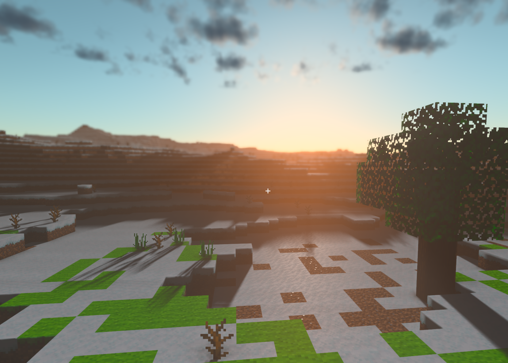

# Crafty: Building a WebGPU Voxel Game Engine

This book explores real-time graphics programming through the lens of **Crafty**,
an open-source WebGPU voxel game engine written in TypeScript.



## Who this is for

You have written a few small graphics demos and want to understand how a
complete, multi-pass deferred renderer works end-to-end. You are comfortable
with TypeScript or a C-family language and have a basic understanding of linear
algebra. You do *not* need prior WebGPU experience — we cover the API from the
ground up.

## What you will learn

| Topic | What we build |
|-------|---------------|
| WebGPU fundamentals | Device, queue, buffers, textures, bind groups |
| Shader authoring | WGSL — vertex, fragment, compute |
| Render graph architecture | Multi-pass deferred rendering |
| PBR lighting | Directional + point + spot, IBL, BRDF |
| Shadow algorithms | Cascade shadow maps, VSM, spot shadows |
| GPU particle systems | Compute-based spawn/update/compact, billboard rendering |
| Post-processing | Bloom, TAA, SSAO, DOF, tone-mapping |
| Terrain rendering | Chunked voxel world, greedy meshing, LOD |
| Game engine design | Component/entity system, scene graph |
| Networking | WebSocket multiplayer, state sync, snapshot interpolation |
| Performance | GPU timestamps, pipeline barriers, async compilation |

## How to read this book

The canonical companion is the Crafty source tree at
<https://github.com/brendan-duncan/crafty>.  Each chapter cross-references the
relevant source files — you are encouraged to open them side-by-side.

Code blocks are either **annotated excerpts** (showing the key logic) or
**complete listings** (the entire file).  Excerpts use `// ── ... ──` markers
to indicate elided boilerplate.

## The Crafty philosophy

> **Write it once, understand it forever.**

No black boxes.  Every system is built from scratch — we import only the
WebGPU API and the standard library.  If we use a third-party tool (e.g. a
texture compressor), we explain why and how it fits.

## Directory layout

```
crafty/
├── docs/                  # This book
├── src/                   # Core engine library
│   ├── math/              # Vec3, Mat4, Quaternion, etc.
│   ├── engine/            # Scene graph, components, materials
│   ├── assets/            # Mesh, Texture, shader loading
│   ├── block/             # Voxel world, chunks, biomes
│   └── renderer/          # WebGPU render graph & passes
├── crafty/                # Game application
│   ├── game/              # Multiplayer, player, interactions
│   ├── ui/                # HUD, hotbar, start screen
├── samples/               # Self-contained demos
└── server/                # Multiplayer server
```

## Status

This book is a work in progress.  Chapters are added as the engine evolves.

## Table of Contents

## I — Foundations

- [Chapter 1: Introduction](chapters/01-introduction.md)
  - [1.1 What is Crafty?](chapters/01-introduction.md#11-what-is-crafty)
  - [1.2 A Brief History of Graphics APIs](chapters/01-introduction.md#12-a-brief-history-of-graphics-apis)
  - [1.3 Why WebGPU?](chapters/01-introduction.md#13-why-webgpu)
  - [1.4 Literate Programming with This Book](chapters/01-introduction.md#14-literate-programming-with-this-book)
  - [1.5 Setting Up the Development Environment](chapters/01-introduction.md#15-setting-up-the-development-environment)
  - [1.6 The Crafty Codebase at a Glance](chapters/01-introduction.md#16-the-crafty-codebase-at-a-glance)

- [Chapter 2: 3D Mathematics](chapters/02-mathematics.md)
  - [2.1 Coordinate Systems and Conventions](chapters/02-mathematics.md#21-coordinate-systems-and-conventions)
  - [2.2 Vectors (Vec2, Vec3, Vec4)](chapters/02-mathematics.md#22-vectors-vec2-vec3-vec4)
  - [2.3 Matrices (Mat4)](chapters/02-mathematics.md#23-matrices-mat4)
  - [2.4 Quaternions](chapters/02-mathematics.md#24-quaternions)
  - [2.5 Transform Composition (TRS)](chapters/02-mathematics.md#25-transform-composition-trs)
  - [2.6 Coordinate Space Transformations](chapters/02-mathematics.md#26-coordinate-space-transformations)
  - [2.7 Random Numbers and Noise](chapters/02-mathematics.md#27-random-numbers-and-noise)
  - [2.8 Summary](chapters/02-mathematics.md#28-summary)

- [Chapter 3: WebGPU Fundamentals](chapters/03-webgpu-fundamentals.md)
  - [3.1 The Graphics Pipeline](chapters/03-webgpu-fundamentals.md#31-the-graphics-pipeline)
  - [3.2 GPUDevice and GPUAdapter](chapters/03-webgpu-fundamentals.md#32-gpudevice-and-gpuadapter)
  - [3.3 GPUBuffer — Uploading Data to the GPU](chapters/03-webgpu-fundamentals.md#33-gpubuffer--uploading-data-to-the-gpu)
  - [3.4 GPUTexture — Images and Render Targets](chapters/03-webgpu-fundamentals.md#34-gputexture--images-and-render-targets)
  - [3.5 GPUSampler — Filtering and Addressing](chapters/03-webgpu-fundamentals.md#35-gpusampler--filtering-and-addressing)
  - [3.6 GPUBindGroup and GPUBindGroupLayout](chapters/03-webgpu-fundamentals.md#36-gpubindgroup-and-gpubindgrouplayout)
  - [3.7 GPUShaderModule and WGSL](chapters/03-webgpu-fundamentals.md#37-gpushadermodule-and-wgsl)
  - [3.8 GPURenderPipeline and GPUComputePipeline](chapters/03-webgpu-fundamentals.md#38-gpurenderpipeline-and-gpucomputepipeline)
  - [3.9 GPUCommandEncoder and GPUQueue](chapters/03-webgpu-fundamentals.md#39-gpucommandencoder-and-gpuqueue)
  - [3.10 Render Passes](chapters/03-webgpu-fundamentals.md#310-render-passes)
    - [Attachments](chapters/03-webgpu-fundamentals.md#attachments)
    - [Load and Store Operations](chapters/03-webgpu-fundamentals.md#load-and-store-operations)
    - [Relationship to Render Pipelines](chapters/03-webgpu-fundamentals.md#relationship-to-render-pipelines)
    - [Multiple Render Targets](chapters/03-webgpu-fundamentals.md#multiple-render-targets)
    - [Fullscreen Passes](chapters/03-webgpu-fundamentals.md#fullscreen-passes)
    - [Viewport ans Scissor](chapters/03-webgpu-fundamentals.md#viewport-and-scissor)
    - [Occlusion Queries](chapters/03-webgpu-fundamentals.md#occlusion-queries)
    - [Draw Calls](chapters/03-webgpu-fundamentals.md#draw-calls)
  - [3.11 Compute Passes](chapters/03-webgpu-fundamentals.md#311-compute-passes)
    - [The Compute Shader Model](chapters/03-webgpu-fundamentals.md#the-compute-shader-model)
    - [Workgroup Memory](chapters/03-webgpu-fundamentals.md#workgroup-memory)
    - [Storage Buffers and Storage Textures](chapters/03-webgpu-fundamentals.md#storage-buffers-and-storage-textures)
    - [Dispatching Work](chapters/03-webgpu-fundamentals.md#dispatching-work)
    - [Synchronization Between Passes](chapters/03-webgpu-fundamentals.md#synchronization-between-passes)
    - [Copy Operations](chapters/03-webgpu-fundamentals.md#copy-operations)
  - [3.10 The RenderContext Abstraction](chapters/03-webgpu-fundamentals.md#310-the-rendercontext-abstraction)
    - [Lifecycle](chapters/03-webgpu-fundamentals.md#lifecycle)
  - [3.11 Summary](chapters/03-webgpu-fundamentals.md#311-summary)

## II — Rendering

- [Chapter 4: Rendering Architecture](chapters/04-rendering-architecture.md)
  - [4.1 The Render Graph](chapters/04-rendering-architecture.md#41-the-render-graph)
  - [4.2 Render Passes](chapters/04-rendering-architecture.md#42-render-passes)
    - [Pass Construction Pattern](chapters/04-rendering-architecture.md#pass-construction-pattern)
    - [Per-Frame Update Pattern](chapters/04-rendering-architecture.md#per-frame-update-pattern)
  - [4.3 Multi-Pass Deferred Rendering](chapters/04-rendering-architecture.md#43-multi-pass-deferred-rendering)
    - [Why Deferred?](chapters/04-rendering-architecture.md#why-deferred)
    - [The Deferred Pipeline](chapters/04-rendering-architecture.md#the-deferred-pipeline)
    - [Forward Rendering](chapters/04-rendering-architecture.md#forward-rendering)
  - [4.4 HDR Rendering Pipeline](chapters/04-rendering-architecture.md#44-hdr-rendering-pipeline)
    - [The HDR Target](chapters/04-rendering-architecture.md#the-hdr-target)
    - [Tone Mapping](chapters/04-rendering-architecture.md#tone-mapping)
  - [4.5 The GBuffer](chapters/04-rendering-architecture.md#45-the-gbuffer)
    - [GBuffer Fill Strategy](chapters/04-rendering-architecture.md#gbuffer-fill-strategy)
  - [4.6 Swap Chain and Presentation](chapters/04-rendering-architecture.md#46-swap-chain-and-presentation)
    - [Canvas Resize](chapters/04-rendering-architecture.md#canvas-resize)
  - [4.7 Summary](chapters/04-rendering-architecture.md#47-summary)

- [Chapter 5: Meshes and Geometry](chapters/05-meshes.md)
  - [5.1 Vertex and Index Buffers](chapters/05-meshes.md#51-vertex-and-index-buffers)
    - [Vertex Layout](chapters/05-meshes.md#vertex-layout)
    - [Buffer Creation](chapters/05-meshes.md#buffer-creation)
  - [5.2 Vertex Attributes and Layouts](chapters/05-meshes.md#52-vertex-attributes-and-layouts)
  - [5.3 The Mesh Asset Type](chapters/05-meshes.md#53-the-mesh-asset-type)
  - [5.4 Procedural Geometry](chapters/05-meshes.md#54-procedural-geometry)
    - [Plane](chapters/05-meshes.md#plane)
    - [Cube](chapters/05-meshes.md#cube)
    - [UV Sphere](chapters/05-meshes.md#uv-sphere)
    - [Cone](chapters/05-meshes.md#cone)
  - [5.5 Skinned Meshes and Skeletons](chapters/05-meshes.md#55-skinned-meshes-and-skeletons)
    - [Dual-Quaternion Skinning](chapters/05-meshes.md#dual-quaternion-skinning)
  - [5.6 Animation](chapters/05-meshes.md#56-animation)
  - [5.7 GLTF 2.0 Binary Loader](chapters/05-meshes.md#57-gltf-20-binary-loader)
    - [GLB Container Format](chapters/05-meshes.md#glb-container-format)
    - [Accessor Decoding](chapters/05-meshes.md#accessor-decoding)
    - [Tangent Generation](chapters/05-meshes.md#tangent-generation)
    - [Vertex Packing](chapters/05-meshes.md#vertex-packing)
    - [Material and Texture Resolution](chapters/05-meshes.md#material-and-texture-resolution)
    - [Skeleton and Animation Import](chapters/05-meshes.md#skeleton-and-animation-import)
  - [5.8 Summary](chapters/05-meshes.md#58-summary)

- [Chapter 6: Textures and Materials](chapters/06-textures-materials.md)
  - [6.1 2D, 3D, and Cube Textures](chapters/06-textures-materials.md#61-2d-3d-and-cube-textures)
  - [6.2 Texture Loading](chapters/06-textures-materials.md#62-texture-loading)
    - [Runtime Loading](chapters/06-textures-materials.md#runtime-loading)
    - [HDR / RGBE Environment Maps](chapters/06-textures-materials.md#hdr--rgbe-environment-maps)
    - [Block Texture Atlas](chapters/06-textures-materials.md#block-texture-atlas)
  - [6.3 Textures in the GBuffer](chapters/06-textures-materials.md#63-textures-in-the-gbuffer)
  - [6.4 The PBR Material System](chapters/06-textures-materials.md#64-the-pbr-material-system)
    - [Material Pass Types](chapters/06-textures-materials.md#material-pass-types)
    - [Shared Bind Group Slot](chapters/06-textures-materials.md#shared-bind-group-slot)
    - [Pipeline Caching](chapters/06-textures-materials.md#pipeline-caching)
    - [Material Update Pattern](chapters/06-textures-materials.md#material-update-pattern)
  - [6.5 Material Passes](chapters/06-textures-materials.md#65-material-passes)
  - [6.6 Shader Management and Caching](chapters/06-textures-materials.md#66-shader-management-and-caching)
    - [Common Shader Module](chapters/06-textures-materials.md#common-shader-module)
  - [6.7 Summary](chapters/06-textures-materials.md#67-summary)

- [Chapter 7: Lighting](chapters/07-lighting.md)
  - [7.1 Physically-Based Rendering Theory](chapters/07-lighting.md#71-physically-based-rendering-theory)
  - [7.2 The Directional Light (Sun)](chapters/07-lighting.md#72-the-directional-light-sun)
    - [Directional Light in the Lighting Pass](chapters/07-lighting.md#directional-light-in-the-lighting-pass)
  - [7.3 Point Lights](chapters/07-lighting.md#73-point-lights)
    - [Shadow Mapping Point Lights](chapters/07-lighting.md#shadow-mapping-point-lights)
  - [7.4 Spot Lights](chapters/07-lighting.md#74-spot-lights)
    - [Spot Light Attenuation](chapters/07-lighting.md#spot-light-attenuation)
  - [7.5 Image-Based Lighting (IBL)](chapters/07-lighting.md#75-image-based-lighting-ibl)
  - [7.6 The BRDF](chapters/07-lighting.md#76-the-brdf)
  - [7.7 The Deferred Lighting Pass](chapters/07-lighting.md#77-the-deferred-lighting-pass)
  - [7.8 The Forward Lighting Path](chapters/07-lighting.md#78-the-forward-lighting-path)
  - [7.9 GPU-Based IBL Pre-Computation](chapters/07-lighting.md#79-gpu-based-ibl-pre-computation)
    - [BRDF LUT (CPU)](chapters/07-lighting.md#brdf-lut-cpu)
    - [Irradiance Map (GPU Compute)](chapters/07-lighting.md#irradiance-map-gpu-compute)
    - [GGX Prefiltered Environment Map (GPU Compute)](chapters/07-lighting.md#ggx-prefiltered-environment-map-gpu-compute)
  - [7.10 Screen-Space Ambient Occlusion (SSAO)](chapters/07-lighting.md#710-screen-space-ambient-occlusion-ssao)
    - [Algorithm](chapters/07-lighting.md#algorithm)
    - [Bilateral Blur](chapters/07-lighting.md#bilateral-blur)
  - [7.11 Screen-Space Global Illumination (SSGI)](chapters/07-lighting.md#711-screen-space-global-illumination-ssgi)
    - [Ray March Pass](chapters/07-lighting.md#ray-march-pass)
    - [Temporal Accumulation Pass](chapters/07-lighting.md#temporal-accumulation-pass)
    - [History Copy](chapters/07-lighting.md#history-copy)
    - [SSGI Settings](chapters/07-lighting.md#ssgi-settings)
  - [7.12 Summary](chapters/07-lighting.md#712-summary)

- [Chapter 8: Shadow Mapping](chapters/08-shadow-mapping.md)
  - [8.1 Shadow Map Theory](chapters/08-shadow-mapping.md#81-shadow-map-theory)
    - [Shadow Bias](chapters/08-shadow-mapping.md#shadow-bias)
  - [8.2 Cascade Shadow Maps (CSM)](chapters/08-shadow-mapping.md#82-cascade-shadow-maps-csm)
    - [Cascade Setup](chapters/08-shadow-mapping.md#cascade-setup)
    - [Cascade Partioning](chapters/08-shadow-mapping.md#cascade-partioning)
    - [Rendering Cascades](chapters/08-shadow-mapping.md#rendering-cascades)
    - [Cascade Selection in the Lighting Pass](chapters/08-shadow-mapping.md#cascade-selection-in-the-lighting-pass)
  - [8.3 Variance Shadow Maps (VSM)](chapters/08-shadow-mapping.md#83-variance-shadow-maps-vsm)
  - [8.4 Spot Light Shadows](chapters/08-shadow-mapping.md#84-spot-light-shadows)
  - [8.5 Point Light (Omnidirectional) Shadows](chapters/08-shadow-mapping.md#85-point-light-omnidirectional-shadows)
  - [8.6 Shadow Sampling and Filtering](chapters/08-shadow-mapping.md#86-shadow-sampling-and-filtering)
    - [Percentage-Closer Filtering (PCF)](chapters/08-shadow-mapping.md#percentage-closer-filtering-pcf)
    - [VSM Blurring](chapters/08-shadow-mapping.md#vsm-blurring)
  - [8.7 Shadow Acne and Peter Panning](chapters/08-shadow-mapping.md#87-shadow-acne-and-peter-panning)
  - [8.8 Percentage-Closer Soft Shadows (PCSS)](chapters/08-shadow-mapping.md#88-percentage-closer-soft-shadows-pcss)
  - [8.9 Summary](chapters/08-shadow-mapping.md#89-summary)

- [Chapter 9: GPU Particle System](chapters/09-particle-system.md)
  - [9.1 Architecture Overview](chapters/09-particle-system.md#91-architecture-overview)
  - [9.2 Particle Graph Config](chapters/09-particle-system.md#92-particle-graph-config)
    - [EmitterNode](chapters/09-particle-system.md#emitternode)
    - [ModifierNode](chapters/09-particle-system.md#modifiernode)
    - [RenderNode](chapters/09-particle-system.md#rendernode)
  - [9.3 The Particle Struct](chapters/09-particle-system.md#93-the-particle-struct)
  - [9.4 GPU Buffers](chapters/09-particle-system.md#94-gpu-buffers)
  - [9.5 The Spawn Stage](chapters/09-particle-system.md#95-the-spawn-stage)
    - [Spawn Shapes](chapters/09-particle-system.md#spawn-shapes)
  - [9.6 The Update Stage](chapters/09-particle-system.md#96-the-update-stage)
    - [Curl Noise Turbulence](chapters/09-particle-system.md#curl-noise-turbulence)
    - [Block Collision](chapters/09-particle-system.md#block-collision)
  - [9.7 The Compact Stage](chapters/09-particle-system.md#97-the-compact-stage)
  - [9.8 The Render Stage](chapters/09-particle-system.md#98-the-render-stage)
    - [Forward HDR (Transparent)](chapters/09-particle-system.md#forward-hdr-transparent)
    - [Deferred GBuffer (Opaque)](chapters/09-particle-system.md#deferred-gbuffer-opaque)
  - [9.9 Per-Frame CPU Upload](chapters/09-particle-system.md#99-per-frame-cpu-upload)
  - [9.10 Runtime Spawn Rate Adjustment](chapters/09-particle-system.md#910-runtime-spawn-rate-adjustment)
  - [9.11 Rain and Snow Configurations](chapters/09-particle-system.md#911-rain-and-snow-configurations)
    - [Rain](chapters/09-particle-system.md#rain)
    - [Snow](chapters/09-particle-system.md#snow)
  - [9.12 Summary](chapters/09-particle-system.md#912-summary)

- [Chapter 10: Sky and Atmosphere](chapters/10-sky-atmosphere.md)
  - [10.1 HDR Environment Maps](chapters/10-sky-atmosphere.md#101-hdr-environment-maps)
    - [RGBE decoding](chapters/10-sky-atmosphere.md#rgbe-decoding)
  - [10.2 Atmospheric Sky](chapters/10-sky-atmosphere.md#102-atmospheric-sky)
    - [Single Scattering Approximation](chapters/10-sky-atmosphere.md#single-scattering-approximation)
  - [10.3 Cloud rendering](chapters/10-sky-atmosphere.md#103-cloud-rendering)
    - [Silver's Multi-Scattering Approximation](chapters/10-sky-atmosphere.md#silvers-multi-scattering-approximation)
    - [Cloud Noise Texture Generation](chapters/10-sky-atmosphere.md#cloud-noise-texture-generation)
  - [10.4 Volumetric Fog](chapters/10-sky-atmosphere.md#104-volumetric-fog)
  - [10.5 Cloud Shadows](chapters/10-sky-atmosphere.md#105-cloud-shadows)
  - [10.6 Oren-Nayer Diffuse Ground](chapters/10-sky-atmosphere.md#106-oren-nayer-diffuse-ground)
  - [10.7 Ozone Absorption (Chappuis Band)](chapters/10-sky-atmosphere.md#107-ozone-absorption-chappuis-band)
  - [10.8 Day/Night Cycle and Star Rendering](chapters/10-sky-atmosphere.md#108-daynight-cycle-and-star-rendering)
    - [Sun Position Skew](chapters/10-sky-atmosphere.md#sun-position-skew)
    - [Sun Direction, Intensity, and Color](chapters/10-sky-atmosphere.md#sun-direction-intensity-and-color)
    - [Sky and Cloud Driven by Day Fraction](chapters/10-sky-atmosphere.md#sky-and-cloud-driven-by-day-fraction)
    - [Persistence](chapters/10-sky-atmosphere.md#persistence)
    - [Moon Rendering](chapters/10-sky-atmosphere.md#moon-rendering)
    - [Star Rendering](chapters/10-sky-atmosphere.md#star-rendering)
  - [10.9 God Rays (Crepuscular Rays)](chapters/10-sky-atmosphere.md#109-god-rays-crepuscular-rays)
    - [Radial Blur from Light Source](chapters/10-sky-atmosphere.md#radial-blur-from-light-source)
  - [10.10 Summary](chapters/10-sky-atmosphere.md#1010-summary)

- [Chapter 11: Terrain and Voxel World](chapters/11-terrain.md)
  - [11.1 Voxel Data Structure](chapters/11-terrain.md#111-voxel-data-structure)
  - [11.2 Chunk Management](chapters/11-terrain.md#112-chunk-management)
    - [Frustum Culling](chapters/11-terrain.md#frustum-culling)
  - [11.3 Procedural World Generation](chapters/11-terrain.md#113-procedural-world-generation)
    - [Noise-Based Terrain](chapters/11-terrain.md#noise-based-terrain)
    - [Biomes](chapters/11-terrain.md#biomes)
    - [Ores and Caves](chapters/11-terrain.md#ores-and-caves)
  - [11.4 Greedy meshing](chapters/11-terrain.md#114-greedy-meshing)
    - [Algorithm](chapters/11-terrain.md#algorithm)
    - [Separate Opaque and Transparent Meshes](chapters/11-terrain.md#separate-opaque-and-transparent-meshes)
  - [11.5 Level-of-Detail (LOD)](chapters/11-terrain.md#115-level-of-detail-lod)
  - [11.6 Block Interaction](chapters/11-terrain.md#116-block-interaction)
    - [Ray Casting](chapters/11-terrain.md#ray-casting)
    - [Block Placement and Breaking](chapters/11-terrain.md#block-placement-and-breaking)
  - [11.7 Erosion Simulation](chapters/11-terrain.md#117-erosion-simulation)
  - [11.8 Water Propogation](chapters/11-terrain.md#118-water-propogation)
    - [Flow Rules](chapters/11-terrain.md#flow-rules)
    - [Performance Optimizations](chapters/11-terrain.md#performance-optimizations)
  - [11.9 Water Rendering](chapters/11-terrain.md#119-water-rendering)
    - [Screen-Space Refraction](chapters/11-terrain.md#screen-space-refraction)
    - [Depth-Based Attenuation](chapters/11-terrain.md#depth-based-attenuation)
    - [Screen-Space reflection + Sky Fallback](chapters/11-terrain.md#screen-space-reflection--sky-fallback)
  - [11.10 Screen-Space Reflections (SSR)](chapters/11-terrain.md#1110-screen-space-reflections-ssr)
    - [Algorithm](chapters/11-terrain.md#algorithm-1)
    - [Confidence Blending](chapters/11-terrain.md#confidence-blending)
    - [Fresnel Blend](chapters/11-terrain.md#fresnel-blend)
  - [11.11 Village Generation](chapters/11-terrain.md#1111-village-generation)
    - [Site Selection](chapters/11-terrain.md#site-selection)
    - [House Placement](chapters/11-terrain.md#house-placement)
    - [House Template](chapters/11-terrain.md#house-template)
  - [11.12 Summary](chapters/11-terrain.md#1112-summary)

- [Chapter 12: Post-Processing](chapters/12-post-processing.md)
  - [12.1 Tone Mapping and HDR Display](chapters/12-post-processing.md#121-tone-mapping-and-hdr-display)
    - [ACES Filmic Tone Mapping](chapters/12-post-processing.md#aces-filmic-tone-mapping)
    - [HDR Passthrough](chapters/12-post-processing.md#hdr-passthrough)
    - [Gamma Correction](chapters/12-post-processing.md#gamma-correction)
  - [12.2 Bloom](chapters/12-post-processing.md#122-bloom)
  - [12.3 Temporal Anti-Aliasing (TAA)](chapters/12-post-processing.md#123-temporal-anti-aliasing-taa)
    - [Jitter](chapters/12-post-processing.md#jitter)
    - [Reprojection](chapters/12-post-processing.md#reprojection)
    - [Neighborhood Clamping](chapters/12-post-processing.md#neighborhood-clamping)
  - [12.4 Depth of Field (DOF)](chapters/12-post-processing.md#124-depth-of-field-dof)
    - [Circle of Confusion](chapters/12-post-processing.md#circle-of-confusion)
    - [Seperable Blur](chapters/12-post-processing.md#seperable-blur)
  - [12.5 Auto-Exposure](chapters/12-post-processing.md#125-auto-exposure)
    - [Histogram Computation](chapters/12-post-processing.md#histogram-computation)
    - [Average Luminance](chapters/12-post-processing.md#average-luminance)
  - [12.6 Color Grading](chapters/12-post-processing.md#126-color-grading)
  - [12.7 Underwater Screen-Space Effects](chapters/12-post-processing.md#127-underwater-screen-space-effects)
    - [UV Distortion](chapters/12-post-processing.md#uv-distortion)
    - [Color Tint and Vignette](chapters/12-post-processing.md#color-tint-and-vignette)
  - [12.8 Summary](chapters/12-post-processing.md#128-summary)

## III — Game Engine

- [Chapter 13: Game Engine Design](chapters/13-game-engine.md)
  - [13.1 The Component/Entity System](chapters/13-game-engine.md#131-the-componententity-system)
  - [13.2 GameObject and Component](chapters/13-game-engine.md#132-gameobject-and-component)
  - [13.3 The Scene Graph](chapters/13-game-engine.md#133-the-scene-graph)
  - [13.4 The game Loop](chapters/13-game-engine.md#134-the-game-loop)
  - [13.5 Input Handling](chapters/13-game-engine.md#135-input-handling)
  - [13.6 Camera Controls](chapters/13-game-engine.md#136-camera-controls)
  - [13.7 The Player Controller](chapters/13-game-engine.md#137-the-player-controller)
  - [13.8 Touch Controls (Mobile)](chapters/13-game-engine.md#138-touch-controls-mobile)
    - [Lazy Initialization](chapters/13-game-engine.md#lazy-initialization)
    - [Virtual Joystick](chapters/13-game-engine.md#virtual-joystick)
    - [Camera Look](chapters/13-game-engine.md#camera-look)
    - [Action Buttons](chapters/13-game-engine.md#action-buttons)
    - [Layout and Hotbar Clearance](chapters/13-game-engine.md#layout-and-hotbar-clearance)
  - [13.9 World Persistence (IndexedDB)](chapters/13-game-engine.md#139-world-persistence-indexeddb)
    - [Database Schema](chapters/13-game-engine.md#database-schema)
    - [CRUD Operations](chapters/13-game-engine.md#crud-operations)
    - [Schema Versioning](chapters/13-game-engine.md#schema-versioning)
    - [World Record Lifecycle](chapters/13-game-engine.md#world-record-lifecycle)
  - [13.10 Summary](chapters/13-game-engine.md#1310-summary)

- [Chapter 14: Physics and Interaction](chapters/14-physics.md)
  - [14.1 Collision Detection (AABB)](chapters/14-physics.md#141-collision-detection-aabb)
  - [14.2 Player Movement and Gravity](chapters/14-physics.md#142-player-movement-and-gravity)
    - [Coyote Time and Variable Jump Height](chapters/14-physics.md#coyote-time-and-variable-jump-height)
  - [14.3 Block Ray Casting](chapters/14-physics.md#143-block-ray-casting)
  - [14.4 Block Interaction](chapters/14-physics.md#144-block-interaction)
  - [14.5 Summary](chapters/14-physics.md#145-summary)

- [Chapter 15: NPC AI](chapters/15-npc-ai.md)
  - [15.1 NPC Architecture](chapters/15-npc-ai.md#151-npc-architecture)
  - [15.2 The AI State Machine](chapters/15-npc-ai.md#152-the-ai-state-machine)
    - [Idle](chapters/15-npc-ai.md#idle)
    - [Wander](chapters/15-npc-ai.md#wander)
    - [Flee](chapters/15-npc-ai.md#flee)
    - [Follow](chapters/15-npc-ai.md#follow)
    - [Chase](chapters/15-npc-ai.md#chase)
    - [Detonate](chapters/15-npc-ai.md#detonate)
  - [15.3 Duck AI](chapters/15-npc-ai.md#153-duck-ai)
  - [15.4 Duckling AI](chapters/15-npc-ai.md#154-duckling-ai)
  - [15.5 Pig AI](chapters/15-npc-ai.md#155-pig-ai)
  - [15.6 Creeper AI](chapters/15-npc-ai.md#156-creeper-ai)
    - [Four-State Machine](chapters/15-npc-ai.md#four-state-machine)
    - [Idle](chapters/15-npc-ai.md#idle-1)
    - [Chase](chapters/15-npc-ai.md#chase-1)
    - [Detonate](chapters/15-npc-ai.md#detonate-1)
    - [Explosion](chapters/15-npc-ai.md#explosion)
    - [Flash Visual](chapters/15-npc-ai.md#flash-visual)
    - [Spawning](chapters/15-npc-ai.md#spawning)
  - [15.7 Bee AI](chapters/15-npc-ai.md#157-bee-ai)
    - [Idle](chapters/15-npc-ai.md#idle-2)
    - [Wander](chapters/15-npc-ai.md#wander-1)
    - [Hover](chapters/15-npc-ai.md#hover)
    - [Flower Detection](chapters/15-npc-ai.md#flower-detection)
    - [Spawning](chapters/15-npc-ai.md#spawning-1)
  - [15.8 Gravity and Ground Collision](chapters/15-npc-ai.md#158-gravity-and-ground-collision)
  - [15.9 Head Bob Animation](chapters/15-npc-ai.md#159-head-bob-animation)
  - [15.10 Animated Models and Skeletal Animation](chapters/15-npc-ai.md#1510-animated-models-and-skeletal-animation)
  - [15.11 Mob Spawning Mechanics](chapters/15-npc-ai.md#1511-mob-spawning-mechanics)
    - [Column-Level Deduplication](chapters/15-npc-ai.md#column-level-deduplication)
    - [Spawn Conditions](chapters/15-npc-ai.md#spawn-conditions)
    - [Spawn Resolution](chapters/15-npc-ai.md#spawn-resolution)
    - [Helper Functions for Debugging](chapters/15-npc-ai.md#helper-functions-for-debugging)
    - [Summary of Spawn Flow](chapters/15-npc-ai.md#summary-of-spawn-flow)
  - [15.12 Extending the NPC System](chapters/15-npc-ai.md#1512-extending-the-npc-system)
  - [15.13 Summary](chapters/15-npc-ai.md#1513-summary)

- [Chapter 16: Weather System](chapters/16-weather-system.md)
  - [16.1 Weather Types](chapters/16-weather-system.md#161-weather-types)
  - [16.2 Biome Weather Tables](chapters/16-weather-system.md#162-biome-weather-tables)
  - [16.3 Dynamic Weather Transitions](chapters/16-weather-system.md#163-dynamic-weather-transitions)
  - [16.4 Cloud Coverage Mapping](chapters/16-weather-system.md#164-cloud-coverage-mapping)
  - [16.5 Precipitation Control](chapters/16-weather-system.md#165-precipitation-control)
  - [16.6 Integration in the Frame Loop](chapters/16-weather-system.md#166-integration-in-the-frame-loop)
  - [16.7 Debug Overlay Display](chapters/16-weather-system.md#167-debug-overlay-display)
  - [16.8 Summary](chapters/16-weather-system.md#168-summary)

- [Chapter 17: Audio](chapters/17-audio.md)
  - [17.1 Web Audio API Fundamentals](chapters/17-audio.md#171-web-audio-api-fundamentals)
  - [17.2 Spatial Audio](chapters/17-audio.md#172-spatial-audio)
  - [17.3 Sound Effect Triggers](chapters/17-audio.md#173-sound-effect-triggers)
  - [17.4 Ambient and Music](chapters/17-audio.md#174-ambient-and-music)
  - [17.5 Summary](chapters/17-audio.md#175-summary)

- [Chapter 18: User Interface](chapters/18-user-interface.md)
  - [18.1 DOM-based UI vs. In-Game UI](chapters/18-user-interface.md#181-dom-based-ui-vs-in-game-ui)
  - [18.2 The HUD](chapters/18-user-interface.md#182-the-hud)
  - [18.3 The Start Screen](chapters/18-user-interface.md#183-the-start-screen)
  - [18.4 The Settings Panel](chapters/18-user-interface.md#184-the-settings-panel)
  - [18.5 The Block Manager](chapters/18-user-interface.md#185-the-block-manager)
  - [18.6 Summary](chapters/18-user-interface.md#186-summary)

## IV — Multiplayer

- [Chapter 19: Network Architecture](chapters/19-network-architecture.md)
  - [19.1 WebSocket Fundamentals](chapters/19-network-architecture.md#191-websocket-fundamentals)
  - [19.2 Message Protocol Design](chapters/19-network-architecture.md#192-message-protocol-design)
  - [19.3 Connection Lifecycle](chapters/19-network-architecture.md#193-connection-lifecycle)
  - [19.4 The Server Architecture](chapters/19-network-architecture.md#194-the-server-architecture)
    - [Server-Side Authorization](chapters/19-network-architecture.md#server-side-authorization)
  - [19.5 World State Persistence](chapters/19-network-architecture.md#195-world-state-persistence)
  - [19.6 Summary](chapters/19-network-architecture.md#196-summary)

- [Chapter 20: Multiplayer Gameplay](chapters/20-multiplayer-gameplay.md)
  - [20.1 Player State Synchronization](chapters/20-multiplayer-gameplay.md#201-player-state-synchronization)
  - [20.2 Snapshot Interpolation](chapters/20-multiplayer-gameplay.md#202-snapshot-interpolation)
  - [20.3 Remote Player Rendering](chapters/20-multiplayer-gameplay.md#203-remote-player-rendering)
  - [20.4 Name Labels](chapters/20-multiplayer-gameplay.md#204-name-labels)
  - [20.5 Block Edit Replication](chapters/20-multiplayer-gameplay.md#205-block-edit-replication)
  - [20.6 Latency Compensation](chapters/20-multiplayer-gameplay.md#206-latency-compensation)
  - [20.7 Summary](chapters/20-multiplayer-gameplay.md#207-summary)

## V — Advanced Topics

- [Chapter 21: Performance](chapters/21-performance.md)
  - [21.1 GPU Timestamps and Profiling](chapters/21-performance.md#211-gpu-timestamps-and-profiling)
  - [21.2 Async Shader Compilation](chapters/21-performance.md#212-async-shader-compilation)
  - [21.3 Frustum Culling](chapters/21-performance.md#213-frustum-culling)
  - [21.4 Occlusion Culling](chapters/21-performance.md#214-occlusion-culling)
  - [21.5 Draw Call Batching](chapters/21-performance.md#215-draw-call-batching)
  - [21.6 Memory Management](chapters/21-performance.md#216-memory-management)
    - [Pre-Allocated Staging Arrays](chapters/21-performance.md#pre-allocated-staging-arrays)
    - [Buffer Pooling](chapters/21-performance.md#buffer-pooling)
    - [Texture Management](chapters/21-performance.md#texture-management)
  - [21.7 Summary](chapters/21-performance.md#217-summary)

- [Chapter 22: Tools and Workflow](chapters/22-tools.md)
  - [22.1 The Sample Framework](chapters/22-tools.md#221-the-sample-framework)
  - [22.2 Testing Strategy](chapters/22-tools.md#222-testing-strategy)
  - [22.3 Debugging WebGPU](chapters/22-tools.md#223-debugging-webgpu)
    - [Validation Errors](chapters/22-tools.md#validation-errors)
    - [Shader Debugging](chapters/22-tools.md#shader-debugging)
    - [WebGPU Inspector (Chrome Extension)](chapters/22-tools.md#webgpu-inspector-chrome-extension)
  - [22.4 Asset Pipeline](chapters/22-tools.md#224-asset-pipeline)
    - [Texture Atlas Buidling](chapters/22-tools.md#texture-atlas-buidling)
    - [HDR Map Preprocessing](chapters/22-tools.md#hdr-map-preprocessing)
  - [22.5 Continuous Integration](chapters/22-tools.md#225-continuous-integration)
  - [22.6 Summary](chapters/22-tools.md#226-summary)

- [Chapter 23: The Road Ahead](chapters/23-road-ahead.md)
  - [23.1 Ray Tracing with WebGPU](chapters/23-road-ahead.md#231-ray-tracing-with-webgpu)
  - [23.2 Compute Shader Post-Processing](chapters/23-road-ahead.md#232-compute-shader-post-processing)
  - [23.3 Procedural Generation at Scale](chapters/23-road-ahead.md#233-procedural-generation-at-scale)
  - [23.4 WebXR](chapters/23-road-ahead.md#234-webxr)
  - [23.5 Closing Thoughts](chapters/23-road-ahead.md#235-closing-thoughts)
  - [23.6 Summary](chapters/23-road-ahead.md#236-summary)

## Appendices

- [Appendix A: WGSL Quick Reference](appendix/wgsl-ref.md)
- [Appendix B: WebGPU API Reference](appendix/webgpu-ref.md)
- [Appendix C: Mathematics Reference](appendix/math-ref.md)
- [Appendix D: Glossary](appendix/glossary.md)
